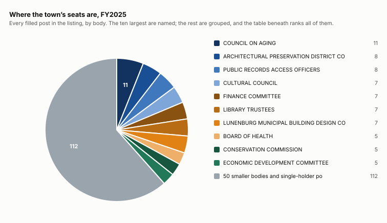
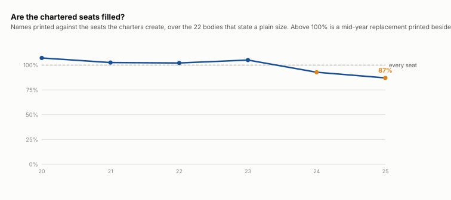

# Board composition

How the town’s boards are made up, how big they are and how fast they turn over, FY2016 to FY2025. Looking for a seat? That is [open seats](/analysis/open-seats).

## Where the seats are

COUNCIL ON AGING is the biggest body in the town at 11 seats. 26 posts have a single holder.

## Are the chartered seats filled?

| fiscal year | chartered seats | names printed | filled |
|---|---:|---:|---:|
| FY2020 | 138 | 148 | 107% |
| FY2021 | 115 | 118 | 103% |
| FY2022 | 93 | 95 | 102% |
| FY2023 | 98 | 103 | 105% |
| FY2024 | 111 | 103 | 93% |
| FY2025 | 116 | 101 | 87% |

A board’s charter fixes how many seats it has, so the seat COUNT is not a trend — it is the charter. Whether the seats have anybody in them is the part that moves, and it has moved a long way. Above 100%% is not an overfull board: it is a mid-year replacement printed beside the person replaced.

| | FY2017 | FY2018 | FY2019 | FY2020 | FY2021 | FY2022 | FY2023 | FY2024 | FY2025 |
|---|---:|---:|---:|---:|---:|---:|---:|---:|---:|
| stayed from the year before | 145 | 158 | 137 | 100 | 144 | 121 | 132 | 115 | 106 |
| new that year | 57 | 48 | 38 | 102 | 58 | 67 | 52 | 56 | 67 |
| gone from the year before | 75 | 44 | 69 | 75 | 58 | 81 | 56 | 69 | 65 |

18 of the 694 people listed at any point across the ten years appear in all of them.

## Which boards change most

Seats changing hands each year, over bodies of three seats or more. `years compared` is how many times the body appears in two consecutive years and can therefore be differenced — the listing is readable for ten years but not consecutively in all of them, so a body with 5 has been measured five times and one with 2 twice. A one-seat post whose holder changed reads as a hundred per cent and is one person leaving a job, so it is left out. The median across the 36 bodies here is 31%.

| board or committee | seats | years compared | seats changing hands |
|---|---:|---:|---:|
| GCTF ADVISORS | 3.5 | 3 | 71% |
| MONTACHUSETT REGIONAL VOCATIONAL TECHNICAL SCHOOL REPRESENTATIVE | 8.0 | 3 | 67% |
| STORM WATER TASK FORCE | 3.4 | 7 | 57% |
| AMERICANS WITH DISABILITIES COMMITTEE | 3.8 | 3 | 56% |
| ECONOMIC DEVELOPMENT COMMITTEE | 4.0 | 4 | 56% |
| GREEN COMMUNITIES COMMITTEE | 3.7 | 3 | 54% |
| PUBLIC RECORDS ACCESS OFFICERS | 8.8 | 8 | 49% |
| LUNENBURG MUNICIPAL BUILDING DESIGN COMMITTEE | 5.5 | 2 | 46% |
| HISTORICAL COMMISSION | 4.1 | 9 | 42% |
| Sewer Commission - 1/2 | 5.4 | 8 | 40% |
| CAPITAL PLANNING COMMITTEE | 6.2 | 9 | 39% |
| AGRICULTURAL COMMISSION | 5.7 | 7 | 38% |
| TAXATION AID COMMITTEE | 4.8 | 4 | 37% |
| FINANCE COMMITTEE | 7.2 | 6 | 36% |
| CULTURAL COUNCIL | 7.8 | 7 | 34% |
| Board of Selectmen | 5.0 | 3 | 33% |
| School Committee | 5.1 | 8 | 32% |
| Planning Board | 5.6 | 6 | 31% |
| Housing Authority | 4.3 | 8 | 30% |
| Parks Commission | 5.0 | 3 | 27% |
| Board of Assessors | 3.2 | 6 | 26% |
| PERSONNEL COMMITTEE | 5.4 | 6 | 26% |
| Park Commission | 4.0 | 2 | 25% |
| Cemetery Commission | 3.3 | 8 | 24% |
| Select Board | 5.2 | 4 | 24% |
| CONSERVATION COMMISSION | 7.1 | 9 | 23% |
| ARCHITECTURAL PRESERVATION DISTRICT COMMISSION (APDC) | 7.1 | 7 | 19% |
| Board of Health | 5.2 | 8 | 19% |
| Library Trustees | 7.2 | 8 | 19% |
| PUBLIC ACCESS CABLE COMMITTEE | 4.7 | 9 | 18% |
| COUNCIL ON AGING- - (11 members) | 11.5 | 2 | 17% |
| COUNCIL ON AGING | 11.3 | 5 | 15% |
| ZONING BOARD OF APPEALS | 4.9 | 9 | 15% |
| TOWN CLOCK WINDERS | 6.2 | 2 | 12% |
| TOWN CLOCKWINDERS | 5.4 | 5 | 11% |
| CABLE ADVISORY COMMITTEE | 3.0 | 2 | 0% |

## The bodies, by size

FY2025, filled seats only.

| board, committee or post | people |
|---|---:|
| COUNCIL ON AGING | 11 |
| ARCHITECTURAL PRESERVATION DISTRICT COMMISSION (APDC) | 8 |
| PUBLIC RECORDS ACCESS OFFICERS | 8 |
| CULTURAL COUNCIL | 7 |
| FINANCE COMMITTEE | 7 |
| LIBRARY TRUSTEES | 7 |
| LUNENBURG MUNICIPAL BUILDING DESIGN COMMITTEE | 7 |
| BOARD OF HEALTH | 5 |
| CONSERVATION COMMISSION | 5 |
| ECONOMIC DEVELOPMENT COMMITTEE | 5 |
| HOUSING AUTHORITY | 5 |
| SELECT BOARD | 5 |
| SEWER COMMISSION - 1/2 | 5 |
| STORM WATER TASK FORCE | 5 |
| TOWN CLOCKWINDERS | 5 |
| AGRICULTURAL COMMISSION | 4 |
| ELECTION WORKERS | 4 |
| GREEN COMMUNITIES COMMITTEE | 4 |
| HISTORICAL COMMISSION | 4 |
| PARKS COMMISSION | 4 |
| PLANNING BOARD | 4 |
| PUBLIC ACCESS CABLE COMMITTEE | 4 |
| SCHOOL COMMITTEE | 4 |
| ZONING BOARD OF APPEALS | 4 |
| AMERICANS WITH DISABILITIES COMMITTEE | 3 |
| BOARD OF ASSESSORS | 3 |
| CAPITAL PLANNING COMMITTEE | 3 |
| CEMETERY COMMISSION | 3 |
| MILES | 3 |
| Associate Members | 2 |
| Associate Members (2) | 2 |
| Ex Officio Members | 2 |
| TOWN COUNSEL | 2 |
| TRUST FUND COMMISSION | 2 |
| ASSISTANT DAM KEEPER | 1 |
| ASSISTANT TAX COLLECTOR/TREASURER | 1 |
| ASSISTANT TOWN CLERK | 1 |
| ASST. INSPECTOR OF PLUMBING/GAS | 1 |
| ASST. INSPECTOR OF WIRING | 1 |
| BUILDING COMMISSIONER/ZONING ENFORCEMENT OFFICER | 1 |
| CONSTABLE | 1 |
| COUNCIL ON AGING DIRECTOR | 1 |
| DAM KEEPER | 1 |
| DPW DIRECTOR | 1 |
| FIELD DRIVER | 1 |
| FIRE CHIEF/ EMERGENCY MANAGEMENTDIRECTOR/ FOREST WARDEN | 1 |
| HAZARDOUS WASTE COORDINATOR | 1 |
| HEARINGS OFFICER | 1 |
| INSPECTOR OF PLUMBING/GAS | 1 |
| INSPECTOR OF WEIGHTS & MEASURES | 1 |
| INSPECTOR OF WIRING | 1 |
| LOCAL CENSUS LIAISON | 1 |
| MART ADVISORY BOARD | 1 |
| MODERATOR | 1 |
| MONTACHUSETT METROPOLITAN PLANNING ORGANIZATION | 1 |
| POLICE CHIEF | 1 |
| TAX COLLECTOR/TREASURER/TAX CUSTODIAN | 1 |
| TOWN CLERK | 1 |
| TREE WARDEN | 1 |
| VETERANS SERVICES AGENT | 1 |

## Seats by kind

| | FY2016 | FY2017 | FY2018 | FY2019 | FY2020 | FY2021 | FY2022 | FY2023 | FY2024 | FY2025 |
|---|---:|---:|---:|---:|---:|---:|---:|---:|---:|---:|
| Elected seats — filled by the voters | 57 | 58 | 56 | 41 | 59 | 56 | 53 | 56 | 51 | 53 |
| Appointed board seats — filled by the Select Board | 69 | 72 | 72 | 58 | 103 | 106 | 86 | 92 | 79 | 79 |

## What this cannot show

- Why anybody left a board. A term ending, a resignation and a move out of town look identical here.
- Whether a seat sat empty between one holder and the next.
- Hours, or what a seat asks of the person in it.
- Anything about pay. This listing never states it, and no salary is inferred here from a post’s name.

## How well we read it

Most headings state their own membership, so the page checks itself: 492 rows sit under a board where the stated size and the printed names agree, 299 where they differ, and 1,327 under a post that states no size. A difference is a vacancy, a mid-year replacement printed beside the person it replaced, or our reading of a page set in two columns — a note about our extraction rather than about the town.

## Where it comes from

- **Every board and committee, its members and their term-expiry years, FY2016 to FY2025** — the ELECTED OFFICIALS and APPOINTED OFFICIALS listing in each annual town report — nine pages a year. Read by scripts/extract_personnel.py. The format is not the same every year: the elected pages set headings in title case and the appointed pages in capitals, two or three pages a year are set in two columns, and five years print the section under no running header at all.
