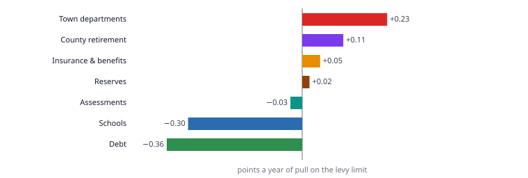

# Every department’s budget, against the schools

**How fast each part of the general fund’s starting budget grew from FY2010 to FY2025, which part pulls hardest on the levy, how each side spends what it is given — and what “deficit” can and cannot mean in this ledger.**

Analysis, October 2026. A draft for review. Every figure is computed from the Finance Committee’s general fund history by `scripts/build_department_budgets.py`; the grouping, the benchmark and the treatment of health insurance are ours and are marked as ours where they are used.

---

## The short version

**Town departments’ starting budgets grew 5.4% a year; the schools’ grew 3.6%.** FY2010 to FY2025, with health insurance taken out of both so they are measured alike.

**Ranked by pull on the levy, town departments lead at +0.23 points a year.** The schools sit at −0.30 points: their starting budget grew slower than the levy limit’s 4.3%.

**The county retirement assessment grew 9.7% a year — the fastest of any group.** It pays pensions for town and school members alike, and nothing published splits it.

**The schools spent 98.5% of their final budgets, FY2010 to FY2024; town departments 93.7%.** No school or town department ended a year over budget except snow removal, once.

**Snow Removal spent above its starting budget in 15 of 15 years.** It is the one budget state law lets run over; transfers then cover it.

**$5,638,195 reached departments’ budgets mid-year with no transfer recorded for it.** *(a hypothesis)* 75% of it fits money carried forward from the year before. That is a hypothesis.

**The $3,300,000 override voted in 2026 was for town and school budgets alike.** In a year the town priced level service, the ask covered its own departments too.

---

## How each part of the budget grew

### In plain terms

From FY2010 to FY2025 the general fund’s starting budget grew 4.1% a year, from $26,525,827 to $48,629,090. Town departments grew 5.4% a year and the schools, with health insurance taken out, 3.6%. The levy limit, with the FY2025 override taken back out, grew 4.3% a year — so the schools’ starting budget grew more slowly than the levy and the town’s faster.

### The evidence

| group | FY2010 | FY2025 | a year | a year to FY2024 | median year | largest single year | share FY2010 | share FY2025 |
|---|---:|---:|---:|---:|---:|---:|---:|---:|
| Schools | $12,981,333 | $22,160,922 | 3.6% | 3.1% | 3.4% | 11.9% (FY2025) | 48.9% | 45.6% |
| Town departments | $5,328,125 | $11,685,851 | 5.4% | 5.4% | 5.5% | 9.4% (FY2022) | 20.1% | 24.0% |
| Insurance & benefits | $3,584,096 | $7,040,092 | 4.6% | 4.7% | 7.2% | 16.2% (FY2018) | 13.5% | 14.5% |
| County retirement | $528,137 | $2,127,801 | 9.7% | 9.6% | 10.5% | 16.3% (FY2016) | 2.0% | 4.4% |
| Debt | $2,664,148 | $2,941,322 | 0.7% | 2.0% | −1.2% | 53.1% (FY2016) | 10.0% | 6.0% |
| Assessments | $1,340,514 | $2,288,103 | 3.6% | 3.5% | 5.3% | 17.4% (FY2014) | 5.1% | 4.7% |
| Reserves | $99,474 | $385,000 | 9.4% | 2.5% | 0.0% | 173.3% (FY2025) | 0.4% | 0.8% |
| **all** | **$26,525,827** | **$48,629,090** | **4.1%** |  |  |  | 100% | 100% |

*a year* is compound growth of the ORIGINAL budget, budget to budget. *median year* and *largest single year* are there because a rate over fifteen years can be one step and fourteen flat years — read them before reading the rate.

**The levy limit**, from the Division of Local Services: $16,418,410 in FY2010 and $31,602,108 in FY2025, 4.5% a year. That includes $948,136 voted by override (FY2025, 2024-05-18, “Fund Lunenburg Public Schools”). Taken back out, carried forward at 2.5%, the limit grew 4.3% a year. **Our choice**: the benchmark is the second figure, because the question is what the levy grows by without a vote.

### What this does not show

- **Cost.** A budget line is net (rule 11). The school appropriation is what the town raises after grants, circuit breaker, school choice and revolving funds have paid their part; a line that rises may mean a grant ended. The town’s lines are net too, of whatever receipts offset them.
- **Need.** A starting budget is what was voted. It is the outcome of a request, a recommendation and a vote, and it does not say what level service would have cost.
- **Service.** A department can hold its dollars and cut its hours, or gain dollars because a service moved into it from elsewhere. Several town lines show single-year steps large enough to be exactly that (see the department table).

## Which part pulls hardest on the levy

**Pull** is a group’s share of the FY2010 budget times how far its growth ran above the levy limit’s 4.3% a year, in points a year (rule 4). Neither size nor rate means anything alone: the schools are the largest group and pull the other way; county retirement is small and pulls hard.

| group | share FY2010 | a year | pull, points a year |
|---|---:|---:|---:|
| Town departments | 20.1% | 5.4% | +0.23 |
| County retirement | 2.0% | 9.7% | +0.11 |
| Insurance & benefits | 13.5% | 4.6% | +0.05 |
| Reserves | 0.4% | 9.4% | +0.02 |
| Assessments | 5.1% | 3.6% | −0.03 |
| Schools | 48.9% | 3.6% | −0.30 |
| Debt | 10.0% | 0.7% | −0.36 |

**As the town books it**, by MUNIS function — no grouping of ours. Function 3 is the school department with its health insurance in it, plus Monty Tech; function 9 is the town’s insurance department, which until FY2022 also carried every retiree’s health insurance, the schools’ included.

| function | name | FY2010 | FY2025 | a year | pull |
|---|---|---:|---:|---:|---:|
| 4 | Public works & facilities | $1,269,967 | $3,442,810 | 6.9% | +0.13 |
| 8 | Retirement & state assessments | $1,227,224 | $3,190,258 | 6.6% | +0.11 |
| 2 | Public safety | $2,230,587 | $4,679,217 | 5.1% | +0.07 |
| 1 | General government | $1,421,573 | $2,890,717 | 4.8% | +0.03 |
| 9 | Insurance & benefits (town side) | $1,988,109 | $3,879,254 | 4.6% | +0.02 |
| 5 | Human services | $171,171 | $464,467 | 6.9% | +0.02 |
| 6 | Culture & recreation | $334,301 | $593,640 | 3.9% | −0.00 |
| 3 | Education | $15,218,747 | $26,547,406 | 3.8% | −0.27 |
| 7 | Debt service | $2,664,148 | $2,941,322 | 0.7% | −0.36 |

### What this does not show

- **The levy is not all of the revenue.** State aid, local receipts and free cash pay for part of every line. The whole starting budget grew 4.1% a year, slower than the levy limit — which says the rest of the revenue grew more slowly than the levy, or the levy was not raised to its limit, or both. This ledger cannot say which.
- **Debt is not like for like.** Part of it is paid by debt exclusions, outside the levy limit altogether, so its pull against the limit is overstated in both directions.

## The schools against the rest, like for like

The school department books its own employees’ health insurance inside its budget. The town books its employees’ insurance in a separate department, and until FY2022 booked every retiree’s insurance there too, the schools’ retirees included, in one line. So the ledger’s own boundary puts a large, fast-moving cost on the school side for actives and on the town side for retirees.

**The method used for the headline is ours, and it allocates nothing**: every benefit object is taken out of the school department and set beside the town’s insurance department as one group. That needs no split of any shared line, which is why it was chosen over an allocation.

| method | schools, a year | town departments, a year | years |
|---|---:|---:|---|
| as booked — school department whole, town departments | 3.7% | 5.4% | FY2010 to FY2025 |
| **benefits out of both (the headline)** | **3.6%** | **5.4%** | FY2010 to FY2025 |
| by the ledger’s own labels — school retirees’ insurance to the schools, town retirees’ to the town | 5.4% | 6.8% | FY2022 to FY2025 |

The school’s own health insurance line grew 4.9% a year, $1,537,487 to $3,140,838. The third method is the only allocation the ledger’s names support, and only from FY2022, when a line called SCHOOL RETIREES HLTH INSURANCE first appears; before that the retirees of both sides share one line and no year can be split without inventing the split.

### What this does not show

- **The rest of what the town pays for the schools.** County retirement covers school members who are not teachers; Medicare, liability insurance and the facilities and technology departments may serve both sides. None is split in any published document, so in every method above those costs stay on the town’s side. These are registered gaps.
- **Whether any service moved between the two sides** during the fifteen years. A move would show as growth on one side and a fall on the other, and the ledger alone cannot tell it from a real change.

## Department by department

Every department with a starting budget in both FY2010 and FY2025, ranked by pull. The *largest single year* column is the first thing to read: a department whose growth is one step is a department that took something on or had something moved into it, and a rate measured across that step is not a trend (rule 6).

| dept | name | group | FY2010 | FY2025 | a year | median year | largest single year | pull |
|---|---|---|---:|---:|---:|---:|---:|---:|
| 820 | WRRS Assessment | County retirement | $528,137 | $2,127,801 | 9.7% | 10.5% | 16.3% (FY2016) | +0.11 |
| 220 | Fire Department | Town departments | $540,833 | $1,651,515 | 7.7% | 4.7% | 18.8% (FY2022) | +0.07 |
| 411 | General Highway Maintenance | Town departments | $120,850 | $888,250 | 14.2% | 10.9% | 84.3% (FY2014) | +0.05 |
| 193 | Director Of Facilities & Groun | Town departments | $214,113 | $669,011 | 7.9% | 4.4% | 37.3% (FY2014) | +0.03 |
| 433 | Recycling Program | Town departments | $100,000 | $469,775 | 10.9% | 12.8% | 62.2% (FY2022) | +0.02 |
| 914 | Insurance | Insurance & benefits | $1,753,109 | $3,450,089 | 4.6% | 4.6% | 18.7% (FY2024) | +0.02 |
| 155 | Information Technology Dept | Town departments | $160,068 | $402,222 | 6.3% | 8.3% | 33.7% (FY2023) | +0.01 |
| 132 | Reserve Fund | Reserves | $50,000 | $200,000 | 9.7% | 0.0% | 166.7% (FY2025) | +0.01 |
| 210 | Police Department | Town departments | $1,254,162 | $2,413,369 | 4.5% | 5.5% | 14.1% (FY2018) | +0.01 |
| 133 | Salary Reserve | Reserves | $49,474 | $185,000 | 9.2% | 0.0% | 180.9% (FY2025) | +0.01 |
| 141 | Assessor's Administration | Town departments | $116,621 | $289,822 | 6.3% | 2.6% | 24.3% (FY2025) | +0.01 |
| 541 | Council On Aging | Town departments | $96,042 | $230,123 | 6.0% | 4.7% | 21.1% (FY2024) | +0.01 |
| 192 | Public Buildings | Town departments | $83,560 | $206,453 | 6.2% | 0.0% | 191.0% (FY2014) | +0.01 |
| 310 | Monty Tech Assessment | Assessments | $641,427 | $1,225,646 | 4.4% | 3.7% | 17.5% (FY2023) | +0.00 |
| 491 | Cemetery Department | Town departments | $46,684 | $118,110 | 6.4% | 2.0% | 34.7% (FY2022) | +0.00 |
| 544 | Veterans Benefits | Town departments | $2,500 | $99,275 | 27.8% | 0.0% | 250.0% (FY2014) | +0.00 |
| 161 | Town Clerk's Administration | Town departments | $24,513 | $60,960 | 6.3% | 2.9% | 26.3% (FY2022) | +0.00 |
| 912 | Workers Compensation | Insurance & benefits | $85,000 | $169,976 | 4.7% | 5.0% | 94.7% (FY2018) | +0.00 |
| 158 | Tax Title Redemp/foreclosure | Town departments | $3,500 | $29,000 | 15.1% | 0.0% | 100.0% (FY2021) | +0.00 |
| 294 | Tree Removal | Town departments | $14,500 | $38,500 | 6.7% | 0.6% | 79.4% (FY2016) | +0.00 |
| 126 | Town Manager | Town departments | $120,600 | $231,244 | 4.4% | 2.7% | 27.7% (FY2025) | +0.00 |
| 162 | Elections | Town departments | $5,801 | $18,525 | 8.0% | 10.7% | 106.6% (FY2021) | +0.00 |
| 522 | Nashoba Nursing | Town departments | $7,618 | $19,923 | 6.6% | 5.0% | 29.7% (FY2013) | +0.00 |
| 420 | Highway Overtime | Town departments | $2,518 | $12,000 | 11.0% | 3.0% | 105.2% (FY2015) | +0.00 |
| 164 | Town Clerk's Salary | Town departments | $40,560 | $79,438 | 4.6% | 2.5% | 38.2% (FY2025) | +0.00 |
| 543 | Veteran's Administration | Town departments | $3,800 | $10,250 | 6.8% | 0.0% | 95.2% (FY2023) | +0.00 |
| 199 | Central Purchasing | Town departments | $41,612 | $80,300 | 4.5% | 0.1% | 34.3% (FY2022) | +0.00 |
| 195 | Town Reports | Town departments | $5,700 | $12,000 | 5.1% | 0.0% | 140.0% (FY2017) | +0.00 |
| 693 | Band Concerts | Town departments | $2,500 | $6,000 | 6.0% | 0.0% | 68.0% (FY2015) | +0.00 |
| 691 | Historical Commission | Town departments | $850 | $3,000 | 8.8% | 0.0% | 500.0% (FY2017) | +0.00 |
| 131 | Finance Committee | Town departments | $500 | $1,800 | 8.9% | 0.0% | 70.0% (FY2012) | +0.00 |
| 291 | Emergency Management | Town departments | $3,500 | $7,000 | 4.7% | 0.0% | 64.3% (FY2012) | +0.00 |
| 163 | Registration & Census | Town departments | $13,699 | $25,950 | 4.4% | 1.1% | 35.5% (FY2023) | +0.00 |
| 524 | Police/fire Medical | Town departments | $2,000 | $4,000 | 4.7% | 0.0% | 60.0% (FY2012) | +0.00 |
| 149 | Banking Charges | Town departments | $500 | $1,000 | 4.7% | 0.0% | 100.0% (FY2011) | +0.00 |
| 292 | Animal Control | Town departments | $24,180 | $45,125 | 4.2% | 0.0% | 58.1% (FY2017) | −0.00 |
| 299 | Inspector Of Animals | Town departments | $600 | $1,000 | 3.5% | 0.0% | 66.7% (FY2016) | −0.00 |
| 545 | Registrar Of Veterans Graves | Town departments | $360 | $500 | 2.2% | 0.0% | 25.0% (FY2016) | −0.00 |
| 841 | Montachusett Planning Comm | Assessments | $2,652 | $4,369 | 3.4% | 2.5% | 12.1% (FY2023) | −0.00 |
| 525 | Physicals | Town departments | $2,200 | $3,500 | 3.1% | 0.0% | 40.0% (FY2016) | −0.00 |
| 692 | Memorial Day | Town departments | $750 | $750 | 0.0% | 0.0% | 0.0% (FY2011) | −0.00 |
| 244 | Inspector Of Wghts & Measures | Town departments | $3,000 | $4,300 | 2.4% | 0.0% | 22.4% (FY2013) | −0.00 |
| 176 | Zoning Board Of Appeals | Town departments | $3,228 | $4,500 | 2.2% | 0.0% | 21.4% (FY2016) | −0.00 |
| 425 | Traffic Signs & Devices | Town departments | $16,400 | $28,500 | 3.8% | 0.0% | 204.9% (FY2012) | −0.00 |
| 171 | Conservation Commission | Town departments | $46,861 | $84,738 | 4.0% | 3.1% | 31.6% (FY2025) | −0.00 |
| 650 | Parks & Recreation | Town departments | $64,908 | $117,247 | 4.0% | 2.2% | 27.4% (FY2020) | −0.00 |
| 512 | General Health Expense | Town departments | $30,748 | $53,427 | 3.8% | 3.4% | 35.9% (FY2014) | −0.00 |
| 521 | Nashoba Health | Town departments | $25,903 | $43,469 | 3.5% | 5.0% | 22.4% (FY2023) | −0.00 |
| 227 | MTC Of Town Radios | Town departments | $10,000 | $10,000 | 0.0% | 0.0% | 0.0% (FY2011) | −0.00 |
| 913 | Unemployment Compensation | Insurance & benefits | $10,000 | $10,000 | 0.0% | 0.0% | 92.8% (FY2013) | −0.00 |
| 223 | Fire Hydrant Expense | Town departments | $14,265 | $17,000 | 1.2% | 0.0% | 11.9% (FY2024) | −0.00 |
| 945 | Liability Insurance | Insurance & benefits | $140,000 | $249,189 | 3.9% | 2.9% | 34.6% (FY2013) | −0.00 |
| 136 | Annual Audit | Town departments | $30,000 | $44,100 | 2.6% | 0.4% | 32.9% (FY2017) | −0.00 |
| 145 | Treasurer's Administration | Town departments | $69,782 | $115,794 | 3.4% | 4.1% | −20.4% (FY2016) | −0.00 |
| 214 | Injury Leave | Town departments | $7,500 | $4,000 | −4.1% | 0.0% | −33.3% (FY2011) | −0.00 |
| 135 | Town Accountant | Town departments | $148,939 | $260,802 | 3.8% | 3.6% | 15.2% (FY2016) | −0.00 |
| 423 | Snow Removal | Town departments | $200,000 | $355,000 | 3.9% | 0.0% | 26.9% (FY2023) | −0.00 |
| 146 | Tax Collector's Administration | Town departments | $81,892 | $126,599 | 2.9% | 3.3% | 10.8% (FY2018) | −0.00 |
| 228 | Radio Watch | Town departments | $180,635 | $305,314 | 3.6% | 3.2% | 21.1% (FY2014) | −0.00 |
| 610 | Lunenburg Public Library | Town departments | $330,201 | $583,890 | 3.9% | 4.0% | 14.7% (FY2023) | −0.00 |
| 421 | Highway Labor | Town departments | $344,989 | $609,066 | 3.9% | 4.0% | 13.5% (FY2011) | −0.01 |
| 175 | Planning Board | Town departments | $106,520 | $162,677 | 2.9% | 2.4% | 29.0% (FY2015) | −0.01 |
| 241 | Building Inspection | Town departments | $112,512 | $161,494 | 2.4% | 2.4% | 7.8% (FY2012) | −0.01 |
| 752 | Interest Temporary Loans | Debt | $20,000 | $5,986 | −7.7% | 50.2% | 806.3% (FY2015) | −0.01 |
| 754 | Loan Administrative Fees | Debt | $15,797 | $1,365 | −15.1% | −18.2% | 134.2% (FY2017) | −0.01 |
| 151 | Legal Expenses | Town departments | $95,000 | $110,000 | 1.0% | 0.0% | 57.9% (FY2011) | −0.01 |
| 122 | Select Board | Town departments | $122,643 | $152,793 | 1.5% | 5.6% | 109.9% (FY2020) | −0.01 |
| 412 | Town Highway Garage | Town departments | $16,870 | $1,100 | −16.6% | 0.0% | −94.9% (FY2014) | −0.01 |
| 213 | Police Lock Up | Town departments | $44,400 | $20,600 | −5.0% | 0.0% | −49.4% (FY2024) | −0.02 |
| 429 | Vehicle Maintenance | Town departments | $142,635 | $174,750 | 1.4% | 0.0% | 10.0% (FY2016) | −0.02 |
| 825 | State Assessments | Assessments | $696,435 | $1,058,088 | 2.8% | 6.9% | 27.4% (FY2014) | −0.04 |
| 751 | Interest Serial Loans | Debt | $832,075 | $1,101,717 | 1.9% | −5.2% | 132.5% (FY2016) | −0.07 |
| 710 | Principal Serial Loans | Debt | $1,773,794 | $1,832,253 | 0.2% | 0.5% | 38.3% (FY2016) | −0.27 |
| 300 | School Department | Insurance & benefits / Schools | $14,577,320 | $25,304,074 | 3.7% | 3.4% | 10.6% (FY2025) | −0.28 |

Nine departments have no starting budget in one of the two years and carry no rate: Charter Review Committee (123), Architectural Preservation Dis (178), Gas Inspector (242), Plumbing Inspector (243), Wiring Inspector (245), Municipal Hearings Officer (246), School Non-recurring Expenses (301), Bond Issuance Costs (753), Prior Year Expense (917).

## How each side spends what it is given

FY2010 to FY2024, the complete years — FY2025 is excluded because its actual is part-year. *Final budget* is the REVISED budget, after transfers. *Net transfers* nets transfers in against transfers out, so moves between a department’s own lines cancel. *Outside transfers* is revised minus original minus both transfer columns: money that reached the budget with no transfer recorded for it.

| group | final budget | spent | unspent | unspent rate | net transfers | outside transfers |
|---|---:|---:|---:|---:|---:|---:|
| Schools | $244,527,471 | $240,841,516 | $3,685,956 | 1.5% | $228,711 | $1,618,626 |
| Town departments | $119,335,149 | $111,794,828 | $7,540,321 | 6.3% | $3,393,299 | $3,538,301 |
| Insurance & benefits | $73,236,924 | $72,232,568 | $1,004,355 | 1.4% | -$1,221,236 | $62,156 |
| County retirement | $16,295,129 | $16,295,129 | $0 | 0.0% | $0 | $0 |
| Debt | $58,215,423 | $58,192,892 | $22,531 | 0.0% | $177,961 | $4 |
| Assessments | $28,390,673 | $27,811,215 | $579,459 | 2.0% | $489,408 | $49,244 |
| Reserves | $670,704 | $268,978 | $401,726 | 59.9% | -$1,191,452 | $0 |

A GROUP can end a year over while every department in it ends inside: the schools’ benefits were taken out of the school department above, and the school department moves money between its own lines. So whether anybody ran over is read department by department, below.

**Departments that ended a year over their final budget**, of 83 departments across fifteen years: Snow Removal (423), FY2010; State Assessments (825), FY2011; State Assessments (825), FY2012; State Assessments (825), FY2017; State Assessments (825), FY2019; State Assessments (825), FY2021.

State assessments are charged on the cherry sheet by the Commonwealth rather than spent by a department, so a year over budget there is a charge that arrived larger than estimated — that reading is ours, from what the line is, and the ledger does not state it.

Every department with at least $300,000 of final budget across those years, most unspent first:

| dept | name | final budget | unspent | rate | net transfers | outside transfers | years over starting | years over final |
|---|---|---:|---:|---:|---:|---:|---:|---:|
| 133 | Salary Reserve | $443,052 | $174,074 | 39.3% | -$494,104 | $0 | 1 | 0 |
| 411 | General Highway Maintenance | $8,739,489 | $2,396,696 | 27.4% | $333,831 | $1,973,734 | 8 | 0 |
| 544 | Veterans Benefits | $1,024,165 | $223,457 | 21.8% | $127,284 | $181 | 6 | 0 |
| 213 | Police Lock Up | $848,011 | $184,876 | 21.8% | -$49,909 | $583 | 5 | 0 |
| 301 | School Non-recurring Expenses | $545,749 | $97,318 | 17.8% | $0 | $85,119 | 3 | 0 |
| 425 | Traffic Signs & Devices | $344,115 | $58,932 | 17.1% | -$82,970 | $25,294 | 2 | 0 |
| 151 | Legal Expenses | $2,320,322 | $373,787 | 16.1% | $256,991 | $338,331 | 10 | 0 |
| 199 | Central Purchasing | $947,859 | $149,749 | 15.8% | $28,749 | $61,761 | 4 | 0 |
| 650 | Parks & Recreation | $1,110,645 | $140,450 | 12.6% | -$113,084 | $30,303 | 2 | 0 |
| 429 | Vehicle Maintenance | $2,506,416 | $287,616 | 11.5% | -$133,695 | $57,004 | 1 | 0 |
| 161 | Town Clerk's Administration | $549,985 | $61,720 | 11.2% | -$1,303 | $22,302 | 3 | 0 |
| 146 | Tax Collector's Administration | $1,338,904 | $117,754 | 8.8% | -$43,064 | $29,952 | 1 | 0 |
| 193 | Director Of Facilities & Groun | $6,232,372 | $541,804 | 8.7% | $61,898 | $197,781 | 2 | 0 |
| 155 | Information Technology Dept | $3,179,869 | $266,692 | 8.4% | $53,855 | $86,172 | 7 | 0 |
| 433 | Recycling Program | $3,217,536 | $258,699 | 8.0% | $157,907 | $94,325 | 5 | 0 |
| 192 | Public Buildings | $2,962,680 | $194,149 | 6.6% | -$28,265 | $47,075 | 5 | 0 |
| 294 | Tree Removal | $390,881 | $25,159 | 6.4% | $35,691 | $11,857 | 6 | 0 |
| 912 | Workers Compensation | $1,478,522 | $81,326 | 5.5% | -$13,414 | $0 | 3 | 0 |
| 241 | Building Inspection | $2,021,212 | $109,911 | 5.4% | $15,189 | $1,096 | 3 | 0 |
| 175 | Planning Board | $2,011,802 | $100,012 | 5.0% | -$2,837 | $18,100 | 4 | 0 |
| 945 | Liability Insurance | $2,984,635 | $146,037 | 4.9% | -$51,716 | $2,154 | 4 | 0 |
| 541 | Council On Aging | $2,042,874 | $97,157 | 4.8% | $17,583 | $6,483 | 3 | 0 |
| 914 | Insurance | $34,501,135 | $1,512,703 | 4.4% | -$807,879 | $12,734 | 1 | 0 |
| 171 | Conservation Commission | $785,721 | $31,917 | 4.1% | $385 | $2,200 | 3 | 0 |
| 141 | Assessor's Administration | $2,510,416 | $98,642 | 3.9% | $66,907 | $40,978 | 6 | 0 |
| 421 | Highway Labor | $6,478,985 | $247,366 | 3.8% | -$297,573 | $49 | 2 | 0 |
| 610 | Lunenburg Public Library | $6,070,575 | $229,715 | 3.8% | $78,862 | $112,683 | 7 | 0 |
| 825 | State Assessments | $16,057,204 | $497,633 | 3.1% | $469,676 | $0 | 9 | 5 |
| 145 | Treasurer's Administration | $1,182,939 | $34,810 | 2.9% | -$20,392 | $2,399 | 4 | 0 |
| 512 | General Health Expense | $552,709 | $15,828 | 2.9% | $21,739 | $1,416 | 6 | 0 |
| 122 | Select Board | $1,387,383 | $38,942 | 2.8% | $314 | $1,326 | 5 | 0 |
| 210 | Police Department | $23,671,934 | $504,728 | 2.1% | $207,934 | $55,060 | 6 | 0 |
| 220 | Fire Department | $14,025,153 | $291,621 | 2.1% | $237,583 | $116,465 | 8 | 0 |
| 135 | Town Accountant | $2,803,602 | $42,121 | 1.5% | $60,930 | $9,564 | 8 | 0 |
| 521 | Nashoba Health | $408,304 | $5,515 | 1.4% | $0 | $5,492 | 1 | 0 |
| 228 | Radio Watch | $3,841,932 | $43,191 | 1.1% | -$36,485 | $0 | 6 | 0 |
| 292 | Animal Control | $521,000 | $5,663 | 1.1% | $11,475 | $3,895 | 4 | 0 |
| 300 | School Department | $278,015,180 | $2,799,135 | 1.0% | -$125,894 | $1,566,181 | 4 | 0 |
| 491 | Cemetery Department | $950,890 | $7,795 | 0.8% | $30,196 | $1,108 | 8 | 0 |
| 136 | Annual Audit | $575,600 | $4,000 | 0.7% | -$8,275 | $1,250 | 2 | 0 |
| 310 | Monty Tech Assessment | $12,283,624 | $81,820 | 0.7% | $19,733 | $49,244 | 1 | 0 |
| 126 | Town Manager | $2,069,625 | $10,388 | 0.5% | $30,140 | $0 | 9 | 0 |
| 751 | Interest Serial Loans | $18,776,769 | $7,383 | 0.0% | $222,774 | $0 | 3 | 0 |
| 710 | Principal Serial Loans | $39,073,572 | $341 | 0.0% | $59,497 | $4 | 4 | 0 |
| 164 | Town Clerk's Salary | $732,613 | $0 | 0.0% | $19,220 | $0 | 1 | 0 |
| 820 | WRRS Assessment | $16,295,129 | $0 | 0.0% | $0 | $0 | 0 | 0 |
| 423 | Snow Removal | $6,169,845 | -$33,194 | −0.5% | $2,075,219 | $0 | 15 | 1 |

### Money that arrived outside a recorded transfer

On 859 of 16,992 account-years — every one of the sixteen years has some — the revised budget is not original plus the two transfer columns. All but one of them are positive, adding $5,638,195 in total. **A hypothesis, tested once**: if this is a carried-forward encumbrance, the same account must have had at least that much unspent the year before. 633 of the 858 account-years pass, carrying $4,239,960 of the dollars; the rest do not and need another explanation — a supplemental appropriation at a special Town Meeting is the obvious candidate, and nothing here tests it.

## What “deficit” can mean here

**Not an operating deficit.** A Massachusetts department may not spend past its appropriation without a vote or a transfer, and the ledger shows it: No school or town department ended a year over budget except snow removal, once. The schools spend closer to their budget than the town’s departments do, and still end inside it.

**What the schools call a deficit is a planning figure**: what the district says level service would cost next year, minus what the town’s revenue allows it. That is need minus revenue, and need is not a column in any ledger. So this data can say how fast each side’s budget grew and how each side spent it; it cannot say whether either side’s budget was enough.

**When the town priced level service, its departments showed a gap too.** On 12 February 2026 the Finance Committee’s minutes record that the Town Manager “has requested the department heads provide a level sever budget and provide an explanation for any line item above the level service request” (sic). On 16 March the Select Board worked through “the "balanced budget" and the "unbalanced budget," with the unbalanced budget representing the core services override scenario”, department by department. The override questions that followed, 2026-05-16, were for both sides: $3,300,000, “Fund Budgets Town And School For Fy27”, lost; $2,400,000, “Fund Budgets For Fy27 Town And School”, lost. Compare $948,136 in FY2025, the one override won inside this ledger’s years, which DLS records as “Fund Lunenburg Public Schools”.

[Finance Committee, 12 February 2026](/docs/minutes/text/finance-committee/2026-02-12-minutes-7645.txt) · [Select Board, 16 March 2026](/docs/minutes/text/select-board/2026-03-16-minutes-7716.txt)

The one place a town department’s level-service figure might exist is its budget request to the Town Manager. For FY2027 those requests are being extracted separately; for every earlier year none is in this archive, and the gap is registered.

## What could explain the difference — hypotheses, each with its test

None of these is established. Each is a reading that fits the measurements, written down with the document that would settle it.

- **The process.** The School Committee builds from need and publishes the shortfall; in most years the town’s departments are built to a revenue figure the Town Manager sets, so a shortfall is absorbed before it is ever a number. FY2027 is one test of it and fits: the year the town asked for level-service budgets, its side showed a gap too. One year is not a pattern. *Would settle it:* each town department’s request to the Town Manager against the recommendation, for several years.
- **Grants holding the school line down, then letting go.** The schools’ starting budget grew 3.1% a year from FY2010 to FY2024 and then 11.9% in FY2025 alone, the year of the override. The lines that moved most into FY2025: Sped Tuitions-private, $310,260 to $703,872; School Salary Reserve, $25,356 to $347,338; Collaborative Tuitions, $190,979 to $460,952. Federal relief money paying for costs like these in the middle years, and then ending, would produce that shape; so would an override restoring what earlier years had cut. *Would settle it:* the district’s grant and revolving fund expenditures by year (DESE End of Year Financial Report, schedule 1 by fund).
- **The cost structure.** School costs are dominated by contracted salary schedules and placements the district must make; town costs include more discretionary lines that can be held. *Would settle it:* the share of each side’s budget in salaries and mandated placements, by object, with the contracts beside it.
- **Costs that sit on the town side but serve both.** County retirement, Medicare, retirees’ insurance before FY2022, and possibly facilities and technology. *Would settle it:* the WRRS valuation by member unit and the Chapter 32B enrollment schedule.

## What this does not show

- Whether any budget was **adequate**. Growth of an appropriation is not growth of need, and a budget that grew slowly may have been cut or may have been enough.
- **Cost**. Every figure is a net general fund appropriation; grants, fees, revolving and enterprise funds are not in it, on either side.
- **People**. Dollars are not staff. Nothing here counts a position.
- **FY2025 actuals**. Part-year, and excluded from every spending measure.
- **Whether the workbook is the books**. It was assembled from MUNIS exports by the Finance Committee; every year ties to its own printed Grand Total to the cent, and FY2024’s school lines agree with the period 13 ledger on 253 of 265 lines. That is strong, and it is still a workbook somebody assembled (rule 13a).

## Gaps registered by this report

Each is a row in `sources/data/money-gaps.csv` and appears at [/what-we-cannot-answer](/what-we-cannot-answer):

- What a level-service budget for each town department would have cost, year by year
- What the money was that reached departments’ revised budgets outside any recorded transfer
- Whether a town department’s budget growth is more service or a cost moved into it from another budget
- Why the general fund’s starting budget grew more slowly than the levy limit, FY2010 to FY2025

Already registered and cited here: the school share of the county retirement assessment; the school share of the town’s health insurance before the retiree split; the school share of Medicare and the insurance reserves.

## Sources

- **Lunenburg Finance Committee** — the general fund budget against actual, every account, FY2010–FY2025, assembled from MUNIS exports; received by public records request on 4 October 2026. Read into sources/data/gl-history.csv by scripts/extract_gl_history.py. `sources/budget-workbooks/finance-committee/fy26-budget/general-fund-budget-vs-actuals-history.xlsx` sha256 `92968c581fa2aed0…`
- **Massachusetts Division of Local Services** — certified new growth and the prior year’s levy limit, every town, by year. `sources/state-dls/new_growth-2026-09-26-3b8980b0efc3.xlsx` sha256 `3b8980b0efc38de6…`
- **Massachusetts Division of Local Services** — every Proposition 2½ override, underride and exclusion vote on record. `sources/state-dls/OverrideUnderrideVotes.xlsx` sha256 `8fa6e1fbcf9771b1…`

Computed by `scripts/build_department_budgets.py`; every figure in the short version is recomputed independently by `scripts/verify_department_budgets.py`.
