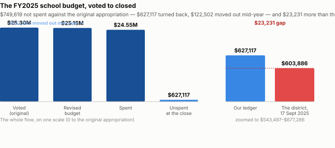

# The FY25 school surplus, from the closed ledger

**What the closed MUNIS ledger shows for department 300 at period 13, beside the figure the School Committee was told on 17 September 2025.**

---

## The short version

**$749,619 was unspent in the school general fund when FY2025 closed** — $627,117 turned back at the close plus $122,502 moved to other budgets mid-year, against an original appropriation of $25,304,074.

**The closed ledger’s $627,117 exceeds the district’s own $603,886 by $23,231.** The School Committee was told the surplus had reached $603,885.97 on 17 September 2025. No single account, and no pair of accounts, accounts for the gap; entries posted after that date are a hypothesis this ledger cannot test.

**Nothing is still open.** Encumbrances are $0.00, so the figure is final as the system holds it, and the department scope is confirmed: the original appropriation ($25,304,074) equals the Town’s own FY25 school figure in its revenue-distribution workbook ($25,304,074).

---

## Where it sat, by DESE function

Net unspent at the close, by function family (the account string’s 4th segment, grouped to the thousands) and whether the line is salary (object code starting `51`) or not.

| function | salary | non-salary | total |
|---|---:|---:|---:|
| 2000 instruction | $136,171 | $112,326 | $248,498 |
| 4000 operations & maintenance | $113,829 | $113,746 | $227,574 |
| 7000 assets | — | $64,748 | $64,748 |
| 3000 other student services | $5,192 | $24,915 | $30,108 |
| 9000 out-of-district tuition | — | $29,946 | $29,946 |
| 1000 leadership / admin | $8,850 | $11,765 | $20,615 |
| 5000 fixed charges | — | $5,629 | $5,629 |
| | **$264,042** | **$363,075** | **$627,117** |

**Instruction and operations & maintenance together hold $476,072 — 76% of the $627,117 unspent.** Almost no account ended overspent: the largest over-lines are in operations and maintenance and in assets, and both are small beside the unspent total.

---

## The paraprofessional accounts (function 2330)

Special-education paraprofessional lines ended under budget everywhere, and para budgets moved between lines mid-year in both directions.

| school | account | original | transfers | revised | spent | available |
|---|---|---:|---:|---:|---:|---:|
| Primary | `S2512131` | $317,143 | $0 | $317,143 | $268,318 | $48,825 |
| High school (not SPED) | `S2066131` | $47,960 | -$13,000 | $34,960 | $4,786 | $30,174 |
| High school (SPED) | `S2516131` | $347,258 | -$31,440 | $315,818 | $294,050 | $21,768 |
| KIND PARAPROFESSIONALS/REG | `S2032131` | $73,273 | $20,222 | $93,495 | $83,766 | $9,729 |
| Middle school (SPED) | `S2515131` | $323,772 | $53,674 | $377,446 | $371,572 | $5,874 |
| Elementary (SPED) | `S2514131` | $312,445 | -$65,000 | $247,445 | $244,291 | $3,154 |
| HOME/HOSPITAL TUTORING | `S0511061` | $10,000 | -$3,200 | $6,800 | $5,031 | $1,769 |
| PARAPROFESSIONALS | `S2511131` | $66,275 | $389 | $66,664 | $66,663 | $1 |

*The "double booking of the para salaries" named in the 17 September 2025 minutes is not visible at this grain — the ledger carries no narrative behind either transfer.*

---

## What it does not show

- What any dollar was spent on, or when — no journal.

- Where the $122,502 moved out of the department went — net per account, no counterparty.

- Why the ledger is $23,231 above the district’s September figure. Entries posted after 17 September 2025 are a hypothesis; nothing here tests it.

- Whether facilities’ unspent salary was unfilled posts — dollars are not posts (rule 7, rule 11).

---

## Closes with

The FY2025 transfer schedule for department 300 with counterparties and authority, and the journal entries posted to department 300 after 17 September 2025.

---

## Sources

| | |
|---|---|
| The ledger | `munis-school-ytd.csv`, FY2025 period 13, report gf-school, type E, 415 accounts |
| The scope check | `revenue-distribution-fy26.csv`, the FY25 School Dept figure |
| The district’s figure | School Committee minutes, 17 September 2025, page 3 of 3 |
