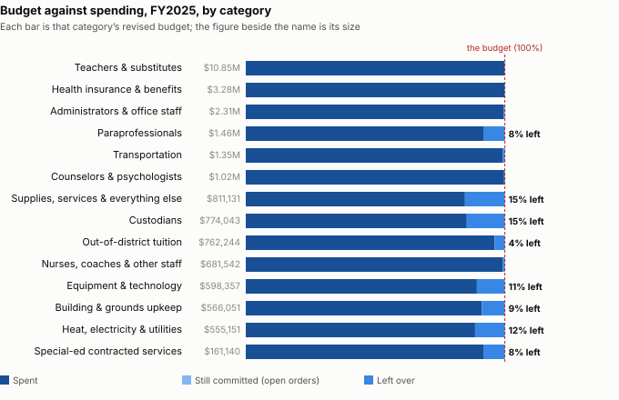

# The FY25 school surplus, from the closed ledger

**What the closed MUNIS ledger shows for department 300 at period 13, beside the figure the School Committee was told on 17 September 2025.**

---

## The short version

**$749,619 was unspent in the school general fund when FY2025 closed** — $627,117 turned back at the close plus $122,502 moved to other budgets mid-year, against an original appropriation of $25,304,074.

![Where the FY2025 school surplus was left, by category: Supplies, services & everything else $125,192; Paraprofessionals $121,294; Custodians $113,829; Equipment & technology $64,748; Heat, electricity & utilities $63,570; Building & grounds upkeep $50,175; Out-of-district tuition $29,946; Special-ed contracted services $13,408; Teachers & substitutes $11,529; Transportation $10,406; Administrators & office staff $9,502; Health insurance & benefits $5,629; Nurses, coaches & other staff $5,192; Counselors & psychologists $2,695.](charts/fy25-school-surplus-causes.svg)

**Where it came from. Three categories left the most:** supplies, services & everything else, $125,192 (15.4% of its budget); paraprofessionals, $121,294 (8.3% of its budget); custodians, $113,829 (14.7% of its budget). Accounts that ended over budget used $22,275 of what the rest left.

**Was it thrift? $240,115 of it (38%) sat in discretionary lines — supplies, upkeep and equipment, the part a decision to spend less could explain.** The other $387,002 sat in salaries, benefits, tuition and other lines that follow staffing, placements and prices. The split of lines into the two groups is ours; see *Was it thrift?* below.

**The closed ledger’s $627,117 exceeds the district’s own $603,886 by $23,231.** The School Committee was told the surplus had reached $603,885.97 on 17 September 2025. No single account, and no pair of accounts, accounts for the gap; entries posted after that date are a hypothesis this ledger cannot test.

**Nothing is still open.** Encumbrances are $0.00, so the figure is final as the system holds it, and the department scope is confirmed: the original appropriation ($25,304,074) equals the Town’s own FY25 school figure in its revenue-distribution workbook ($25,304,074).

---

## Why there was money left over

Every one of the 415 accounts is put in exactly one category by its DESE function and object code (the table is under *How the categories are built*). The surplus is net: accounts that ended under budget left $649,392, and accounts that ended over used $22,275 of it.

| category | revised budget | spent | still committed | left over (net) | % of its budget | under-budget accounts | over-budget accounts |
|---|---:|---:|---:|---:|---:|---:|---:|
| Supplies, services & everything else | $811,131 | $685,939 | — | **$125,192** | 15.4% | $125,455 | -$263 |
| Paraprofessionals | $1,459,771 | $1,338,477 | — | **$121,294** | 8.3% | $121,294 | — |
| Custodians | $774,043 | $660,214 | — | **$113,829** | 14.7% | $113,829 | — |
| Equipment & technology | $598,357 | $533,609 | — | **$64,748** | 10.8% | $68,010 | -$3,262 |
| Heat, electricity & utilities | $555,151 | $491,581 | — | **$63,570** | 11.5% | $63,570 | — |
| Building & grounds upkeep | $566,051 | $515,876 | — | **$50,175** | 8.9% | $68,925 | -$18,750 |
| Out-of-district tuition | $762,244 | $732,298 | — | **$29,946** | 3.9% | $29,946 | — |
| Special-ed contracted services | $161,140 | $147,732 | — | **$13,408** | 8.3% | $13,408 | — |
| Teachers & substitutes | $10,851,937 | $10,840,407 | — | **$11,529** | 0.1% | $11,529 | $0 |
| Transportation | $1,352,528 | $1,342,122 | — | **$10,406** | 0.8% | $10,406 | — |
| Administrators & office staff | $2,310,318 | $2,300,815 | — | **$9,502** | 0.4% | $9,502 | — |
| Health insurance & benefits | $3,275,744 | $3,270,115 | — | **$5,629** | 0.2% | $5,629 | — |
| Nurses, coaches & other staff | $681,542 | $676,350 | — | **$5,192** | 0.8% | $5,192 | — |
| Counselors & psychologists | $1,021,615 | $1,018,920 | — | **$2,695** | 0.3% | $2,695 | — |
| **Total** | $25,181,572 | $24,554,455 | $0 | **$627,117** | 2.5% | $649,392 | -$22,275 |

### What the ledger shows, and what explains it

For each category that moved by at least $25,000: first what the ledger shows (measured), then what a document says about why — quoted, never paraphrased — or, where no document here says, the causes that fit the same numbers, marked as a hypothesis, and the one record that would settle it.

**Supplies, services & everything else.** Supplies, services & everything else left $125,192 of $811,131 (15.4% of its budget). Inside it, accounts under budget left $125,455 and accounts over budget used $263. It ended under budget in 4 of the 4 closed years held (FY2023–FY2026). Other funds also paid on the same lines: fund 1301 “CHAPTER 658 REVOLVING FU”, $27,947; fund 2640 “SPECIAL ED CIRCUIT BREAK”, $24,801; fund 1308 “SCHOOL CHOICE REVOLVING”, $18,665.

*On the record — evidence of what was said, not a test of it:*

- *School Committee minutes, 17 September 2025 (page 3):* “double booking of the para salaries, the music program and supply line cuts”. [Our copy](https://lunenburgbudgetproject.org/docs/minutes/text/school-committee/2025-09-17-minutes-7408.txt) · [the Town’s](https://www.lunenburgma.gov/AgendaCenter/ViewFile/Minutes/_09172025-7408).

*What the record does not establish:* how much of the figure above it accounts for. Other causes that fit: a deliberate hold on purchasing, or purchases made from grants and revolving funds instead. *Would settle it:* the general-fund journal detail by month.

**Paraprofessionals.** Paraprofessionals left $121,294 of $1,459,771 (8.3% of its budget). It ended under budget in 3 of the 4 closed years held (FY2023–FY2026).

*On the record — evidence of what was said, not a test of it:*

- *Town of Lunenburg press release, 2026 (page 6):* “several paraprofessional salaries were ultimately covered by newly identified grants”. [Our copy](https://lunenburgbudgetproject.org/docs/town-budget/docs/4090-click-here-for-a-release-on-quot-understanding-lunenburg-apos-s-fy27-budget-how-.pdf) · [the Town’s](https://www.lunenburgma.gov/DocumentCenter/View/4090). The same release, the second cause.
- *School Committee minutes, 3 September 2025 (page 2):* “a discussion of transfer accounts regarding a double budget amount for paraprofessionals in the amount of $243,000”. [Our copy](https://lunenburgbudgetproject.org/docs/minutes/text/school-committee/2025-09-03-minutes-7385.txt) · [the Town’s](https://www.lunenburgma.gov/AgendaCenter/ViewFile/Minutes/_09032025-7385).
- *School Committee minutes, 17 September 2025 (page 3):* “double booking of the para salaries, the music program and supply line cuts”. [Our copy](https://lunenburgbudgetproject.org/docs/minutes/text/school-committee/2025-09-17-minutes-7408.txt) · [the Town’s](https://www.lunenburgma.gov/AgendaCenter/ViewFile/Minutes/_09172025-7408).

*What the record does not establish:* how much of the figure above it accounts for. Other causes that fit: aides hired late or not at all, or aides paid from a grant instead. *Would settle it:* paraprofessional payroll by month and by funding source.

**Custodians.** Custodians left $113,829 of $774,043 (14.7% of its budget). It ended under budget in 4 of the 4 closed years held (FY2023–FY2026).

*On the record — evidence of what was said, not a test of it:*

- *Town of Lunenburg press release, 2026 (page 6):* “significant turnover and unfilled positions in the facilities department resulted in unspent salaries and stalled maintenance projects”. [Our copy](https://lunenburgbudgetproject.org/docs/town-budget/docs/4090-click-here-for-a-release-on-quot-understanding-lunenburg-apos-s-fy27-budget-how-.pdf) · [the Town’s](https://www.lunenburgma.gov/DocumentCenter/View/4090). The Town’s release “Understanding Lunenburg’s FY27 Budget”, naming the first of two causes of the FY25 school surplus.

*What the record does not establish:* how much of the figure above it accounts for. Other causes that fit: custodial vacancies or turnover. *Would settle it:* the custodial roster by month, with overtime.

**Equipment & technology.** Equipment & technology left $64,748 of $598,357 (10.8% of its budget). Inside it, accounts under budget left $68,010 and accounts over budget used $3,262. It ended under budget in 1 of the 4 closed years held (FY2023–FY2026).

*Possible causes, not established by any document here (a hypothesis):* purchases deferred, or made from another fund. *Would settle it:* the purchase-order list for these accounts.

**Heat, electricity & utilities.** Heat, electricity & utilities left $63,570 of $555,151 (11.5% of its budget). It ended under budget in 1 of the 4 closed years held (FY2023–FY2026).

*Possible causes, not established by any document here (a hypothesis):* weather, energy prices, or a bill for one year paid in another. *Would settle it:* the utility bills by month.

**Building & grounds upkeep.** Building & grounds upkeep left $50,175 of $566,051 (8.9% of its budget). Inside it, accounts under budget left $68,925 and accounts over budget used $18,750. It ended under budget in 4 of the 4 closed years held (FY2023–FY2026).

*On the record — evidence of what was said, not a test of it:*

- *Town of Lunenburg press release, 2026 (page 6):* “significant turnover and unfilled positions in the facilities department resulted in unspent salaries and stalled maintenance projects”. [Our copy](https://lunenburgbudgetproject.org/docs/town-budget/docs/4090-click-here-for-a-release-on-quot-understanding-lunenburg-apos-s-fy27-budget-how-.pdf) · [the Town’s](https://www.lunenburgma.gov/DocumentCenter/View/4090). The Town’s release “Understanding Lunenburg’s FY27 Budget”, naming the first of two causes of the FY25 school surplus.

*What the record does not establish:* how much of the figure above it accounts for. Other causes that fit: maintenance projects postponed or not started, a shortage of facilities staff to run them, or a deliberate hold on spending. *Would settle it:* the facilities work-order and project list with dates.

**Out-of-district tuition.** Out-of-district tuition left $29,946 of $762,244 (3.9% of its budget). It ended under budget in 3 of the 4 closed years held (FY2023–FY2026). Other funds also paid on the same lines: fund 2640 “SPECIAL ED CIRCUIT BREAK”, $473,650.

*Possible causes, not established by any document here (a hypothesis):* fewer children placed than budgeted, placements starting later, a placement paid from the circuit breaker fund instead, or a placement billed to a different tuition line. *Would settle it:* the placement list by setting, with start dates and the tuition invoice for each.

### The largest single accounts

| left over | account | budget | spent | committed |
|---:|---|---:|---:|---:|
| $48,825 | P.S. Sped Paraprofessionals (paraprofessionals) `0100-3-300-2330-51-2-13-1-511203` | $317,143 | $268,318 | — |
| $43,086 | Heating Charges/Natural Gas (heat, electricity & utilities) `0100-3-300-4120-99-1-74-2-521025` | $125,608 | $82,522 | — |
| $38,730 | Primary School Custodians (custodians) `0100-3-300-4110-07-2-74-1-511003` | $120,500 | $81,770 | — |
| $30,174 | H.S. Paraprofessionals (paraprofessionals) `0100-3-300-2330-06-6-13-1-511203` | $34,960 | $4,786 | — |
| $29,478 | Custodial Supplies (building & grounds upkeep) `0100-3-300-4110-99-1-74-2-541001` | $88,885 | $59,407 | — |
| $29,415 | Collaborative Tuitions (out-of-district tuition) `0100-3-300-9400-51-1-06-2-535023` | $58,372 | $28,957 | — |
| $27,979 | New Equipment/System (equipment & technology) `0100-3-300-7300-99-1-10-2-585003` | $27,979 | $0 | — |
| $26,687 | Curriculum Adoption (supplies, services & everything else) `0100-3-300-2110-99-1-10-2-555027` | $75,542 | $48,855 | — |

| over budget | account | budget | spent | committed |
|---:|---|---:|---:|---:|
| -$18,750 | Contracted Services (building & grounds upkeep) `0100-3-300-4220-01-1-74-2-535006` | $274,889 | $293,639 | — |
| -$3,262 | Computers-Purchase & Lease (equipment & technology) `0100-3-300-7400-99-1-52-2-525013` | $320,145 | $323,407 | — |
| -$263 | Postage (supplies, services & everything else) `0100-3-300-1210-01-1-02-2-534400` | $3,550 | $3,813 | — |
| $0 | E.S. Librarian (teachers & substitutes) `0100-3-300-2340-04-4-59-1-511001` | $48,611 | $48,611 | — |

---

## Was it thrift?

A statement that the district was careful is evidence that it was said, not of what happened (rule 7). The ledger can test it five ways; a sixth needs a record nobody has published.

**1. Which lines.** $240,115 of the $627,117 left over sat in discretionary lines (38%); $387,002 sat in circumstantial ones. Salary lines alone, net: $264,042. Thrift shows up in the first group; the second follows vacancies, placements and prices whatever anyone decides about purchases.

**2. Does it repeat?** Left over, net, by category, in every closed year the ledger holds. A line left over every year reads as budgeted high rather than run lean.

| category | kind | FY2023 | FY2024 | FY2025 | FY2026 | years under |
|---|---|---:|---:|---:|---:|---:|
| Supplies, services & everything else | discretionary | $43,031 | $53,200 | $125,192 | $96,363 | 4 of 4 |
| Paraprofessionals | circumstantial | $47,427 | $195,970 | $121,294 | -$208,082 | 3 of 4 |
| Custodians | circumstantial | $14,716 | $155,826 | $113,829 | $11,352 | 4 of 4 |
| Equipment & technology | discretionary | -$106,662 | -$27,388 | $64,748 | -$8,305 | 1 of 4 |
| Heat, electricity & utilities | circumstantial | -$5,962 | -$30,918 | $63,570 | -$21,792 | 1 of 4 |
| Building & grounds upkeep | discretionary | $439 | $18,650 | $50,175 | $195,934 | 4 of 4 |
| Out-of-district tuition | circumstantial | $185,170 | -$87,269 | $29,946 | $88,522 | 3 of 4 |
| Special-ed contracted services | circumstantial | -$8,833 | $4,795 | $13,408 | -$100,262 | 2 of 4 |
| Teachers & substitutes | circumstantial | $210,173 | $122,858 | $11,529 | $167,992 | 4 of 4 |
| Transportation | circumstantial | -$23,809 | -$112,490 | $10,406 | -$67,555 | 1 of 4 |
| Administrators & office staff | circumstantial | -$62,156 | -$40,674 | $9,502 | $4,087 | 2 of 4 |
| Health insurance & benefits | circumstantial | -$197,227 | -$123,307 | $5,629 | $107,003 | 2 of 4 |
| Nurses, coaches & other staff | circumstantial | -$441 | -$29,772 | $5,192 | $25,700 | 2 of 4 |
| Counselors & psychologists | circumstantial | $10,960 | $116,294 | $2,695 | $191,162 | 4 of 4 |

2 of the 3 discretionary categories ended under budget in all 4 years (supplies, services & everything else, building & grounds upkeep).

**3. Budget moves during the year.** What was voted, what moved, and what the budget became, by category — slack moved from one line to cover another is not saving.

| category | voted | moved during the year | revised |
|---|---:|---:|---:|
| Out-of-district tuition | $1,164,824 | -$402,580 | $762,244 |
| Administrators & office staff | $2,160,011 | $150,307 | $2,310,318 |
| Health insurance & benefits | $3,160,838 | $114,906 | $3,275,744 |
| Custodians | $888,929 | -$114,886 | $774,043 |
| Nurses, coaches & other staff | $784,893 | -$103,351 | $681,542 |
| Heat, electricity & utilities | $458,250 | $96,901 | $555,151 |
| Equipment & technology | $520,910 | $77,447 | $598,357 |
| Building & grounds upkeep | $517,358 | $48,693 | $566,051 |
| Supplies, services & everything else | $858,905 | -$47,774 | $811,131 |
| Special-ed contracted services | $114,000 | $47,140 | $161,140 |
| Teachers & substitutes | $10,805,031 | $46,906 | $10,851,937 |
| Paraprofessionals | $1,498,126 | -$38,355 | $1,459,771 |
| Counselors & psychologists | $1,019,471 | $2,144 | $1,021,615 |

**4. Other funds paying.** The school’s special funds (grants, revolving funds, the circuit breaker) spent on the same DESE function as these categories:

- Out-of-district tuition: fund 2640 “SPECIAL ED CIRCUIT BREAK” spent $473,650.
- Health insurance & benefits: fund 2200 “SCHOOL LUNCH REVOLVING” spent $108,237.
- Health insurance & benefits: fund 1312 “EXTENDED DAY REVOLVING F” spent $52,901.
- Supplies, services & everything else: fund 1301 “CHAPTER 658 REVOLVING FU” spent $27,947.
- Supplies, services & everything else: fund 2640 “SPECIAL ED CIRCUIT BREAK” spent $24,801.
- Supplies, services & everything else: fund 1308 “SCHOOL CHOICE REVOLVING” spent $18,665.
- Nurses, coaches & other staff: fund 2713 “FY25 TITLE I #305” spent $17,100.
- Nurses, coaches & other staff: fund 1301 “CHAPTER 658 REVOLVING FU” spent $4,849.
- Nurses, coaches & other staff: fund 2781 “FY22 #119 ESSER III GRAN” spent $1,408.

A match means the same kind of spending, not that it replaced general-fund spending: neither report says which staff member or child a payment covered.

$1,223,963 more of special-fund spending is coded to a round function (2000, 0000 and the like) that names no line, so it cannot be matched to any category here. Where another fund paid, a general-fund line can look underspent without anyone having spent less (rule 11).

**5. Committed is not saved.** $0 is still committed to open purchase orders — $0 of it in discretionary lines. It is not in the $627,117 and is not savings until an order is released.

**6. A decision on record.** What the archive holds about a hold on spending:

- *School Committee, 4 February 2026 — the recording at [0:12:17](https://www.youtube.com/watch?v=HsjpFotE9hc&t=737s), our machine captions, not a record:* “We are on a budget freeze”. A forum on the FY2025 surplus; a speaker recounting what teachers were told. The archive holds the Town’s minutes of this meeting.

No posted minutes in the archive record a vote or a directive to freeze FY2025 spending; searched for *thrift*, *freeze*, *spending freeze*, *hold on spending*, *frugal* and *conservative* in School Committee, Finance Committee and Select Board documents. *Would settle it:* the general-fund journal by month — thrift would show as discretionary spending slowing late in the year against prior years.

---

## Where it sat, by DESE function

Net unspent at the close, by function family (the account string’s 4th segment, grouped to the thousands) and whether the line is salary (object code starting `51`) or not.

| function | salary | non-salary | total |
|---|---:|---:|---:|
| 2000 instruction | $136,171 | $112,326 | $248,498 |
| 4000 operations & maintenance | $113,829 | $113,746 | $227,574 |
| 7000 assets | — | $64,748 | $64,748 |
| 3000 other student services | $5,192 | $24,915 | $30,108 |
| 9000 out-of-district tuition | — | $29,946 | $29,946 |
| 1000 leadership / admin | $8,850 | $11,765 | $20,615 |
| 5000 fixed charges | — | $5,629 | $5,629 |
| | **$264,042** | **$363,075** | **$627,117** |

**Instruction and operations & maintenance together hold $476,072 — 76% of the $627,117 unspent.** Almost no account ended overspent: the largest over-lines are in operations and maintenance and in assets, and both are small beside the unspent total.

---

## The paraprofessional accounts (function 2330)

Special-education paraprofessional lines ended under budget everywhere, and para budgets moved between lines mid-year in both directions.

| school | account | original | transfers | revised | spent | available |
|---|---|---:|---:|---:|---:|---:|
| Primary | `S2512131` | $317,143 | $0 | $317,143 | $268,318 | $48,825 |
| High school (not SPED) | `S2066131` | $47,960 | -$13,000 | $34,960 | $4,786 | $30,174 |
| High school (SPED) | `S2516131` | $347,258 | -$31,440 | $315,818 | $294,050 | $21,768 |
| KIND PARAPROFESSIONALS/REG | `S2032131` | $73,273 | $20,222 | $93,495 | $83,766 | $9,729 |
| Middle school (SPED) | `S2515131` | $323,772 | $53,674 | $377,446 | $371,572 | $5,874 |
| Elementary (SPED) | `S2514131` | $312,445 | -$65,000 | $247,445 | $244,291 | $3,154 |
| HOME/HOSPITAL TUTORING | `S0511061` | $10,000 | -$3,200 | $6,800 | $5,031 | $1,769 |
| PARAPROFESSIONALS | `S2511131` | $66,275 | $389 | $66,664 | $66,663 | $1 |

*The "double booking of the para salaries" named in the 17 September 2025 minutes is not visible at this grain — the ledger carries no narrative behind either transfer.*

---

## How the categories are built

One table in `scripts/build_school_surplus.py` (`CATEGORIES`), first match wins. *Function* is the account string’s 4th segment, the DESE function code; *salary* means the object code starts `51`. The discretionary / circumstantial split is ours, a judgement about which lines a decision to spend less moves directly, and it is stated so it can be disagreed with.

| category | kind | rule |
|---|---|---|
| Teachers & substitutes | circumstantial | salary lines, functions 2300–2399 except 2330 (teachers, special-education teachers, specialists, substitutes, librarians) |
| Counselors & psychologists | circumstantial | salary lines, functions 2700–2899 (guidance, social workers, psychologists) |
| Paraprofessionals | circumstantial | salary lines, function 2330 |
| Administrators & office staff | circumstantial | salary lines, functions 1000–2299 (central office, directors, principals, secretaries) |
| Custodians | circumstantial | salary lines, functions 4000–4999 |
| Nurses, coaches & other staff | circumstantial | every other salary line (nurses, athletics, advisors, reserves) |
| Out-of-district tuition | circumstantial | functions 9000 and up (private and collaborative special-education tuition) |
| Special-ed contracted services | circumstantial | non-salary lines, functions 2310 and 2320 (contracted therapists, evaluations, tutoring) |
| Transportation | circumstantial | non-salary lines, function 3300 (regular and special-education buses) |
| Heat, electricity & utilities | circumstantial | non-salary lines, functions 4120 and 4130 |
| Health insurance & benefits | circumstantial | functions 5000–5999 (health insurance, Medicare, unemployment) |
| Building & grounds upkeep | discretionary | every other non-salary line in functions 4000–4999 (repairs, contracted maintenance, custodial and grounds supplies) |
| Equipment & technology | discretionary | functions 7000–7999, and 2451 (furniture, equipment, computers and their leases) |
| Supplies, services & everything else | discretionary | every remaining non-salary line (classroom supplies, textbooks, professional development, legal, dues, athletics expenses, office services) |

---

## What it does not show

- What any dollar was spent on, or when — no journal.

- Where the $122,502 moved out of the department went — net per account, no counterparty.

- Why the ledger is $23,231 above the district’s September figure. Entries posted after 17 September 2025 are a hypothesis; nothing here tests it.

- Whether facilities’ unspent salary was unfilled posts — dollars are not posts (rule 7, rule 11).

---

## Closes with

The FY2025 transfer schedule for department 300 with counterparties and authority, and the journal entries posted to department 300 after 17 September 2025.

---

## Sources

| | |
|---|---|
| The ledger | `munis-school-ytd.csv`, FY2025 period 13, report gf-school, type E, 415 accounts |
| The scope check | `revenue-distribution-fy26.csv`, the FY25 School Dept figure |
| The district’s figure | School Committee minutes, 17 September 2025, page 3 of 3 |
