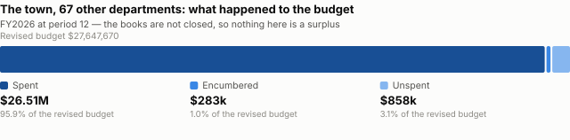
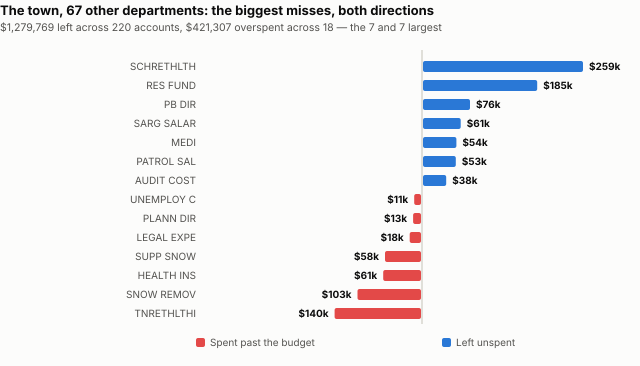
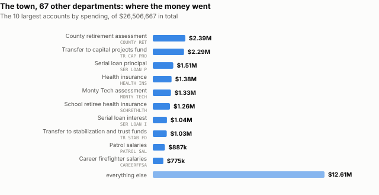

# FY26 on the town side, as the books stood in June

> **Working state:** `notes/HANDOFF.md` carries the current branch and what is established
> versus assumed. `CLAUDE.md` carries the rules.

Analysis, 2 September 2026. Companion to `analyses/fy26-closeout.md`, which reads the same
report for the school department. Every figure recomputed by
`scripts/verify_fy26_closeout_town.py` from `sources/data/lunenburg.db`.

Each section is written twice: **In plain terms** for anyone, and **The evidence** for
anyone who wants to check it.

---

## What this rests on, and what it is not

The FY26 year-to-date budget report sent by the Town Manager on 2 September 2026, at
account level: 376 accounts across 67 departments, everything except the school department
(300) and school non-recurring (301).

**The same three limits apply as on the school side.** It is **period 12, not 13** — June,
with the books open, before purchase orders are cleared. **Zero-balance accounts are
suppressed**, so nothing here reasons from what is absent. And it is **expenditures only,
Fund 0100** — no enterprise funds, no grants, no revolving funds.

**Nothing in this document is a surplus.** It is a position.

---

## In one page

**The town finished June $858,462 under budget across 376 accounts** — the residue of
$1,279,769 of underspending against $421,307 of overspending. Like the school side, the
total is quiet and the parts are not.

**But the town gets there very differently.** Only 18 of its 376 accounts went over
budget. On the school side it is 57 of 259 — one account in five, against fewer than one in
twenty. That difference is a fact with at least four explanations and this document does
not choose between them.

**Snow removal is the year's outstanding number.** Budgeted at $355,571, given $520,319
more during the year, and it still finished $162,521 over — **$1,038,092 spent, 292% of
the appropriation.** The wages line alone spent 539% of its budget with no transfer at all.

**The Reserve Fund was never touched.** $185,000 of declared contingency, $0 spent, in the
year snow ran $682,521 past its appropriation. With the retirement buy-back reserve that is
$215,000 of unused contingency — a quarter of the town's entire net underspend. That is
stated as a fact rather than a criticism: a Reserve Fund transfer needs a Finance Committee
vote and snow deficit spending does not.

**$3.3 million left the operating budget** for capital projects and stabilization, against
$1,285,000 appropriated for the purpose. It is the largest single movement in the FY26
books.

**And $1,262,376 of school retiree health insurance sits in a town department** — a real
cost of running the schools, invisible in the school budget the School Committee votes on.
An unknown share of the town's remaining $2,336,409 of insurance is for serving school
staff; the accounts do not separate town from school. This is the first time this project
has been able to point in the ledger at any of the gap between the state's all-funds
figure for Lunenburg and the appropriation.

**Nothing here is a surplus.** Period 12, books open.

---

**These three pictures are the whole document in outline.** The first shows that almost
all of the budget was spent. The second shows that the small leftover is the residue of
large movements in both directions. The third shows what the money bought. Everything
below is those three facts, itemised and sourced.

---

## 1. The town underspends differently from the schools

### In plain terms

Both sides came in under budget. They got there in completely different ways.

On the town side, **220 accounts were under and only 18 were over.** On the school side,
160 were under and **57** were over. About one school account in five overspent; on the
town side it is fewer than one in twenty.

### The evidence

| | accounts | under | accounts | over | net |
|---|---:|---:|---:|---:|---:|
| Town, 67 departments, 376 accounts | 220 | $1,279,769 | 18 | $421,307 | **$858,462** |
| Schools, 259 accounts | 160 | $1,683,534 | 57 | $1,219,295 | **$464,239** |

Both rows are departments 300 **and** 301 excluded or included consistently. The
companion school analysis covers department 300 alone — 258 accounts, 56 over,
$1,201,434 — because 301 is a single separate appropriation. Adding it moves the school
row by one account and $17,862, and that account is `CURR ADOPT`, curriculum adoption,
which spent $43,639 against a revised $35,777.

Town totals at period 12: **$24,902,491** appropriated, **$2,745,179** transferred in,
**$27,647,670** revised, **$26,506,667** spent, **$282,542** encumbered, **$858,462**
unspent, across **376** accounts in **67** departments.

### What this does not show

**Why.** Four readings fit and nothing here separates them: school budgets may be set
tighter against known costs; the town may transfer more readily during the year so an
account never shows as over; the two may code differently, with the schools carrying more
small accounts that can each tip negative; or school costs may simply be less
controllable. The ratio is a fact. The explanation is not.

---

## 2. Snow removal cost $1,038,092 against a budget of $355,571

### In plain terms

Snow was budgeted at **$355,571**. It was given **$520,319** more during the year. It
still finished **$162,521 over** — total spending of **$1,038,092**, which is **292% of
what the town appropriated.**

It is the single largest budget miss in the FY26 town books, and it is bigger than the
school department's entire net underspend.

### The evidence

| account | | original | transferred in | revised | spent | left |
|---|---|---:|---:|---:|---:|---:|
| `531003` | CONTR SERV | $114,500 | +$381,730 | $496,230 | $496,230.00 | $0 |
| `531029` | SUPP SNOW | $205,151 | +$138,589 | $343,740 | $402,039.54 | −$58,300 |
| `513000` | SNOW REMOV (wages) | $23,420 | $0 | $23,420 | $126,286.35 | **−$102,866** |
| `531030` | HIRED SNOW | $7,500 | $0 | $7,500 | $9,174.15 | −$1,674 |
| `531006` | PURCH SERV | $5,000 | −$319 | $4,681 | $4,362.42 | +$319 |
| | **department 423** | **$355,571** | **+$520,000** | **$875,571** | **$1,038,092.46** | **−$162,521** |

**Two things in that table are worth reading closely.**

`CONTR SERV` was given $381,730 and then spent **exactly** $496,230.00, to the penny of
its revised budget. A transfer sized precisely to what was spent is what a year-end
transfer looks like: the budget is moved to cover the actual, not the other way round.

`SNOW REMOV` — the wages line — got **no transfer at all** and spent **539%** of its
$23,420 budget. It is the account most over its appropriation anywhere in the town books.

### What this does not show

Snow and ice is the one thing a Massachusetts town may lawfully overspend, which is why
this department can end a year negative where others cannot. **We hold no document
stating that authority**, and it is named here as the ordinary explanation rather than as
something this project has verified.

Nor does this say the winter was severe. It says what was spent.

---

## 3. The Reserve Fund was never touched

### In plain terms

The town budgeted **$185,000** as a Reserve Fund — the contingency it holds for
unforeseen costs. At the end of June it had spent **nothing**. Not one dollar.

In the same year snow removal ran $682,521 past its original appropriation.

### The evidence

| department | account | budgeted | transferred out | spent |
|---|---|---:|---:|---:|
| `132` RESERVE FUND | `RES FUND` | $185,000 | $0 | **$0.00** |
| `133` SALARY RESERVE | `RES FUND` | $180,000 | −$128,953.67 | $51,046.33 |
| `133` SALARY RESERVE | `RETIRE/BUY` | $30,000 | $0 | **$0.00** |

The salary reserve did its job: it gave away $128,954 of its $180,000 and spent the rest.
The Reserve Fund proper did nothing, and the retirement buy-back reserve did nothing.

**$215,000 of contingency went unused**, which is 25% of the town's entire net underspend.

### What this does not show

**That this is a finding rather than a procedure.** A Reserve Fund transfer requires
Finance Committee approval, and snow deficit spending does not — so a town facing a snow
overrun would not necessarily reach for it. Whether $185,000 sitting idle reflects a
deliberate policy, an unspent contingency in a mild year, or a reserve nobody asked to
use, is not established here.

---

## 4. $3.3 million left the operating budget for capital and reserves

### In plain terms

Two accounts exist to move money out of the operating budget: one into capital projects,
one into stabilization and trust funds. Between them they were budgeted $1,285,000 and
moved **$3,321,257** — more than two and a half times as much.

This is the largest single movement in the FY26 town books, and it is money the operating
budget raised and then sent somewhere else.

### The evidence

| department | | original | transferred in | spent |
|---|---|---:|---:|---:|
| `993` | Transfer to capital project fund | $1,052,500 | +$1,240,820.32 | $2,293,320.32 |
| `996` | Transfer to trust and stabilization | $232,500 | +$795,437.00 | $1,027,937.00 |
| | **together** | **$1,285,000** | **+$2,036,257.32** | **$3,321,257.32** |

Both spent their revised budget to the dollar, which is what a transfer account does: the
money arrives and immediately leaves.

### What this does not show

**Where the incoming $2,036,257 was voted from.** These accounts received more than
they were appropriated, so something outside the original appropriation funded them —
free cash, a stabilization draw, a Town Meeting article. The ledger records that the
budget changed and never records the counterparty. That is the same gap the school
department's transfers run into, and the same document would close it.

---

## 5. The schools cost the town money the school budget never shows

### In plain terms

The town's insurance department spent **$3,598,785** in FY26. Of that, **$1,262,376 is
explicitly school retiree health insurance** — a real cost of running the schools, sitting
in a town department, appearing nowhere in the school budget the School Committee votes on.

An unknown share of the remaining $2,336,409 is health insurance for **serving** school
employees. The account names do not separate town from school, so it cannot be measured.

### The evidence

| account | | revised | spent | left |
|---|---|---:|---:|---:|
| `570018` | **SCHRETHLTH** — school retiree health | $1,521,536 | **$1,262,376.00** | +$259,160 |
| `570001` | HEALTH INS | $1,315,270 | $1,376,557.17 | −$61,287 |
| `570009` | TNRETHLTHI — town retiree health | $453,215 | $593,088.85 | −$139,874 |
| `570003` | MEDI | $400,000 | $345,848.60 | +$54,151 |
| `570002` | LIFE INS | $15,000 | $12,864.84 | +$2,135 |
| | four smaller accounts | | $8,049.98 | |
| | **department 914** | | **$3,598,785.44** | |

Elsewhere, department 210 carries `SCHRESSTIP` at **$6,800** — a school resource stipend
in the police budget.

**False friends, checked and discarded.** Nine town accounts match a search for `SCH`.
Two are the ones above. The other **seven** are named `MTGS/SCHOO`, `MTG/SCH FF`,
`MEET/SCHOO` — meetings and schooling, meaning staff training, not schools. They total
$9,944.81 and are excluded. A name match is a candidate, not a finding.

### Why this matters beyond the money

This is the mechanism behind a number this project has had to be careful with. DESE
reports Lunenburg's FY24 in-district spending at **$26,914,321.89** against a general fund
school appropriation of about $22.8M, and the difference is not hidden money — it is
costs like these, which DESE attributes to the schools and the school budget does not
carry.

**$1,269,176 of it can now be named.** The rest cannot, and this is the first document in
this project able to point at any of it in the ledger.

### What this does not show

**How much active school employee insurance is in the $1,315,270 `HEALTH INS` line.** The
account does not split town from school. It could be most of it or little of it.

---

## 6. Spending against a zero budget — and why the school case is still different

### In plain terms

`analyses/fy26-closeout.md` §3 reports two kindergarten paraprofessional accounts that
spent $99,064 with no appropriation and no transfer. The obvious question is whether that
is unusual, so it was checked against the town side.

**Thirteen non-school accounts spent money with no original appropriation. Eleven of them
received a transfer that covered it.** The remaining two are one event, not two — and it
is not the same event as the kindergarten accounts at all.

### The evidence

Eleven were covered by a transfer, and that is the ordinary mechanism working:

| department | account | transferred in | spent |
|---|---|---:|---:|
| `164` Town Clerk | TN CLK SAL | +$80,629 | $78,466.44 |
| `992` | TR SPE REV | +$15,000 | $15,000.00 |
| `136` | AUDIT COST | +$8,500 | $8,500.00 |
| `170` | CONSULTANT | +$8,971 | $8,187.54 |
| `141` | TEMP SALAR | +$13,347 | $4,276.20 |
| `136` | GASB45VALU | +$4,100 | $4,100.00 |
| … | five smaller | | |

**The two without a transfer are both in the Planning Board, and they cancel:**

| account | | original | transfers | spent |
|---|---|---:|---:|---:|
| `511000` | PLANN DIR | $0 | $0 | **+$12,796.80** |
| `511001` | PLAN CLERI | $0 | $0 | **−$12,796.80** |

Those are the department's only two accounts in this report, and the second is the exact
negative of the first. That is a **reclassification** — a salary posted to one account and
journalled out of another — and it nets to nothing. No money was spent without a budget;
money was moved between two accounts that both happen to carry no budget.

### What this changes about the school finding

**It makes the kindergarten case more unusual, not less.** The one town-side example that
looked like the same thing turns out to be a paired journal entry that cancels.

**There is no offsetting negative anywhere in the school department.** Every account in
department 300 has zero or positive spending; not one carries a credit that would net the
kindergarten accounts off against something else. Checked directly, because it is the
first thing that would have explained them.

So on the town side, spending against a zeroed line is either covered by a transfer or is
half of a recode. In the school department, $99,064 is neither.

---

---

## 7. Money not spent on people

### In plain terms

The Town's explanation for the FY25 surplus was **unfilled posts**: *"significant turnover
and unfilled positions in the facilities department resulted in unspent salaries and
stalled maintenance projects."* Read against FY26, the town side gives a cleaner picture
than the school side does — and it does not support the same story.

Salary accounts under budget hold **$378,959**, which is the ceiling on unfilled-post
savings. Salary accounts over budget hold $120,923, so the **net left on personnel is
$258,036** — about 30% of the town's net underspend.

**Almost none of it is a post that went unfilled all year.** Only two salary accounts
spent nothing at all, and they hold **$4,440** between them. Everything else is a line
that paid somebody for part of a year.

### The evidence

| | accounts | amount |
|---|---:|---:|
| Salary accounts under budget | 45 | $378,959 |
| Salary accounts over budget | 7 | $120,923 |
| **Net left on salaries** | **52** | **$258,036** |

The largest partial spends:

| department | account | budget | spent | | left |
|---|---|---:|---:|---:|---:|
| `170` Land Use | PB DIR | $104,911 | $28,793 | 27% | $76,118 |
| `210` Police | SARG SALAR — sergeant salaries | $329,083 | $267,994 | 81% | $61,089 |
| `541` Council on Aging | SALASSTMEA | $21,080 | $4,147 | 20% | $16,933 |
| `170` Land Use | CONS ADMIN | $67,094 | $52,884 | 79% | $14,210 |
| `541` Council on Aging | MEAL SITE | $44,973 | $30,867 | 69% | $14,106 |
| `541` Council on Aging | OUT WORKER | $42,629 | $28,910 | 68% | $13,720 |
| `650` Parks & Recreation | PARK SUPER | $23,208 | $13,029 | 56% | $10,179 |

`PB DIR` at 27% of a $104,911 salary is the largest single personnel underspend in the
town books, and the Land Use department also holds `CONS ADMIN` at 79%.

### The FY25 explanation does not repeat in FY26

The Town named **the facilities department**, and in FY26 Facilities & Grounds spent its
salary budget **to the dollar**:

| account | | budget | spent | left |
|---|---|---:|---:|---:|
| `SALFACDIRE` | Facilities salaries | $123,250 | $123,250 | $0 |
| `DIR FAC SA` | Facilities director salary | $68,966 | $68,966 | $0 |
| `SAL STAFF` | Facilities staff salaries | $46,772 | $46,772 | $0 |

Three accounts, three exact matches, nothing left on any of them. **Whatever produced
FY26's underspend, it is not the mechanism the Town identified for FY25.**

### The two sides differ here as they do everywhere

| | under | over | net | share of the side's net |
|---|---:|---:|---:|---:|
| Town salary accounts | $378,959 | $120,923 | $258,036 | 30% |
| School salary accounts | $573,623 | $399,162 | $174,460 | 36% |

Personnel is about a third of each side's underspend. But the school department has
**38 salary accounts over budget against the town's 7**, which is the same pattern §1
found across all accounts, concentrated in the place where it is most consequential.

### What this does not show

**That any post was vacant.** A partial spend is consistent with a post filled in October,
a resignation in April, a part-time appointment, or a person appointed at a lower step,
and nothing here separates them. A budget line is not a position.

### What would settle it

Budgeted positions with their fill dates, or the payroll register by account.

---

## 8. Which lines give their money away

### In plain terms

A line budgeted high and then handed to something else is doing a contingency's job
without being called one. In FY26, **85 town accounts gave up $758,421** — two and a half
times what the school department released, across two and a half times as many accounts.

**But one year cannot show whether any of it is habitual**, and the clearest example on
this side is not over-budgeting at all.

### The evidence

The accounts that gave away the largest share of what they started with:

| department | account | started with | gave up | | left |
|---|---|---:|---:|---:|---:|
| `411` Highway | ADAPROW | $30,000 | −$30,000 | 100% | $0 |
| `425` Traffic signs | LINE PAINT — line painting | $17,500 | −$17,500 | 100% | $0 |
| `945` | TRAINING | $5,000 | −$5,000 | 100% | $0 |
| `145` Treasurer | BOND ISSUA — bond issuance costs | $2,500 | −$2,500 | 100% | $0 |
| `193` Facilities | SAL OVERTI — facilities overtime | $2,083 | −$2,083 | 100% | $0 |
| `161` Town Clerk | SAL ELECTE — elected officials' salaries | $80,629 | −$78,466 | 97% | $2,163 |
| `541` Council on Aging | MILEAGE | $3,800 | −$3,000 | 79% | $800 |

### The largest one is a recoding, not a release

`SAL ELECTE` gave up $78,466 — and in a different department, `TN CLK SAL` received
**$80,629** and spent **$78,466**. The two match: the Town Clerk's salary moved from an
elected-salaries line in department 161 to a Town Clerk line in department 164. Nothing
was over-budgeted. Something was renamed, and the ledger shows it as a large transfer out
of one line and into another.

**That is the caution the whole section needs.** A line at 100% given-up looks identical
whether it was padded, recoded, or genuinely not needed, and only the transfer schedule —
which names the counterparty — separates them.

### What this does not show

**That any line is consistently over-budgeted.** Every figure above is one observation.
The archive holds one year at account level, and `CLAUDE.md` rule 6 is explicit that a
rate off one or two points is not a trend.

**Nor which of these was a Reserve Fund transfer.** The town has declared contingencies —
the $185,000 Reserve Fund untouched in §3, the $180,000 salary reserve that gave away
$128,954 — and a line released by ordinary departmental transfer is a different thing from
one released by a Finance Committee vote. The ledger does not distinguish them.

### What would settle it

FY24 and FY25 at the same grain, and the transfer schedule that names each counterparty.

---

## What this means

### For a resident

**The town's books are tighter than the schools', and that is visible rather than
asserted.** Eighteen accounts over budget out of 376. Whether that reflects steadier costs,
readier mid-year transfers, or a different way of coding the same thing is not established
here — but the pattern is real and it is the clearest structural difference between the two
sides.

**Snow is the one line a town may lawfully overspend, and Lunenburg used it heavily.** It
cost nearly three times its appropriation. That is not a failure of control; it is what the
mechanism exists for. It does mean that when the town budgets $355,571 for snow, the
figure is a placeholder rather than a forecast.

**Part of what the schools cost is on the town's side of the ledger.** $1,262,376 of
school retiree health insurance, plus an unmeasured share of active employee insurance.
Anyone comparing the school budget to what the state says Lunenburg spends on schools is
looking at that difference, and this is where some of it lives.

### For the Select Board and Finance Committee

**$215,000 of declared contingency went unused in a year with a $682,521 snow overrun.**
There is a good procedural reason — the Reserve Fund needs a vote, snow deficits do not —
but it is worth knowing that the town carried an untouched reserve through its most
expensive weather event of the year.

**The transfer schedule is the missing document, and it is missing for the same reason on
both sides.** Every "transferred in" figure in this analysis has an unrecorded
counterparty, including the $2,036,257 that arrived in the two accounts that move money to
capital and stabilization. The ledger records that a budget changed; only the schedule
records what it changed against. It was tabled at Finance Committee on 11 June for want of
documents and has not surfaced since.

**Health insurance should be split between town and school employees in the accounts.**
It is the single largest unmeasured school cost in the town books, and the split is not a
new report — it is a coding question about accounts that already exist.

### For a department head

**A line that gives away 100% of its budget looks the same whether it was padded, recoded,
or genuinely not needed.** The clearest case here is not over-budgeting at all: the Town
Clerk's salary moved between two lines in different departments, and it appears in the
ledger as a $78,466 give-up. Where a transfer is a reclassification rather than a release,
the transfer schedule is the only thing that says so.

**Facilities is the line this document can point to as working.** Three salary accounts,
three exact matches, nothing left on any of them — and it is also the department the Town
named as the cause of the FY25 surplus. Whatever happened last year did not happen this
year.

**One year cannot show a pattern.** Nothing here says any line is habitually
over-budgeted, and three years at this grain is the only thing that would.

## What would change these findings

1. **The FY26 period 13 report.** Every figure here is a position, not a result.
2. **The year-end transfer schedule.** Settles §2, §4 and §6 — every "transferred in"
   figure above has an unknown counterparty.
3. **A split of health insurance between town and school employees.** Settles the open
   half of §5, and is the largest single unmeasured school cost in the town books.
4. **Finance Committee minutes from 14 July 2026.**
5. **Budgeted positions with their fill dates, or the payroll register by account.**
   Turns §7's ceiling into a measurement.
6. **FY24 and FY25 at account level.** §8 can show which lines gave money away once; only
   three years can show which do it habitually.

## How to reproduce

    python3 scripts/build_db.py
    python3 scripts/verify_fy26_closeout_town.py
