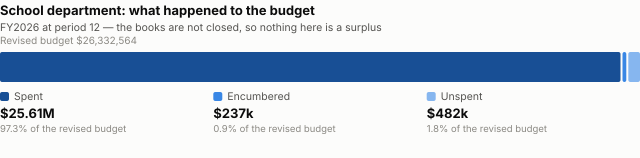
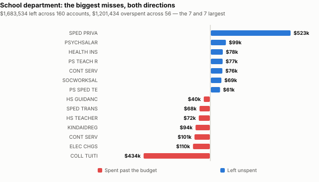
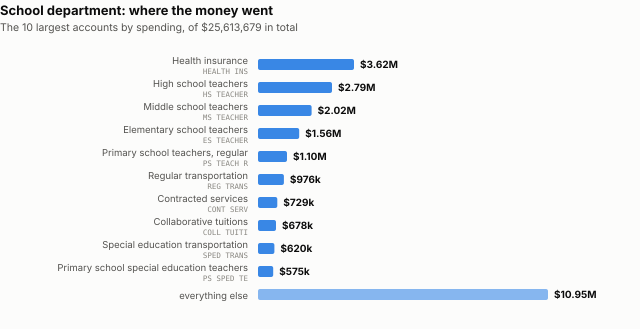

# FY26, as the books stood in June

> **Working state:** `notes/HANDOFF.md` carries the current branch and what is established
> versus assumed. `CLAUDE.md` carries the rules.

Analysis, 2 September 2026. Every figure recomputed by
`scripts/verify_fy26_closeout.py` from `sources/data/lunenburg.db`.

Each section is written twice: **In plain terms** for anyone, and **The evidence** for
anyone who wants to check it. The plain version never states anything the evidence does
not support.

---

## What this rests on, and what it is not

On 2 September 2026 the Town Manager sent the FY26 year-to-date budget report in two
forms, printed and as a spreadsheet. It is the **first account-level general fund
expenditure report this project has ever held.** Every prior one was run as a department
rollup, which renders the entire school district as a single row.

Here the school department is **258 accounts**, each with an org code, an object code and
a description.

**Three limits travel with every figure below, and none of them is a technicality.**

**It is period 12, not period 13.** Period 12 is June. Period 13 is the year-end close,
after purchase orders are cleared in the lapse period. The Town Manager said so in the
covering note: the figures *"are likely to continue to adjust as we continue the year-end
reconciliation process."* In FY25 that step moved the school figure by $21,770.53 between
two School Committee meetings a fortnight apart. **So nothing here is a surplus. It is a
position.**

**Zero-balance accounts are suppressed.** The report was run with `Suppress zero bal
accts: Y`. An account absent from it is not necessarily absent from the ledger, and
nothing below reasons from what is missing.

**It is expenditures only, Fund 0100.** No grants, no revolving funds, no school choice.
The district's budget is *net* — a line is what the town must raise after other money has
paid for part of the thing — so none of this says what anything costs.

---

**These three pictures are the whole document in outline.** The first shows that almost
all of the budget was spent. The second shows that the small leftover is the residue of
large movements in both directions. The third shows what the money bought. Everything
below is those three facts, itemised and sourced.

---

## 1. The headline number is a residual, not a result

### In plain terms

The school department was **$482,101 under budget** in June. That single number is the
small remainder of two much larger flows running in opposite directions: about $1.68
million unspent across 160 accounts, and about $1.20 million overspent across 56.

Reading $482,101 as "the schools underspent by half a million" describes the arithmetic
correctly and the year not at all.

### The evidence

| | |
|---|---:|
| Original appropriation | $26,247,474.00 |
| Transfers and adjustments | $85,090.24 |
| Revised budget | $26,332,564.24 |
| Expended | $25,613,679.23 |
| Encumbered | $236,783.89 |
| **Unspent** | **$482,101.12** |

| | accounts | amount |
|---|---:|---:|
| Under their revised budget | 160 | $1,683,534.14 |
| Over their revised budget | 56 | $1,201,433.65 |
| **Net** | **258** | **$482,101.12** |

Town-wide at the same period: $51,189,965.10 appropriated, $2,826,046.42 transferred,
$52,163,984.85 spent, $529,325.69 encumbered, **$1,322,700.98 unspent.**

The Town's own release of 1 September 2026 put the school figure at "approximately
$470,000 to $600,000" and the town-wide figure at "roughly $1.63 million". The school
figure here sits inside that range near the bottom. **The town-wide figures differ and are
not reconciled here** — the release is preliminary, this is one report at one period, and
nothing published says how the release's figure was struck.

### What this does not show

Whether any of it survives the close. Encumbrances of $236,783.89 are still open, and
clearing purchase orders releases some of that back and commits the rest.

---

## 2. The biggest movers

### In plain terms

Two out-of-district special education lines account for most of the movement in both
directions, and they move opposite ways. Beneath them sit one of the district's four
psychologist accounts that spent nothing all year, a utility overrun, and
paraprofessional lines that all ran over.

### The evidence

| account | | revised | spent | encumbered | left |
|---|---|---:|---:|---:|---:|
| `S0511062` | SPED PRIVA — out-of-district, private | $988,630 | $466,001 | $0 | **+$522,629** |
| `S5511062` | COLL TUITI — out-of-district, collaborative | $302,663 | $678,062 | $58,708 | **−$434,108** |
| `S3991742` | ELEC CHGS — electricity | $271,132 | $319,109 | $62,362 | −$110,338 |
| `S1511062` | CONT SERV — special services contracted | $105,500 | $204,758 | $1,262 | −$100,520 |
| `S2072061` | PSYCHSALAR — one of four psychologist accounts, §4 | $98,784 | $0 | $0 | +$98,784 |
| `S2032121` | KINDAIDREG — kindergarten paras | **$0** | $93,691 | $0 | −$93,691 |
| `S3991692` | SPED TRANS — special ed transport | $565,735 | $620,025 | $13,265 | −$67,555 |
| 4 accounts | special education paraprofessionals | $1,352,508 | $1,458,152 | $0 | −$105,644 |

**The last column is `revised − spent − encumbered`, not `revised − spent`**, and the
encumbrance column is printed because without it the arithmetic does not appear to work.
`COLL TUITI` is the clearest case: $302,663 − $678,062 is $375,399, and the figure is
$434,108, because $58,708 is committed under purchase orders that have not yet been paid.
An earlier version of this table showed the variance and omitted the encumbrance it was
computed from.

**An encumbrance is money promised under a signed contract and not yet paid out.** At the
year-end close some of it is paid and the rest is released back, which is exactly the step
this report predates.

**The two out-of-district lines together**: $1,291,293 budgeted, $1,144,063 spent, a net
of **+$88,522**.

### What this does not show

**Why the two out-of-district lines moved in opposite directions.** It is tempting to read
a shift from private placements toward collaboratives. That precise inference — two budget
lines moving in opposite directions by similar amounts — is one of the three errors
`CLAUDE.md` records as having shipped here before being caught. What is established is the
two numbers. Placement counts by year are not published, so dollars cannot distinguish
fewer children from a different mix from a differently struck budget.

**Whether the special education paraprofessional overruns mean more staff.** They are
dollars. A budget line is not a filled position.

---

## 3. Kindergarten paraprofessionals — an open question

### In plain terms

The FY26 approved budget cut the kindergarten paraprofessional line to zero and published
it as a **−100% cut**. During FY26, **$99,064 was spent on kindergarten paraprofessionals
anyway**, against an appropriation of nothing and with no transfer covering it. In
February 2026, while that spending was happening, the district asked for a kindergarten
paraprofessional back as a **new** staffing request for FY27, at $22,205. It did not make
the FY27 proposed budget.

**No meeting document connects either the cut or the spending to a decision.**
Kindergarten paraprofessionals do appear in the minutes — twice — and both times as an
FY27 staffing request, never in relation to FY26. The distinction matters and an earlier
draft of this section did not make it.

**This is not presented as an impropriety.** Money is routinely spent and reconciled later
through a year-end transfer, and the FY26 transfer schedule is exactly what we do not
have.

### The evidence

**The cut, published.** FY26 School Committee approved budget, 12 March 2025, page 7,
under `2330 - Paraprofessionals General Education`:

    Kindergarten Paraprofessionals   77,699.88$   73,273.00$   (73,273.00)$  -100.00%   (73,273.00)$  -100.00%
    H.S. Paraprofessionals /Regular  18,435.23$   47,960.00$   (47,960.00)$  -100.00%   (47,960.00)$  -100.00%

**The history, from the FY27 workbook** (`fy27-proposals.xlsx`, sheet `FY27 Budget
Projection`, and identical in its traceable twin):

| cell | | value |
|---|---|---:|
| `C332` | FY23 actual | $75,501.66 |
| `D332` | FY24 actual | $77,699.88 |
| `E332` | FY25 actual | $83,765.97 |
| `F332` | FY25 budget | $73,273.00 |
| `G332` | FY26 final budget | `-` |
| `J332`–`M332` | every FY27 proposal | `-` |

Row 333, `Kindergarten Aides/Regular`, exists only from FY26: `G333 = 0`, `H333 =
59,709.10` of actuals to date. **That row is the ledger account surfacing in the workbook,
not a renamed budget line** — it does not appear in the FY26 approved budget at all.

**The spending, from the ledger at period 12:**

| account | object | original | transfers | revised | spent |
|---|---|---:|---:|---:|---:|
| `S2032121` KINDAIDREG | 511103 | $0 | $0 | $0 | $93,691.03 |
| `S2032131` KINDPARREG | 511203 | $0 | $0 | $0 | $5,373.12 |

**$99,064.15 against an appropriation of $0.**

**The mechanism exists and was used elsewhere.** Nine school accounts spent with no
original appropriation. Six received a transfer to cover it — `HS GUID SE` $42,967,
`DUES/FEES` $29,965, `PHYS ED SU` $550 among them. These two received nothing.

**The request, in the minutes.** Finance Committee, 26 February 2026, under *Staffing
Increase Requests — Primary School*:

    1 Interventionist to address the early literacy and math gaps: $72,441
    1 Kindergarten Paraprofessional: $22,205

and, in the same list, *"The above listed position costs do not include insurance costs."*
A resident named the same request in public comment to the School Committee on 10 March
2026.

**Both mentions are FY27 requests.** Neither refers to the FY26 cut or to the FY26
spending. That is the whole of what the minutes say.

### A partial conclusion, offered as one

The service continued. Kindergarten paraprofessionals were paid throughout FY26 at a level
comparable to prior years — $99,064 against actuals of $75,502, $77,700 and $83,766 in the
three years before — while the line carrying them was budgeted at zero.

### What this does not show, and three readings that fit equally well

1. **A recoding.** The appropriation landed under a different line and the spending did not
   follow it. `H.S. Paraprofessionals /Regular` was cut the same way and shows *no* FY26
   spending, so the cut was real somewhere; it is not established that it was real here.
2. **A grant expected to cover it.** The Town has stated that about $287,000 of
   out-of-district tuition was charged to the FY26 IDEA grant rather than the operating
   budget, so grant-shifting demonstrably happened in FY26. Nothing links it to this line.
3. **An unreconciled overrun** awaiting the year-end transfer that has not yet been voted.

**Do not treat the $22,205 request as the cost of the FY26 spending.** It is one position,
excluding insurance, in a different fiscal year. $99,064 ÷ $22,205 is arithmetic, not a
headcount.

### What would settle it

The FY26 year-end transfer schedule, by department and account, with the authority for
each. And Finance Committee minutes from 14 July 2026 onward.

---

## 4. Four psychologist lines, and one of them spent nothing

### In plain terms

The district carries four school psychologist accounts and four social worker accounts,
one per building. **Three of the four psychologist lines spent their budget in full or a
little over. The fourth spent nothing at all, all year — $98,784 budgeted, $0 out.**

The social worker lines are less stark but point the same way: two spent in full, one
spent 68%, one spent 23%.

Between them the eight accounts left $194,718 unspent, which is about 40% of the
department's entire net underspend.

### The evidence

| account | | budgeted | spent | |
|---|---|---:|---:|---:|
| `S2044061` | PSYCHSALAR | $98,784 | $101,510 | 103% |
| `S2055061` | PSYCHSALAR | $45,106 | $45,306 | 100% |
| `S2066061` | PSYCHSALAR | $45,106 | $45,306 | 100% |
| `S2072061` | PSYCHSALAR | $98,784 | **$0** | **0%** |
| | **four psychologist accounts** | **$287,780** | **$192,122** | |
| `S2044651` | SOCWORKSAL | $92,939 | $92,939 | 100% |
| `S2055651` | SOCWORKSAL | $92,939 | $63,214 | 68% |
| `S2066651` | SOCWORKSAL | $90,212 | $20,877 | 23% |
| `S2072651` | SOCWORKSAL | $92,939 | $92,939 | 100% |
| | **four social worker accounts** | **$369,029** | **$269,969** | |

All eight carry object code `511023` or `511024`, and none received a transfer.

### Why it matters beyond the money

`CLAUDE.md` lists as a standing question: *"Whether budgeted positions were filled. A
budget line is an intention."* For these eight lines, in this one year, the ledger comes
closer to answering it than anything this project has held before — three lines paid in
full look like filled posts, and one paid nothing does not.

### What this does not show

**That a post was vacant.** A line spending nothing is consistent with a vacancy, with a
person paid from a different account, with a grant-funded position, or with a coding
change. Rule 7: the measurement is the dollars.

**And it is deliberately not stated as "a school psychologist was cut".** An earlier draft
of this section quoted the zero line alone and described it as *a position budgeted and not
spent*, which read as a statement about the district's psychologists in general. It is one
of four. `scripts/verify_fy26_closeout.py` caught it because the figure it derived from the
database did not match the figure in the prose.

## 5. $85,090 moved into the schools — what that actually looks like

### In plain terms

"$85,090 of transfers" is not one movement. It is **82 separate account changes**:
49 accounts had budget added, 33 had budget taken away, and the difference between those
two piles is $85,090.

Most of it is the department moving its own money around during the year — an overrun
here covered by an underspend there. The net is what came from outside the department.

**And the ledger cannot tell you what any transfer was from.** It records that an
account's budget changed. It does not record the counterparty. That is in the transfer
schedule, and the transfer schedule is what the Finance Committee twice did not have.

### The evidence

| | accounts | amount |
|---|---:|---:|
| Budget added | 49 | $394,928.82 |
| Budget taken away | 33 | $309,838.58 |
| **Net into the department** | **82** | **$85,090.24** |

The largest movements in each direction:

| account | | change | original |
|---|---|---:|---:|
| `S0990991` SCHSALRESE | school salary reserve | **−$90,769.62** | $90,770 |
| `S2516061` HS SPED RE | H.S. special ed | −$81,075.96 | $449,087 |
| `S2066651` HS GUID SE | H.S. guidance | **+$42,966.92** | **$0** |
| `S2514131` ESSPEDPARA | E.S. special ed paras | +$33,623.36 | $225,152 |
| `S0011742` CONT SERV | contracted services | +$31,291.13 | $257,000 |
| `S3066672` DUES/FEES | athletics dues and fees | +$29,965.45 | **$0** |
| `S2055711` MS REG SUB | M.S. substitutes | +$21,230.45 | $11,000 |
| `S3066672` ATH INS | athletics insurance | −$20,000.00 | $29,000 |
| `S2032711` KIND LONG | kindergarten long-term subs | −$15,000.00 | $15,000 |

**What a transfer looks like, read off this table.** `S0990991 SCHSALRESE` is a *salary
reserve* — a contingency line budgeted at $90,770 and deliberately not attached to any
job. Over the year it gave up **every dollar**, ending at zero. That is a reserve doing
exactly what a reserve is for. `S2032711 KIND LONG` gave up its whole $15,000 the same
way, and `S2516061` gave up $81,076 of a $449,087 special education line.

On the other side, `HS GUID SE` and `DUES/FEES` both started at **$0** and were given
$42,967 and $29,965 — accounts that had no budget until money was moved into them. Which
is precisely what did *not* happen for the kindergarten paraprofessional accounts in §3.

### Where the net $85,090 came from

**Not established.** Town-wide, net transfers into the general fund at period 12 are
$2,826,046.42 — so this is not a closed system in which one department's gain is
another's loss. The town's `SALARY RESERVE` department gave up $128,953.67, and the
capital projects and trust fund transfer accounts took in $1,240,820.32 and $795,437.00.
Whether any of the school department's $85,090 came from the salary reserve, from a Town
Meeting vote, or from somewhere else **cannot be read off this report**, because the
report shows each account's net change and never its counterparty.

### What this does not show

That no vote happened. Minutes may not be posted yet, and not every transfer requires a
Finance Committee vote. What can be said is that **no document in this archive connects
any of these 82 movements to a decision.**

Finance Committee, 11 June 2026:

> "**a. Year End Transfers** — The documents needed on this topic were not provided but
> should be available for the next meeting."

It returned to the agenda for 14 July 2026. The archive holds Finance Committee **agendas**
through 27 August 2026 and **minutes** only through 11 June 2026.

---

## 6. The money that never appears in the budget at all

### In plain terms

Alongside the general fund, the schools ran **21 other funds that spent money** in FY26 —
grants, revolving funds fed by fees, and gifts. Together they spent **$1,736,376**, and
not one dollar of it appears in the district's budget document.

The largest is school lunch, which is a self-contained operation. But the next several
are not: **$409,035 of IDEA special education grants**, $233,350 of extended day,
$100,467 of athletics, $95,196 of after-school.

### The evidence

**These figures are period 9 — through 31 March 2026 — not period 12.** They come from a
different report from everything above, and the two cannot be added into a single
year-end total. Where §1 says "period 12", this section says "through March".

| fund | | revenue in | spent | balance |
|---|---|---:|---:|---:|
| `2200` | School Lunch Revolving | $572,231 | $739,586 | $287,771 |
| `1312` | Extended Day Revolving | $192,943 | $233,350 | $54,161 |
| `2813` | FY25 IDEA #240 | $0 | $229,398 | −$88,503 |
| `2814` | FY26 IDEA #240 | $0 | $179,637 | −$179,637 |
| `1301` | Chapter 658 (athletics) | $160,164 | $100,467 | $169,945 |
| `1305` | After School Activities | $111,376 | $95,196 | $148,578 |
| `2778` | FY25 SOA Evidence-Based | $0 | $68,647 | −$91,220 |
| `1308` | School Choice Revolving | $83,116 | $30,558 | $299,461 |
| `2672` | FY26 Family & Community #237 | $48,558 | $13,372 | $35,186 |
| `1306` | School Facilities Use | $18,670 | $12,354 | $71,559 |
| `2640` | **Special Ed Circuit Breaker** | **$325,970** | **$4,005** | **$615,301** |
| `1311` | School Gift Fund | $22,486 | $2,911 | $109,398 |
| | ten smaller funds | | $26,896 | |
| | **total** | | **$1,736,376** | |

### Two things in that table worth reading twice

**The IDEA grants spent $409,035 between them and took in nothing**, ending at −$88,503
and −$179,637. A negative balance here means spending has run ahead of the reimbursement
drawn down; grants are typically claimed in arrears. It is not an overdraft.

**Special education circuit breaker took in $325,970 and spent $4,005**, holding
**$615,301**. Circuit breaker is the state's reimbursement toward high-cost out-of-district
placements — the same thing §2's two tuition lines pay for. That is a large balance
sitting beside a general fund tuition line that underspent by $522,629.

**Nothing here links them.** No document maps a fund's spending onto a budget line, so it
cannot be said that circuit breaker money did or did not pay for a placement the general
fund budgeted. The two facts sit next to each other and that is all.

### What this does not show — and it is the whole of §6

**Where any of this money went.** The fund tells you its purpose, not the line it paid.
School lunch plainly buys food; the IDEA grants plainly buy special education; but *which*
special education — which staff, which placement, which of the 258 accounts it would
otherwise have shown up in — is not published anywhere.

So every figure in sections 1 to 5 is the **town's share**. A line that fell may mean less
service, or may mean one of these funds paid for it. The expense side cannot tell them
apart, and neither can this document.

---

---

## 7. Money not spent on people — the closest we can get

### In plain terms

The Town's own explanation for the FY25 surplus was **unfilled posts**: *"significant
turnover and unfilled positions in the facilities department resulted in unspent salaries
and stalled maintenance projects."* So the obvious question for FY26 is how much of the
underspend is salary money that was budgeted for someone and not paid to anyone.

**The answer is a ceiling, not a measurement, and the two must not be confused.**

Salary accounts that came in under budget hold **$573,623** — that is the most that could
possibly be unfilled-post savings. But salary accounts that went *over* hold $399,162, so
the **net** left on personnel is **$174,460**, about 36% of the department's net
underspend.

Only **three** salary accounts of any size spent nothing at all, and they hold **$125,239**
between them.

### The evidence

| | accounts | amount |
|---|---:|---:|
| Salary accounts under budget | 42 | $573,623 |
| Salary accounts over budget | 38 | $399,162 |
| **Net left on salaries** | **80** | **$174,460** |

Salary accounts that spent **nothing all year**, above $5,000:

| account | | budget | spent |
|---|---|---:|---:|
| `S2072061` | PSYCHSALAR — school psychologist salaries | $98,784 | $0 |
| `S3066671` | ATHSEC — athletics secretary | $20,407 | $0 |
| `S2996101` | CCLT/CCL | $6,048 | $0 |

Seven more spent nothing and hold $4,644 between them. **Five of those seven are $800
secretarial overtime lines**, where spending nothing means no overtime was worked — not a
vacancy. That is why the count matters less than it looks.

Salary accounts that spent **less than 85%** of their budget:

| account | | budget | spent | | left |
|---|---|---:|---:|---:|---:|
| `S2066651` | SOCWORKSAL — social worker salaries | $90,212 | $20,877 | 23% | $69,335 |
| `S2055651` | MS GUIDANC — middle school guidance | $131,509 | $97,988 | 75% | $33,521 |
| `S2055651` | SOCWORKSAL — social worker salaries | $92,939 | $63,214 | 68% | $29,725 |
| `S2016081` | HS ADM SEC — high school admin secretary | $51,973 | $38,249 | 74% | $13,724 |
| `S2514711` | ES SPED SU — elementary special ed substitutes | $18,393 | $10,697 | 58% | $7,696 |
| | six more under 85% | | | | $15,220 |

### The FY25 explanation does not repeat in FY26

The Town named **the facilities department**. Whichever facilities it meant, neither shows
the pattern in FY26.

The town's Facilities & Grounds salary accounts spent **100% of budget, to the dollar**:
`DIR FAC SA` $68,966 of $68,966, `SAL STAFF` $46,772 of $46,772, `SALFACDIRE` $123,250 of
$123,250, nothing left on any of them. The school's own custodial and maintenance salary
lines are at or **over** budget — `MTC SYSTEM` spent $262,082 against $261,711, primary
school custodians $102,733 against $99,711.

**So the mechanism the Town identified for FY25 is not what happened in FY26.** Something
else produced this year's underspend.

### What this does not show, and it is most of what a reader wants

**That any post was vacant.** A salary line spending nothing is *consistent with* a
vacancy and equally consistent with: the person being paid from a different account, the
post being grant-funded, the line being left in the budget after the post was eliminated,
or a coding change. Section 4's four psychologist accounts are the clearest case — three
paid in full and one paid nothing — and even there the ledger says dollars, not people.

**And a partial spend is weaker evidence still.** 75% of a salary is equally consistent
with a post filled in October, a resignation in April, a part-time appointment, or a
person appointed at a lower step. Nothing here separates them.

**A budget line is not a position.** That is rule 7 and it applies with full force here:
the quantity nobody publishes is a headcount, and the quantity we have is dollars.

### What would settle it

A list of budgeted positions with their fill dates — the standing question
`notes/DATA-WANTED.md` calls unanswerable. Failing that, the **payroll register by
account**, which would show whether a line paid a person for part of the year or nobody at
all. Neither is a report the town publishes.

---

## 8. Which lines give their money away

### In plain terms

A line that is budgeted high and then hands its money to something else is doing the job
of a contingency without being called one. Whether that is happening here is a fair
question, and this is the year it first became askable — but **one year cannot answer it.**

In FY26, **33 school accounts gave up $309,839** of budget. Nearly a third of that is one
account doing exactly what it exists to do.

### The evidence

The accounts that gave away the largest share of what they started with:

| account | | started with | gave up | | left | spent |
|---|---|---:|---:|---:|---:|---:|
| `S0990991` | SCHSALRESE — school salary reserve | $90,770 | −$90,770 | 100% | $0 | $0 |
| `S2032711` | KIND LONG — kindergarten long-term subs | $15,000 | −$15,000 | 100% | $0 | $0 |
| `S2066711` | HS LONG TE — high school long-term subs | $3,000 | −$2,956 | 99% | $44 | $0 |
| `S3066672` | ATH INS — athletics insurance | $29,000 | −$20,000 | 69% | $9,000 | $8,980 |
| `S2022711` | PS LONG SU — primary long-term subs | $15,000 | −$7,075 | 47% | $7,925 | $10,265 |
| `S1011022` | DUES/MTGS — dues and meetings | $8,000 | −$3,585 | 45% | $4,415 | $3,521 |
| `S2032711` | KIND SUBS — kindergarten substitutes | $4,000 | −$1,601 | 40% | $2,399 | $2,399 |

### Reading it

**The largest is a declared contingency and should not be counted as padding.**
`SCHSALRESE` is a salary reserve — budgeted at $90,770, attached to no post, and voted on
that basis. Giving away every dollar is the whole point of it. It is 29% of everything the
department gave up.

**Three of the top five are substitute-teacher lines.** `KIND LONG`, `HS LONG TE` and
`PS LONG SU` are long-term substitute budgets that gave up 100%, 99% and 47%. A
substitute line is a genuine forecast — you budget for absences you cannot predict — so it
is the kind of line most likely to be set high and released. It is also the kind of line
where "set high" and "set honestly" look identical from outside.

**And `ATH INS` gave up $20,000 of a $29,000 insurance budget** and then spent $8,980 of
the $9,000 left. That is a line that turned out to need a third of what it was given.

### What this does NOT show, and it is the whole limitation

**That any of this is consistent.** Establishing that a line is *habitually* over-budgeted
takes several years of the same account. **This project holds exactly one year at account
level** — FY26 at period 12 — so every figure above is a single observation. A line that
gave away 100% once may do it every year or may have done it once.

`CLAUDE.md` rule 6 exists for this: a rate off one or two points is not a trend. One point
is not even a rate.

**And a 100% give-up is often a recoding rather than a release.** The town side has the
clearest example: `SAL ELECTE` gave up 97% of $80,629 while `TN CLK SAL` in a different
department received $80,629 and spent $78,466. The Town Clerk's salary moved between
lines. Nothing was over-budgeted; something was renamed.

### What would settle it

**The FY24 and FY25 reports at the same grain.** Three years of the same accounts would
turn every row above from an observation into a pattern or a one-off, and it is the same
request already outstanding for other reasons. This is the strongest argument yet for
asking for the back years rather than only the current one.

## What would change these findings

In order of how much each would settle:

1. **The FY26 period 13 report.** Turns every figure here from a position into a result.
2. **The year-end transfer schedule**, by account, with authority. Settles §3 and §5.
3. **The same report for funds other than 0100.** Turns the net budget into a gross one.
4. **Finance Committee minutes from 14 July 2026.**
5. **Out-of-district placement counts by year.** The only thing that would let §2's two
   tuition lines be read as anything other than two numbers.
6. **Budgeted positions with their fill dates, or the payroll register by account.**
   Turns §7's ceiling into a measurement.
7. **FY24 and FY25 at account level.** §8 can show which lines gave money away once; only
   three years can show which do it habitually.

## How to reproduce

    python3 scripts/build_db.py
    python3 scripts/verify_fy26_closeout.py
