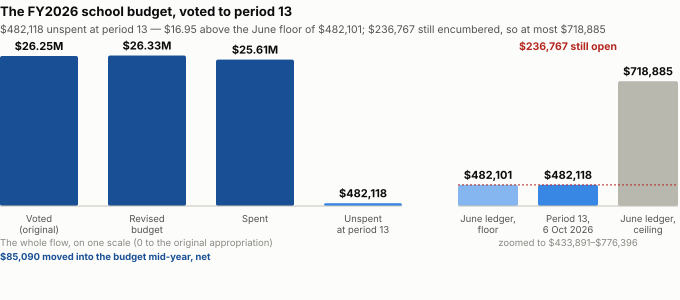
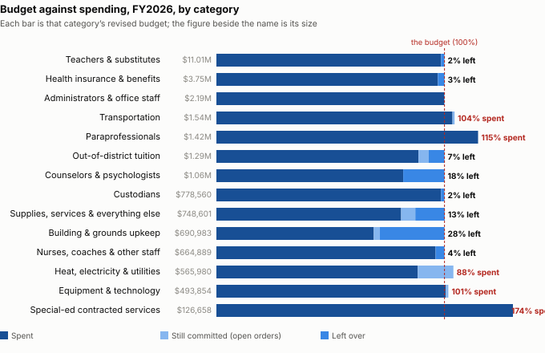

# The FY26 school surplus, from the period-13 ledger

**What the school general fund’s period-13 ledger, run 6 October 2026, shows was left unspent in FY2026 — set against the range the June ledger allowed and what the School Committee was told.**

---

## The short version

**$482,118 was left unspent and uncommitted in the school general fund at period 13 of FY2026**, of a revised budget of $26,332,564 — net of $1,683,552 left on lines that came in under and $1,201,434 spent past the budgets of the rest. Read against what each line was supposed to equal, it says this:

**FY27 budgets $700,142 for out-of-district tuition; FY26 spent $1,202,771 on the same lines.** The circuit breaker paid $333,495 on top. The FY28 line has to say which figure it plans from.

**57 school accounts closed FY26 $1,201,434 past their revised budgets; FY25 closed with 4.** The 29 July transfers moved $148,364. FY23 and FY24 closed like FY26, with 70 and 52 over.

**FY26 left $482,118 unspent; the FY27 school budget was set $761,000 below level service.** The surplus goes to the town as free cash, and Town Meeting decides where certified free cash is spent.

**Electricity and contracted therapy ran past their voted budgets all 4 years, by $489,283.** FY27 budgets them at $316,250 and $130,000; FY26 already paid $319,109 and $204,758.

**20 accounts were given $117,626 by transfer in FY26 and still ended $223,361 under.** School Committee dues got $13,500 for a search invoice and ended with $13,689 unspent.

**The circuit breaker paid 21.7% of FY26 out-of-district tuition; in FY23 it paid 61.9%.** Over the same years the general fund's tuition bill went from $304,748 to $1,202,771.

**Supplies and services were voted above what they spent in all 4 years, $375,175 in all.** Building upkeep's vote rose 96.4% from FY23 to FY26; FY26 spent $156,984 less than voted.

**A $98,784 psychologist line paid nobody in FY26; FY27 budgets the line at $102,227.** Kindergarten aides went the other way: $99,064 paid against no budget, and FY27 budgets none.

**Salary lines left $192,211 net, though paraprofessionals ran $208,082 over.** The record names one leave of absence; no document here says why counselor money was left.

**The FY26 school surplus stands at $482,118, $16.95 more than the June ledger showed.** Not one of the 258 accounts in both runs changed its spending between them.

**$236,767 is still committed to open purchase orders, across 27 accounts.** Paid, the surplus stays at $482,118; released, it can rise to at most $718,885.

**In July the Committee heard FY26 would return well below FY25’s $600,000.** The floor, $482,118, is below it; the ceiling, $718,885, is above it.

**Credit where the ledger shows it.** FY27 budgets special-ed aides $297,321 above what FY26 paid them, after an overrun. Health insurance, $328,771 short over FY23 and FY24, closed FY26 $78,313 under its budget. And the year-end transfers were voted in open session and itemised, one by one, in the minutes.

Every figure is in the evidence below, with the account it comes from. Where a cause is offered it is a hypothesis, and it says so.

---

## The audit: each finding against what it should equal

Every finding below sets a figure against something it was supposed to equal — a budget against its spending, one year against the next, a statement against the ledger. Accounts are cited by their full MUNIS string; raw values are to the cent. The FY2027 figures are the district’s FY2027 workbook, Balanced column, each line first tied to the MUNIS FY2026 original appropriation. Where a cause is offered it is a hypothesis and says so.

### 1. Out-of-district tuition: the FY2027 budget against the FY2026 bill

| line | account | FY2026 voted | FY2026 spent | FY2026 spent and committed | FY2027 budget |
|---|---|---:|---:|---:|---:|
| Private tuition | `0100-3-300-9300-51-1-06-2-535019` | $988,630.00 | $466,000.82 | $466,000.82 | $536,400.00 |
| Collaborative tuition | `0100-3-300-9400-51-1-06-2-535023` | $302,662.56 | $678,062.05 | $736,770.12 | $163,742.00 |
| **Both** | | $1,291,292.56 | $1,144,062.87 | **$1,202,770.94** | **$700,142.00** |

The FY2027 budget is $502,629 below what FY2026 spent and committed on the same two lines. The circuit breaker fund (2640) paid $333,495 more tuition in FY2026, outside these lines. The FY2027 figure is the same in the Balanced, Level Service, Core and Restoration columns, so it was the district’s estimate rather than one of the spring’s cuts.

*What it does not show:* how many children either figure pays for, or for which months. *Readings that fit, none tested here (hypotheses):* placements ending in FY2027; more expected from the circuit breaker; FY2027 tuition paid in advance from FY2026 money, which would raise FY2026 and lower FY2027 by the same amount. *Would settle it:* the tuition invoices by service period, and the FY2027 placement list with the fund expected to pay each.

### 2. Lines that closed past their revised budgets

| fiscal year | accounts past revised budget | by | transfers in, gross | accounts spent to exactly $0 left |
|---|---:|---:|---:|---:|
| FY2023 | 70 | $753,697 | $590,339 | 26 |
| FY2024 | 52 | $1,167,996 | $486,257 | 23 |
| FY2025 | 4 | $22,275 | $1,463,210 | 91 |
| FY2026 | 57 | $1,201,434 | $394,929 | 29 |

FY2025 is the exception, not FY2026: it is the one year in four in which nearly every line was brought back to its budget by transfer. *That this was a deliberate year-end reconciliation after the FY2025 surplus became public is a hypothesis; nothing here records it.* The school appropriation is a single bottom-line total, so a line past its budget is not spending past the appropriation — but the lines are what the next budget is built from.

The five largest FY2026 overruns, $811,010 of the $1,201,434:

| account | description | voted | moved in | spent | committed | past budget |
|---|---|---:|---:|---:|---:|---:|
| `0100-3-300-9400-51-1-06-2-535023` | Collaborative Tuitions | $302,662.56 | $0.00 | $678,062.05 | $58,708.07 | -$434,107.56 |
| `0100-3-300-4130-99-1-74-2-521011` | Electricity Charges | $265,000.00 | $6,132.42 | $319,108.72 | $62,362.13 | -$110,338.43 |
| `0100-3-300-2310-51-1-06-2-535012` | Contract Related Services | $103,000.00 | $2,500.00 | $204,757.65 | $1,262.40 | -$100,520.05 |
| `0100-3-300-2330-03-2-12-1-511103` | Kindergarten Aides/Regular | $0.00 | $0.00 | $93,691.03 | $0.00 | -$93,691.03 |
| `0100-3-300-2305-06-6-10-1-511001` | H.S. Teachers/Regular | $2,719,099.00 | $0.00 | $2,791,452.42 | $0.00 | -$72,353.42 |

The minutes of 29 July 2026 describe “a series of year-end line-item transfers needed to cover overages within the FY26 budget” and list ten, totalling $148,364.31. They also record that “additional year-end transfers may still be forthcoming”. The period-13 run of 6 October 2026 shows no transfer posted after the period-12 run of 1 September 2026. 38 of the 57 accounts past their budget received no transfer in at all.

### 3. The surplus beside the FY2027 cuts

| | |
|---|---:|
| FY2027 school budget, Level Service | $27,333,288.00 |
| FY2027 school budget, Balanced (the no-override budget) | $26,572,287.50 |
| **The difference** | **$761,000.50** |
| FY2026 unspent at period 13 | $482,118.07 (63.4% of the difference) |
| …with every open purchase order released | $718,885.01 (94.5%) |

Two measured things, side by side; neither explains the other. The FY2027 budget was set in March 2026, when the FY2026 year was nine months in; this surplus was measured in October. A school appropriation that is not spent lapses to the town’s general fund and reaches the free cash the state certifies; Town Meeting appropriates free cash. The district’s FY2027 projection of 23 March 2026 prints the same two totals, rounded to the dollar.

### 4. Two lines voted below their spending in every year held

| line | account | FY2023 voted − spent | FY2024 voted − spent | FY2025 voted − spent | FY2026 voted − spent | FY2027 budget |
|---|---|---:|---:|---:|---:|---:|
| Electricity | `0100-3-300-4130-99-1-74-2-521011` | -$13,633 | -$105,732 | -$67,266 | -$116,471 | $316,250 |
| Contracted related services (special-education therapy) | `0100-3-300-2310-51-1-06-2-535012` | -$14,197 | -$41,922 | -$27,042 | -$103,020 | $130,000 |

FY2026 had already paid $319,108.72 for electricity and $204,757.65 for therapy before anything still committed. Beside electricity, natural-gas heating (`0100-3-300-4120-99-1-74-2-521025`) was voted above its spending in FY2024, FY2025, FY2026 and received transfers in, net, in every year held: FY2023 voted $98,151, moved $14,500, spent and committed $122,623; FY2024 voted $98,151, moved $16,400, spent and committed $94,480; FY2025 voted $120,000, moved $5,608, spent and committed $82,522; FY2026 voted $145,000, moved $11,024, spent and committed $110,464.

At the Finance Committee on 26 February 2026 a member “questions the impact of the solar panels”. *Hypotheses, untested:* buildings moving load from gas to electricity; rates; the solar arrangement. *Would settle it:* the utility bills by building, with kilowatt-hours and any solar credit.

### 5. Transfers in to lines that then ended unspent

20 accounts received $117,626.28, net, by transfer during FY2026 and closed with $223,360.98 still unspent. The largest:

| account | description | voted | moved in, net | spent | committed | left |
|---|---|---:|---:|---:|---:|---:|
| `0100-3-300-4220-01-1-74-2-535006` | Contracted Services | $257,000.00 | $31,291.13 | $203,782.93 | $8,848.00 | $75,660.20 |
| `0100-3-300-1110-01-1-01-2-535003` | Dues/Meetings | $6,500.00 | $13,500.00 | $6,311.00 | $0.00 | $13,689.00 |
| `0100-3-300-4120-99-1-74-2-521025` | Heating Charges/Natural Gas | $145,000.00 | $11,024.22 | $92,495.36 | $17,968.44 | $45,560.42 |
| `0100-3-300-3510-06-6-67-2-535020` | Dues And Fees | $0.00 | $29,965.45 | $21,481.00 | $0.00 | $8,484.45 |
| `0100-3-300-4210-01-1-74-2-535006` | Contracted Services | $21,730.00 | $16,598.45 | $34,336.02 | $0.00 | $3,992.43 |
| `0100-3-300-1210-01-1-02-2-545001` | General Supplies | $1,500.00 | $3,655.03 | $490.20 | $149.38 | $4,515.45 |

School Committee minutes, 5 November 2025: “transfer $13,500 from admin tech contracts to school committee dues, to cover superintendent search invoice”. The ledger shows that line received $13,500.00, spent $6,311.00 of its original $6,500.00, and closed with $13,689.00 left — so whatever paid the search invoice, this line did not, or did not yet. Two measured things; the reconciling explanation, if there is one, is not in any document held.

And heating. The 29 July minutes record “$11,000 from Heating Charges, where funds remained available, to Regular Transportation”. The ledger shows natural-gas heating received $11,024.22, net, over the year — so at least $22,024.22 moved into it from somewhere — and it closed with $45,560.42 left and $17,968.44 still committed. The ledger is net per account and cannot say which transfer was which.

### 6. Who paid for out-of-district tuition

| fiscal year | general fund (functions 9000+) | circuit breaker (fund 2640) | both | circuit breaker share |
|---|---:|---:|---:|---:|
| FY2023 | $304,748 | $494,968 | $799,715 | 61.9% |
| FY2024 | $588,508 | $466,296 | $1,054,804 | 44.2% |
| FY2025 | $732,298 | $473,650 | $1,205,949 | 39.3% |
| FY2026 | $1,202,771 | $333,495 | $1,536,266 | 21.7% |

Spent and committed, both funds. Measured: tuition from the two funds together rose, and the circuit breaker’s share of it fell, so the general-fund lines rose faster than the cost. Not measured: why its share fell. The reimbursement follows the year of the cost, at a rate the state sets, and the fund’s balance is not held here; any of those could move it (a hypothesis). A general-fund line is the town’s share, not the cost (rule 11).

### 7. Supplies and upkeep, voted against spent

| fiscal year | supplies & services voted | spent and committed | voted − spent | building upkeep voted | spent and committed | voted − spent |
|---|---:|---:|---:|---:|---:|---:|
| FY2023 | $734,753 | $697,059 | $37,694 | $332,016 | $348,533 | -$16,517 |
| FY2024 | $767,189 | $695,520 | $71,669 | $406,910 | $391,355 | $15,555 |
| FY2025 | $858,905 | $685,939 | $172,966 | $517,358 | $515,876 | $1,482 |
| FY2026 | $745,084 | $652,238 | $92,846 | $652,033 | $495,049 | $156,984 |

These are the categories of *Why there was money left over* below, measured against what was VOTED rather than the revised budget. A line left under its vote every year reads as budgeted high as much as run lean.

### 8. Lines budgeted again

| line | account(s) | FY2026 voted | FY2026 spent | FY2027 budget |
|---|---|---:|---:|---:|
| Primary school psychologist | `0100-3-300-2800-07-2-06-1-511023` | $98,784.00 | $0.00 | $102,227.00 |
| Kindergarten aides and paraprofessionals | `0100-3-300-2330-03-2-12-1-511103`, `0100-3-300-2330-03-2-13-1-511203` | $0.00 | $99,064.15 | $0.00 |

*Hypotheses, untested:* the psychologist post was vacant or on leave, or paid from another line; the kindergarten aides were hired for children whose plans required them. *Would settle it:* the position-control roster by month, and payroll by account.

### Credit where the ledger shows it

- **Special-education aides.** The five lines ran $111,018 past their revised budgets in FY2026 and spent $1,526,467. FY2027 budgets $1,823,788 — $297,321 above what FY2026 paid. A budget that moved toward its spending.
- **Health insurance** (`0100-3-300-5200-99-1-99-2-570001`) closed FY2023 and FY2024 a combined $328,771 past its budget; FY2026 closed $78,313 under, 2.1% of the budget.
- **The year-end transfers were voted in open session and itemised** in the 29 July 2026 minutes, account by account, with a reason for each.

---

## Why there was money left over

![Where the FY2026 school surplus was left, by category: Building & grounds upkeep $195,934; Counselors & psychologists $191,162; Teachers & substitutes $167,992; Health insurance & benefits $107,003; Supplies, services & everything else $96,363; Out-of-district tuition $88,522; Nurses, coaches & other staff $25,700; Custodians $11,352; Administrators & office staff $4,087; Equipment & technology -$8,305; Heat, electricity & utilities -$21,792; Transportation -$67,555; Special-ed contracted services -$100,262; Paraprofessionals -$208,082.](charts/fy26-school-surplus-causes.svg)

**Where it came from. Three categories left the most:** building & grounds upkeep, $195,934 (28.4% of its budget); counselors & psychologists, $191,162 (18.1% of its budget); teachers & substitutes, $167,992 (1.5% of its budget). Accounts that ended over budget used $1,201,434 of what the rest left, led by paraprofessionals, $208,082 over and special-ed contracted services, $100,262 over.

**Was it thrift? $283,991 of it (59%) sat in discretionary lines — supplies, upkeep and equipment, the part a decision to spend less could explain.** The other $198,127 sat in salaries, benefits, tuition and other lines that follow staffing, placements and prices. The split of lines into the two groups is ours; see *Was it thrift?* below.

Every one of the 415 accounts is put in exactly one category by its DESE function and object code (the table is under *How the categories are built*). The surplus is net: accounts that ended under budget left $1,683,552, and accounts that ended over used $1,201,434 of it.

| category | revised budget | spent | still committed | left over (net) | % of its budget | under-budget accounts | over-budget accounts |
|---|---:|---:|---:|---:|---:|---:|---:|
| Building & grounds upkeep | $690,983 | $476,979 | $18,070 | **$195,934** | 28.4% | $195,934 | — |
| Counselors & psychologists | $1,056,014 | $864,852 | — | **$191,162** | 18.1% | $235,145 | -$43,983 |
| Teachers & substitutes | $11,009,404 | $10,841,411 | — | **$167,992** | 1.5% | $255,765 | -$87,772 |
| Health insurance & benefits | $3,752,258 | $3,645,255 | — | **$107,003** | 2.9% | $107,003 | — |
| Supplies, services & everything else | $748,601 | $606,165 | $46,073 | **$96,363** | 12.9% | $142,550 | -$46,187 |
| Out-of-district tuition | $1,291,293 | $1,144,063 | $58,708 | **$88,522** | 6.9% | $522,629 | -$434,108 |
| Nurses, coaches & other staff | $664,889 | $639,190 | — | **$25,700** | 3.9% | $37,491 | -$11,791 |
| Custodians | $778,560 | $767,208 | — | **$11,352** | 1.5% | $17,930 | -$6,577 |
| Administrators & office staff | $2,194,387 | $2,190,300 | — | **$4,087** | 0.2% | $49,008 | -$44,921 |
| Equipment & technology | $493,854 | $496,723 | $5,437 | **-$8,305** | -1.7% | $29,293 | -$37,599 |
| Heat, electricity & utilities | $565,980 | $499,743 | $88,029 | **-$21,792** | -3.9% | $88,546 | -$110,338 |
| Transportation | $1,542,235 | $1,596,525 | $13,265 | **-$67,555** | -4.4% | — | -$67,555 |
| Special-ed contracted services | $126,658 | $219,734 | $7,186 | **-$100,262** | -79.2% | $258 | -$100,520 |
| Paraprofessionals | $1,417,449 | $1,625,531 | — | **-$208,082** | -14.7% | $2,000 | -$210,082 |
| **Total** | $26,332,564 | $25,613,679 | $236,767 | **$482,118** | 1.8% | $1,683,552 | -$1,201,434 |

### What the ledger shows, and what explains it

For each category that moved by at least $25,000: first what the ledger shows (measured), then what a document says about why — quoted, never paraphrased — or, where no document here says, the causes that fit the same numbers, marked as a hypothesis, and the one record that would settle it.

**Paraprofessionals.** Paraprofessionals ran $208,082 over a budget of $1,417,449. Inside it, accounts under budget left $2,000 and accounts over budget used $210,082. It ended under budget in 3 of the 4 closed years held (FY2023–FY2026).

*On the record — evidence of what was said, not a test of it:*

- *School Committee minutes, 29 July 2026 (page 3):* “$81,075.96 from the High School Special Education Resource Room Teacher account to Hospital Tutoring and the ACE, Primary School, Elementary School, Middle School and High School Special Education Paraprofessional accounts to cover overages in those areas”. [Our copy](https://lunenburgbudgetproject.org/docs/minutes/text/school-committee/2026-07-29-minutes-7930.txt) · [the Town’s](https://www.lunenburgma.gov/AgendaCenter/ViewFile/Minutes/_07292026-7930).

*What the record does not establish:* how much of the figure above it accounts for. Other causes that fit: aides hired late or not at all, or aides paid from a grant instead. *Would settle it:* paraprofessional payroll by month and by funding source.

**Building & grounds upkeep.** Building & grounds upkeep left $195,934 of $690,983 (28.4% of its budget). $18,070 more is still committed to open orders. It ended under budget in 4 of the 4 closed years held (FY2023–FY2026).

*Possible causes, not established by any document here (a hypothesis):* maintenance projects postponed or not started, a shortage of facilities staff to run them, or a deliberate hold on spending. *Would settle it:* the facilities work-order and project list with dates.

**Counselors & psychologists.** Counselors & psychologists left $191,162 of $1,056,014 (18.1% of its budget). Inside it, accounts under budget left $235,145 and accounts over budget used $43,983. It ended under budget in 4 of the 4 closed years held (FY2023–FY2026).

*Possible causes, not established by any document here (a hypothesis):* a counselor or psychologist post vacant or on leave for part of the year, or the work bought from a contractor instead. *Would settle it:* the position-control roster by month for functions 2710 and 2800.

**Teachers & substitutes.** Teachers & substitutes left $167,992 of $11,009,404 (1.5% of its budget). Inside it, accounts under budget left $255,765 and accounts over budget used $87,772. It ended under budget in 4 of the 4 closed years held (FY2023–FY2026).

*On the record — evidence of what was said, not a test of it:*

- *School Committee minutes, 29 July 2026 (page 3):* “$81,075.96 from the High School Special Education Resource Room Teacher account to Hospital Tutoring and the ACE, Primary School, Elementary School, Middle School and High School Special Education Paraprofessional accounts to cover overages in those areas”. [Our copy](https://lunenburgbudgetproject.org/docs/minutes/text/school-committee/2026-07-29-minutes-7930.txt) · [the Town’s](https://www.lunenburgma.gov/AgendaCenter/ViewFile/Minutes/_07292026-7930).
- *School Committee minutes, 29 July 2026 (page 3):* “the funds were associated with a leave of absence”. [Our copy](https://lunenburgbudgetproject.org/docs/minutes/text/school-committee/2026-07-29-minutes-7930.txt) · [the Town’s](https://www.lunenburgma.gov/AgendaCenter/ViewFile/Minutes/_07292026-7930).

*What the record does not establish:* how much of the figure above it accounts for. Other causes that fit: a post left vacant or filled late, a leave of absence covered for less than the salary, or teachers hired at a lower step than budgeted. *Would settle it:* the district’s position-control roster by month: each budgeted post, who held it, from when, and at what step.

**Health insurance & benefits.** Health insurance & benefits left $107,003 of $3,752,258 (2.9% of its budget). It ended under budget in 2 of the 4 closed years held (FY2023–FY2026). Other funds also paid on the same lines: fund 2200 “SCHOOL LUNCH REVOLVING”, $124,298; fund 1312 “EXTENDED DAY REVOLVING F”, $55,689; fund 2622 “FY25 FAMILY & COMMUNITY”, $2,477.

*Possible causes, not established by any document here (a hypothesis):* fewer employees enrolled in the health plan than budgeted, staff opting out, or premiums below the estimate. *Would settle it:* health-plan enrolment by month and the premium rates.

**Special-ed contracted services.** Special-ed contracted services ran $100,262 over a budget of $126,658. Inside it, accounts under budget left $258 and accounts over budget used $100,520. $7,186 more is still committed to open orders. It ended under budget in 2 of the 4 closed years held (FY2023–FY2026).

*Possible causes, not established by any document here (a hypothesis):* more children needing contracted therapy or evaluation than budgeted, or contractors covering for vacant staff posts. *Would settle it:* the contracted-service invoices by service type.

**Supplies, services & everything else.** Supplies, services & everything else left $96,363 of $748,601 (12.9% of its budget). Inside it, accounts under budget left $142,550 and accounts over budget used $46,187. $46,073 more is still committed to open orders. It ended under budget in 4 of the 4 closed years held (FY2023–FY2026). Other funds also paid on the same lines: fund 1301 “CHAPTER 658 REVOLVING FU”, $116,398; fund 2640 “SPECIAL ED CIRCUIT BREAK”, $4,005; fund 2681 “COMP SCHOOL HEALTH SERV”, $3,585; fund 1308 “SCHOOL CHOICE REVOLVING”, $2,655.

*Possible causes, not established by any document here (a hypothesis):* a deliberate hold on purchasing, or purchases made from grants and revolving funds instead. *Would settle it:* the general-fund journal detail by month.

**Out-of-district tuition.** Out-of-district tuition left $88,522 of $1,291,293 (6.9% of its budget). Inside it, accounts under budget left $522,629 and accounts over budget used $434,108. $58,708 more is still committed to open orders. It ended under budget in 3 of the 4 closed years held (FY2023–FY2026). Other funds also paid on the same lines: fund 2640 “SPECIAL ED CIRCUIT BREAK”, $333,495.

*On the record — evidence of what was said, not a test of it:*

- *School Committee minutes, 4 February 2026 (page 2):* “we have also had students move into the district that require out of district placements”. [Our copy](https://lunenburgbudgetproject.org/docs/minutes/text/school-committee/2026-02-04-minutes-7634.txt) · [the Town’s](https://www.lunenburgma.gov/AgendaCenter/ViewFile/Minutes/_02042026-7634). It does not say which tuition line those placements were charged to.

*What the record does not establish:* how much of the figure above it accounts for. Other causes that fit: fewer children placed than budgeted, placements starting later, a placement paid from the circuit breaker fund instead, or a placement billed to a different tuition line. *Would settle it:* the placement list by setting, with start dates and the tuition invoice for each.

**Transportation.** Transportation ran $67,555 over a budget of $1,542,235. $13,265 more is still committed to open orders. It ended under budget in 1 of the 4 closed years held (FY2023–FY2026).

*On the record — evidence of what was said, not a test of it:*

- *School Committee minutes, 29 July 2026 (page 3):* “regular transportation had been budgeted too low for FY26”. [Our copy](https://lunenburgbudgetproject.org/docs/minutes/text/school-committee/2026-07-29-minutes-7930.txt) · [the Town’s](https://www.lunenburgma.gov/AgendaCenter/ViewFile/Minutes/_07292026-7930). It is about the regular-route line, which closed exactly on its budget after the transfer; the overrun in this category is all on the special-education line, which no transfer covered.
- *School Committee minutes, 29 July 2026 (page 3):* “$11,000 from Heating Charges, where funds remained available, to Regular Transportation to cover an overage”. [Our copy](https://lunenburgbudgetproject.org/docs/minutes/text/school-committee/2026-07-29-minutes-7930.txt) · [the Town’s](https://www.lunenburgma.gov/AgendaCenter/ViewFile/Minutes/_07292026-7930).

*What the record does not establish:* how much of the figure above it accounts for. Other causes that fit: route or contract prices above budget, or special-education routes added mid-year. *Would settle it:* the transportation contract and the route list by month.

**Nurses, coaches & other staff.** Nurses, coaches & other staff left $25,700 of $664,889 (3.9% of its budget). Inside it, accounts under budget left $37,491 and accounts over budget used $11,791. It ended under budget in 2 of the 4 closed years held (FY2023–FY2026). Other funds also paid on the same lines: fund 1301 “CHAPTER 658 REVOLVING FU”, $30,514; fund 2681 “COMP SCHOOL HEALTH SERV”, $8,331.

*Possible causes, not established by any document here (a hypothesis):* stipends not paid for seasons or programs that did not run, or a nurse post vacant for part of the year. *Would settle it:* the stipend and nursing payroll by month.

**Heat, electricity & utilities.** Heat, electricity & utilities ran $21,792 over a budget of $565,980. Inside it, accounts under budget left $88,546 and accounts over budget used $110,338. $88,029 more is still committed to open orders. It ended under budget in 1 of the 4 closed years held (FY2023–FY2026).

*On the record — evidence of what was said, not a test of it:*

- *School Committee minutes, 29 July 2026 (page 3):* “$11,000 from Heating Charges, where funds remained available, to Regular Transportation to cover an overage”. [Our copy](https://lunenburgbudgetproject.org/docs/minutes/text/school-committee/2026-07-29-minutes-7930.txt) · [the Town’s](https://www.lunenburgma.gov/AgendaCenter/ViewFile/Minutes/_07292026-7930).

*What the record does not establish:* how much of the figure above it accounts for. Other causes that fit: weather, energy prices, or a bill for one year paid in another. *Would settle it:* the utility bills by month.

### The largest single accounts

| left over | account | budget | spent | committed |
|---:|---|---:|---:|---:|
| $522,629 | Sped Tuitions-Private (out-of-district tuition) `0100-3-300-9300-51-1-06-2-535019` | $988,630 | $466,001 | — |
| $98,784 | Psychologists Salaries (counselors & psychologists) `0100-3-300-2800-07-2-06-1-511023` | $98,784 | $0 | — |
| $78,313 | Health Insurance (health insurance & benefits) `0100-3-300-5200-99-1-99-2-570001` | $3,701,195 | $3,622,882 | — |
| $77,436 | P.S. Teachers/Regular (teachers & substitutes) `0100-3-300-2305-07-2-10-1-511001` | $1,172,728 | $1,095,292 | — |
| $75,660 | Contracted Services (building & grounds upkeep) `0100-3-300-4220-01-1-74-2-535006` | $288,291 | $203,783 | $8,848 |
| $69,335 | Social Workers Salaries (counselors & psychologists) `0100-3-300-2710-06-6-65-1-511024` | $90,212 | $20,877 | — |
| $60,583 | P.S. Special Ed Teachers (teachers & substitutes) `0100-3-300-2310-51-2-06-1-511001` | $635,488 | $574,905 | — |
| $45,560 | Heating Charges/Natural Gas (heat, electricity & utilities) `0100-3-300-4120-99-1-74-2-521025` | $156,024 | $92,495 | $17,968 |

| over budget | account | budget | spent | committed |
|---:|---|---:|---:|---:|
| -$434,108 | Collaborative Tuitions (out-of-district tuition) `0100-3-300-9400-51-1-06-2-535023` | $302,663 | $678,062 | $58,708 |
| -$110,338 | Electricity Charges (heat, electricity & utilities) `0100-3-300-4130-99-1-74-2-521011` | $271,132 | $319,109 | $62,362 |
| -$100,520 | Contract Related Services (special-ed contracted services) `0100-3-300-2310-51-1-06-2-535012` | $105,500 | $204,758 | $1,262 |
| -$93,691 | Kindergarten Aides/Regular (paraprofessionals) `0100-3-300-2330-03-2-12-1-511103` | $0 | $93,691 | — |
| -$72,353 | H.S. Teachers/Regular (teachers & substitutes) `0100-3-300-2305-06-6-10-1-511001` | $2,719,099 | $2,791,452 | — |

---

## Was it thrift?

A statement that the district was careful is evidence that it was said, not of what happened (rule 7). The ledger can test it five ways; a sixth needs a record nobody has published.

**1. Which lines.** $283,991 of the $482,118 left over sat in discretionary lines (59%); $198,127 sat in circumstantial ones. Salary lines alone, net: $192,211. Thrift shows up in the first group; the second follows vacancies, placements and prices whatever anyone decides about purchases.

**2. Does it repeat?** Left over, net, by category, in every closed year the ledger holds. A line left over every year reads as budgeted high rather than run lean.

| category | kind | FY2023 | FY2024 | FY2025 | FY2026 | years under |
|---|---|---:|---:|---:|---:|---:|
| Building & grounds upkeep | discretionary | $439 | $18,650 | $50,175 | $195,934 | 4 of 4 |
| Counselors & psychologists | circumstantial | $10,960 | $116,294 | $2,695 | $191,162 | 4 of 4 |
| Teachers & substitutes | circumstantial | $210,173 | $122,858 | $11,529 | $167,992 | 4 of 4 |
| Health insurance & benefits | circumstantial | -$197,227 | -$123,307 | $5,629 | $107,003 | 2 of 4 |
| Supplies, services & everything else | discretionary | $43,031 | $53,200 | $125,192 | $96,363 | 4 of 4 |
| Out-of-district tuition | circumstantial | $185,170 | -$87,269 | $29,946 | $88,522 | 3 of 4 |
| Nurses, coaches & other staff | circumstantial | -$441 | -$29,772 | $5,192 | $25,700 | 2 of 4 |
| Custodians | circumstantial | $14,716 | $155,826 | $113,829 | $11,352 | 4 of 4 |
| Administrators & office staff | circumstantial | -$62,156 | -$40,674 | $9,502 | $4,087 | 2 of 4 |
| Equipment & technology | discretionary | -$106,662 | -$27,388 | $64,748 | -$8,305 | 1 of 4 |
| Heat, electricity & utilities | circumstantial | -$5,962 | -$30,918 | $63,570 | -$21,792 | 1 of 4 |
| Transportation | circumstantial | -$23,809 | -$112,490 | $10,406 | -$67,555 | 1 of 4 |
| Special-ed contracted services | circumstantial | -$8,833 | $4,795 | $13,408 | -$100,262 | 2 of 4 |
| Paraprofessionals | circumstantial | $47,427 | $195,970 | $121,294 | -$208,082 | 3 of 4 |

2 of the 3 discretionary categories ended under budget in all 4 years (building & grounds upkeep, supplies, services & everything else).

**3. Budget moves during the year.** What was voted, what moved, and what the budget became, by category — slack moved from one line to cover another is not saving.

| category | voted | moved during the year | revised |
|---|---:|---:|---:|
| Nurses, coaches & other staff | $753,145 | -$88,256 | $664,889 |
| Paraprofessionals | $1,344,373 | $73,077 | $1,417,449 |
| Building & grounds upkeep | $652,033 | $38,950 | $690,983 |
| Teachers & substitutes | $11,047,726 | -$38,323 | $11,009,404 |
| Counselors & psychologists | $1,019,964 | $36,050 | $1,056,014 |
| Administrators & office staff | $2,173,725 | $20,662 | $2,194,387 |
| Heat, electricity & utilities | $548,450 | $17,530 | $565,980 |
| Transportation | $1,531,234 | $11,001 | $1,542,235 |
| Special-ed contracted services | $118,000 | $8,658 | $126,658 |
| Supplies, services & everything else | $745,084 | $3,517 | $748,601 |
| Equipment & technology | $491,630 | $2,224 | $493,854 |

**4. Other funds paying.** The school’s special funds (grants, revolving funds, the circuit breaker) spent on the same DESE function as these categories:

- Out-of-district tuition: fund 2640 “SPECIAL ED CIRCUIT BREAK” spent $333,495.
- Health insurance & benefits: fund 2200 “SCHOOL LUNCH REVOLVING” spent $124,298.
- Supplies, services & everything else: fund 1301 “CHAPTER 658 REVOLVING FU” spent $116,398.
- Health insurance & benefits: fund 1312 “EXTENDED DAY REVOLVING F” spent $55,689.
- Nurses, coaches & other staff: fund 1301 “CHAPTER 658 REVOLVING FU” spent $30,514.
- Nurses, coaches & other staff: fund 2681 “COMP SCHOOL HEALTH SERV” spent $8,331.
- Supplies, services & everything else: fund 2640 “SPECIAL ED CIRCUIT BREAK” spent $4,005.
- Supplies, services & everything else: fund 2681 “COMP SCHOOL HEALTH SERV” spent $3,585.
- Supplies, services & everything else: fund 1308 “SCHOOL CHOICE REVOLVING” spent $2,655.
- Health insurance & benefits: fund 2622 “FY25 FAMILY & COMMUNITY” spent $2,477.

A match means the same kind of spending, not that it replaced general-fund spending: neither report says which staff member or child a payment covered.

$1,114,569 more of special-fund spending is coded to a round function (2000, 0000 and the like) that names no line, so it cannot be matched to any category here. Where another fund paid, a general-fund line can look underspent without anyone having spent less (rule 11).

**5. Committed is not saved.** $236,767 is still committed to open purchase orders — $69,579 of it in discretionary lines. It is not in the $482,118 and is not savings until an order is released.

**6. A decision on record.** What the archive holds about a hold on spending:

- *School Committee, 19 November 2025 — the recording at [0:13:45](https://www.youtube.com/watch?v=6PZ-J-oIAkQ&t=825s), our machine captions, not a record:* “last year there was a freeze, so we haven't had that yet”. A speaker answering, in November, whether FY26 spending was on track. The archive’s catalogue of the Town’s postings lists no minutes for this meeting, so the recording is the only record.
- *School Committee, 7 October 2026 — the recording at [1:44:03](https://www.youtube.com/watch?v=kPZcnFd5COw&t=6243s), our machine captions, not a record:* “We were thrifty and we didn't spend every dime”. A speaker discussing what to do with the money left over. The archive’s catalogue of the Town’s postings lists no minutes for this meeting, so the recording is the only record.

No posted minutes in the archive record a vote or a directive to freeze FY2026 spending; searched for *thrift*, *freeze*, *spending freeze*, *hold on spending*, *frugal* and *conservative* in School Committee, Finance Committee and Select Board documents. *Would settle it:* the general-fund journal by month — thrift would show as discretionary spending slowing late in the year against prior years.

---

## Against the period-12 range

`fy26-closeout.md` read the period-12 report and said the year would close between $482,101 (every open order paid) and $718,885 (every open order released). Department 300, the same 258 accounts, both runs:

| | period 12, run 1 September 2026 | period 13, run 6 October 2026 | change |
|---|---:|---:|---:|
| Original appropriation | $26,247,474.00 | $26,247,474.00 | $0.00 |
| Transfers and adjustments | $85,090.24 | $85,090.24 | $0.00 |
| Revised budget | $26,332,564.24 | $26,332,564.24 | $0.00 |
| Expended | $25,613,679.23 | $25,613,679.23 | $0.00 |
| Encumbered | $236,783.89 | $236,766.94 | -$16.95 |
| **Unspent** | $482,101.12 | $482,118.07 | $16.95 |
| Ceiling (unspent + encumbered) | $718,885.01 | $718,885.01 | $0.00 |

**1 of 258 accounts changed.**
`0100-3-300-2110-51-0-04-2-545001` GENERAL SUPPLIES — encumbered $16.95 at period 12, $0.00 at period 13; unspent $4,912.99, then $4,929.94.

No account’s spending moved, net, so no late invoice posted to the year between the two runs; and no other encumbrance was paid or released. The period-13 report is the year as the system held it on 6 October 2026, not necessarily the year as it will close.

---

## What the School Committee was told

The minutes of **29 July 2026** (page 3) record the business manager reporting that "expense accounts were approximately 100.2% expended, while salary accounts were still being reconciled", and that he "expected final salary expenditures to be close to, but below, 100% of the budget". The Committee discussed "the approximately $600,000 that had been returned, which was estimated during the discussion to represent approximately 2.5% of the budget"; asked how FY26 would compare, "he was confident the remaining amount would be well below that figure" (page 4).

Set beside the period-13 ledger — a statement is evidence of what was said, not of what happened:

| | stated, 29 July 2026 | period 13 |
|---|---|---:|
| What is left | "well below" about $600,000, or about 2.5% of the budget | $482,118 to $718,885; 1.8% to 2.7% of the revised budget |
| Salary lines | "close to, but below, 100%" | 98.9% spent |
| "Expense accounts" | about 100.2% expended | non-salary lines: 94.3% spent, 96.9% spent or encumbered |

The floor is below the July expectation and the ceiling above it, so the open purchase orders decide whether it holds. *Reading "expense accounts" as every non-salary line is ours; the minutes do not define it, and the statement was made more than two months before this run, so the two rows are not a test of each other.*

The agendas of 2 September 2026 and 9 September 2026 carried "FY26 Year End Budget review". The archive’s catalogue of the Town’s postings lists no minutes for either meeting, so there is no written record here of what was said under that item.

---

## What is still open

27 accounts carry $236,767 of purchase orders not yet paid or released. The three largest hold $144,594 of it.

| account | description | function | encumbered | unspent |
|---|---|---|---:|---:|
| `S3991742` 521011 | Electricity Charges | 4000 operations & maintenance | $62,362.13 | -$110,338.43 |
| `S5511062` 535023 | Collaborative Tuitions | 9000 out-of-district tuition | $58,708.07 | -$434,107.56 |
| `S3066672` 535016 | Transportation | 3000 other student services | $23,523.50 | $4,421.01 |
| `S1991742` 521025 | Heating Charges/Natural Gas | 4000 operations & maintenance | $17,968.44 | $45,560.42 |
| `S3991692` 535026 | Special Ed Transportation | 3000 other student services | $13,265.28 | -$67,555.39 |
| `S0991742` 541002 | Building Mtc Supplies | 4000 operations & maintenance | $9,146.80 | $19,548.87 |
| `S0011742` 535006 | Contracted Services | 4000 operations & maintenance | $8,848.00 | $75,660.20 |
| `S4011012` 535004 | Counsel/Legal Expenses | 1000 leadership / admin | $8,287.50 | $14,029.59 |
| `S1511062` 535011 | Hospital Tutoring | 2000 instruction | $5,923.13 | $0.00 |
| `S3991742` 523001 | Water Charges | 4000 operations & maintenance | $5,770.00 | $1,939.85 |
| `S1011032` 545001 | General Supplies | 1000 leadership / admin | $5,600.00 | -$3,834.00 |
| `S1011022` 534400 | Postage | 1000 leadership / admin | $5,291.93 | $1,000.00 |
| `S7991102` 585003 | New Equipment/System | 7000 assets | $2,450.19 | -$16,825.98 |
| `S3991742` 521013 | Rubbish Removal Charges | 4000 operations & maintenance | $1,928.00 | $3,127.85 |
| `S7991522` 525013 | Computers-Purchase & Lease | 7000 assets | $1,414.23 | -$8,194.14 |
| `S1511062` 535012 | Contract Related Services | 2000 instruction | $1,262.40 | -$100,520.05 |
| `S2072082` 545002 | Office Supplies/Materials | 2000 instruction | $983.18 | $1.84 |
| `S1011032` 535006 | Contracted Services | 1000 leadership / admin | $975.00 | -$21,743.75 |
| `S7991082` 525012 | Equipment-Mtc & Lease | 7000 assets | $938.94 | $19,268.95 |
| `S2991502` 535015 | Professional Development Exp | 2000 instruction | $475.00 | -$10,213.20 |
| `S2511062` 545001 | Ace General Supplies | 2000 instruction | $377.94 | $8,288.76 |
| `S2072522` 535006 | Contracted Services | 2000 instruction | $366.84 | $2.13 |
| `S2066082` 535008 | Graduation Expenses | 2000 instruction | $275.00 | $40.13 |
| `S2991522` 555038 | Computer Supplies | 2000 instruction | $266.39 | $6,129.26 |
| `S1011022` 545001 | General Supplies | 1000 leadership / admin | $149.38 | $4,515.45 |
| `S2072302` 555004 | Reading Supplies | 2000 instruction | $134.67 | $5.19 |
| `S4990522` 535006 | Contracted Services | 4000 operations & maintenance | $75.00 | $18,564.76 |
| | | | **$236,766.94** | |

---

## Where it sat, by DESE function

Net unspent at period 13, by function family (the account string’s 4th segment, grouped to the thousands) and whether the line is salary (object code starting `51`), with what is still encumbered beside it.

| function | salary | non-salary | unspent | still encumbered |
|---|---:|---:|---:|---:|
| 4000 operations & maintenance | $11,352 | $174,142 | $185,494 | $106,098 |
| 2000 instruction | $158,075 | -$45,797 | $112,278 | $10,065 |
| 5000 fixed charges | — | $107,003 | $107,003 | — |
| 9000 out-of-district tuition | — | $88,522 | $88,522 | $58,708 |
| 1000 leadership / admin | -$2,916 | $24,020 | $21,104 | $20,304 |
| 3000 other student services | $25,700 | -$41,549 | -$15,849 | $36,789 |
| 7000 assets | — | -$16,433 | -$16,433 | $4,803 |
| | **$192,211** | **$289,907** | **$482,118** | **$236,767** |

**Operations & maintenance holds the most of both: $185,494 unspent and $106,098 still open.** Other student services and assets ended over, net: other student services -$15,849, assets -$16,433.

---

## The paraprofessional accounts (function 2330)

5 of 5 special-education paraprofessional lines ended over their revised budget, $111,018 over between them, after mid-year transfers into 4 of them. Two kindergarten accounts with $0 budgeted spent $99,064; `fy26-closeout.md` §3 reads them.

| school | account | original | transfers | revised | spent | available |
|---|---|---:|---:|---:|---:|---:|
| HOME/HOSPITAL TUTORING | `S0511061` | $1,000 | $0 | $1,000 | $0 | $1,000 |
| CONTRACTED SERVICES | `S0511061` | $1,000 | $0 | $1,000 | $0 | $1,000 |
| KIND PARAPROFESSIONALS/REG | `S2032131` | $0 | $0 | $0 | $5,373 | -$5,373 |
| PARAPROFESSIONALS | `S2511131` | $43,742 | $19,199 | $62,941 | $68,314 | -$5,373 |
| Primary | `S2512131` | $424,416 | $16,913 | $441,328 | $464,971 | -$23,643 |
| Middle school (SPED) | `S2515131` | $373,590 | -$4,220 | $369,370 | $394,176 | -$24,806 |
| Elementary (SPED) | `S2514131` | $225,152 | $33,623 | $258,776 | $286,938 | -$28,162 |
| High school (SPED) | `S2516131` | $275,473 | $7,562 | $283,034 | $312,068 | -$29,033 |
| KINDERGARTEN AIDES/REGULAR | `S2032121` | $0 | $0 | $0 | $93,691 | -$93,691 |

---

## How the categories are built

One table in `scripts/build_school_surplus.py` (`CATEGORIES`), first match wins. *Function* is the account string’s 4th segment, the DESE function code; *salary* means the object code starts `51`. The discretionary / circumstantial split is ours, a judgement about which lines a decision to spend less moves directly, and it is stated so it can be disagreed with.

| category | kind | rule |
|---|---|---|
| Teachers & substitutes | circumstantial | salary lines, functions 2300–2399 except 2330 (teachers, special-education teachers, specialists, substitutes, librarians) |
| Counselors & psychologists | circumstantial | salary lines, functions 2700–2899 (guidance, social workers, psychologists) |
| Paraprofessionals | circumstantial | salary lines, function 2330 |
| Administrators & office staff | circumstantial | salary lines, functions 1000–2299 (central office, directors, principals, secretaries) |
| Custodians | circumstantial | salary lines, functions 4000–4999 |
| Nurses, coaches & other staff | circumstantial | every other salary line (nurses, athletics, advisors, reserves) |
| Out-of-district tuition | circumstantial | functions 9000 and up (private and collaborative special-education tuition) |
| Special-ed contracted services | circumstantial | non-salary lines, functions 2310 and 2320 (contracted therapists, evaluations, tutoring) |
| Transportation | circumstantial | non-salary lines, function 3300 (regular and special-education buses) |
| Heat, electricity & utilities | circumstantial | non-salary lines, functions 4120 and 4130 |
| Health insurance & benefits | circumstantial | functions 5000–5999 (health insurance, Medicare, unemployment) |
| Building & grounds upkeep | discretionary | every other non-salary line in functions 4000–4999 (repairs, contracted maintenance, custodial and grounds supplies) |
| Equipment & technology | discretionary | functions 7000–7999, and 2451 (furniture, equipment, computers and their leases) |
| Supplies, services & everything else | discretionary | every remaining non-salary line (classroom supplies, textbooks, professional development, legal, dues, athletics expenses, office services) |

---

## What it does not show

- Whether the $236,767 still encumbered will be paid, released, or carried into FY2027 — the ledger shows the commitment, not its fate.

- What any dollar was spent on, or when — no journal.

- Where the $85,090 moved into the department came from — net per account, no counterparty.

- Department 301 — the separate $40,000 curriculum adoption appropriation in the period-12 report — is outside this report, and its period-13 figures are not held.

- What free cash the Town will certify. The school figure is one input to it, and certification is a separate step.

---

## Closes with

The FY2026 period-13 report run again after the year-end close is complete, and the Town Accountant’s list of FY2026 encumbrances carried forward into FY2027, by account.

---

## Sources

| | |
|---|---|
| Period 13 | `munis-school-ytd.csv`, FY2026 period 13, report gf-school, type E, 415 accounts; run 6 October 2026 |
| Period 12 | `munis-ledger.csv`, FY2026 period 12, department 300, 258 accounts; run 1 September 2026 |
| FY2025, for the encumbrance comparison | `munis-school-ytd.csv`, FY2025 period 13 |
| What the Committee was told | School Committee minutes, 29 July 2026, pages 3 to 4 |
| The year-end agenda item | School Committee agendas, 2 September 2026 and 9 September 2026 |
