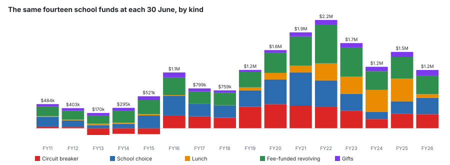
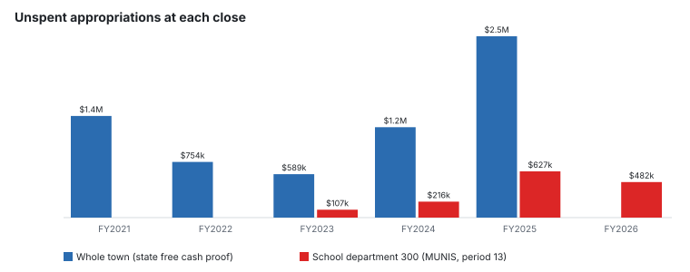

# Is anyone sitting on money? Town and schools

**Every pot of money the town and the schools hold outside the voted budget, as a balance at each 30 June, for as many years as a document prints it.**

---

## The short version

**The schools’ own funds grew to a peak in FY2022 and have fallen since.** The fourteen school funds that take in fees, tuition, lunch money, gifts and the state’s special education reimbursement went from $483,815 at 30 June 2011 to $2,170,682 at 30 June 2022, and were at $1,167,744 by 30 June 2026.

**What the schools leave unspent in their budget goes back to the town.** $482,118 at the FY2026 close, $627,117 at the FY2025 close — and the state’s free cash calculation counts it in. At the FY2025 close the schools were 25.5% of the town’s unspent appropriations.

**What has grown is held by the town.** Certified free cash went from $263,188 (FY2015 close) to $3,354,370 (FY2025 close); the general stabilization fund from $1,186,777 to $2,901,158. Both are spent only by Town Meeting vote.

---

## The schools’ own funds, every year end

The same fourteen funds every year. **FY2011–FY2023** are the annual report’s own balances. **FY2024–FY2026** carry each fund’s 30 June 2023 balance forward through the period-13 ledgers (revenue less expense); the 30 June 2025 result equals, to the cent, the opening balance the Town’s March 2026 special revenue report implies for **every one of the fourteen**. FY2026 has no independent check yet.

| 30 June | circuit breaker | school choice | lunch | fee-funded | gifts | total | basis |
|---|---:|---:|---:|---:|---:|---:|---|
| FY2011 | $35,565 | $191,468 | $12,201 | $199,718 | $44,863 | **$483,815** | annual report |
| FY2012 | $23,254 | $134,584 | $14,770 | $177,678 | $52,225 | **$402,511** | annual report |
| FY2013 | -$136,412 | $61,644 | $29,579 | $165,217 | $49,794 | **$169,823** | annual report |
| FY2014 | -$112,882 | $88,023 | $21,508 | $244,479 | $54,201 | **$295,328** | annual report |
| FY2015 | -$119,894 | $254,512 | $26,050 | $284,713 | $75,792 | **$521,173** | annual report |
| FY2016 | $256,031 | $396,870 | $11,740 | $354,456 | $99,026 | **$1,118,122** | annual report |
| FY2017 | $238,144 | $255,288 | $1,443 | $243,328 | $60,680 | **$798,884** | annual report |
| FY2018 | $207,928 | $251,273 | $730 | $254,031 | $45,338 | **$759,301** | annual report |
| FY2019 | $430,958 | $329,506 | $59,320 | $307,485 | $42,279 | **$1,169,548** | annual report |
| FY2020 | $482,004 | $496,879 | $128,823 | $409,571 | $49,329 | **$1,566,606** | annual report |
| FY2021 | $455,563 | $666,904 | $135,397 | $583,212 | $81,670 | **$1,922,746** | annual report |
| FY2022 | $426,893 | $533,167 | $340,911 | $779,557 | $90,154 | **$2,170,682** | annual report |
| FY2023 | $347,676 | $338,541 | $347,542 | $586,081 | $87,281 | **$1,707,120** | annual report |
| FY2024 | $182,969 | $147,912 | $437,584 | $376,024 | $87,611 | **$1,232,100** | carried from FY2023 through MUNIS, proved against March 2026 |
| FY2025 | $293,335 | $246,903 | $455,126 | $432,889 | $102,123 | **$1,530,376** | carried from FY2023 through MUNIS, proved against March 2026 |
| FY2026 | $281,806 | $326,281 | $75,039 | $373,333 | $111,286 | **$1,167,744** | carried from FY2023 through MUNIS |

**Not in these totals: the grant funds and a handful of small accounts** — $46,588 at 30 June 2023, net, because reimbursement grants spend before they are paid and so sit below zero at a year end. Their later balances cannot be carried: the annual report names a grant by year, MUNIS numbers it, and nothing published maps one to the other. Registered as a gap.

**Lunch fell to $75,039 at 30 June 2026** after spending $1,046,309 against $666,223 taken in during FY2026. The ledger shows the amounts; why — a costlier year, reimbursements that arrive after the close, or both — is a hypothesis nothing here tests.

### The circuit breaker

Printed in the annual report as “50/50 Grant Sped Tuitions”. That it is the circuit breaker is shown, not assumed: its FY2023 receipts, $415,750, equal MUNIS fund 2640 SPECIAL ED CIRCUIT BREAKER’s to the cent. It peaked at $482,004 at 30 June 2020 and has fallen in 5 of the 6 years since, to $281,806.

| 30 June | balance | in that year | out that year |
|---|---:|---:|---:|
| FY2023 | $347,676 | $415,750 | $494,968 |
| FY2024 | $182,969 | $301,589 | $466,296 |
| FY2025 | $293,335 | $608,818 | $498,451 |
| FY2026 | $281,806 | $325,970 | $337,499 |

### The school budget’s turnback at the close

| fiscal year | school budget, revised | spent | still committed | **unspent at the close** | town-wide unspent (state proof) | schools’ share |
|---|---:|---:|---:|---:|---:|---:|
| FY2021 | — | — | — | — | $1,377,642 | — |
| FY2022 | — | — | — | — | $754,201 | — |
| FY2023 | $22,510,690 | $22,403,863 | $0 | **$106,827** | $588,680 | 18.1% |
| FY2024 | $22,959,236 | $22,743,460 | $0 | **$215,776** | $1,224,836 | 17.6% |
| FY2025 | $25,181,572 | $24,554,455 | $0 | **$627,117** | $2,457,761 | 25.5% |
| FY2026 | $26,332,564 | $25,613,679 | $236,767 | **$482,118** | — | — |

The school figures are department 300 only, from reports all run on 6 October 2026, so FY2023–FY2025 show the closed years as the system holds them now. The state’s figure is its free cash proof’s line CL#11, *unencumbered/unexpended appropriations*, for the whole town. FY2026 has no state figure yet.

## Free cash

| close of | certified | certified on | of the prior budget |
|---|---:|---|---:|
| FY2015 | $263,188 | 10/13/2015 | 0.81% |
| FY2016 | $888,944 | 2/16/2017 | 2.54% |
| FY2017 | $818,886 | 10/3/2017 | 2.23% |
| FY2018 | $1,512,483 | 10/22/2018 | 3.85% |
| FY2019 | $1,107,694 | 10/18/2019 | 2.74% |
| FY2020 | $1,804,185 | 10/13/2020 | 4.24% |
| FY2021 | $2,666,962 | 10/8/2021 | 6.24% |
| FY2022 | $2,923,290 | 10/25/2022 | 6.53% |
| FY2023 | $1,870,612 | 11/3/2023 | 3.93% |
| FY2024 | $2,270,060 | 12/11/2024 | 4.57% |
| FY2025 | $3,354,370 | 3/11/2026 | 6.65% |

What the state’s proof says each certification was built from, for the five years it covers. These are four of its lines, not all of them, so they do not sum to the total.

| close of | Local receipts above the estimate | State aid above the estimate | Appropriations not spent or committed | Last year’s free cash nobody appropriated | certified |
|---|---:|---:|---:|---:|---:|
| FY2021 | $590,516 | $240,260 | $1,377,642 | $318,581 | $2,666,962 |
| FY2022 | $1,049,137 | $120,947 | $754,201 | $516,732 | $2,923,290 |
| FY2023 | $1,006,025 | $327,281 | $588,680 | $209,426 | $1,870,612 |
| FY2024 | $1,363,025 | -$390,814 | $1,224,836 | $214,884 | $2,270,060 |
| FY2025 | $1,225,720 | $149,455 | $2,457,761 | $270,669 | $3,354,370 |

*Last year’s free cash nobody appropriated* is the nearest thing in the record to money left unused: between $209,426 and $516,732 a year.

## The town’s special revenue funds

From the same annual report schedule as the school funds, FY2011–FY2023. Split three ways because they are three kinds of money. The split is ours, by fund name.

| 30 June | water, sewer, trash, cable | federal relief | everything else | all school funds | printed total |
|---|---:|---:|---:|---:|---:|
| FY2011 | $1,497,431 | $0 | $813,012 | $456,512 | $2,766,955 |
| FY2012 | $1,429,762 | $0 | $287,205 | $345,654 | $2,062,622 |
| FY2013 | $1,335,475 | $0 | $756,490 | $117,035 | $2,209,001 |
| FY2014 | $1,436,178 | $0 | $790,124 | $373,592 | $2,599,894 |
| FY2015 | $1,390,972 | $0 | $824,861 | $488,647 | $2,704,481 |
| FY2016 | $1,545,961 | $0 | $419,310 | $1,208,351 | $3,173,623 |
| FY2017 | $1,905,513 | $0 | $930,195 | $728,429 | $3,564,136 |
| FY2018 | $2,235,244 | $0 | $968,614 | $768,361 | $3,972,219 |
| FY2019 | $2,288,992 | $0 | $1,126,964 | $1,160,367 | $4,576,323 |
| FY2020 | $3,024,914 | $97,898 | $844,982 | $1,628,255 | $5,596,049 |
| FY2021 | $3,411,162 | $689,131 | $388,369 | $1,926,081 | $6,414,743 |
| FY2022 | $3,922,392 | $1,647,745 | $658,992 | $2,416,360 | $8,645,489 |
| FY2023 | $3,800,195 | $3,337,921 | $1,139,277 | $1,753,708 | $10,031,100 |

*Everything else* swings because some of its funds are reimbursement grants — Chapter 90 road money among them — that spend first and are paid later, so they sit below zero at a year end. **FY2024 and FY2025 are printed in a different table** (a balance detail with no receipts or disbursements) that this project has not yet read, and FY2026’s annual report is not yet published. Registered as a gap.

## The general stabilization fund

| 30 June | ending cash | page |
|---|---:|---:|
| FY2011 | $1,186,777 | 74 |
| FY2012 | $989,609 | 74 |
| FY2013 | $999,549 | 79 |
| FY2014 | $1,299,078 | 38 |
| FY2015 | $1,388,105 | 39 |
| FY2016 | $1,511,527 | 41 |
| FY2017 | $1,631,431 | 38 |
| FY2018 | $1,740,280 | 45 |
| FY2019 | $1,848,803 | 46 |
| FY2020 | $1,978,348 | 41 |
| FY2021 | $2,447,755 | 41 |
| FY2022 | $2,574,673 | 42 |
| FY2023 | $2,730,601 | 51 |
| FY2024 | $2,901,158 | 34 |

## Unspent of the final budget: the schools against the rest of the general fund

From the Finance Committee’s budget-against-actual workbook — **a workbook somebody assembled from MUNIS exports, not a printout, so `stated`** (rule 13a). Revised budget less actual; an amount carried forward on an open purchase order is not separated, so this is not the same quantity as the turnback above.

| fiscal year | schools unspent | share | rest of the general fund unspent | share |
|---|---:|---:|---:|---:|
| FY2010 | $170,807 | 1.2% | $4,627 | 0.0% |
| FY2011 | $92,501 | 0.6% | $214,007 | 1.7% |
| FY2012 | $72,932 | 0.5% | $207,373 | 1.6% |
| FY2013 | $40,726 | 0.3% | $183,008 | 1.3% |
| FY2014 | $47,324 | 0.3% | $350,293 | 2.5% |
| FY2015 | $40,035 | 0.2% | $305,288 | 2.1% |
| FY2016 | $176,934 | 1.0% | $737,712 | 4.3% |
| FY2017 | $300,385 | 1.6% | $574,041 | 3.1% |
| FY2018 | $129,282 | 0.7% | $1,092,587 | 5.7% |
| FY2019 | $69,422 | 0.3% | $1,045,837 | 5.4% |
| FY2020 | $467,195 | 2.2% | $1,606,923 | 8.1% |
| FY2021 | $720,544 | 3.4% | $965,863 | 4.7% |
| FY2022 | $237,048 | 1.1% | $877,938 | 4.2% |
| FY2023 | $109,252 | 0.5% | $799,784 | 3.6% |
| FY2024 | $222,065 | 1.0% | $1,372,613 | 5.9% |
| **FY2010–FY2024** | **$2,896,453** | **1.0%** | **$10,337,895** | **3.9%** |

*The rest of the general fund* is every department outside 300 and 301 — town departments, but also debt, insurance and assessments such as Monty Tech’s. It is not a measure of town departments alone.

## Held at 30 June 2023, side by side

The last year end for which every pot here is read. **Not added together**: they are different kinds of money, decided by different people, and a sum would count restricted and unrestricted money as one.

| pot | held | who can spend it (our summary of the statute or rule, not quoted) |
|---|---:|---|
| Free cash, certified as of 1 July 2023 | $1,870,612 | Town Meeting, for any lawful purpose |
| General stabilization fund | $2,730,601 | Town Meeting, two-thirds vote |
| All school special revenue funds (71, grants included) | $1,753,708 | School Committee, each fund under its own statute, without a Town Meeting vote |
| Water, sewer, trash and cable enterprise funds | $3,800,195 | Town Meeting, for that utility only |
| Federal pandemic relief | $3,337,921 | Under federal rules and deadlines |
| Other town special revenue funds | $1,139,277 | Each fund under its own statute or vote |

## What was said

Searched in the minutes for unspent balances, revolving funds, the circuit breaker and free cash (`scripts/search_minutes.py`). Each quote is checked verbatim against the minutes it cites every time this report is built.

- **School Committee, 26 August 2026** — a resident, speaking for herself in public comment: *“She referenced balances in several school-related accounts and questioned whether any portion of those funds could legally or appropriately be used to reduce pressure on the operating budget”* ([minutes](https://www.lunenburgma.gov/AgendaCenter/ViewFile/Minutes/_08262026-7980))
- **School Committee, 26 August 2026** — the same speaker, just before: *“referenced an estimated cost of approximately $19,350 to restore certain middle school sports”* ([minutes](https://www.lunenburgma.gov/AgendaCenter/ViewFile/Minutes/_08262026-7980))
- **Finance Committee, 14 March 2024** — the district’s Director of Special Services, asked how the previous year’s tuition increase had been absorbed: *“it is probably absorbed with a lot of the carry over for the circuit breaker monies and that’s why that account has gone down”* ([minutes](https://www.lunenburgma.gov/AgendaCenter/ViewFile/Minutes/_03142024-6469))
- **School Committee, 8 January 2025** — the district, presenting the school choice and facilities revolving accounts: *“these accounts are following the same patterns as other revolving accounts, which is the money coming in is not enough to cover the money going out”* ([minutes](https://www.lunenburgma.gov/AgendaCenter/ViewFile/Minutes/_01082025-6948))
- **Finance Committee, 28 May 2026** — two Finance Committee members: *“for the last 10 years the town has not collected less than 4 million dollars in local receipts. This year’s estimate is 3.535 million.”* ([minutes](https://www.lunenburgma.gov/AgendaCenter/ViewFile/Minutes/_05282026-7828))
- **Finance Committee, 28 May 2026** — the same meeting: *“suggests having an analyst review all of the town’s policies on free cash and estimates”* ([minutes](https://www.lunenburgma.gov/AgendaCenter/ViewFile/Minutes/_05282026-7828))

The first is the question this report answers, and the second is the concrete thing it was asked for. **The athletics revolving fund (1301) held $152,281 at 30 June 2026** by the carried figures above. Whether it may lawfully pay for middle school sports, and what else is already committed against it, the ledger cannot say. The third and fourth describe school balances falling, which is what the ledgers show; they are the district’s statements and are quoted as that. The last two are about the receipts line above.

## What it does not show

- What any balance was spent on, or why a balance rose or fell — the ledgers give amounts, not reasons.
- What the town’s own special revenue funds held after 30 June 2023 (registered gap).
- What the school grant funds held after 30 June 2023 (registered gap).
- Which town departments make up the unspent appropriations that are not the schools’ (registered gap).
- Why receipts come in above the estimate (registered gap).
- The FY2026 school balances against any second document; they are carried, and the carry is proved only to 30 June 2025.

## Closes with

Each is a row in `sources/data/money-gaps.csv`:

- What the town’s own special revenue funds held at 30 June 2024, 2025 and 2026
- What the school grant funds held at 30 June 2024, 2025 and 2026
- Why local receipts come in above the town’s own estimate
- How much of free cash is the schools’

## Method

- Special revenue: `special-revenue-read.csv`; each year’s funds are summed and must equal the GRAND TOTAL the report prints (`special-revenue-printed-totals.csv`) or nothing is written.
- The school chain: fourteen funds matched by name to MUNIS fund numbers (ours); the match is tested by the 30 June 2025 balance meeting the March 2026 report’s implied opening for every fund, to the cent.
- A second test of the same matching: for FY2023 itself, the annual report’s opening balance plus the MUNIS year’s revenue less expense equals the report’s closing balance for 13 of the fourteen funds. Greenthumb Revolving (1310) misses by $507, revenue MUNIS records in FY2023 and the report does not; the chain starts from the printed balance, so it does not enter the figures.
- Free cash: the Town’s fact sheet labels a certification by the year it is spent in; it is shown here at the close it measures. Every overlapping year agrees with the state’s proof.
- Verified by `scripts/verify_sitting_on_money.py`, which recomputes every conclusion figure by a second route.

## Sources

| document | what it gives here |
|---|---|
| [4117-fy-2011-annual-town-report.pdf](/docs/town-annual-reports/docs/4117-fy-2011-annual-town-report.pdf) | Annual town report, Special Revenue Funds schedule: each fund’s balance carried forward at 30 June. Read off the page; every row and the printed GRAND TOTAL tie (special-revenue-read.csv). |
| [4118-fy-2012-annual-town-report.pdf](/docs/town-annual-reports/docs/4118-fy-2012-annual-town-report.pdf) | Annual town report, Special Revenue Funds schedule: each fund’s balance carried forward at 30 June. Read off the page; every row and the printed GRAND TOTAL tie (special-revenue-read.csv). |
| [4119-fy-2013-annual-town-report.pdf](/docs/town-annual-reports/docs/4119-fy-2013-annual-town-report.pdf) | Annual town report, Special Revenue Funds schedule: each fund’s balance carried forward at 30 June. Read off the page; every row and the printed GRAND TOTAL tie (special-revenue-read.csv). |
| [4120-fy-2014-annual-town-report.pdf](/docs/town-annual-reports/docs/4120-fy-2014-annual-town-report.pdf) | Annual town report, Special Revenue Funds schedule: each fund’s balance carried forward at 30 June. Read off the page; every row and the printed GRAND TOTAL tie (special-revenue-read.csv). |
| [4121-fy-2015-annual-town-report.pdf](/docs/town-annual-reports/docs/4121-fy-2015-annual-town-report.pdf) | Annual town report, Special Revenue Funds schedule: each fund’s balance carried forward at 30 June. Read off the page; every row and the printed GRAND TOTAL tie (special-revenue-read.csv). |
| [4123-fy-2016-annual-town-report.pdf](/docs/town-annual-reports/docs/4123-fy-2016-annual-town-report.pdf) | Annual town report, Special Revenue Funds schedule: each fund’s balance carried forward at 30 June. Read off the page; every row and the printed GRAND TOTAL tie (special-revenue-read.csv). |
| [4124-fy-2017-annual-town-report.pdf](/docs/town-annual-reports/docs/4124-fy-2017-annual-town-report.pdf) | Annual town report, Special Revenue Funds schedule: each fund’s balance carried forward at 30 June. Read off the page; every row and the printed GRAND TOTAL tie (special-revenue-read.csv). |
| [4125-fy-2018-annual-town-report.pdf](/docs/town-annual-reports/docs/4125-fy-2018-annual-town-report.pdf) | Annual town report, Special Revenue Funds schedule: each fund’s balance carried forward at 30 June. Read off the page; every row and the printed GRAND TOTAL tie (special-revenue-read.csv). |
| [4126-fy-2019-annual-town-report.pdf](/docs/town-annual-reports/docs/4126-fy-2019-annual-town-report.pdf) | Annual town report, Special Revenue Funds schedule: each fund’s balance carried forward at 30 June. Read off the page; every row and the printed GRAND TOTAL tie (special-revenue-read.csv). |
| [4127-fy-2020-annual-town-report.pdf](/docs/town-annual-reports/docs/4127-fy-2020-annual-town-report.pdf) | Annual town report, Special Revenue Funds schedule: each fund’s balance carried forward at 30 June. Read off the page; every row and the printed GRAND TOTAL tie (special-revenue-read.csv). |
| [4128-fy-2021-annual-town-report.pdf](/docs/town-annual-reports/docs/4128-fy-2021-annual-town-report.pdf) | Annual town report, Special Revenue Funds schedule: each fund’s balance carried forward at 30 June. Read off the page; every row and the printed GRAND TOTAL tie (special-revenue-read.csv). |
| [4129-fy-2022-annual-town-report.pdf](/docs/town-annual-reports/docs/4129-fy-2022-annual-town-report.pdf) | Annual town report, Special Revenue Funds schedule: each fund’s balance carried forward at 30 June. Read off the page; every row and the printed GRAND TOTAL tie (special-revenue-read.csv). |
| [4131-fy-2023-annual-town-report.pdf](/docs/town-annual-reports/docs/4131-fy-2023-annual-town-report.pdf) | Annual town report, Special Revenue Funds schedule: each fund’s balance carried forward at 30 June. Read off the page; every row and the printed GRAND TOTAL tie (special-revenue-read.csv). |
| [glytdbud-expense-fy2023-p13-special-school.xlsx](/docs/town-ledgers/expenses/glytdbud-expense-fy2023-p13-special-school.xlsx) | School special funds, period 13: each fund’s revenue and expense for the year. Delivered 6 October 2026. |
| [glytdbud-expense-fy2023-p13-gf-school.xlsx](/docs/town-ledgers/expenses/glytdbud-expense-fy2023-p13-gf-school.xlsx) | School general fund, department 300, period 13: budget, spent, encumbered and available at the close. |
| [glytdbud-expense-fy2024-p13-special-school.xlsx](/docs/town-ledgers/expenses/glytdbud-expense-fy2024-p13-special-school.xlsx) | School special funds, period 13: each fund’s revenue and expense for the year. Delivered 6 October 2026. |
| [glytdbud-expense-fy2024-p13-gf-school.xlsx](/docs/town-ledgers/expenses/glytdbud-expense-fy2024-p13-gf-school.xlsx) | School general fund, department 300, period 13: budget, spent, encumbered and available at the close. |
| [glytdbud-expense-fy2025-p13-special-school.xlsx](/docs/town-ledgers/expenses/glytdbud-expense-fy2025-p13-special-school.xlsx) | School special funds, period 13: each fund’s revenue and expense for the year. Delivered 6 October 2026. |
| [glytdbud-expense-fy2025-p13-gf-school.xlsx](/docs/town-ledgers/expenses/glytdbud-expense-fy2025-p13-gf-school.xlsx) | School general fund, department 300, period 13: budget, spent, encumbered and available at the close. |
| [glytdbud-expense-fy2026-p13-special-school.xlsx](/docs/town-ledgers/expenses/glytdbud-expense-fy2026-p13-special-school.xlsx) | School special funds, period 13: each fund’s revenue and expense for the year. Delivered 6 October 2026. |
| [glytdbud-expense-fy2026-p13-gf-school.xlsx](/docs/town-ledgers/expenses/glytdbud-expense-fy2026-p13-gf-school.xlsx) | School general fund, department 300, period 13: budget, spent, encumbered and available at the close. |
| [special-revenue-fy2026-p09.xlsx](/docs/town-ledgers/fund-balances/special-revenue-fy2026-p09.xlsx) | Every school special revenue fund to 31 March 2026, with its balance. Used here only to PROVE the carried-forward balances, never as a year-end. |
| [free-cash-proof-lunenburg.xlsx](/docs/state-dls/free-cash-proof-lunenburg.xlsx) | The state’s free cash proof, 2021-2025: the certified figure and the components it is built from. |
| [free-cash-fact-sheet.docx](/docs/budget-workbooks/finance-committee/fy27-budget/tm-warrant/free-cash-fact-sheet.docx) | The Town’s free cash fact sheet in the FY27 warrant materials: each certification since 2015, its date, and its share of the prior budget. |
| [general-fund-budget-vs-actuals-history.xlsx](/docs/budget-workbooks/finance-committee/fy26-budget/general-fund-budget-vs-actuals-history.xlsx) | Revised budget and actual for every general fund account, FY2010-FY2025. A workbook a person assembled: stated, not proof (rule 13a). |
| [4090-click-here-for-a-release-on-quot-understanding-lunenburg-apos-s-fy27-budget-how-.pdf](/docs/town-budget/docs/4090-click-here-for-a-release-on-quot-understanding-lunenburg-apos-s-fy27-budget-how-.pdf) | The FY27 budget release, which cites the guide: "5-7% of its annual budget". |
| [2026-08-26-minutes-7980.pdf](/docs/meetings/school-committee/2026-08-26-minutes-7980.pdf) | Minutes of 26 August 2026: "She referenced balances in several school-related accounts and questioned whether any portion of those funds could legally or appropriately be used to reduce pressure on the operating budget" |
| [2024-03-14-minutes-6469.docx](/docs/meetings/finance-committee/2024-03-14-minutes-6469.docx) | Minutes of 14 March 2024: "it is probably absorbed with a lot of the carry over for the circuit breaker monies and that’s why that account has gone down" |
| [2025-01-08-minutes-6948.pdf](/docs/meetings/school-committee/2025-01-08-minutes-6948.pdf) | Minutes of 8 January 2025: "these accounts are following the same patterns as other revolving accounts, which is the money coming in is not enough to cover the money going out" |
| [2026-05-28-minutes-7828.pdf](/docs/meetings/finance-committee/2026-05-28-minutes-7828.pdf) | Minutes of 28 May 2026: "for the last 10 years the town has not collected less than 4 million dollars in local receipts. This year’s estimate is 3.535 million." |
