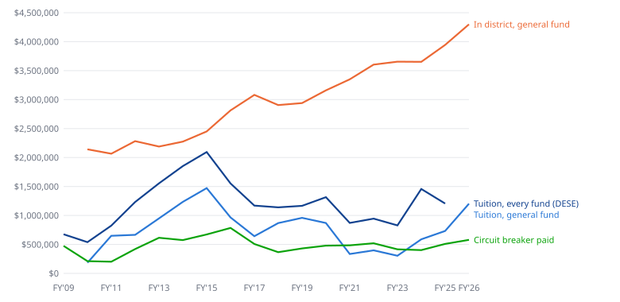

# Special education: what a bad year costs

**How far special education spending has landed from the budget voted for it, year by year since FY2010 — and what a reserve for the bad years would have needed.**

Analysis, October 2026. A draft for review. Every figure is computed by `scripts/build_sped_costs.py`; the grouping of accounts, the reserve rule and every per-child figure are ours and say so where they appear.

---

## The short version

**Covering the worst year in 17 would have taken $223,774.** That is FY2013, the most the three special education lines ran past the budget voted for them.

**Out-of-district tuition ran over its voted budget in 7 of 17 years.** The worst, FY2019, was $204,015 over. In the others it came in under, by as much as $432,526.

**Counting every fund, tuition ran $553,565 past its voted budget in FY2024.** The circuit breaker account paid $466,296 of that, outside the budget the town votes.

**In-district special education never ran over its voted budget by more than 2.7%.** Its overruns are small. The large ones, in both directions, are tuition and transportation.

**Tuition worked out to $119,480 per child placed, the median of FY2022 to FY2025. Our estimate.** *(a hypothesis, not a measurement)* The count rose by 3 within FY2023, so 3 children is about $358,440.

**The reserve Town Meeting created in FY2026 can hold up to about $541,717.** That is 2% of FY2026 net school spending, the cap as the Town Manager described it.

---

## How far each year landed from its budget

### In plain terms

Before each year begins the town votes a budget for special education. At the close of the year the accounting system records what was spent. The difference is the surprise. Across 17 years, the out-of-district tuition line ran over in 7 and under in the rest; transportation ran over in 6; the in-district lines ran over in 5, and never by more than 2.7%.

### The evidence

| FY | tuition voted | tuition spent | miss | in-district voted | in-district spent | miss | transport voted | transport spent | miss | overruns, added | ledger |
|---|---:|---:|---:|---:|---:|---:|---:|---:|---:|---:|---|
| FY2010 | $165,000 | $183,735 | +$18,735 | $2,203,433 | $2,141,545 | -$61,888 | $300,000 | $226,876 | -$73,124 | $18,735 | FinCom history |
| FY2011 | $607,405 | $648,358 | +$40,953 | $2,013,473 | $2,066,833 | +$53,360 | $300,000 | $267,248 | -$32,752 | $94,313 | FinCom history |
| FY2012 | $708,000 | $665,200 | -$42,800 | $2,336,028 | $2,283,609 | -$52,419 | $270,000 | $309,766 | +$39,766 | $39,766 | FinCom history |
| FY2013 | $818,500 | $949,835 | +$131,335 | $2,209,487 | $2,190,304 | -$19,183 | $348,060 | $440,499 | +$92,439 | $223,774 | FinCom history |
| FY2014 | $1,144,319 | $1,235,349 | +$91,030 | $2,268,285 | $2,274,722 | +$6,437 | $395,702 | $444,752 | +$49,050 | $146,517 | FinCom history |
| FY2015 | $1,529,405 | $1,472,753 | -$56,652 | $2,506,498 | $2,449,637 | -$56,861 | $415,488 | $480,819 | +$65,331 | $65,331 | FinCom history |
| FY2016 | $989,655 | $965,926 | -$23,729 | $2,774,291 | $2,813,739 | +$39,448 | $469,046 | $460,508 | -$8,538 | $39,448 | FinCom history |
| FY2017 | $903,960 | $641,626 | -$262,334 | $3,105,994 | $3,081,936 | -$24,058 | $489,250 | $360,537 | -$128,713 | $0 | FinCom history |
| FY2018 | $888,909 | $868,928 | -$19,981 | $3,065,431 | $2,905,432 | -$159,999 | $490,000 | $366,184 | -$123,816 | $0 | FinCom history |
| FY2019 | $754,480 | $958,495 | +$204,015 | $2,998,364 | $2,939,574 | -$58,790 | $417,585 | $322,047 | -$95,538 | $204,015 | FinCom history |
| FY2020 | $865,746 | $869,557 | +$3,811 | $3,245,546 | $3,159,564 | -$85,982 | $446,658 | $223,350 | -$223,308 | $3,811 | FinCom history |
| FY2021 | $719,269 | $335,377 | -$383,892 | $3,427,643 | $3,349,796 | -$77,847 | $380,409 | $260,921 | -$119,488 | $0 | FinCom history |
| FY2022 | $818,716 | $397,233 | -$421,483 | $3,508,656 | $3,604,649 | +$95,993 | $297,843 | $241,390 | -$56,453 | $95,993 | FinCom history |
| FY2023 | $489,918 | $304,748 | -$185,170 | $3,724,015 | $3,654,709 | -$69,306 | $329,360 | $320,244 | -$9,116 | $0 | MUNIS year-end |
| FY2024 | $501,239 | $588,508 | +$87,269 | $3,850,408 | $3,652,104 | -$198,304 | $335,947 | $401,402 | +$65,455 | $152,724 | MUNIS year-end |
| FY2025 | $1,164,824 | $732,298 | -$432,526 | $4,262,965 | $3,944,444 | -$318,521 | $445,328 | $434,922 | -$10,406 | $0 | MUNIS year-end |
| FY2026 | $1,291,293 | $1,202,771 | -$88,522 | $4,216,813 | $4,299,387 | +$82,574 | $565,734 | $633,291 | +$67,557 | $150,131 | MUNIS year-end |

*FY2010 to FY2026, 17 years.* **voted** is the ORIGINAL general fund budget — what Town Meeting appropriated before the year began. **spent** is expended plus encumbered at the close (only FY2026 carries an encumbrance). **overruns, added** is every line’s overrun summed without netting any line’s underspend against it: the amount a reserve would have had to supply if nothing else in the school budget were moved. **That rule is ours.** Netting the three lines instead, the worst year is FY2013, +$204,591.

**Comparing a budget to an actual is allowed here, and only here.** Rule 1 of this project forbids mixing the two in a growth rate or a projection, because the step between them contaminates the rate. In this section the step between them is the thing being measured. Nothing below grows a budget from an actual.

**Is this FY2025 again?** FY2025 is the year the schools finished with money unspent. Its three special education lines together came in $761,453 under the budget voted for them, $432,526 of it on tuition. In FY2026, the latest closed year, they came in $61,609 over.

**What was said in the overrun years.** Statements, not measurements.

> *"Our out of District placements have skyrocketed"* — School Committee, 2024-01-24 ([minutes](/docs/meetings/text/school-committee/2024-01-24-minutes-6375.txt))

Said in the middle of FY2024 — one of the years the tuition line ran over the budget voted for it, and the year it ran furthest over counting the circuit breaker account. The count of children placed barely moved that year; the dollars did. Dollars are not children.

> *"Ms. Brzozoski regarding the 14% increase in tuition, when did we find out about this?"* — School Committee, 2024-02-28 ([minutes](/docs/meetings/text/school-committee/2024-02-28-minutes-6439.txt))

A second route to a surprise that no count of children shows: the price of a place rising after the budget is built. The minutes record the question and not the answer, and which tuition the rise applied to is not stated.

**Which ledger.** FY2023 onward is the Town’s MUNIS year-end (period 13) report — a printout from the accounting system. Before that it is the Finance Committee’s general fund history workbook, which a person assembled from per-year exports. It is used because, for FY2023 and FY2024, its special education rows match the MUNIS reports to the dollar on both the voted budget and the spending, and the build refuses to run if they stop matching. Its FY2025 column is marked partial and is not used.

### What this does not show

Why any year missed. A child placed or leaving mid-year, a tuition rate the state set after the budget was built, a vacancy, and a payment moved to the circuit breaker account all produce the same row. It also does not show the size of a bad year that has not happened: 17 years is the whole of what the ledger holds, and the reserve rule above covers the worst of them, not the worst possible.

---

## Counting the money outside the budget

### In plain terms

The general fund is not the only account that pays tuition. The state reimburses part of the cost of the most expensive placements a year later, through the circuit breaker, and that money lands in a school special fund the town does not vote on. In every one of the 4 years the accounting system reports in full, that account paid tuition too, so the whole bill for placements ran above the general fund line every year.

### The evidence

| FY | tuition voted (general fund) | spent, general fund | spent, circuit breaker account | spent, every fund | above the voted line | as a share of it | circuit breaker received (ledger) | circuit breaker paid (state schedule) |
|---|---:|---:|---:|---:|---:|---:|---:|---:|
| FY2023 | $489,918 | $304,748 | $494,968 | $799,716 | +$309,798 | +63.2% | $415,750 | $415,750 |
| FY2024 | $501,239 | $588,508 | $466,296 | $1,054,804 | +$553,565 | +110.4% | $301,589 | $401,966 |
| FY2025 | $1,164,824 | $732,298 | $473,650 | $1,205,948 | +$41,124 | +3.5% | $608,818 | $508,441 |
| FY2026 | $1,291,293 | $1,202,771 | $333,495 | $1,536,266 | +$244,973 | +19.0% | $325,970 | $579,142 |

*FY2023 to FY2026, four years, MUNIS year-end reports for the school general fund and the school special funds; the circuit breaker account is fund 2640.* The account also paid $28,806 in these years for things other than tuition.

**The ledger and the state agree, a year apart.** The receipts the ledger books and the payments the state’s schedule lists match in FY2023. Where they do not, the difference moves between years: FY2024 and FY2025 together come to $910,407 in both, with $100,377 booked a year later than the state lists it. A reserve has to bridge that timing, because the reimbursement for a placement arrives in the following year at the earliest.

### What this does not show

Whether the district planned on the account. If the general fund line is built expecting the circuit breaker to pay part, the amount above it is a plan rather than a surprise. Nothing published says which — the same open question `sped-and-funds.md` asks of the FY27 line.

---

## The trend, and the averages

### In plain terms

Over FY2010 to FY2026, in-district special education averaged $2,988,940 a year of general fund spending and out-of-district tuition $765,923. Together, on that same basis, $3,754,864 a year; over the last five years, $4,476,170. Counting every fund, as the state reports it, out-of-district tuition averaged $1,201,594 a year over FY2009 to FY2025, and the circuit breaker paid back an average of $474,634 a year.

### The evidence

| FY | in district, spent (general fund) | tuition, spent (general fund) | transportation, spent (general fund) | tuition, every fund (DESE) | circuit breaker paid (DESE) |
|---|---:|---:|---:|---:|---:|
| FY2009 | — | — | — | $674,350 | $474,301 |
| FY2010 | $2,141,545 | $183,735 | $226,876 | $539,509 | $211,224 |
| FY2011 | $2,066,833 | $648,358 | $267,248 | $825,194 | $201,165 |
| FY2012 | $2,283,609 | $665,200 | $309,766 | $1,232,350 | $419,945 |
| FY2013 | $2,190,304 | $949,835 | $440,499 | $1,554,923 | $615,317 |
| FY2014 | $2,274,722 | $1,235,349 | $444,752 | $1,852,392 | $575,389 |
| FY2015 | $2,449,637 | $1,472,753 | $480,819 | $2,094,813 | $672,634 |
| FY2016 | $2,813,739 | $965,926 | $460,508 | $1,553,142 | $784,099 |
| FY2017 | $3,081,936 | $641,626 | $360,537 | $1,170,397 | $507,832 |
| FY2018 | $2,905,432 | $868,928 | $366,184 | $1,140,157 | $366,790 |
| FY2019 | $2,939,574 | $958,495 | $322,047 | $1,166,701 | $430,958 |
| FY2020 | $3,159,564 | $869,557 | $223,350 | $1,315,167 | $478,987 |
| FY2021 | $3,349,796 | $335,377 | $260,921 | $871,429 | $484,579 |
| FY2022 | $3,604,649 | $397,233 | $241,390 | $945,295 | $519,394 |
| FY2023 | $3,654,709 | $304,748 | $320,244 | $828,554 | $415,750 |
| FY2024 | $3,652,104 | $588,508 | $401,402 | $1,456,770 | $401,966 |
| FY2025 | $3,944,444 | $732,298 | $434,922 | $1,205,949 | $508,441 |
| FY2026 | $4,299,387 | $1,202,771 | $633,291 | — | $579,142 |

*FY2009 to FY2026.* Each column is ONE basis and they are never added across: the first three are the town’s ledger, closed-year spending, general fund only; the fourth is DESE’s End of Year Financial Report, functions 9300 and 9400, every fund; the fifth is the state’s payment schedule, by year of PAYMENT, and each payment answers for the year before.

| average a year of | span | whole span | last five years |
|---|---|---:|---:|
| In-district special education (general fund, ours) | FY2010 to FY2026 | $2,988,940 | $3,831,059 |
| Out-of-district tuition (general fund) | FY2010 to FY2026 | $765,923 | $645,112 |
| **Combined, in district and out (general fund)** | FY2010 to FY2026 | **$3,754,864** | **$4,476,170** |
| Special education transportation (general fund) | FY2010 to FY2026 | $364,397 | $406,250 |
| Out-of-district tuition, every fund (DESE) | FY2009 to FY2025 | $1,201,594 | $1,061,599 |

**Why the combined figure is general fund only, and transportation sits apart.** The in-district lines and the general fund tuition line come from the same ledger, the same fund and the same years, so adding them is like with like. Tuition from every fund comes from a different return and has no in-district counterpart — DESE publishes no in-district special education total — so it is not added to anything. Transportation is one account, and the circuit breaker reimburses the out-of-district part of it, so it cannot be put on either side. Out-of-district tuition was between 7.7% and 37.5% of the general fund combined figure across the span.

### What this does not show

What special education costs. Every general fund figure here is NET (rule 11): grant-funded staff, the circuit breaker account and anything paid from a revolving fund are missing from it, and the in-district total rests on a classification of accounts that is ours. The averages describe what the town’s budget carried, not the cost of educating any child.

---

## Per child — our estimate, and what it is not

### In plain terms

Dividing a year’s tuition, from every fund, by the number of children the town counted as placed gives $119,480 per child as the median of FY2022 to FY2025, and $120,595 in FY2025. That is our arithmetic on two published numbers. It is not the price of a placement.

### The evidence

| FY | tuition, every fund (DESE) | children placed, 1 March (town) | per child — OUR ESTIMATE |
|---|---:|---:|---:|
| FY2011 | $825,194 | 15 | $55,013 |
| FY2012 | $1,232,350 | 24 | $51,348 |
| FY2013 | $1,554,923 | 22 | $70,678 |
| FY2014 | $1,852,392 | 26 | $71,246 |
| FY2015 | $2,094,813 | 30 | $69,827 |
| FY2016 | $1,553,142 | 19 | $81,744 |
| FY2017 | $1,170,397 | 14 | $83,600 |
| FY2018 | $1,140,157 | 14 | $81,440 |
| FY2019 | $1,166,701 | 12 | $97,225 |
| FY2020 | $1,315,167 | 11 | $119,561 |
| FY2021 | $871,429 | 12 | $72,619 |
| FY2022 | $945,295 | 8 | $118,162 |
| FY2023 | $828,554 | 7 | $118,365 |
| FY2024 | $1,456,770 | 8 | $182,096 |
| FY2025 | $1,205,949 | 10 | $120,595 |

*FY2011 to FY2025.* Median over the whole span $81,744.

| FY | children with a plan, in district (DESE) | in-district spent (general fund, ours) | per child in district — OUR ESTIMATE | children with a plan, all (DESE) | in district + tuition (general fund) | per child, combined — OUR ESTIMATE |
|---|---:|---:|---:|---:|---:|---:|
| FY2021 | 249 | $3,349,796 | $13,453 | 261 | $3,685,173 | $14,119 |
| FY2022 | 217 | $3,604,649 | $16,611 | 227 | $4,001,882 | $17,629 |
| FY2023 | 230 | $3,654,709 | $15,890 | 234 | $3,959,457 | $16,921 |
| FY2024 | 224 | $3,652,104 | $16,304 | 233 | $4,240,612 | $18,200 |
| FY2025 | 238 | $3,944,444 | $16,573 | 248 | $4,676,742 | $18,858 |
| FY2026 | 246 | $4,299,387 | $17,477 | 258 | $5,502,158 | $21,326 |

*FY2021 to FY2026, the years DESE publishes the in-district count.* DESE counts children with a plan in October; the town counts placements in March.

### What this does not show

/what-special-education-costs refuses to compute any of these, and its reasons stand: the dollars and the children come from different returns with different rules. Each figure here is a net ledger total divided by a headcount taken on one day. It misses the circuit breaker reimbursement on the in-district side, grant-funded staff, transportation, and every child placed or served for part of a year. A child in district also costs the general education budget, which none of these lines carry. Read them as orders of magnitude for planning, never as a price.

---

## How many children arrive or leave mid-year

### In plain terms

Nothing published counts children entering or leaving an out-of-district placement during a year. What can be shown is two counts taken months apart: DESE’s in October and the town’s in March. The largest rise between them was 3, in FY2023. From one March to the next, the largest rise was 9, in FY2012, and 2 in the last few years (FY2025).

### The evidence

| FY | placed out of district, October (DESE) | placed, 1 March (town) | net change |
|---|---:|---:|---:|
| FY2021 | 12 | 12 | 0 |
| FY2022 | 10 | 8 | -2 |
| FY2023 | 4 | 7 | +3 |
| FY2024 | 9 | 8 | -1 |
| FY2025 | 10 | 10 | 0 |

*FY2021 to FY2025.* A NET change: a child who arrived and another who left between the two dates cancel to zero, and a child placed and returned between them is in neither count.

| FY | children placed, 1 March | collaborative | day | residential | change from the year before |
|---|---:|---:|---:|---:|---:|
| FY2011 | 15 | — | 13 | 2 | — |
| FY2012 | 24 | — | 19 | 5 | +9 |
| FY2013 | 22 | — | 17 | 5 | -2 |
| FY2014 | 26 | 7 | 13 | 6 | +4 |
| FY2015 | 30 | 9 | 15 | 6 | +4 |
| FY2016 | 19 | 4 | 12 | 3 | -11 |
| FY2017 | 14 | 2 | 8 | 4 | -5 |
| FY2018 | 14 | 6 | 5 | 3 | 0 |
| FY2019 | 12 | 4 | 5 | 3 | -2 |
| FY2020 | 11 | 3 | 3 | 5 | -1 |
| FY2021 | 12 | — | — | — | +1 |
| FY2022 | 8 | 4 | 2 | 2 | -4 |
| FY2023 | 7 | 3 | 3 | 1 | -1 |
| FY2024 | 8 | 4 | 3 | 1 | +1 |
| FY2025 | 10 | 6 | 3 | 1 | +2 |

*FY2011 to FY2025, the town’s count from the Special Services report in each annual town report (SIMS, 1 March).* FY2021 is recovered from FY2022’s back-reference; its split is not printed. See `PROVENANCE-placement-counts.md`.

| FY | on a plan, K-12 | moved in | moved out | note |
|---|---:|---:|---:|---|
| FY2019 | 254 | 28 | 40 |  |
| FY2020 | 242 | 24 | 19 |  |
| FY2021 | 241 | 19 | 28 |  |
| FY2022 | 207 | 33 | 28 |  |
| FY2023 | 224 | 23 | 21 |  |
| FY2024 | 222 | 38 | 17 |  |
| FY2025 | 222 | 38 | 17 | identical to the year before — not a second year |

*DESE, Students Moving In and Out of Special Education Services (8aww-sugs), FY2019 to FY2025.* This counts children entering and leaving SERVICES — gaining or ending a plan — and not placements. The file carries no definition column; the reading is from its title, and the statewide figures fit it.

**What was said.** None of this is a count.

> *"April 1st is the deadline, if a student enters the district before this date our school incurs the cost, if it is after this date the sending school assumes the expense for the rest of the year and the following year"* — School Committee, 2024-02-28 ([minutes](/docs/meetings/text/school-committee/2024-02-28-minutes-6439.txt))

The district’s account of when a child who moves in becomes Lunenburg’s cost. It is a statement at a meeting, not the regulation, and nothing in this archive holds the rule itself; if it holds, a placement arriving after 1 April does not reach this budget until the year after next.

> *"we currently have 9 out of district stud ents and next year we will have 9"* — School Committee, 2024-02-28 ([minutes](/docs/meetings/text/school-committee/2024-02-28-minutes-6439.txt))

Said in February 2024, a few days before the town’s own 1 March count for the same year, which is in the table above. The broken word is what the extracted minutes render to.

> *"we currently have students on our radar that may require out of district placement and we have also had students move into the district that require out of district placements"* — School Committee, 2026-02-04 ([minutes](/docs/meetings/text/school-committee/2026-02-04-minutes-7634.txt))

Mid-year arrivals, named in the middle of FY2026. Evidence that it happens; not a count of how often.

> *"The administration reported that 19 out-of-district placements were then anticipated."* — School Committee, 2026-08-26 ([minutes](/docs/meetings/text/school-committee/2026-08-26-minutes-7980.txt))

An anticipated count for FY2027, as minuted. It is a forecast reported at a meeting, not a census taken on any date, and it is set beside the town’s own counts in the reserve section.

### What this does not show

How many children arrived or left during any year, or when. The two snapshots may also differ because DESE and the town count differently, which is why they agree in some years and not others — see the gap registered as *How many out-of-district placements are children who arrived already placed*. A dated log of placements would settle it.

---

## Sizing a reserve — our arithmetic, not a recommendation

### In plain terms

Three ways of putting a number on a bad year, each from a different piece of the record, and each ours:

| measure | from | amount |
|---|---|---:|
| The worst year in the ledger, every line’s overrun added | FY2010 to FY2026 | $223,774 |
| The worst of the four years MUNIS reports in full | FY2023 to FY2026 | $152,724 |
| The median year | FY2010 to FY2026 | $39,766 |
| Out-of-district tuition, every fund, above its voted line — worst year | FY2023 to FY2026 | $553,565 |
| One unplanned placement at the per-child estimate | FY2022 to FY2025 | $119,480 |
| 3 unplanned placements — the largest rise between October and March | FY2023 | $358,440 |
| The reserve’s cap, 2% of FY2026 net school spending, as described | FY2026 | $541,717 |

### What changes what a reserve must cover

- **The circuit breaker pays a year late.** The state’s schedule pays each year for the year before, so a placement that starts in September is reimbursed, in part, the following year at the earliest. The reserve carries the whole of a surprise in the year it lands.
- **A child who moves in late may not land on this budget at all that year.** The district told the School Committee on 2024-02-28 that a child entering after 1 April is the sending district’s cost for the rest of that year and the next. That is a statement at a meeting; the rule itself is not in this archive.
- **The forecast for FY2027 is well above the recent counts.** The School Committee was told on 2026-08-26 that 19 placements were anticipated. The town counted 10 on 1 March 2025; the last year it counted 19 or more was FY2016. If the forecast holds, the per-child estimate above puts the difference at about $1,075,320 a year — our arithmetic on a forecast, not a measurement.

- **What would have shown a bad year coming.** A placement log with start and end dates, and a statement of how much of the tuition line the district expects the circuit breaker account to pay. Neither is published; both are registered as gaps, and both are things a Finance Committee could ask for before voting the line.

### The reserve that now exists

> *"VOTED (Yes 65, No 24, Abstain 1) to accept the provisions of MGL Chapter 40, Section 13E, to establish a Special Education Reserve Fund to be utilized in the upcoming fiscal years, to pay, without further appropriation, for unanticipated or unbudgeted costs of special education and recovery high school programs, out-of-district tuition or transportation."* — Special Town Meeting, 18 November 2025 ([FY2025 annual town report](/docs/town-annual-reports/text/4130-fy-2025-annual-town-report.txt)). The Finance Committee recommended disapproval.

> *"The fund requires a majority vote of both the School Committee and the Select Board to expend. The total balance cannot exceed 2% of annual net school spending."* — Select Board, 2025-10-07 ([minutes](/docs/meetings/text/select-board/2025-10-07-minutes-7441.txt))

The Town Manager’s description of the reserve, as minuted. The statute itself is not in this archive, so the cap used below is the cap as described.

> *"Member McLeod expressed lingering concern about potential budget impacts if the reserve were to reduce urgency around special education line-item funding."* — Select Board, 2025-10-21 ([minutes](/docs/meetings/text/select-board/2025-10-21-minutes-7466.txt))

The argument against, on the record: that a reserve can become a reason to budget the line itself short. The voted line is measured on this page against what was spent, every year back to FY2010, so whether that happens will be visible in the years after the reserve is funded.

The School Committee’s agenda for 7 October 2026 carries an item to *"Vote an Amount to Fund the Special Education Reserve Fund Approved at November 2026 Town Meeting"*. The amount, and whether "November 2026" is the date of a coming vote or a misprint for November 2025, are not established here.

### What this does not show

What the town should hold. A reserve sized to the worst of 17 years covers the worst of 17 years. The per-child scenarios rest on our estimate. And the statute’s own terms — the cap, who may spend it, what counts as unanticipated — are taken from how they were described at a meeting, because chapter 40 section 13E is not in this archive.

---

## Read as each reader

`notes/process/PERSONAS.md`, run before publishing.

- **Already sure the schools are not straight with them.** The worst figure on the page — $553,565 spent on placements above the line voted for them, in FY2024 — is in the summary at full size, and so is the fact that in-district spending never ran more than 2.7% over.
- **Hears it second-hand.** The sentence they will repeat is the first card: the worst year in 17 needed $223,774. It is true as worded; it is not a statement that anybody overspent, because tuition came in under budget in most years.
- **Close to the boards.** No finding names a person. The one person named is quoted for an argument made on the record at a public meeting.
- **Finance Committee.** One thing to do differently: ask, before voting the tuition line, how much of it the district expects the circuit breaker account to pay, and for the placement count it was built on.
- **School Committee.** *Is this FY2025 again?* is answered in the first section.
- **Select Board.** Nothing here compares the town side with the school side.
- **Somebody with one concrete thing.** The meeting archive was searched for *out of district*, *special education reserve*, *13E*, *mid-year*, *move into the district* and *unanticipated*, in the town’s published minutes and agendas; every quotation on this page came out of that search and is re-read from the archive on every build. Machine transcripts of the recordings were not searched for this page.

## Method and classification

- **Which accounts.** In the town’s account string the fourth segment is the function code and the fifth is `51` on every general fund school account whose own description names special education — checked on every run — except special education transportation. Out-of-district tuition is functions 9100, 9300 and 9400 in that segment. In-district is every other account in it, less two the district’s budget book labels as English learner costs (ELL General Supplies, $8,000 in FY2026, District Wide Specials (ELL), $185,878 in FY2026), tied to the budget book by amount on every run. Reading `51` as "special education" is ours.
- **Spent** is expended plus encumbered at the year-end close.
- **Per-child figures** divide a dollar total by a headcount and are labelled OUR ESTIMATE wherever they appear.
- **Nothing is netted.** The circuit breaker is always its own column.

## Sources

- **Town of Lunenburg — Town Accountant (MUNIS)** — the school general fund year-end budget report, FY2026 period 13; the FY2023, FY2024 and FY2025 reports sit beside it under the same name. Obtained by public records request (sources/town-ledgers/expenses/PROVENANCE-fy2023-fy2026-p13-school.md). `sources/town-ledgers/expenses/glytdbud-expense-fy2026-p13-gf-school.xlsx` sha256 `ec2f620cb36d`
- **Town of Lunenburg — Town Accountant (MUNIS)** — the school special funds year-end report, FY2026 period 13, including fund 2640, the circuit breaker account; FY2023 to FY2025 beside it. `sources/town-ledgers/expenses/glytdbud-expense-fy2026-p13-special-school.xlsx` sha256 `8c572c5f42ef`
- **Lunenburg Finance Committee** — the general fund original budget, revised budget and actual, every account, FY2010-FY2025, assembled from MUNIS exports; used for FY2010-FY2022 after its school rows tie to the MUNIS reports. `sources/budget-workbooks/finance-committee/fy26-budget/general-fund-budget-vs-actuals-history.xlsx` sha256 `92968c581fa2`
- **Massachusetts Department of Elementary and Secondary Education** — End of Year Financial Report, functions 9300 and 9400, general fund and every other fund. `sources/state-dese/district-expenditures-by-function.xlsx` sha256 `9e43789807b1`
- **Massachusetts Department of Elementary and Secondary Education** — the circuit breaker reimbursement schedule, by fiscal year of payment. `sources/state-dese/dese-circuit-breaker.xlsx` sha256 `b710ba4f88fb`
- **Massachusetts Department of Elementary and Secondary Education** — children with a plan, in district and out of district. `sources/state-dese/dese-sped-program-characteristics.xlsx` sha256 `417435bddfca`
- **Massachusetts Department of Elementary and Secondary Education** — children moving in and out of special education services. `sources/state-dese/dese-sped-movement.xlsx` sha256 `2b5e67f3ba6b`
- **Massachusetts Department of Elementary and Secondary Education** — net school spending, for the reserve cap. `sources/state-dese/dese-ch70-district-profile.xlsx` sha256 `a0dc63bc9d51`
- **Town of Lunenburg** — the FY2025 annual town report: the Special Town Meeting vote on the reserve, and the last year of the placement counts read out of every report FY2011-FY2025 (sources/data/placement-counts.csv). `sources/town-annual-reports/text/4130-fy-2025-annual-town-report.txt` sha256 `001a524bab87`

Generated by `scripts/build_sped_costs.py`; every figure in the summary is recomputed by `scripts/verify_sped_costs.py` by a different route.
