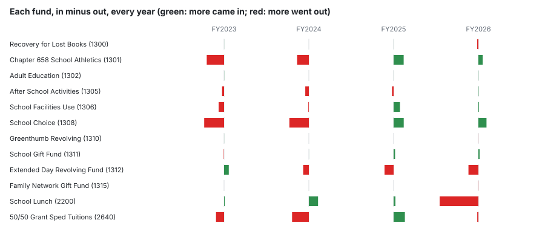
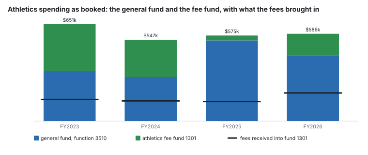

# Are we spending what comes in? The school funds, FY2023 to FY2026

**For each school fund outside the voted budget: what came in, what went out, every closed year the town’s ledger covers.**

---

## The short version

**Yes: more than came in.** Over FY2023 to FY2026 the schools’ fourteen own funds (fees, school choice, lunch, gifts and the circuit breaker) took in $8,059,022 and spent $9,061,961: **$1,002,938 more out than in.** The difference came out of balances that had built up to a peak at 30 June 2022 ($2,170,682); by 30 June 2026 they held $1,167,744. See [/analysis/sitting-on-money](/analysis/sitting-on-money) for the balances year by year.

**Not every fund covers its own spending, even on its own books.** After-school activities, extended day and the circuit breaker spent more than came in in three of the four years. Extended day — minuted in February 2025 as *“a self-sustaining program”* — spent $241,062 more than it took in across FY2024 to FY2026.

**Athletics fees matched 25.5% of the athletics spending the books show**, FY2023 to FY2026. The general fund booked 68.4% of that spending under the same function code; the fee fund booked the other 31.6%, partly from its balance. Athletics is the only fee-funded programme where the two can be set side by side.

---

## By kind, every year

Revenue and expenditure as the period-13 ledger books them (`munis-school-ytd.csv`, `report = special-school`). **Net** is in minus out: negative means the fund spent more than it took in that year, which for a revolving fund draws on its balance.

| kind | funds with activity | FY2023 net | FY2024 net | FY2025 net | FY2026 net | four years in | four years out | net | years out > in |
|---|---:|---:|---:|---:|---:|---:|---:|---:|---:|
| Circuit breaker (special education reimbursement) | 1 | -$79,218 | -$164,707 | $110,367 | -$11,529 | $1,652,127 | $1,797,214 | **-$145,087** | 3 of 4 |
| School choice tuition received | 1 | -$194,626 | -$190,629 | $98,991 | $79,378 | $485,153 | $692,039 | **-$206,886** | 2 of 4 |
| School lunch | 1 | $6,631 | $90,043 | $17,541 | -$380,087 | $3,212,258 | $3,478,130 | **-$265,872** | 1 of 4 |
| Fee-funded revolving funds (athletics, after-school, extended day, rentals and four more) | 7 | -$193,477 | -$210,057 | $56,865 | -$59,556 | $2,603,501 | $3,009,725 | **-$406,224** | 3 of 4 |
| Gift funds | 2 | -$2,873 | $330 | $14,512 | $9,162 | $105,983 | $84,851 | **$21,131** | 1 of 4 |
| Grants (federal and state, every other 2xxx fund) | 32 | -$58,269 | -$65,402 | $213,916 | -$498,094 | $3,041,168 | $3,449,017 | **-$407,849** | 3 of 4 |

**Grants are different and are shown apart.** A reimbursement grant spends first and is paid after, so a year of more out than in is usually timing, not a drawdown. FY2026 books $59,333 of grant revenue against $557,427 of grant spending; whether the rest arrives after the close, sits in a fund this report does not carry, or both, the ledger cannot say (registered gap). The grants are counted in no total above the fold.

## Fund by fund

The fourteen funds sitting-on-money carries, with their balance at each end of the four years. Names are the annual report’s; the number is MUNIS’s.

| fund | kind | FY2023 in / out | FY2024 in / out | FY2025 in / out | FY2026 in / out | four-year net | years out > in | 30 June 2022 | 30 June 2026 |
|---|---|---:|---:|---:|---:|---:|---:|---:|---:|
| School Lunch (2200) | Lunch | $739,687 / $733,056 | $927,542 / $837,499 | $878,807 / $861,266 | $666,223 / $1,046,309 | **-$265,872** | 1 | $340,911 | $75,039 |
| School Choice (1308) | School choice | $116,976 / $311,602 | $94,912 / $285,541 | $157,234 / $58,244 | $116,031 / $36,653 | **-$206,886** | 2 | $533,167 | $326,281 |
| Extended Day Revolving Fund (1312) | Fee-funded revolving | $306,343 / $259,863 | $280,400 / $335,537 | $271,204 / $359,993 | $274,325 / $371,461 | **-$194,582** | 3 | $192,013 | -$2,569 |
| 50/50 Grant Sped Tuitions (2640) | Circuit breaker | $415,750 / $494,968 | $301,589 / $466,296 | $608,818 / $498,451 | $325,970 / $337,499 | **-$145,087** | 3 | $426,893 | $281,806 |
| Chapter 658 School Athletics (1301) | Fee-funded revolving | $144,950 / $314,864 | $135,765 / $250,575 | $131,481 / $32,796 | $188,944 / $146,911 | **-$144,006** | 2 | $296,286 | $152,281 |
| After School Activities (1305) | Fee-funded revolving | $197,144 / $216,460 | $180,338 / $215,560 | $136,317 / $152,423 | $207,734 / $205,589 | **-$68,499** | 3 | $203,041 | $134,542 |
| Recovery for Lost Books (1300) | Fee-funded revolving | $450 / $0 | $1,110 / $1,358 | $4,076 / $3,709 | $3,195 / $15,661 | **-$11,897** | 2 | $13,897 | $2,000 |
| Family Network Gift Fund (1315) | Gifts | $0 / $0 | $0 / $0 | $0 / $0 | $0 / $2,433 | **-$2,433** | 1 | $2,301 | -$132 |
| Greenthumb Revolving (1310) | Fee-funded revolving | $507 / $0 | $0 / $0 | $984 / $966 | $0 / $1,000 | **-$475** | 1 | $1,866 | $1,391 |
| Vending Machine Revolving (1314) | Fee-funded revolving | $0 / $0 | $0 / $0 | $0 / $0 | $0 / $0 | **$0** | 0 | $1,955 | $1,955 |
| Technology for School Children Gift Fund (1549) | Gifts | $0 / $0 | $0 / $0 | $0 / $0 | $0 / $0 | **$0** | 0 | $10,000 | $10,000 |
| Adult Education (1302) | Fee-funded revolving | $7,240 / $5,780 | $4,830 / $4,960 | $5,020 / $4,560 | $5,750 / $4,480 | **$3,060** | 1 | $9,834 | $12,894 |
| School Facilities Use (1306) | Fee-funded revolving | $15,116 / $68,259 | $16,888 / $21,399 | $64,720 / $2,489 | $18,670 / $13,074 | **$10,173** | 2 | $60,666 | $70,839 |
| School Gift Fund (1311) | Gifts | $26,293 / $29,166 | $19,103 / $18,773 | $35,794 / $21,282 | $24,793 / $13,198 | **$23,564** | 1 | $77,854 | $101,418 |

The 32 grant funds with activity, for completeness (no balances: none is published after 30 June 2023 — registered gap):

| fund | MUNIS name | FY2023 in / out | FY2024 in / out | FY2025 in / out | FY2026 in / out | four-year net |
|---|---|---:|---:|---:|---:|---:|
| 2582 | EECBG ENERGY EFFICIENCY GRANT | $0 / $0 | $9 / $0 | $9 / $0 | $0 / $0 | $18 |
| 2622 | FY25 FAMILY & COMMUNITY | $0 / $0 | $0 / $0 | $72,737 / -$540 | $0 / $6,077 | $67,200 |
| 2649 | DISPLACED STUDENTS-PUERTO RICO | $0 / $0 | $0 / $0 | $0 / $10,661 | $0 / $0 | -$10,661 |
| 2653 | FY24 FAMILY & COMMUNITY #237 | $0 / $0 | $72,737 / $71,803 | $0 / $500 | $0 / $0 | $434 |
| 2667 | FY24  #718 ARTS/CULTURAL VITAL | $0 / $0 | $5,200 / $5,172 | $0 / $17 | $0 / $0 | $11 |
| 2672 | FY26 FAMILY & COMMUNITY 237 | $0 / $0 | $0 / $0 | $0 / $0 | $48,558 / -$10,215 | $58,773 |
| 2681 | COMP SCHOOL HEALTH SERV GRANT | $130,000 / $82,882 | $15,000 / $84,923 | $0 / $0 | $10,775 / $11,915 | -$23,946 |
| 2690 | FY26 #309 TITLE IV PART A | $0 / $0 | $0 / $0 | $0 / $0 | $0 / $10,107 | -$10,107 |
| 2702 | FY25 CSHS INST/SUPRT SALARIES | $0 / $0 | $0 / $0 | $24,000 / $21,062 | $0 / $0 | $2,938 |
| 2705 | FY24 305 TITLE 1 GRANT | $0 / $0 | $165,760 / $165,760 | $31,500 / $31,500 | $0 / $0 | $0 |
| 2713 | FY25 TITLE 1 #305 | $0 / $0 | $0 / $0 | $194,517 / $160,649 | $0 / $0 | $33,868 |
| 2728 | FY24 TITLE 11 PART A #140 | $0 / $0 | $36,509 / $27,832 | $0 / $352 | $0 / $3,217 | $5,108 |
| 2748 | FY24 117 EVIDENCE | $0 / $0 | $136,583 / $136,583 | $0 / $0 | $0 / $0 | $0 |
| 2750 | FY24 TITLE IV-PART A #309 | $0 / $0 | $14,026 / $14,045 | $0 / $0 | $0 / $0 | -$18 |
| 2758 | FY23 240 | $0 / $0 | $239,897 / $239,897 | $173,793 / $180,294 | $0 / $1,666 | -$8,167 |
| 2765 | FY20 TITLE IIA #140 | $200 / $269 | $0 / $0 | $0 / $0 | $0 / $0 | -$69 |
| 2767 | FY20 TITLE IV #309 | $200 / $812 | $0 / $0 | $0 / $0 | $0 / $0 | -$612 |
| 2769 | FY21 TITLE II #140 | $0 / $199 | $0 / $0 | $0 / $0 | $0 / $0 | -$199 |
| 2770 | FY25 TITLE IV 309 | $4,916 / $4,916 | $0 / $0 | $15,259 / $13,538 | $0 / $0 | $1,721 |
| 2778 | FY25 117 SOA EVIDENCE BASE | $0 / $0 | $0 / $0 | $116,000 / $138,573 | $0 / $5,388 | -$27,961 |
| 2781 | FY22 119 ESSER III FRINGE BENEFIT | $252,821 / $356,170 | $708,298 / $711,818 | $0 / $1,408 | $0 / $0 | -$108,277 |
| 2787 | FY22 TITLE IV PART A #309 | $8,626 / $6,656 | $0 / $4,900 | $0 / $0 | $0 / $0 | -$2,929 |
| 2788 | FY22 TITLE II #140 | $20,388 / $16,241 | $0 / $2,500 | $0 / $0 | $0 / $0 | $1,647 |
| 2793 | SCHOOL WATER IMPROVEMENT GRANT | $6,000 / $1,998 | $0 / $0 | $0 / $0 | $0 / $0 | $4,002 |
| 2795 | FY23 TITLE IV #309 | $1,290 / $11,838 | $10,762 / $0 | $0 / $0 | $0 / $0 | $214 |
| 2796 | FY23 TITLE II #140 | $19,126 / $19,855 | $12,430 / $17,382 | $0 / $0 | $0 / $0 | -$5,680 |
| 2797 | FY23 #719 ACCELERATED LITERACY | $26,862 / $26,862 | $0 / $0 | $0 / $0 | $0 / $0 | $0 |
| 2800 | FY25 140   080524093026 | $0 / $0 | $0 / $0 | $33,663 / $35,871 | $0 / -$2,208 | $0 |
| 2809 | FY26 117 soa Evidence Based | $0 / $0 | $0 / $0 | $0 / $0 | $0 / $92,176 | -$92,176 |
| 2813 | FY25 #240 | $0 / $0 | $0 / $0 | $422,716 / $281,820 | $0 / $112,981 | $27,915 |
| 2814 | FY26 #240 | $0 / $0 | $0 / $0 | $0 / $0 | $0 / $320,895 | -$320,895 |
| 2832 | FY25 #274  0205202509302025 | $0 / $0 | $0 / $0 | $10,000 / $4,573 | $0 / $5,427 | $0 |

## Do the revolving funds pay their own way?

**On their own books, the test is simple: did each year’s revenue cover each year’s spending?** The tables above answer it. **The harder question is whether the general fund carries costs of the same programme** — and the ledger can answer that in exactly one place.

A fund’s spending is booked to a DESE function code. Where the general fund books spending under the same, programme-specific code, the two can be set side by side. Of the fee and lunch funds, **only athletics (function 3510) meets that test.** The others book to codes that name no programme — 2000 (instruction, generally), 4000 (operations), 5200 (benefits) — so whether the general fund carries any of their custodians, utilities, administration or benefits cannot be shown from this ledger: Adult Education, After School Activities, Extended Day Revolving Fund, Greenthumb Revolving, Recovery for Lost Books, School Facilities Use, School Lunch. That is not evidence that it does not; it is the limit of the instrument (registered gap). The lunch fund books food service to function 3400, and the general fund books $0 there in four years.

| year | general fund, function 3510 | fee fund 1301 spent | fee fund share of the two | fees received |
|---|---:|---:|---:|---:|
| FY2023 | $335,766 | $314,864 | 48.4% | $144,950 |
| FY2024 | $295,979 | $250,575 | 45.8% | $135,765 |
| FY2025 | $541,945 | $32,796 | 5.7% | $131,481 |
| FY2026 | $439,510 | $146,911 | 25.1% | $188,944 |
| **four years** | **$1,613,201** | **$745,146** | **31.6%** | **$601,141** |

**What the data shows.** The athletics fee fund paid 31.6% of the athletics spending booked in either fund, and the fees themselves equal 25.5% of it. The fund’s share swung from 48.4% in FY2023 to 5.7% in FY2025.

**What it does not show.** Why the split moved. Costs may have been moved between the two deliberately, the fund may have been rested to rebuild its balance (it took in $98,685 more than it spent in FY2025), or a general fund line may be budgeted net of the revolving fund (registered gap). And it is not the whole cost of athletics: fields, custodians and utilities sit in other general fund functions and are in neither column (registered gap). **Rule 11 applies to every fund here: covering its costs means covering the costs booked to it.**

**Lunch is not a fee-funded programme.** Over the four years 93.8% of its receipts were federal reimbursement through the state and 3.8% were sales. It covered its booked spending in FY2023, FY2024 and FY2025 and fell $380,087 short in FY2026; with federal money that dominant, a shortfall at the close may be a reimbursement booked after it — a hypothesis nothing here tests.

**School choice and the circuit breaker are not fee funds either.** School choice is tuition the state pays for children who come in from other towns; the circuit breaker is the state’s reimbursement for high-cost special education. Both are meant to be spent, and both may lawfully carry a balance. Their four-year drawdowns ($206,886 and $145,087) are spending of money already received.

## Does this agree with sitting-on-money?

**FY2024 to FY2026: yes, every fund, every year, to the cent** — the change in each balance sitting-on-money publishes equals in minus out here. That is two reads of one ledger agreeing, not a second document; the independent check is sitting-on-money’s own, which proves the 30 June 2025 balances against the Town’s March 2026 report.

**FY2023, against the annual town report (a different document): 12 of the fourteen funds tie on every test** — receipts, disbursements, the report’s own forward-plus-net-equals-carried, and its opening balance against the FY2022 report’s closing one.

| fund | receipts: report less ledger | disbursements: report less ledger | forward + ledger net − carried | FY2023 opening − FY2022 closing |
|---|---:|---:|---:|---:|
| Chapter 658 School Athletics (1301) | $1,456 | $1,456 | $0 | $0 |
| Greenthumb Revolving (1310) | -$507 | $0 | $507 | $507 |

Across all fourteen, the balance fell $1,002,938 from 30 June 2022 to 30 June 2026, and in minus out over the same four years sums to -$1,002,938: they agree to the cent, because each miss above cancels within its own fund (the same amount on both sides of athletics; Greenthumb’s FY2023 opening balance is above its FY2022 closing one by the same amount the ledger books as an FY2023 receipt).

**Coverage.** The FY2023 annual report prints $3,667,636 received and $4,333,280 spent across every school special revenue fund; the period-13 special funds report carries $2,440,883 and $2,962,716. The difference is funds that report does not carry (registered gap). The fourteen funds are all in it; the grant totals here are only what it holds.

## What was said

Searched in the minutes for revolving funds, self-sustaining programmes, athletic fees and lunch (`scripts/search_minutes.py`). Each quote is checked verbatim against the minutes it cites every time this report is built.

- **School Committee, 8 January 2025** — the district, presenting the school choice and facilities revolving accounts: *“these accounts are following the same patterns as other revolving accounts, which is the money coming in is not enough to cover the money going out”* ([minutes](https://www.lunenburgma.gov/AgendaCenter/ViewFile/Minutes/_01082025-6948))
- **School Committee, 5 February 2025** — the minutes, on the unaffiliated salary schedule: *“this is primarily for the extended day staff, which is a self-sustaining program and has no budgetary impact”* ([minutes](https://www.lunenburgma.gov/AgendaCenter/ViewFile/Minutes/_02052025-7006))
- **School Committee, 15 November 2023** — the district, presenting the athletics report: *“We could be looking at an increase in athletic fees in the next two years.”* ([minutes](https://www.lunenburgma.gov/AgendaCenter/ViewFile/Minutes/_11152023-3952))
- **School Committee, 26 August 2026** — the Superintendent, on restoring athletic transportation: *“Of that amount, $10,000 would come from the additional appropriation and $50,000 from the athletic revolving account.”* ([minutes](https://www.lunenburgma.gov/AgendaCenter/ViewFile/Minutes/_08262026-7980))
- **School Committee, 26 August 2026** — the same meeting: *“Town Meeting could not appropriate school revolving funds or circuit-breaker funds, which were school funds and, in some cases, restricted to specific purposes”* ([minutes](https://www.lunenburgma.gov/AgendaCenter/ViewFile/Minutes/_08262026-7980))
- **School Committee, 12 March 2025** — a resident, in public comment on the FY26 athletics cuts: *“I don't have the full picture for each sport because of this lack of information regarding cost to particular athletic programs”* ([minutes](https://www.lunenburgma.gov/AgendaCenter/ViewFile/Minutes/_03122025-7098))
- **School Committee, 12 March 2025** — another resident, the same evening: *“Splitting everything into revolving funds is not a good way to manage finances. We need to lay out all revenues and all expenses.”* ([minutes](https://www.lunenburgma.gov/AgendaCenter/ViewFile/Minutes/_03122025-7098))
- **Finance Committee, 12 June 2025** — the minutes, summarising members: *“There are issues with finance management and the inability to see where grant money and revolving funds are being moved and spent.”* ([minutes](https://www.lunenburgma.gov/AgendaCenter/ViewFile/Minutes/_06122025-7273))

The first matches the ledger: school choice and facilities use both spent more than came in in FY2023 and FY2024. The second says extended day pays for itself; on its own books its fees stopped covering its spending from FY2024 and it ran on its balance. Whether the general fund carries any of its cost cannot be tested (it books to codes that name no programme), so “no budgetary impact” is neither confirmed nor contradicted here — but by the carried figure the balance that cushioned it is gone. The fourth and fifth are the same thing from two sides: a use of the athletics fund’s balance, which stood at $152,281 at 30 June 2026 by sitting-on-money’s carried figure, and the limit on who may spend it.

**The two from 12 March 2025 were said in FY2025, the year the FY26 sports cuts were argued.** That year the athletics fee fund spent $32,796 while $131,481 of fees came in, the general fund booked $541,945 under athletics, and the fund closed the year holding $110,248. Whether any of that balance was already committed, or could lawfully have carried a sport under discussion, the ledger cannot say. This report is the revenue-and-expense layout the second of them asks for, for the funds the ledgers carry.

## What it does not show

- Why any fund spent more or less than it took in — the ledger gives amounts, not reasons.
- The whole cost of any fee-funded programme: costs booked to the general fund under generic function codes cannot be attributed (registered gap).
- Whether a general fund athletics line is budgeted net of the revolving fund (registered gap).
- Whether the FY2026 grant and lunch shortfalls are reimbursements booked after the close (registered gap).
- School funds the period-13 special funds report does not carry (registered gap).
- The FY2026 balances against any second document; they are carried through the ledger.
- The town’s own special revenue funds: these ledgers are the schools’ alone, and the town’s receipts and disbursements are read only to FY2023 (registered gap).
- Encumbrances: $13,780 is still committed in these funds at the closes and is not counted as spent.

## Closes with

Each is a row in `sources/data/money-gaps.csv`:

- Which school special revenue funds the period-13 special funds report leaves out
- What a fee-funded school programme costs that is not booked to its own fund
- Whether a general fund athletics line is net of the revolving fund
- What share of the schools’ grounds, custodial, heating and utility cost is athletics
- What the school grant funds held at 30 June 2024, 2025 and 2026
- What the town’s own special revenue funds held at 30 June 2024, 2025 and 2026

## Method

- Revenue is the period-13 `ytd_expended` on revenue rows, sign reversed (MUNIS prints revenue as a credit); expenditure is `ytd_expended` on expense rows. Encumbrances are not counted as spent.
- The fund grouping is sitting-on-money’s, imported from `build_sitting_on_money.py`. Grants (every other 2xxx fund) are ours, by MUNIS’s numbering. Two 13xx funds outside the fourteen moved no money in any of the four years; the generator refuses to build if that changes.
- The shared-function test reads the DESE function code (the fourth segment of the account) on both sides; codes 0000, 2000, 4000 and 5200 name no programme and are not counted as a match. The generator refuses to build if the test ever finds a programme other than athletics.
- Verified by `scripts/verify_spending_what_comes_in.py`, which recomputes every conclusion figure by a second route.

## Sources

| document | what it gives here |
|---|---|
| [glytdbud-expense-fy2023-p13-special-school.xlsx](/docs/town-ledgers/expenses/glytdbud-expense-fy2023-p13-special-school.xlsx) | School special funds, period 13: each fund’s revenue and expense for FY2023. Delivered 6 October 2026. |
| [glytdbud-expense-fy2023-p13-gf-school.xlsx](/docs/town-ledgers/expenses/glytdbud-expense-fy2023-p13-gf-school.xlsx) | School general fund, period 13, FY2023: spending by DESE function, used for athletics (3510). |
| [glytdbud-expense-fy2024-p13-special-school.xlsx](/docs/town-ledgers/expenses/glytdbud-expense-fy2024-p13-special-school.xlsx) | School special funds, period 13: each fund’s revenue and expense for FY2024. Delivered 6 October 2026. |
| [glytdbud-expense-fy2024-p13-gf-school.xlsx](/docs/town-ledgers/expenses/glytdbud-expense-fy2024-p13-gf-school.xlsx) | School general fund, period 13, FY2024: spending by DESE function, used for athletics (3510). |
| [glytdbud-expense-fy2025-p13-special-school.xlsx](/docs/town-ledgers/expenses/glytdbud-expense-fy2025-p13-special-school.xlsx) | School special funds, period 13: each fund’s revenue and expense for FY2025. Delivered 6 October 2026. |
| [glytdbud-expense-fy2025-p13-gf-school.xlsx](/docs/town-ledgers/expenses/glytdbud-expense-fy2025-p13-gf-school.xlsx) | School general fund, period 13, FY2025: spending by DESE function, used for athletics (3510). |
| [glytdbud-expense-fy2026-p13-special-school.xlsx](/docs/town-ledgers/expenses/glytdbud-expense-fy2026-p13-special-school.xlsx) | School special funds, period 13: each fund’s revenue and expense for FY2026. Delivered 6 October 2026. |
| [glytdbud-expense-fy2026-p13-gf-school.xlsx](/docs/town-ledgers/expenses/glytdbud-expense-fy2026-p13-gf-school.xlsx) | School general fund, period 13, FY2026: spending by DESE function, used for athletics (3510). |
| [4129-fy-2022-annual-town-report.pdf](/docs/town-annual-reports/docs/4129-fy-2022-annual-town-report.pdf) | Annual town report FY2022, Special Revenue Funds schedule: each school fund’s forward, receipts, disbursements and carried. The FY2023 reconciliation. |
| [4131-fy-2023-annual-town-report.pdf](/docs/town-annual-reports/docs/4131-fy-2023-annual-town-report.pdf) | Annual town report FY2023, Special Revenue Funds schedule: each school fund’s forward, receipts, disbursements and carried. The FY2023 reconciliation. |
| [special-revenue-fy2026-p09.xlsx](/docs/town-ledgers/fund-balances/special-revenue-fy2026-p09.xlsx) | Every school special revenue fund to 31 March 2026: used here for MUNIS’s fund names only. |
| [2025-01-08-minutes-6948.pdf](/docs/meetings/school-committee/2025-01-08-minutes-6948.pdf) | Minutes of 8 January 2025: "these accounts are following the same patterns as other revolving accounts, which is the money coming in is not enough to cover the money going out" |
| [2025-02-05-minutes-7006.pdf](/docs/meetings/school-committee/2025-02-05-minutes-7006.pdf) | Minutes of 5 February 2025: "this is primarily for the extended day staff, which is a self-sustaining program and has no budgetary impact" |
| [2023-11-15-minutes-3952.pdf](/docs/meetings/school-committee/2023-11-15-minutes-3952.pdf) | Minutes of 15 November 2023: "We could be looking at an increase in athletic fees in the next two years." |
| [2026-08-26-minutes-7980.pdf](/docs/meetings/school-committee/2026-08-26-minutes-7980.pdf) | Minutes of 26 August 2026: "Of that amount, $10,000 would come from the additional appropriation and $50,000 from the athletic revolving account." |
| [2025-03-12-minutes-7098.pdf](/docs/meetings/school-committee/2025-03-12-minutes-7098.pdf) | Minutes of 12 March 2025: "I don't have the full picture for each sport because of this lack of information regarding cost to particular athletic programs" |
| [2025-06-12-minutes-7273.pdf](/docs/meetings/finance-committee/2025-06-12-minutes-7273.pdf) | Minutes of 12 June 2025: "There are issues with finance management and the inability to see where grant money and revolving funds are being moved and spent." |
