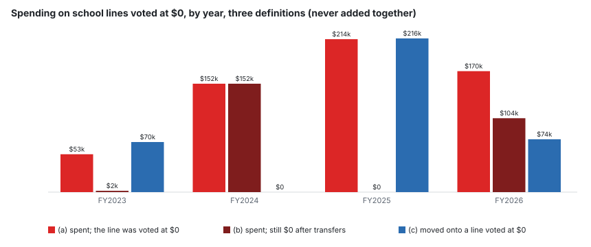
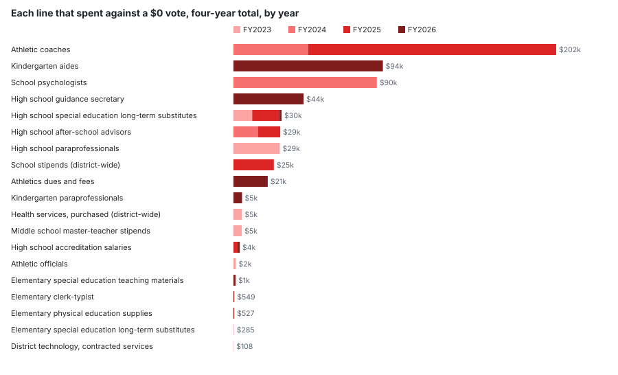
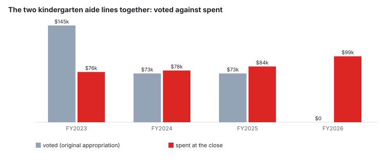

# Spent with no budget: school lines voted at $0, FY2023 to FY2026

**Which school budget lines spent money they were never voted, how much, and whether it happens every year.**

---

## The short version

**$589,335 was spent on school budget lines voted at $0**, FY2023 to FY2026: the general fund lines whose voted (original) appropriation was zero and which spent money anyway. **$257,491 of it** went on lines that were still at $0 after every mid-year transfer. Separately, **$359,920 was moved during the year onto lines that started at $0.** The three are different questions and are never added together.

**This is not by itself improper.** In all four years the school department’s total came in under its budget, so the spending was covered elsewhere in the total. It is never more than 0.9% of a year’s school spending. What it shows is that **the voted line-item budget did not describe what happened** — and that is what a Finance Committee reading the line items is reading.

**It is mostly a missing year, not new spending.** 14 of the 19 lines that spent against a $0 vote had a voted budget in another of the four years. The largest is **athletic coaches: $202,347 against a $0 vote** over FY2024 and FY2025. **The worked case: $99,064 charged to the two kindergarten aide lines in FY2026**, both voted at $0, after the same lines were voted $73,273 in FY2025.

---

## Three definitions, every year

Three different questions, so three different columns, **never added together**: (a) the line was voted at $0 and spent; (b) the line was still at $0 after every transfer and spent; (c) the line was voted at $0 and money was moved onto it. Every (b) line in this period is also an (a) line; 12 of the 14 (c) cases also spent, and so are (a) lines too. The largest single case is athletic coaches in FY2025: $155,614.

| year | (a) lines | (a) spent | (b) lines | (b) spent | (c) lines | (c) moved on | department spent | (a) as share | department left unspent |
|---|---:|---:|---:|---:|---:|---:|---:|---:|---:|
| FY2023 | 6 | $53,154 | 2 | $1,795 | 4 | $70,289 | $22,403,863 | 0.24% | $106,827 |
| FY2024 | 4 | $152,022 | 4 | $152,022 | 0 | $0 | $22,743,460 | 0.67% | $215,776 |
| FY2025 | 5 | $214,497 | 0 | $0 | 5 | $215,544 | $24,554,455 | 0.87% | $627,117 |
| FY2026 | 9 | $169,662 | 6 | $103,674 | 5 | $74,086 | $25,613,679 | 0.66% | $482,118 |
| **four years** | | **$589,335** | | **$257,491** | | **$359,920** | | | |

“Department left unspent” is the period-13 available balance across every line: revised budget, less spent, less still encumbered. It is positive in every year, which is what “covered elsewhere in the total” means here. No purchase orders were open at the close on any line counted above (encumbered: $0).

## Line by line

Every line that enters any of the three definitions in any year, ranked by what it spent against a $0 vote. Each cell is voted / revised / spent; the letters are the definitions the line meets that year. Names are ours, from MUNIS’s description and the DESE function code; the MUNIS description and account are in the last column.

| line | FY2023 | FY2024 | FY2025 | FY2026 | (a) four years | MUNIS |
|---|---|---|---|---|---:|---|
| Athletic coaches | $98k / $100k / $100k | $0 / $0 / $47k **(a,b)** | $0 / $157k / $156k **(a,c)** | $159k / $159k / $146k | $202,347 | ATHLETIC COACHES `0100-3-300-3510-06-6-67-1-519003` |
| Kindergarten aides | $0 / $0 / $0 | $0 / $0 / $0 | $0 / $0 / $0 | $0 / $0 / $94k **(a,b)** | $93,691 | KINDERGARTEN AIDES/REGULAR `0100-3-300-2330-03-2-12-1-511103` |
| School psychologists | $0 / $0 / $0 | $0 / $0 / $90k **(a,b)** | $85k / $92k / $92k | $99k / $99k / $0 | $89,887 | PSYCHOLOGISTS SALARIES `0100-3-300-2800-07-2-06-1-511023` |
| High school guidance secretary | $42k / $42k / $38k | $44k / $44k / $39k | $38k / $40k / $40k | $0 / $43k / $44k **(a,c)** | $43,980 | H.S. GUIDANCE SECRETARY `0100-3-300-2710-06-6-65-1-511002` |
| High school special education long-term substitutes | $0 / $9k / $12k **(a,c)** | $0 / $0 / $0 | $0 / $17k / $17k **(a,c)** | $0 / $0 / $2k **(a,b)** | $30,165 | H.S. SPED LONG TERM SUBS `0100-3-300-2325-51-6-71-1-511003` |
| High school after-school advisors | $12k / $12k / $15k | $0 / $0 / $15k **(a,b)** | $0 / $14k / $14k **(a,c)** | $11k / $11k / $15k | $29,334 | H.S. AFTER SCHOOL ADVISORS `0100-3-300-3520-06-6-70-1-519003` |
| High school paraprofessionals | $0 / $56k / $29k **(a,c)** | $53k / $53k / $18k | $48k / $35k / $5k | $0 / $0 / $0 | $29,070 | H.S. PARAPROFESSIONALS `0100-3-300-2330-06-6-13-1-511203` |
| School stipends (district-wide) | $18k / $19k / $45k | $18k / $18k / $46k | $0 / $25k / $25k **(a,c)** | $31k / $31k / $33k | $25,296 | SCHOOL STIPENDS `0100-3-300-1230-99-0-99-1-519103` |
| Athletics dues and fees | $20k / $20k / $22k | $20k / $20k / $18k | $20k / $32k / $32k | $0 / $30k / $21k **(a,c)** | $21,481 | DUES AND FEES `0100-3-300-3510-06-6-67-2-535020` |
| Kindergarten paraprofessionals | $145k / $89k / $76k | $73k / $73k / $78k | $73k / $93k / $84k | $0 / $0 / $5k **(a,b)** | $5,373 | KIND PARAPROFESSIONALS/REG `0100-3-300-2330-03-2-13-1-511203` |
| Health services, purchased (district-wide) | $0 / $459 / $5k **(a,c)** | $4k / $4k / $4k | $4k / $4k / $2k | $7k / $7k / $0 | $5,325 | PURCHASE OF SERVICE `0100-3-300-3200-99-1-56-2-531006` |
| Middle school master-teacher stipends | $0 / $5k / $5k **(a,c)** | $2k / $0 / $0 | $0 / $0 / $0 | $0 / $0 / $0 | $5,204 | MASTER TEACHER STIPENDS `0100-3-300-2305-05-5-54-1-517005` |
| High school accreditation salaries | $0 / $0 / $0 | $0 / $0 / $0 | $0 / $3k / $3k **(a,c)** | $0 / $0 / $1k **(a,b)** | $3,892 | SALARIES ACCREDITATION `0100-3-300-2210-06-6-08-1-511019` |
| Athletic officials | $0 / $0 / $2k **(a,b)** | $0 / $0 / $0 | $0 / $0 / $0 | $0 / $0 / $0 | $1,510 | ATHLETIC OFFICIALS `0100-3-300-3510-06-6-67-2-535021` |
| Elementary special education teaching materials | $4k / $4k / $3k | $3k / $3k / $792 | $614 / $386 / $386 | $0 / $0 / $1k **(a,b)** | $1,311 | SPEC ED INSTRUCTIONAL MATERIAL `0100-3-300-2415-51-4-05-2-555055` |
| Elementary clerk-typist | $9k / $9k / $10k | $8k / $8k / $10k | $9k / $9k / $9k | $0 / $0 / $549 **(a,b)** | $549 | E.S. CLERK TYPIST `0100-3-300-2210-01-4-08-1-511102` |
| Elementary physical education supplies | $2k / $1k / $964 | $2k / $2k / $1k | $300 / $300 / $300 | $0 / $550 / $527 **(a,c)** | $527 | PHYSICAL ED SUPPLIES `0100-3-300-2420-04-4-62-2-555005` |
| Elementary special education long-term substitutes | $0 / $0 / $285 **(a,b)** | $0 / $0 / $0 | $0 / $0 / $0 | $0 / $600 / $0 **(c)** | $285 | E.S. LONG TERM SPED SUBS `0100-3-300-2325-51-4-71-1-511003` |
| District technology, contracted services | $10k / $10k / $12k | $0 / $0 / $108 **(a,b)** | $0 / $0 / $0 | $4k / $4k / $2k | $108 | CONTRACTED SERVICES SYSTEM `0100-3-300-2451-99-1-52-2-535006` |
| High school marching band | $7k / $7k / $5k | $6k / $6k / $5k | $2k / $2k / $2k | $0 / $4 / $0 **(c)** | $0 | MUSIC MARCHING BAND `0100-3-300-2420-06-6-63-2-555028` |

## Does it recur?

**4 lines spent against a $0 vote in more than one of the four years:**

- **High school special education long-term substitutes** — FY2023, FY2025, FY2026, $30,165 in all.
- **Athletic coaches** — FY2024, FY2025, $202,347 in all.
- **High school after-school advisors** — FY2024, FY2025, $29,334 in all.
- **High school accreditation salaries** — FY2025, FY2026, $3,892 in all.

The rest did it once. Of the 19 lines, **14 had a voted budget in another of the four years**. Where the year before is in the data, 14 of 18 cases had spending on the same line the year before: a line that was in use, then voted at zero.

**Athletics, beside the fee fund.** The athletic coaches line was voted $0 in FY2024 and FY2025. It spent $100,350 (FY2023), $46,733 (FY2024), $155,614 (FY2025), $145,882 (FY2026) across FY2023 to FY2026; in the same years the athletics fee fund spent $314,864 (FY2023), $250,575 (FY2024), $32,796 (FY2025), $146,911 (FY2026) ([/analysis/spending-what-comes-in](/analysis/spending-what-comes-in)). *Hypothesis, not tested here:* the split of coaching pay between the general fund and the fee fund moved from year to year, and the voted line did not follow it. Nothing published says so; the journal export below would.

**What a reader can do with that.** A line that spent money last year and is voted at $0 this year is visible in the budget book before the vote, and it is a question a Finance Committee member can ask. That is the only lever this report names; which answer is right is not something the ledger can say.

## The worked case: kindergarten aides and paraprofessionals

Two lines: **kindergarten aides** (`0100-3-300-2330-03-2-12-1-511103`, org S2032121, MUNIS *KINDERGARTEN AIDES/REGULAR*) and **kindergarten paraprofessionals** (`0100-3-300-2330-03-2-13-1-511203`, org S2032131, MUNIS *KIND PARAPROFESSIONALS/REG*). Account codes checked against the ledger before use.

| year | aides: voted / spent | paraprofessionals: voted / revised / spent | together voted | together spent |
|---|---:|---:|---:|---:|
| FY2023 | $0 / $0 | $145,311 / $89,481 / $75,502 | $145,311 | $75,502 |
| FY2024 | $0 / $0 | $73,273 / $73,273 / $77,700 | $73,273 | $77,700 |
| FY2025 | $0 / $0 | $73,273 / $93,495 / $83,766 | $73,273 | $83,766 |
| FY2026 | $0 / $93,691 | $0 / $0 / $5,373 | $0 | $99,064 |

**What the ledger shows.** In FY2024 and FY2025 the paraprofessional line was voted $73,273 and $73,273, and spent $77,700 and $83,766. In FY2026 both lines were voted $0 and **$99,064** was charged to them, $93,691 of it to the aides line, which had spent nothing in the three years before.

**What it does not show.** Who was paid. An account titled *kindergarten aides* is where the books put the money, not a person in a classroom (rule 11 of this project). Staff coded to the line while assigned elsewhere, a reclassification between the aide and paraprofessional titles, or posts moved from another line would all print the same ledger. The FY2026 surplus report counts both lines among the paraprofessional lines, which together ran **$208,082 over budget** in FY2026 — see [/analysis/fy26-school-surplus](/analysis/fy26-school-surplus).

**Beside it, in the same year.** A Finance Committee minute of 12 January 2026 records the School Committee chair saying kindergarten classrooms had no aides (quoted below), and the staffing increase requests the schools listed to the Finance Committee in February 2026 included one kindergarten paraprofessional. The ledger and the minute are both real and nothing published reconciles them; a payroll distribution for the two accounts would (registered gap).

## Why the special funds are left out

Revolving funds, grants, the circuit breaker and gift funds spend **without appropriation, by law**: their authority is the fund, not a vote of Town Meeting. A $0 budget on one of their lines is the normal state. Measured, so the exclusion is visible: across the four years, 262 of the 371 cases of a special-fund expense line spending in a year had a $0 budget, carrying 70.3% of all special-fund spending. Counting them would bury the general fund question under a fact about how those funds are authorised.

| year | special-fund lines spending | of them at $0 budget | spent | spent on $0 lines |
|---|---:|---:|---:|---:|
| FY2023 | 87 | 69 | $2,962,716 | $1,882,724 |
| FY2024 | 101 | 60 | $3,920,110 | $2,494,546 |
| FY2025 | 96 | 66 | $2,900,907 | $2,130,074 |
| FY2026 | 87 | 67 | $2,789,302 | $2,329,024 |

## What was said

Searched: School Committee and Finance Committee minutes from FY2023 on, for *no budget*, *unbudgeted*, *zero budget*, *not budgeted*, *zeroed out*, *kindergarten aide*, *kindergarten para* and paraprofessional budget discussion. No hit discusses a specific line voted at $0 — which says what these words found, not that nobody raised it in other words. What bears on these lines:

- **Finance Committee, 12 January 2026** (the minutes, recording the School Committee chair during the FY2027 budget discussion): *“the school department had already been significantly cut and could not sustain further reductions without affecting classroom performance, noting that kindergarten classrooms were operating with 25 students and no aides”* — [minutes](https://www.lunenburgma.gov/AgendaCenter/ViewFile/Minutes/_01122026-7597)
- **Finance Committee, 26 February 2026** (the minutes, listing the schools’ FY2027 staffing increase requests): *“1 Kindergarten Paraprofessional: $22,205”* — [minutes](https://www.lunenburgma.gov/AgendaCenter/ViewFile/Minutes/_02262026-7673)
- **School Committee, 3 September 2025** (the minutes, approving the FY2025 line item transfers): *“$4900 out of business manager salary account to the stipends account”* — [minutes](https://www.lunenburgma.gov/AgendaCenter/ViewFile/Minutes/_09032025-7385)
- **School Committee, 3 September 2025** (the same minutes, same item): *“a discussion of transfer accounts regarding a double budget amount for paraprofessionals in the amount of $243,000”* — [minutes](https://www.lunenburgma.gov/AgendaCenter/ViewFile/Minutes/_09032025-7385)

The September 2025 minute shows the School Committee approving FY2025 transfers into a stipends account, the year the district-wide stipends line started at $0 and had money moved onto it; the minute does not give the account number, so which stipends line it was is not established. The “double budget amount for paraprofessionals” is recorded as discussed, not explained.

## What it does not show

- What was paid from any of these lines — the ledger gives one spent figure per line per year (registered gap: a journal or payroll export).
- Why any line was voted at $0. Budget carried on another line, a post not expected to be filled, a coding change: each fits the same numbers.
- Where mid-year transfers came from; the ledger gives a net change per line (registered gap).
- Whether anyone paid from the kindergarten lines worked in a kindergarten classroom (registered gap).
- Anything about the special funds, which spend without appropriation by law and are excluded.
- Years before FY2023: the period-13 ledgers delivered cover FY2023-FY2026 only.

## Closes with

- **A MUNIS general ledger detail (journal) export for department 300, FY2023-FY2026, for the lines listed above** — who or what each line paid, with the warrant reference. It settles what the spending was.
- **The FY2026 payroll distribution for the two kindergarten accounts** — who was paid, and which building they were assigned to.
- **The schedule of line item transfers the School Committee approved each year**, with the from and to accounts — where the money moved onto the (c) lines came from.

## Method

- Source: `sources/data/munis-school-ytd.csv`, `report = gf-school` (fund 0100, department 300), `period = 13`, FY2023-FY2026. The report prints every account every year (415 accounts), so a zero line is a row, not an absence; the build refuses to write if that stops being true.
- “Voted” is `original_approp`; “revised” is `revised_budget` (original plus `transfers_adjustments`); “spent” is `ytd_expended` at the close. Zero means within half a cent. Spent is strictly positive; one line with a negative spent figure (a credit) meets no definition.
- The three definitions are computed independently and never summed into one another.
- Plain names are ours. Re-verified by `scripts/verify_spent_no_budget.py`, a second route in Decimal from the CSV.

## Sources

| document | what it gives here |
|---|---|
| [glytdbud-expense-fy2023-p13-gf-school.xlsx](/docs/town-ledgers/expenses/glytdbud-expense-fy2023-p13-gf-school.xlsx) | School general fund, department 300, period 13, FY2023: voted, transferred, revised, spent and encumbered for every line. |
| [glytdbud-expense-fy2024-p13-gf-school.xlsx](/docs/town-ledgers/expenses/glytdbud-expense-fy2024-p13-gf-school.xlsx) | School general fund, department 300, period 13, FY2024: voted, transferred, revised, spent and encumbered for every line. |
| [glytdbud-expense-fy2025-p13-gf-school.xlsx](/docs/town-ledgers/expenses/glytdbud-expense-fy2025-p13-gf-school.xlsx) | School general fund, department 300, period 13, FY2025: voted, transferred, revised, spent and encumbered for every line. |
| [glytdbud-expense-fy2026-p13-gf-school.xlsx](/docs/town-ledgers/expenses/glytdbud-expense-fy2026-p13-gf-school.xlsx) | School general fund, department 300, period 13, FY2026: voted, transferred, revised, spent and encumbered for every line. |
| [glytdbud-expense-fy2023-p13-special-school.xlsx](/docs/town-ledgers/expenses/glytdbud-expense-fy2023-p13-special-school.xlsx) | School special funds, period 13, FY2023: used only to measure the excluded zero-budget lines. |
| [glytdbud-expense-fy2024-p13-special-school.xlsx](/docs/town-ledgers/expenses/glytdbud-expense-fy2024-p13-special-school.xlsx) | School special funds, period 13, FY2024: used only to measure the excluded zero-budget lines. |
| [glytdbud-expense-fy2025-p13-special-school.xlsx](/docs/town-ledgers/expenses/glytdbud-expense-fy2025-p13-special-school.xlsx) | School special funds, period 13, FY2025: used only to measure the excluded zero-budget lines. |
| [glytdbud-expense-fy2026-p13-special-school.xlsx](/docs/town-ledgers/expenses/glytdbud-expense-fy2026-p13-special-school.xlsx) | School special funds, period 13, FY2026: used only to measure the excluded zero-budget lines. |
| [2026-01-12-minutes-7597.pdf](/docs/meetings/finance-committee/2026-01-12-minutes-7597.pdf) | Minutes of 12 January 2026: "the school department had already been significantly cut and could not sustain further reductions without affecting classroom performance, noting that kindergarten classrooms were operating with 25 students and no aides" |
| [2026-02-26-minutes-7673.pdf](/docs/meetings/finance-committee/2026-02-26-minutes-7673.pdf) | Minutes of 26 February 2026: "1 Kindergarten Paraprofessional: $22,205" |
| [2025-09-03-minutes-7385.pdf](/docs/meetings/school-committee/2025-09-03-minutes-7385.pdf) | Minutes of 3 September 2025: "$4900 out of business manager salary account to the stipends account" |
