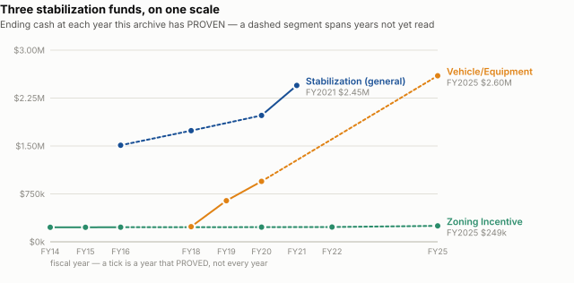
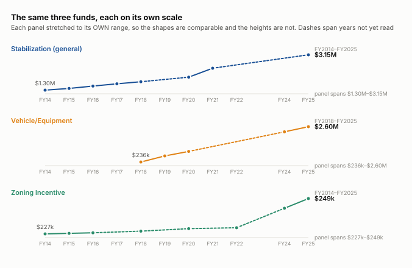
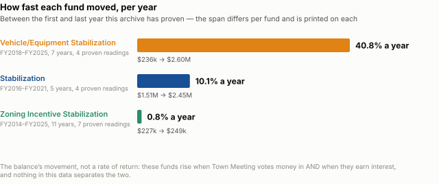

# The stabilization funds, and who may spend them

**What the town holds in reserve, which of it could lawfully be spent on an operating deficit, and the four questions about it this archive cannot yet answer.**

Analysis, September 2026. Balances are the town’s own general ledger at 31 March 2026, reconciled to the total the accounting system prints for them.

---

## The short version

**$9,061,421 held, across the 9 accounts the ledger groups as stabilization funds.** That is what the town has in reserve outside its operating budget — a balance, not an income, and two of the nine are a pension trust and a conservation fund rather than anything Town Meeting would call stabilization.

**$3,147,179 of it can be spent on anything lawful** — the general Stabilization Fund, by a two-thirds Town Meeting vote. The other $5,914,242 is restricted to the purpose each fund was created for, so it cannot be moved to a school deficit whatever Town Meeting thinks of the idea.

**$4,051,527 voted in since FY2012 — an average of $289,395 a year.** This is the money going IN, one Town Meeting article at a time, and it is the figure the cheaper question turns on. It is a FLOOR: 7 of the articles print no amount.

**$308,222 to $770,350 a year in FY2018–FY2023**, the 6 straight years that ran above that average. Reducing a deposit is RECURRING money where spending a balance is a one-off — and a recurring gap is only ever closed by recurring money.

**$1,066,000 has come back out**, in the articles that say so plainly — a floor again, because money also leaves inside articles about something else.

So: *can this pay for a school deficit?* **Yes for $3,147,179, no for the rest** — and a reserve spent on an operating cost buys one year, exactly as free cash does, which is the argument `free-cash.md` already makes.

---

## What has moved, so far as anything here can prove

These are the only stabilization figures in this archive that have been **checked**. Each is read off a photograph of the town’s own trust-fund table and then verified against identities the table states about every row — beginning plus activity equals ending cash, and, where the year prints a market value, ending cash plus unrealised equals ending market. A row that fails is not published.

Some years print no ending market value at all: FY2019’s table carries the heading and not one figure under it. Those rows are proven on the cash identity alone, their market column is left empty rather than filled with the cash figure, and the basis column of the published CSV says which proof each row rests on.

**The general Stabilization Fund**, the one Town Meeting may spend on anything lawful:

| | ending market value |
|---|---:|
| FY2016 | $1,551,001.18 |
| FY2018 | $1,732,690.98 |
| FY2020 | $2,041,061.72 |

That is **$490,060.54 more between FY2016 and FY2020**, a rise of 32%, in a fund whose purpose is to be available.

On one scale the Zoning Incentive fund looks like nothing is happening to it. That is the finding, not a rendering problem — but it hides the shape, so each fund also gets its own panel:

**Three funds, three different things happening.** The Vehicle/Equipment fund moved 40.8% a year and the Stabilization fund 10.1% a year — those are being BUILT, and the Town Meeting articles listed earlier on this page are the votes that did it. The Zoning Incentive fund is not: it moved $21,858.35 in 11 years, which is what a balance does when it is left alone.

*What the charts do not show.* A balance rising does not say how much of the rise is money voted in and how much is interest earned, and nothing in this data separates them. It also does not say a fund is AVAILABLE: what each may be spent on is the section above, and a balance is not a permission.

---

---

## What is in them, at 31 March 2026

Straight from the town’s general ledger: what each account held at the start of FY2026, what has gone into it since, and what has come out. The account numbers are the town’s own.

| account | fund | held | in, this year | out, this year | may be spent on |
|---|---|---:|---:|---:|---|
| `8124` | stabilization | $3,147,178.96 | $97,299.16 | — | **anything lawful**, by a 2/3 Town Meeting vote |
| `8136` | vehicle equipment | $2,598,621.38 | $55,142.16 | — | its own stated purpose only |
| `8137` | opeb | $1,649,190.51 | $280,563.14 | — | its own stated purpose only |
| `8125` | conservation trust | $967,726.65 | $45,850.68 | — | its own stated purpose only |
| `8129` | playground fund | $249,060.25 | $6,543.80 | — | its own stated purpose only |
| `8141` | opiod | $241,421.18 | $46,730.58 | — | its own stated purpose only |
| `8138` | sewer cap stab | $191,679.20 | $25,030.40 | — | its own stated purpose only |
| `8140` | Health Ins Stabil | $11,026.88 | $340.90 | — | its own stated purpose only |
| `8133` | Sewer stabilization | $5,516.23 | $5,238.81 | — | its own stated purpose only |
| | **Total** | **$9,061,421.24** | **$562,739.63** | **$0.00** | |

**Two of these are not stabilization funds in the sense Town Meeting means, and they are here because the LEDGER files them here.** `8137 opeb` is the other-post-employment-benefits trust and `8125 conservation trust` is a conservation fund; together they are $2,616,917.16 of the $9,061,421.24 above. Quoting the total as “the stabilization funds” would be taking the accounting system’s filing decision for a statement about what may be spent — so the grouping is printed as the ledger prints it, and said out loud here.

**The general/restricted split is ours**, read off each fund’s name and account. The ledger prints a balance and never says what may be spent on what.

**One thing about this document is not established: how it reached us.** It prints its own program (`glytdbud`), the date it was generated, and the Town Accountant’s name, which is strong evidence about what it IS — and no request, email or meeting packet is recorded for how we came to have it. That is written down rather than papered over, and it is the one reason to ask the Town for this report directly rather than to rely on this copy.

**Nothing has come out of any of them so far this year.** Every expenditure column is empty at 31 March 2026 — a fact about nine months, not about whether these funds get spent. They do: the Health Insurance fund is a third of a million dollars lighter than the article that created it.

---

## What goes in each year

Town Meeting has voted **$4,051,527 into the stabilization funds** across 39 articles, FY2012 to FY2025 — and **$1,066,000 back out**, in 2 articles.

In the 8 years where every article carries a printed amount, the town voted in between **$35,000 and $770,350 a year, median $393,387**. That is the figure the first question turns on: it is recurring money, it is decided one article at a time at Town Meeting, and it is the same order of magnitude as the gap the schools are projecting.

**Two funds take most of it.** Special Purpose Stabilization and Stabilization Fund (general) together account for $3,274,080 of the $4,051,527. They are where the first question bites — the rest is sewer housekeeping in amounts too small to close an operating gap.

| fund | voted in, total | years | most recent |
|---|---:|---:|---|
| Special Purpose Stabilization | $1,807,449 | 6 | FY2023, $250,000 |
| Stabilization Fund (general) | $1,466,631 | 10 | FY2023, $100,000 |
| Health Insurance Stabilization | $369,334 | 1 | FY2021, $369,334 |
| Sewer Capital Reserve Stabilization | $181,046 | 6 | FY2024, $35,000 |
| Sewer Reserve Capacity Stabilization | $93,462 | 7 | FY2025, $5,133 |
| Opioid Settlement Stabilization | $84,740 | 1 | FY2023, $84,740 |
| Inflow/Infiltration Stabilization | $48,864 | 4 | FY2025, $19,104 |

| year | voted in | articles |
|---|---:|---:|
| FY2012 | $277,432 — *understated* | 1 |
| FY2014 | $74,729 | 1 |
| FY2015 | $105,984 | 3 |
| FY2016 | $124,039 — *understated* | 3 |
| FY2018 | $521,677 | 5 |
| FY2019 | $308,222 | 3 |
| FY2020 | $770,350 | 5 |
| FY2021 | $734,210 | 4 |
| FY2022 | $597,094 — *understated* | 5 |
| FY2023 | $478,553 | 6 |
| FY2024 | $35,000 | 1 |
| FY2025 | $24,238 — *understated* | 2 |

**What has come back out — and this is a FLOOR, not a total.** These are the articles whose SUBJECT is a withdrawal. Money also leaves inside articles about something else: FY2023 article 14 is the sewer enterprise operating budget, and inside that one motion it transfers $35,000 out of the Sewer Capital Reserve fund and $20,962.40 out of the Sewer Reserve Capacity fund. Those are real withdrawals sitting inside an article this classification counts as being about the sewer budget, so the figure below is what can be attributed cleanly and no more.

- FY2023, article 4 — Transfer Special Purpose Stabilization funds for a new ambulance and two dump trucks, **$986,000**
- FY2023, article 5 — Transfer Opioid Settlement funds for the Police Department's Mental Health Co-Response program, **$80,000**

*How solid is this.* Of the 53 articles mentioning a stabilization fund, 39 are deposits, 2 are withdrawals, 7 print no amount (marked *understated* above), and 5 are sewer enterprise operating budgets that name a fund only in passing — those five total $3,706,189 and counting them as deposits would overstate the money going in by more than the deposits themselves.

## Each fund, year by year

Every figure below is a separate page of a separate annual report, read and checked on its own:

- **Zoning Incentive Stabilization** — FY2014 $227,201.90, FY2015 $227,542.95, FY2016 $227,884.96, FY2018 $228,891.82, FY2020 $230,431.40, FY2022 $231,007.68, FY2025 $249,060.25
- **Stabilization** — FY2016 $1,511,526.92, FY2018 $1,740,279.81, FY2020 $1,978,347.74, FY2021 $2,447,755.21
- **Vehicle/Equipment Stabilization** — FY2018 $236,302.39, FY2019 $643,788.80, FY2020 $945,669.29, FY2025 $2,598,621.38

Every proven row:

| year | account | fund | ending cash | ending market |
|---|---|---|---:|---:|
| FY2014 | `—` | ZONING INCENTIVE STABILIZATION (TL 8129 | $227,201.90 | $227,201.90 |
| FY2015 | `8129` | ZONING INCENTIVE STABILIZATION (TD BANKNORTH | $227,542.95 | $227,542.95 |
| FY2016 | `—` | STABILIZATION | $1,511,526.92 | $1,551,001.18 |
| FY2016 | `—` | ZONING INCENTIVE STABILIZATION (TD BI 8129 | $227,884.96 | $227,884.96 |
| FY2018 | `—` | STABILIZATION | $1,740,279.81 | $1,732,690.98 |
| FY2018 | `8136` | VEHICLE/EQUIPMENT STABILIZATION (MAIN STREET | $236,302.39 | — |
| FY2018 | `8129` | ZONING INCENTIVE STABILIZATION (TD BANKNORTH | $228,891.82 | — |
| FY2019 | `—` | VEHICLE/EQUIPMENT STABILIZATION (N 8136 | $643,788.80 | — |
| FY2020 | `—` | STABILIZATION | $1,978,347.74 | $2,041,061.72 |
| FY2020 | `8136` | VEHICLE/EQUIPMENT STABILIZATION (MAIN STREET | $945,669.29 | $945,669.29 |
| FY2020 | `8129` | ZONING INCENTIVE STABILIZATION (TD BANKNORTH | $230,431.40 | $230,431.40 |
| FY2021 | `—` | STABILIZATION | $2,447,755.21 | — |
| FY2022 | `8129` | ZONING INCENTIVE STABILIZATION (TD BANKNORTI | $231,007.68 | $231,007.68 |
| FY2025 | `—` | VEHICLE/EQUIPMENT STABILIZATION (MAIN STREET | $2,598,621.38 | $2,598,621.38 |
| FY2025 | `—` | ZONING INCENTIVE STABILIZATION (TD BANKNORTH | $249,060.25 | $249,060.25 |

**Coverage is 15 rows across 9 years, and that is the point rather than a footnote.** The rest of the run is not missing because nobody looked — it is missing because those pages have not yet yielded a row whose arithmetic closes, and publishing one that does not would be worse than publishing nothing.

---

---

## What each one is FOR, in the town’s own words

A special purpose fund is restricted to the purpose it was created for, and that purpose lives in the article that created it — not in the fund’s name. These are the creating votes this archive holds, each quoting **M.G.L. c.40 §5B**, the statute that lets a town keep a stabilization fund at all.

**This archive holds a creating vote for 5 of the 9 funds that appear in the Town Meeting record, and not for Sewer Capital Reserve Stabilization, Special Purpose Stabilization, Stabilization Fund (general), Vehicle/Equipment Stabilization.** The record here begins at FY2011 and those funds are older than it, so the article that created them — and the purpose that restricts them — is in a warrant nobody here has read. For a restricted fund that is the load-bearing document: without it, what the money may lawfully be spent on rests on the fund’s NAME, which is a reading and not a rule.

**Create and fund a Reserve Capacity Stabilization Fund from sewer retained earnings** — FY2015 annual Town Meeting, article 21, passed.

> VOTED UNANIMOUSLY, pursuant to General Laws Chapter 40, Section 5B, to create a Reserve Capacity Stabilization Fund and further to transfer from Sewer Enterprise Retained Earnings, the sum of $617.10 into the Reserve Capacity Stabilization Fund.

**Create an Inflow/Infiltration Stabilization Fund and fund it** — FY2016 annual Town Meeting, article 21, passed.

> VOTED UNANIMOUSLY to create an Inflow/Infiltration Stabilization Fund and further to transfer from Sewer Enterprise Retained Earnings the sum of $14,520 into the Inflow/ Infiltration Stabilization Fund.

**Create the Town Building Stabilization Fund** — FY2016 special Town Meeting, article 4, amended and passed.

> VOTED UNANIMOUSLY with M.G.L. reference changed to Chapter 40 § 5B.

**Create and fund a Health Insurance Stabilization Fund** — FY2021 annual Town Meeting, article 9, passed.

> VOTED UNANIMOUSLY to create a Health Insurance Stabilization Fund pursuant to General Laws Chapter 40 Section 5B and further, to vote to raise and appropriate the sum of $369,334. to deposit into the Health Insurance Stabilization Fund.

**Create the Opioid Settlement Stabilization Fund and deposit settlement proceeds** — FY2023 annual Town Meeting, article 13, passed.

> VOTED (80 YES, 11 NO), pursuant to the provisions of G.L. c.40, Section 5B, to create a new special purpose stabilization fund, to be known as the Opioid Settlement Stabilization Fund, for dedication, without further appropriation, of 100% of opioid litigation settlement

**The three largest funds are not here, and that is the gap rather than an oversight.** The general Stabilization Fund, Vehicle/Equipment and Zoning Incentive were all created before FY2011, which is as far back as the town-meeting record in this archive reaches. Their purposes are known only from their names, and a name is not an article.

---

## Each fund, meeting by meeting

Every Town Meeting article this archive holds that touches a stabilization fund — what was asked, what was voted, and what the Finance Committee recommended. The record reaches back to FY2011 and no further, which is why three funds have no creation here.

**Which fund an article belongs to is OUR reading.** The votes name funds in prose and carry no account number, so an article saying only “the Stabilization Fund” is taken as the general one — which is what the town means by it, and is still a reading.

### Stabilization Fund (general)

17 articles, FY2011 to FY2025.

| year | meeting | art. | what was asked | amount | FinCom | result |
|---|---|---|---|---|---|---|
| FY2011 | annual | 18 | Appropriate to or from the Stabilization Fund | — | — | passed over |
| FY2011 | special | 2 | Appropriate to or from the Stabilization Fund | — | — | passed over |
| FY2012 | annual | 10 | Appropriate to Stabilization Fund contingent on Article 9's override passing | $277,432 | — | passed over |
| FY2012 | special | 2 | Appropriate to/from the Stabilization Fund | — | — | passed over |
| FY2014 | annual | 17 | Appropriate funds to the Stabilization Fund | $74,729 | Approval | passed |
| FY2015 | special | 14 | Appropriate funds to the Stabilization Fund | $7,136.00 | Approval | passed |
| FY2015 | annual | 16 | Appropriate funds to the Stabilization Fund | $98,231 | Approval | passed |
| FY2016 | annual | 17 | Appropriate to the Stabilization Fund | $99,851.00 | Approval | passed |
| FY2017 | special | 1 | Amend the Town's FY2018 budget by transferring sums among various line items | $199,972. | Approval | amended and passed |
| FY2018 | annual | 8 | Appropriate/transfer a sum into the Stabilization Fund | $87,000 | Approval | passed |
| FY2019 | annual | 9 | Transfer funds to the Stabilization Fund | $100,000 | Approval | passed |
| FY2020 | special | 5 | Transfer funds to the Stabilization Fund | $212,252.00 | Approval | passed |
| FY2020 | annual | 8 | Transfer funds to the Stabilization Fund | $210,000 | Approval | passed |
| FY2021 | annual | 7 | Transfer to Stabilization Fund | $100,000 | Recommend Approval | passed |
| FY2022 | annual | 9 | Transfer funds to the Stabilization Fund | $100,000 | Approval | passed |
| FY2023 | annual | 10 | Transfer funds to the Stabilization Fund | $100,000 | Approval | passed |
| FY2025 | annual | 16 | Appropriation to the Stabilization Fund | — | — | passed over |

### Sewer Reserve Capacity Stabilization

9 articles, FY2015 to FY2025.

| year | meeting | art. | what was asked | amount | FinCom | result |
|---|---|---|---|---|---|---|
| FY2015 | annual | 21 | Create and fund a Reserve Capacity Stabilization Fund from sewer retained ea | $617.10 | Approval | passed |
| FY2016 | annual | 22 | Transfer funds into the Reserve Capacity Stabilization Fund | $9,667.90 | — | passed |
| FY2018 | special | 5 | Transfer Sewer Enterprise retained earnings into the Reserve Capacity Stabil | $6,449.63 | No direct financial impact | passed |
| FY2019 | special | 3 | Amend the Sewer Enterprise Fund FY2020 appropriation | $9,993. | Approval | passed |
| FY2020 | special | 11 | Transfer funds into Sewer Reserve Capacity Stabilization Fund | $68,097.59 | Approval | passed |
| FY2022 | annual | 12 | Fund the Sewer Enterprise Fund for FY2023 | $1,213,182.00 | Approval | passed |
| FY2022 | special | 6 | Transfer funds to the Sewer Reserve Capacity Stabilization Fund | $1,645.60 | Approval | passed |
| FY2023 | special | 7 | Transfer sewer funds into the Sewer Reserve Capacity Stabilization Fund | $1,851.30 | Approval | passed |
| FY2025 | annual | 24 | Transfer funds into the Sewer Reserve Capacity Stabilization Fund | $5,133.15 | Approval | passed |

### Special Purpose Stabilization

9 articles, FY2018 to FY2025.

| year | meeting | art. | what was asked | amount | FinCom | result |
|---|---|---|---|---|---|---|
| FY2018 | special | 2 | Appropriate a sum to the Special Purpose Stabilization Fund | $199,227 | Approval | passed |
| FY2019 | special | 2 | Appropriate funds to the Special Purpose Stabilization Fund | $08,222. | Approval | passed |
| FY2020 | special | 6 | Transfer funds to the Special Purpose Stabilization Fund | $250,000.00 | Approval | passed |
| FY2021 | annual | 8 | Transfer to Special Purpose Stabilization Fund | $250,000 | Recommend Approval | passed |
| FY2022 | annual | 10 | Transfer funds to the Special Purpose Stabilization Fund | $450,000 | Approval | passed |
| FY2022 | special | 5 | Transfer funds to the Special Purpose Stabilization Fund | — | deferred | passed over |
| FY2023 | annual | 11 | Transfer funds to the Special Purpose Stabilization Fund | $250,000 | Approval | passed |
| FY2023 | special | 4 | Transfer Special Purpose Stabilization funds for a new ambulance and two dum | $986,000 | Disapproval | failed |
| FY2025 | annual | 17 | Appropriation to the Special Purpose Stabilization Fund | — | — | passed over |

### Sewer Capital Reserve Stabilization

8 articles, FY2018 to FY2024.

| year | meeting | art. | what was asked | amount | FinCom | result |
|---|---|---|---|---|---|---|
| FY2018 | annual | 12 | Transfer a sum into the Sewer Capital Reserve Stabilization Fund | $29,000 | Approval | passed |
| FY2020 | annual | 10 | Operate the Sewer Enterprise Fund for FY2021 | $943,191.54 | Approval | passed |
| FY2020 | annual | 11 | Transfer $30,000 into the Sewer Capital Reserve Stabilization Fund | $30,000 | Approval | passed |
| FY2021 | special | 5 | Transfer funds into the Sewer Capital Reserve Stabilization Fund | $14,875.50 | Recommend Approval | passed |
| FY2022 | annual | 13 | Transfer funds to the Sewer Capital Reserve Stabilization Fund | $35,548.86 | Approval | passed |
| FY2023 | annual | 14 | Appropriate funds to operate the Sewer Enterprise Fund for FY2024 | $1,339,850.95 | Approval | passed |
| FY2023 | annual | 15 | Transfer funds into the Sewer Capital Reserve Stabilization Fund | $36,621.37 | Approval | passed |
| FY2024 | annual | 16 | Transfer to the Sewer Capital Reserve Stabilization Fund | $35,000 | Approval | passed |

### Inflow/Infiltration Stabilization

4 articles, FY2016 to FY2025.

| year | meeting | art. | what was asked | amount | FinCom | result |
|---|---|---|---|---|---|---|
| FY2016 | annual | 21 | Create an Inflow/Infiltration Stabilization Fund and fund it | $14,520 | — | passed |
| FY2022 | special | 7 | Transfer funds to the Sewer Inflow/Infiltration Stabilization Fund | $9,900.00 | Approval | passed |
| FY2023 | special | 8 | Transfer sewer funds into the Sewer Inflow/Infiltration Stabilization Fund | $5,340.00 | Approval | passed |
| FY2025 | annual | 23 | Transfer funds into the Sewer Inflow/Infiltration Stabilization Fund | $19,104.40 | Approval | passed |

### Vehicle/Equipment Stabilization

2 articles, FY2018 to FY2019.

| year | meeting | art. | what was asked | amount | FinCom | result |
|---|---|---|---|---|---|---|
| FY2018 | annual | 9 | Appropriate/transfer a sum into the Special Purpose Stabilization Fund | $200,000 | Approval | passed |
| FY2019 | annual | 10 | Transfer funds to the Special Purpose Stabilization Fund for future capital  | $200,000 | Approval | passed |

### Opioid Settlement Stabilization

2 articles, FY2023 to FY2023.

| year | meeting | art. | what was asked | amount | FinCom | result |
|---|---|---|---|---|---|---|
| FY2023 | annual | 13 | Create the Opioid Settlement Stabilization Fund and deposit settlement proce | $84,740.25 | Approval | passed |
| FY2023 | special | 5 | Transfer Opioid Settlement funds for the Police Department's Mental Health C | $80,000 | Approval | passed |

### Town Building Stabilization

1 article, FY2016 to FY2016.

| year | meeting | art. | what was asked | amount | FinCom | result |
|---|---|---|---|---|---|---|
| FY2016 | special | 4 | Create the Town Building Stabilization Fund | — | Approval | amended and passed |

### Health Insurance Stabilization

1 article, FY2021 to FY2021.

| year | meeting | art. | what was asked | amount | FinCom | result |
|---|---|---|---|---|---|---|
| FY2021 | annual | 9 | Create and fund a Health Insurance Stabilization Fund | $369,334 | Recommend Approval | passed |

---

## What this cannot answer yet, and why

Four of the six questions this report was asked are about MOVEMENT, and the series does not exist in a form anything may aggregate:

| question | blocked on |
|---|---|
| How has each balance moved? | the series |
| How are they spent? | the disbursement columns, and the articles authorising each transfer out |
| When are they spent? | the same series, read as a pattern |
| If the town put less in each year, could that go to the gap? | the transfer-IN series, and separating OPEB from it |

`report_trust_funds` holds 642 rows for FY2011–FY2025. **Twelve are reconciled to a total the document itself prints.** The balances above are `no check`: extracted, never tied to the page’s own total. Every page was surveyed before anyone tried — ten of seventeen years need real PDF geometry rather than text, because of mirrored layouts, rows offset from their own names, and column counts that change between years.

That is registered as a gap rather than left here: see the `extraction` rows in `sources/data/money-gaps.csv`, published at `/what-we-cannot-answer`. The work to close it is `notes/plans/STABILIZATION-FUNDS.md`.

---

## What this does not show

- **That the balances are right.** They are unreconciled. A figure here is a place to look in the annual report, not a figure to quote at a meeting.

- **That the restricted funds are unavailable for ever.** Town Meeting created each one and can, in principle, act on them again. What it cannot do is spend a special purpose fund on something else while it stands.

- **That spending a reserve solves anything.** It is one-time money against a recurring cost — the same shape as the September Town Meeting appropriation that left $392,264 of salary in the following year with nothing behind it.

- **Why any balance is the size it is.** A balance is a fact; a reason is a hypothesis.

---

## Sources

| | |
|---|---|
| Balances | `report_trust_funds`, from the annual town reports — status `no check` |
| The general/restricted split | ours, from each fund’s name |
| What the archive cannot yet say | `sources/data/money-gaps.csv`, side `extraction` |
