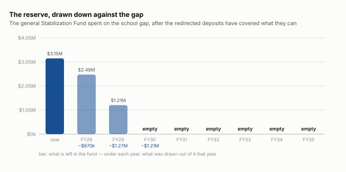

# The stabilization option

**What the stabilization funds could actually do about the school budget gap, and for how long.**

Analysis, September 2026. The companion to [the stabilization funds](stabilization-funds.md), which describes what the town holds; this one is only about what can be done with it.

---

## The short version

**$3,147,179 is the only balance Town Meeting may spend on anything lawful.** The other $5,914,242 is restricted to the purpose each fund was created for. A school deficit is not that purpose for any of them.

**Spending all of it closes FY28 and FY29, and runs out partway through FY30.** That is 2.3 years, after which the money is gone and the gap is $2,197,945 — larger than the one it started on.

**Stopping the deposits instead raises about $260,244 a year**, which is recurring money against a recurring gap — the right SHAPE of answer. It covers 28% of the FY28 gap and 12% of FY30’s.

So: **neither closes the gap, and they fail differently.** One buys two years and then nothing. The other is permanent and is a quarter of what is needed.

---

## Both options, against the gap

*Both levers pulled at once, which is the most favourable case there is. The deposits are redirected every year and the reserve is spent on whatever they do not cover. It covers FY28 and FY29 outright; by FY35 the gap is $6,751,941 and everything the town has done here covers $260,244 of it.*

*The same scenario, from the fund’s side. It does not taper — it stops. $670,029 is drawn in FY28 and $1,270,230 in FY29, and from FY30 there is nothing left to draw and the deposits are doing it alone.*

---

## 1. Can the town stop putting money in?

Town Meeting voted **$4,051,527** into these funds between FY2012 and FY2025, an average of **$289,395 a year**.

**But not all of it is the town’s to redirect.** $408,113 of it went to the sewer funds and the Opioid Settlement fund — sewer deposits are Sewer Enterprise retained earnings, which is ratepayers’ money and stays in the sewer system, and the opioid money is a legal settlement dedicated by the article that created it. Neither could be sent to a school deficit whatever Town Meeting wanted.

| | per year | share of the FY28 gap |
|---|---:|---:|
| Everything voted in | $289,395 | 31% |
| The part that could be redirected | **$260,244** | **28%** |

**This is the option with the right shape and the wrong size.** A deficit that returns every year is only ever closed by money that arrives every year, and this is that — it just is not enough of it. What it costs is whatever the funds were being built for: equipment the town would then borrow for, and a reserve that is part of how it is rated when it borrows.

---

## 2. Can the town spend what is already there?

**$3,147,179 of it, yes.** That is the general Stabilization Fund, which a two-thirds Town Meeting vote may appropriate for any lawful purpose. Here is what happens if it is spent against the gap until it is gone:

| year | the gap | covered from the fund | still short | fund left |
|---|---:|---:|---:|---:|
| FY28 | $930,273 | $930,273 | — | $2,216,906 |
| FY29 | $1,530,474 | $1,530,474 | — | $686,432 |
| FY30 | $2,197,945 | $686,432 | $1,511,513 | $0 |

**It buys two years.** In FY30 the fund is empty, the gap is $2,197,945, and every structural choice the town had in FY28 is still in front of it — with $3,147,179 less in reserve and nothing to show a bond rating agency.

*And this is the generous version.* It assumes Town Meeting votes the whole balance to the schools, in one go, with no reserve kept for a roof, a fire engine or a snow season — which is what the fund is for.

---

## 3. Then what?

That is the question the first two exist to set up, and the honest answer is that neither is a solution; they are timing.

- **Spending the balance is a one-off.** It moves the problem two years and makes it worse, because the gap grows while the reserve does not come back.

- **Stopping the deposits is permanent** and covers about a quarter of the first year’s gap, falling as the gap grows.

- **Together** they cover FY28 and most of FY29 and still run out.

A reserve spent on an operating cost buys one year of that cost. That is the same arithmetic [free cash](free-cash.md) makes, for the same reason: both are money the town has ONCE, set against a cost it has EVERY year.

---

## What this does not show

- **Whether Town Meeting would vote for any of it.** This is arithmetic about what the money could do, not a prediction about what anybody will do.

- **What the funds were being built for.** Diverting the deposits has a cost that does not appear in this table: the equipment, buildings and reserves they were accumulating toward.

- **What a rating agency would make of it.** A town that spends its stabilization fund borrows on different terms afterwards, and nothing here measures that.

- **Interest.** These balances earn about 3.5% a year, which is real money and is not modelled above; it would extend the burndown by months rather than years.

---

## Where the figures come from

- The gap, year by year: `model/finance.py`, the same projection the rest of the site uses.

- The balances: the town’s general ledger at 31 March 2026, reconciled to the total the accounting system prints for them.

- The deposits: every Town Meeting article that put money into one of these funds, FY2012 to FY2025. 7 of those articles print no amount, so the totals are a floor.

- The restricted/divertible split is OURS, read off which fund each deposit went to and where that fund’s money comes from.

