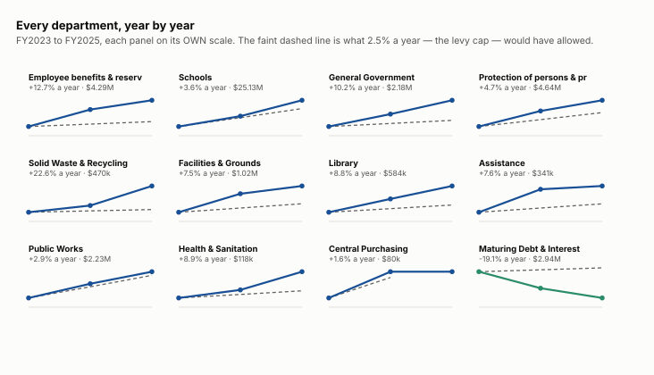
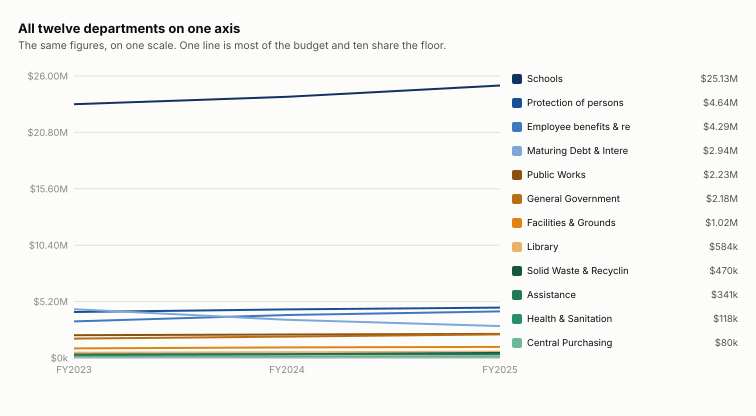
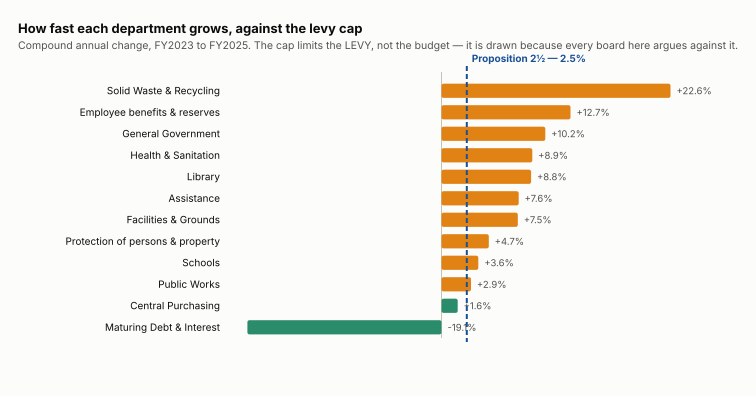
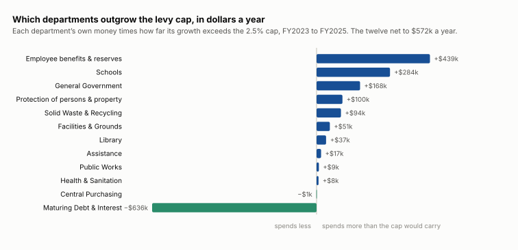
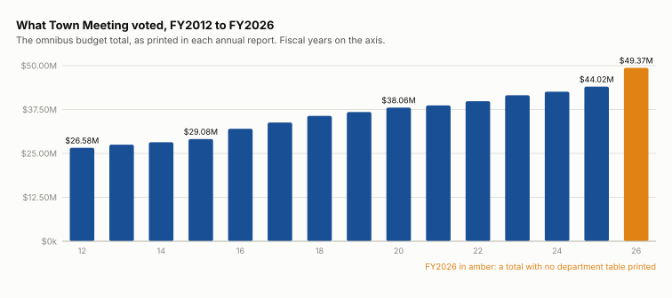

# Budgets across town
What Town Meeting voted for every department, and which departments move the total.

## Who gets the money

| department | FY2025 | share of the budget |
|---|---:|---:|
| [Schools](/analysis/town-budget-schools) | $25,127,554 | 57.1% |
| [Protection of persons & property](/analysis/town-budget-protection) | $4,643,717 | 10.5% |
| [Employee benefits & reserves](/analysis/town-budget-unclassified) | $4,293,123 | 9.8% |
| [Maturing Debt & Interest](/analysis/town-budget-maturing-debt) | $2,941,322 | 6.7% |
| [Public Works](/analysis/town-budget-public-works) | $2,225,277 | 5.1% |
| [General Government](/analysis/town-budget-general-government) | $2,177,964 | 4.9% |
| [Facilities & Grounds](/analysis/town-budget-facilities-grounds) | $1,022,711 | 2.3% |
| [Library](/analysis/town-budget-library) | $583,890 | 1.3% |
| [Solid Waste & Recycling](/analysis/town-budget-solid-waste) | $469,775 | 1.1% |
| [Assistance](/analysis/town-budget-assistance) | $340,898 | 0.8% |
| [Health & Sanitation](/analysis/town-budget-health-sanitation) | $117,819 | 0.3% |
| [Central Purchasing](/analysis/town-budget-central-purchasing) | $80,300 | 0.2% |
| **all twelve** | **$44,024,349** | **100%** |

Schools is the largest department and Central Purchasing the smallest — 313 times the size, in the same budget.

## How each department is growing

## Which departments outgrow the levy cap

## Every department, every measure

| department | FY2023 | FY2024 | FY2025 | a year | share | above the cap |
|---|---:|---:|---:|---:|---:|---:|
| Employee benefits & reserves | $3,378,711 | $3,968,170 | $4,293,123 | 12.7% | 9.8% | +$438,870/yr |
| Schools | $23,397,371 | $24,082,518 | $25,127,554 | 3.6% | 57.1% | +$284,306/yr |
| General Government | $1,792,492 | $1,974,322 | $2,177,964 | 10.2% | 4.9% | +$168,340/yr |
| Protection of persons & property | $4,239,355 | $4,478,848 | $4,643,717 | 4.7% | 10.5% | +$100,330/yr |
| Solid Waste & Recycling | $312,634 | $352,775 | $469,775 | 22.6% | 1.1% | +$94,340/yr |
| Facilities & Grounds | $884,566 | $981,645 | $1,022,711 | 7.5% | 2.3% | +$51,396/yr |
| Library | $492,984 | $539,126 | $583,890 | 8.8% | 1.3% | +$36,961/yr |
| Assistance | $294,404 | $335,082 | $340,898 | 7.6% | 0.8% | +$17,409/yr |
| Public Works | $2,101,445 | $2,168,288 | $2,225,277 | 2.9% | 5.1% | +$8,994/yr |
| Health & Sanitation | $99,260 | $104,961 | $117,819 | 8.9% | 0.3% | +$7,597/yr |
| Central Purchasing | $77,800 | $80,300 | $80,300 | 1.6% | 0.2% | −$728/yr |
| Maturing Debt & Interest | $4,497,723 | $3,518,013 | $2,941,322 | -19.1% | 6.7% | −$636,277/yr |

**above the cap** is the department’s own money times how far its growth exceeds the 2.5% the levy may rise by — dollars a year, and the ranking this page uses, because neither size nor rate means anything alone. The twelve net to $571,540 a year.

## The voted total, FY2012 to FY2026

| fiscal year | voted | change |
|---|---:|---:|
| FY2012 | $26,582,152 | — |
| FY2013 | $27,489,441 | +3.4% |
| FY2014 | $28,177,263 | +2.5% |
| FY2015 | $29,079,384 | +3.2% |
| FY2016 | $32,025,895 | +10.1% |
| FY2017 | $33,802,328 | +5.5% |
| FY2018 | $35,690,394 | +5.6% |
| FY2019 | $36,804,409 | +3.1% |
| FY2020 | $38,058,164 | +3.4% |
| FY2021 | $38,658,115 | +1.6% |
| FY2022 | $39,864,899 | +3.1% |
| FY2023 | $41,568,745 | +4.3% |
| FY2024 | $42,584,049 | +2.4% |
| FY2025 | $44,024,349 | +3.4% |
| FY2026 | $49,374,465 | +12.2% |

## Does it add up

The twelve group totals against the grand total the same page prints.

| fiscal year | twelve groups | printed total | difference |
|---|---:|---:|---:|
| FY2023 | $41,568,745 | $41,568,745 | -0.30 |
| FY2024 | $42,584,049 | $42,584,049 | nil |
| FY2025 | $44,024,349 | $44,024,349 | nil |

FY2023 is thirty cents short and the thirty cents are the town’s: it prints `Total Health & Sanitation` at $99,259.60 over five lines that come to $99,259.90, and foots its grand total on the correct figure rather than on the subtotal it printed.

## What this cannot show

- What any department ASKED for. The omnibus is what Town Meeting voted, which is already balanced — the difference between a request and a vote is where a cut lives, and the annual report prints only the second.
- What was actually spent. Voted and spent are different quantities and rule 1 forbids mixing them in one calculation.
- Whether any department reduced SERVICE. A department can hold its dollars and cut its hours, and a dollar figure will not say so.
- Why any line moved. The omnibus states an amount and gives no reason for it, so every explanation of a movement here would be a hypothesis.
- Anything about FY2026 below the total. The FY2025 annual report prints no department figures at all.
- That growing faster than the levy cap is a problem. Proposition 2½ limits the LEVY, not the budget: the budget is the levy plus state aid, local receipts and transfers, and new growth raises the levy limit on top of the 2.5%. The cap is used here as a common reference point every board in town already uses — it is not a ceiling anybody breached.

## Where it comes from

- **The FY2023, FY2024 and FY2025 omnibus budgets, department by department** — The annual town reports for FY2022, FY2023 and FY2024 — each prints the omnibus for the year AHEAD, as voted at that spring’s Town Meeting. Every one of these reconciles against every total the table prints about itself. FY2023 and FY2024 land on the town’s own +$0.80, recorded as an attested reading rather than a defect in ours.
- **The voted total for every year from FY2012 to FY2025** — The GRAND TOTAL each annual report prints at the foot of its omnibus. A single printed figure per year. The department detail beneath it is only reconciled for the last three.
- **The FY2026 total** — Article 10 of the 3 May 2025 Annual Town Meeting, printed as prose on page 140 of the FY2025 annual report. No department table is printed for FY2026 in any form. The five funding sources the article names sum to the total exactly, which is the only check available on it, and it passes.
