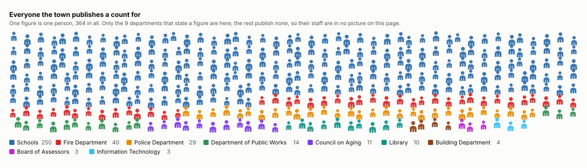
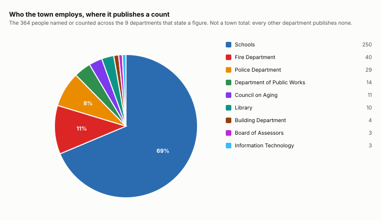
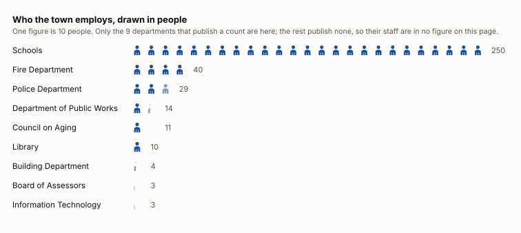
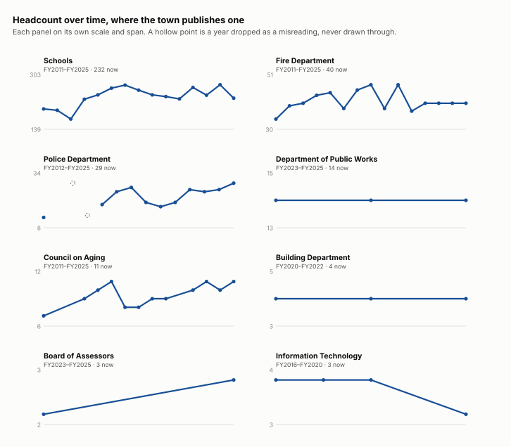

# Who works for the town

How many people each part of the town employs, which are growing and which have shed staff. The seats people volunteer for are [board composition](/analysis/board-composition).

## How many people each part of the town employs

| part of the town | people | as of | first published | change | a year | what it counts |
|---|---:|---|---:|---:|---:|---|
| Schools | 232 | FY2025 | 200 in FY2011 | +32 | +2.3 | every member of staff, named |
| Veterans' Services | 47 | FY2019 | 47 in FY2019 | +0 | — | career staff plus the low end of the on-call range |
| Fire Department | 40 | FY2025 | 36 in FY2011 | +4 | +0.3 | career staff plus the low end of the on-call range |
| Police Department | 29 | FY2025 | 13 in FY2012 | +16 | +1.2 | every member of staff, named on its roster |
| Department of Public Works | 14 | FY2025 | 14 in FY2023 | +0 | +0.0 | an establishment, post by post |
| Council on Aging | 11 | FY2025 | 7 in FY2011 | +4 | +0.3 | a named staff list |
| Library | 10 | FY2019 | 10 in FY2019 | +0 | — | a stated headcount |
| Building Department | 4 | FY2022 | 4 in FY2020 | +0 | +0.0 | a named staff list |
| Board of Assessors | 3 | FY2025 | 2 in FY2023 | +1 | +0.5 | an establishment, one post at a time |
| Information Technology | 3 | FY2020 | 4 in FY2016 | −1 | −0.2 | a named roster, one biography per person |

Department of Public Works and Board of Assessors report an ESTABLISHMENT rather than a headcount — the posts the department states it has, not the people standing in them. A post can sit vacant and still be printed here, and the Assessing office says so itself: in FY2024 it reported being “fully staffed for the first time in over a year”.

These are not identical measures — a named roster, a career count plus the low end of an on-call range, and an establishment of posts — and they are answers to two different questions: how many people are there, and how many posts the department says it has. Where a department states a range the LOW end is used, so none is flattered by its own vagueness.

**change** is measured over each department’s own record, and those records do not line up: the Schools record spans 14 years and the Board of Assessors’s 2, so +32 and +1 are not the same claim. No year is published by all 10 — the fullest is FY2019, with 6 of them — and standardising on that would drop the four that STOPPED publishing, which is the part worth seeing. **a year** is the change divided by the years it spans, and that column compares.

A year whose count reads under half the year before it is dropped as a short read rather than published as a cut: Police Department FY2014. The Police roster comes back as seven officers in FY2024 against twenty-five in FY2023, which is a page this reader did not find, not three quarters of a police force.

## Headcount over time

On one scale the relation is plain, and it is the one the panels below deliberately hide: every other department that publishes a headcount fits inside the schools several times over. The panels answer how each one is MOVING; this answers how big each one is.

Schools moves between 170 and 272 across 15 published years; Fire Department moves between 36 and 48 across 15 published years; Police Department moves between 13 and 33 across 13 published years. Veterans' Services, Library and Board of Assessors publish too few years to show a trend at all.

## The schools, in detail

Five times the next employer, so worth breaking out. FY2025.

| school | staff |
|---|---:|
| Primary | 73 |
| High | 62 |
| Turkey Hill | 60 |
| Middle | 49 |

The school columns come to 244 and the district employs 232. That is not an error to tidy away: somebody who teaches at two schools is staff at both and one employee of the district, so the two answer different questions and are counted differently.

| what they do | staff |
|---|---:|
| Classroom Teacher | 72 |
| Paraprofessional | 51 |
| (unmapped) | 41 |
| Custodial / Facilities | 11 |
| Specialist Teacher | 10 |
| Food Service | 8 |
| Speech / OT / PT | 6 |
| Administrative Staff | 5 |
| Guidance / Adjustment Counselor | 5 |
| Assistant Principal | 5 |
| Nurse | 4 |
| Special Education Teacher | 4 |

## Which parts of the budget have a headcount behind them

Town Meeting votes the budget in 12 groups. 6 of them now have at least one department publishing how many people it employs; 6 have none.

| part of the budget | who publishes a count |
|---|---|
| Maturing Debt & Interest | — |
| Employee benefits & reserves | — |
| General Government | Board of Assessors, Information Technology |
| Central Purchasing | — |
| Protection of persons & property | Fire Department, Police Department, Building Department |
| Health & Sanitation | — |
| Public Works | Department of Public Works |
| Facilities & Grounds | — |
| Solid Waste & Recycling | — |
| Assistance | Council on Aging |
| Schools | Schools |
| Library | Library |

A group with a count is not a group that is counted: `General Government` is voted as one figure covering half a dozen offices, and two of them state a number.

### The ones with no count, and why

Three different answers, and only one of them is a department being quiet.

| part of the budget | voted, FY2025 | what it is | what the reports show |
|---|---:|---|---|
| Maturing Debt & Interest | $2,941,322 | a category of spending | Principal and interest on loans. Nobody works here; see the debt schedule. |
| Employee benefits & reserves | $4,293,123 | a category of spending | Liability, workers compensation, group health and life insurance, Medicare, and the reserve funds. It pays for people who are counted under the department they work in, and employs nobody itself. |
| Central Purchasing | $80,300 | a category of spending | Not a department and there is no report for it. Its lines are Equipment Maintenance, Postage and Purchase of Service — what town hall buys, gathered under one heading. |
| Health & Sanitation | $117,819 | bought as a service | The town’s health agent is the Nashoba Associated Boards of Health, a shared regional service that writes its own pages inside Lunenburg’s annual report (pages 72–75 in FY2024). `Nashoba Board of Health` and `Nashoba Nursing` are budget lines. The only salaried post in the group is `Animal Inspector Salary`, at $1,000. |
| Facilities & Grounds | $1,022,711 | a department with a budget and no paper trail | Created by a RECORDED VOTE — Article 7 of the 2022 Annual Town Meeting, the `Administrative Organization Plan` of 5 April 2022, Yes-136 No-28 — which moved town facilities out from under the DPW Director, where the Town Manager had delegated them, and gave them a Facilities Director of their own. Since then it has filed NO annual report: it is on no contents page in FY2023, FY2024 or FY2025. There is no `Facilities Director` post in the appointed-officials listing in any year, and the person doing the job appears in that listing once, as a committee member under a different title. Before FY2023 its people are inside the DPW’s establishment, which still reads `one Executive Assistant (shared with Facilities)`. |
| Solid Waste & Recycling | $469,775 | bought as a service | Collection is contracted out. The town ran ten years with Casella and moved to E.L. Harvey on 1 July 2021. The group is one line, `Recycling Program`. |

The gross-wages list named a department beside each employee through FY2016 and stopped, so there has been no town-wide headcount by department since.

## How long people stay, and how many leave

A person’s tenure here is the number of years their name appears under a department **in the years that department published anything** — not calendar years, because 27 of 86 bodies skip at least one year inside their own span and a naive count reads a missed report as the whole staff leaving and coming back.

| department | people | years published | median | median, uncensored | longest | still there | names not reappearing |
|---|---:|---:|---:|---:|---:|---:|---:|
| Lunenburg Public Schools | 968 | 15 | 2.0 | 1 | 15 — Alexis Pukaite | 233 | 33% a year |
| Fire Department | 122 | 16 | 4.0 | 2 | 16 — Austin Flagg | 44 | 25% a year |
| Police Department | 90 | 15 | 2.0 | 1 | 15 — Jeffrey Thibodeau | 27 | 29% a year |
| Council on Aging (staff) | 26 | 13 | 4.0 | 2 | 13 — Susan Doherty | 11 | 20% a year |
| Department of Public Works | 22 | 11 | 1.0 | 2 | 10 — Richard Patry | 13 | 24% a year |
| Building Department | 20 | 11 | 2.5 | 2.5 | 10 — Gary Williams | 7 | 25% a year |
| Town Manager | 17 | 11 | 1 | 5 | 9 — Heather R. Lemieux | 4 | 23% a year |
| Montachusett Regional Vocational Technical School | 8 | 10 | 1.0 | 1.0 | 7 — Thomas R. Browne | 1 | 53% a year |
| Information Technology | 6 | 5 | 3.0 | 1 | 4 — Daniel Nadareski | 1 | 33% a year |
| Town Clerk | 6 | 11 | 2.0 | 2.0 | 11 — Kathyrn M. Herrick | 2 | 16% a year |
| Facilities, Grounds & Recreation | 5 | 3 | 1 | — | 2 — Angela Clement | 4 | 50% a year |

**Half of these people are CENSORED and their tenure is a lower bound, not a length.** 579 of 1290 are present in their department’s first published year — so they started before the archive begins and nothing here can say when — or in its last, so they are still there as far as anything here can see. That is why two medians are given: the first counts everybody, the second only the people whose arrival AND departure both fall inside the record, which is the only one that means what it says.

**A name leaving a roster is a name leaving a roster.** It is not a resignation, a retirement or a cut post. Somebody may have moved between departments, been left off a page, or held a post the town stopped printing. The last column is the rate at which names stop appearing, and it is not a separation rate.

A roster is also a point in time and undated within its year, so N appearances is at most N years of service and at least N−1.

## What this cannot show

- What anybody is paid. No salary is read here, and none is inferred from a post’s name.
- How many people the town employs. Ten departments state a figure, in eight different forms, and no year has all of them — the wage list that would give one town-wide headcount stopped naming departments after FY2016.
- FTE. A career post and an on-call post are not the same job and cannot be netted against each other.
- Whether a post was CUT. A roster is people IN post and a cut removes a POST, and those come apart both ways: someone retires and the post sits vacant but funded, so the count falls and nothing was cut; or a post is eliminated and its holder moves to another vacancy, so the count holds and something was. The town’s own words for it are in the Assessing office’s FY2024 report — “we are fully staffed for the first time in over a year” — a year of posts that existed and were empty. A rise or a fall here is a change in PEOPLE PRESENT, never a decision about establishment.
- When in the year anybody was counted. A roster is a point in time and is undated within its year, so a September departure and a June one are the same figure.
- A town total. The departments that describe their staffing do it in whichever form that year’s department head chose — a count, a range, an establishment post by post, a list of names — and those are different quantities.

## Where it comes from

- **Every appointed post and its holder, FY2016 to FY2025** — the APPOINTED OFFICIALS listing in each annual town report. Read by scripts/extract_personnel.py. A post that states no membership and no term is an officer rather than a board seat — the town’s own distinction, not ours.
- **What each department says it employs** — the prose of each department’s own report; no heading names it in any year. Read by scripts/extract_department_staffing.py. Stored as printed, because the forms do not agree with each other and may not be summed. Eight forms so far, and the department head chooses: a list of names, an establishment post by post, the same establishment written one article at a time, a career count beside an on-call range, a number spelled out in words, and — the Library’s only one — a headcount in an aside inside a sentence about turnover.
- **The Police and Fire rosters, by name** — the Police `Department Personnel` and Fire `Roster of the Lunenburg Fire Department` pages, both set in two columns. Read by scripts/extract_department_rosters.py, from the WORD geometry because a line box spans both columns.
