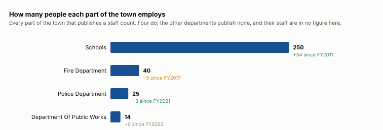

# Who works for the town

How many people each part of the town employs, which are growing and which have shed staff. The seats people volunteer for are [board composition](/analysis/board-composition).

## How many people each part of the town employs

| part of the town | people | as of | first published | change | what it counts |
|---|---:|---|---:|---:|---|
| Schools | 250 | FY2025 | 216 in FY2011 | +34 | every member of staff, named |
| Fire Department | 40 | FY2025 | 45 in FY2017 | −5 | career staff plus the low end of the on-call range |
| Police Department | 25 | FY2023 | 22 in FY2021 | +3 | officers named on the roster |
| Department Of Public Works | 14 | FY2024 | 14 in FY2023 | +0 | posts in the establishment it states |

These are not identical measures — a named roster, a career count plus the low end of an on-call range, and an establishment of posts — and they are all answers to how many people work here. Where a department states a range the LOW end is used, so none is flattered by its own vagueness.

A year whose count reads under half the year before it is dropped as a short read rather than published as a cut: Police Department FY2024. The Police roster comes back as seven officers in FY2024 against twenty-five in FY2023, which is a page this reader did not find, not three quarters of a police force.

## The schools, in detail

Six times the next employer, so worth breaking out. FY2025.

| school | staff |
|---|---:|
| Primary | 73 |
| High | 64 |
| Turkey Hill | 64 |
| Middle | 49 |

| what they do | staff |
|---|---:|
| Classroom Teacher | 77 |
| Paraprofessional | 52 |
| (unmapped) | 42 |
| Specialist Teacher | 13 |
| Custodial / Facilities | 11 |
| Food Service | 8 |
| Speech / OT / PT | 8 |
| Assistant Principal | 6 |
| Administrative Staff | 5 |
| Guidance / Adjustment Counselor | 5 |
| Principal | 5 |
| Nurse | 4 |

## Who publishes nothing

Every other department. A DPW labourer appears because the DPW states an establishment; a library assistant, a town hall clerk, an assessor’s clerk and a Council on Aging driver appear in no published count at all. The gross-wages list named a department beside each employee through FY2016 and stopped, so there has been no town-wide headcount by department since.

## What this cannot show

- What anybody is paid. No salary is read here, and none is inferred from a post’s name.
- How many people the town employs. A DPW labourer, a library assistant and a town hall clerk hold no appointed post and appear in no roster — the wage list that would give a headcount stopped naming departments after FY2016.
- FTE. A career post and an on-call post are not the same job and cannot be netted against each other.
- A town total. The departments that describe their staffing do it in whichever form that year’s department head chose — a count, a range, an establishment post by post, a list of names — and those are different quantities.

## Where it comes from

- **Every appointed post and its holder, FY2016 to FY2025** — the APPOINTED OFFICIALS listing in each annual town report. Read by scripts/extract_personnel.py. A post that states no membership and no term is an officer rather than a board seat — the town’s own distinction, not ours.
- **What each department says it employs** — the prose of each department’s own report; no heading names it in any year. Read by scripts/extract_department_staffing.py. Stored as printed, because the forms do not agree with each other and may not be summed.
- **The Police and Fire rosters, by name** — the Police `Department Personnel` and Fire `Roster of the Lunenburg Fire Department` pages, both set in two columns. Read by scripts/extract_department_rosters.py, from the WORD geometry because a line box spans both columns.
