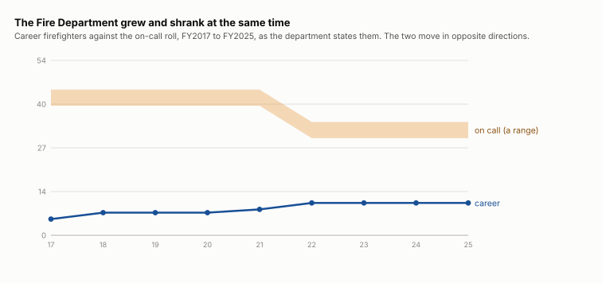

# Who works for the town

The posts the town hires or appoints somebody into, and what each department says it employs, FY2016 to FY2025. The seats people volunteer for are [board composition](/analysis/board-composition); the ones going spare are [open seats](/analysis/open-seats).

## The Fire Department, the one that states its own strength

| fiscal year | career | on call | page |
|---|---:|---:|---:|
| FY2017 | 5 | 40–45 | 79 |
| FY2018 | 7 | 40–45 | 96 |
| FY2019 | 7 | 40–45 | 96 |
| FY2020 | 7 | 40–45 | 86 |
| FY2021 | 8 | 40–45 | 87 |
| FY2022 | 10 | 30–35 | 84 |
| FY2023 | 10 | 30–35 | 92 |
| FY2024 | 10 | 30–35 | 76 |
| FY2025 | 10 | 30–35 | 75 |

Career firefighters went from 5 to 10 while the on-call roll fell from 40–45 to 30–35.

## The two departments that print every name

Police and Fire list their staff by name and assignment in every annual report. The Fire Department also states its strength in a sentence, so the book gives the same quantity twice — and the two do not agree.

| fiscal year | department | names printed | strength stated | agree |
|---|---|---:|---:|---|
| FY2011 | Fire Department | 36 | — | — |
| FY2014 | Fire Department | 44 | — | — |
| FY2015 | Fire Department | 44 | — | — |
| FY2016 | Fire Department | 38 | — | — |
| FY2017 | Fire Department | 42 | 45–50 | yes |
| FY2018 | Fire Department | 40 | 47–52 | NO |
| FY2019 | Fire Department | 38 | 47–52 | NO |
| FY2020 | Fire Department | 41 | 47–52 | NO |
| FY2021 | Fire Department | 37 | 48–53 | NO |
| FY2021 | Police Department | 22 | — | — |
| FY2022 | Fire Department | 11 | 40–45 | NO |
| FY2022 | Police Department | 20 | — | — |
| FY2023 | Fire Department | 38 | 40–45 | yes |
| FY2023 | Police Department | 25 | — | — |
| FY2024 | Fire Department | 35 | 40–45 | NO |
| FY2024 | Police Department | 7 | — | — |

The named roster runs below the stated strength in most years. Either it omits people the sentence counts, or this reading of it does — and until that is settled the count to quote is the range, not either end.

## Stated post by post

| fiscal year | department | as printed |
|---|---|---|
| FY2023 | Department Of Public Works | 1 Director; 1 Executive Assistant; 1 Highway Superintendent; 5 Heavy Equipment Operators; 1 Mechanic; 1 Cemetery Superintendent; 2 Seasonal Cemetery Laborers; 1 Sewer Business Manager; 1 Assistant |
| FY2024 | Department Of Public Works | 1 Director; 1 Executive Assistant; 1 Highway Superintendent; 3 Heavy Equipment Operators; 2 Driver; 1 Mechanic; 1 Cemetery Superintendent; 2 Seasonal Cemetery Laborers; 1 Sewer Business Manager; 1 Assistant |

Read carelessly the Department of Public Works loses two heavy equipment operators between those two years. It does not: FY2024 prints `3 Heavy Equipment Operators, 2 Driver/Laborers` where FY2023 printed `5 Heavy Equipment Operators`. Same five people, two titles reclassified — which is why the sentence is stored as printed.

## The appointed posts

Posts that state no membership and no term: the directors, chiefs, inspectors and clerks the town appoints rather than elects.

| | FY2016 | FY2017 | FY2018 | FY2019 | FY2020 | FY2021 | FY2022 | FY2023 | FY2024 | FY2025 |
|---|---:|---:|---:|---:|---:|---:|---:|---:|---:|---:|
| appointed officers | 115 | 87 | 98 | 0 | 61 | 66 | 59 | 55 | 58 | 60 |

## What this cannot show

- What anybody is paid. No salary is read here, and none is inferred from a post’s name.
- How many people the town employs. A DPW labourer, a library assistant and a town hall clerk hold no appointed post and appear in no roster — the wage list that would give a headcount stopped naming departments after FY2016.
- FTE. A career post and an on-call post are not the same job and cannot be netted against each other.
- A town total. The departments that describe their staffing do it in whichever form that year’s department head chose — a count, a range, an establishment post by post, a list of names — and those are different quantities.

## Where it comes from

- **Every appointed post and its holder, FY2016 to FY2025** — the APPOINTED OFFICIALS listing in each annual town report. Read by scripts/extract_personnel.py. A post that states no membership and no term is an officer rather than a board seat — the town’s own distinction, not ours.
- **What each department says it employs** — the prose of each department’s own report; no heading names it in any year. Read by scripts/extract_department_staffing.py. Stored as printed, because the forms do not agree with each other and may not be summed.
- **The Police and Fire rosters, by name** — the Police `Department Personnel` and Fire `Roster of the Lunenburg Fire Department` pages, both set in two columns. Read by scripts/extract_department_rosters.py, from the WORD geometry because a line box spans both columns.
