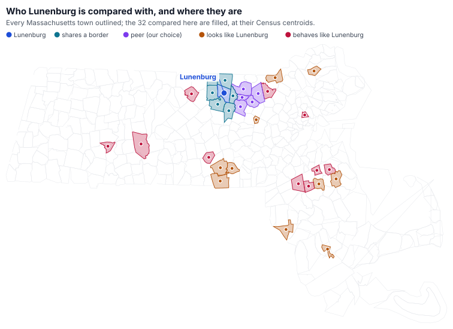

# How Lunenburg compares: neighbours, peers, look-alikes and destinations

Analysis, generated by `scripts/build_town_comparison.py`. Every figure below is computed from the documents listed at the end; nothing is typed.

> **Four comparison sets, because they answer four questions.** The six towns that share a border. The five this project uses as peers. The towns the math picks out of all 351. And the places Lunenburg children are actually schooled, which is not a peer set at all.

## The short version

- **The tax bill tracks home value (r +0.91) and income (r +0.92). New growth: r -0.03.** What a household pays follows what its house is worth and what it earns, not what the town built.
- **Shifting the most the law allows onto commercial saves a $350,000 home $224.25 a year.** The town’s assessor recommended against it. A shift moves the bill between classes, not the levy.
- **Of the towns most like Lunenburg, 9 of 10 spend more per pupil and 7 charge less.** Lunenburg is 158th of 161 comparable districts on spending per pupil.
- **On TOTAL school spending growth Lunenburg is 7th of 11: 3.2% a year.** It kept its pupils. The look-alikes lost more, which lifts per-pupil without spending more.
- **0 of 10 — no town is closest to Lunenburg on both what it is and what it does.** 9 towns make the closest 25 on both. Resembling Lunenburg and acting like it are different.
- **Towns that have won more overrides charge higher bills: r +0.61 across 161 towns.** Lunenburg won $2,010,875 of permanent capacity across 4 wins. A won override never expires.
- **Of 177 Lunenburg children schooled elsewhere, 32 go where one town’s taxes pay.** 97 are at Monty Tech, which Lunenburg helps fund; 38 at charters or virtual schools.
- **Ashby has put 60 override questions and won 7. Lunenburg put 10, won 4.** Adjacent towns under the same cost pressure differ 6x in how often they ask.

## What the figures count

Two calendars, never mixed. Tax figures are FY2026, the last year the Division of Local Services has a rate for every town: an AVERAGE single-family bill on an AVERAGE single-family assessment, which is not any one house. School figures are SY2025, the last year DESE has published spending: dollars per full-time-equivalent pupil, ALL FUNDS, so state aid and grants are inside it and it is not what the town raises. An override row is a question PUT to a ballot, not a dollar levied.

## The towns Lunenburg borders, and the towns it is compared with

Six neighbours, computed from the Census boundary polygons by shared vertices rather than from memory. Five peers, which are this project’s own choice — nothing in the town’s record names a cohort.

| Town | Role | School district | Avg bill FY2026 | Rank of 351 | Bill as % of income | Per pupil SY2025 | Commercial % | Overrides won/put |
|---|---|---|---:|---:|---:|---:|---:|---:|
| Lunenburg | Lunenburg | Lunenburg | $7,444 | 145 | 15.55% | $18,027 | 8.7% | 4 of 10 |
| Ashby | shares a border | North Middlesex | $6,225 | 210 | 15.41% | $21,528 | 5.7% | 7 of 60 |
| Fitchburg | shares a border | Fitchburg | $5,189 | 270 | 20.32% | $22,714 | 18.4% | 0 of 1 |
| Lancaster | shares a border | Nashoba | $9,373 | 83 | 20.72% | $23,109 | 12.3% | 6 of 36 |
| Leominster | shares a border | Leominster | $6,489 | 192 | 18.40% | $20,182 | 17.1% | 0 of 0 |
| Shirley | shares a border | Ayer Shirley School District | $6,490 | 191 | 16.65% | $20,428 | 9.5% | 8 of 33 |
| Townsend | shares a border | North Middlesex | $6,459 | 194 | 15.31% | $21,528 | 6.9% | 8 of 30 |
| Ayer | peer (our choice) | Ayer Shirley School District | $6,625 | 185 | 14.06% | $20,428 | 28.4% | 3 of 13 |
| Groton | peer (our choice) | Groton-Dunstable | $11,253 | 50 | 12.09% | $22,664 | 4.5% | 4 of 12 |
| Harvard | peer (our choice) | Harvard | $14,562 | 22 | 16.69% | $25,565 | 3.9% | 22 of 33 |
| Littleton | peer (our choice) | Littleton | $10,800 | 55 | 14.56% | $21,367 | 21.2% | 3 of 8 |
| Westford | peer (our choice) | Westford | $11,171 | 52 | 13.74% | $20,042 | 9.6% | 8 of 23 |

**Every one of the eleven spends more per pupil than Lunenburg’s $18,027.** The nearest is Westford at $20,042, $2,015 more; the highest is Harvard at $25,565. Read that beside the enrolment column further down before drawing anything from it — per-pupil spending is a ratio, and these districts have not all kept the same number of children.

**Three of the six neighbours are in a regional district, and two of those share one.** Ashby and Townsend are both North Middlesex; Lancaster is in Nashoba; Shirley is in Ayer Shirley with Ayer. So "every bordering town’s school district" is not six districts, and a per-pupil figure beside a town is sometimes a figure that town shares with others.

## The trend: what actually moves a tax bill

Correlations across the 161 Massachusetts towns that run their own K–12 district — the only shape in which town finance and school finance are the same taxpayer, which is Lunenburg’s own shape.

| Relationship | r |
|---|---:|
| average home value → tax bill | +0.91 |
| income per capita → tax bill | +0.92 |
| per-pupil spending → tax bill | +0.29 |
| overrides won → tax bill | +0.61 |
| commercial share → tax bill | -0.38 |
| commercial share → new growth | +0.41 |
| new growth → tax bill | -0.03 |
| enrolment change → per-pupil growth | -0.56 |

**The bill is the house, and the household.** Home value and income per capita track the bill almost identically and nothing here separates them — they are largely measuring the same thing. Nothing about the commercial base comes close, and certified new growth, the measure of what a town built, has no relationship to the bill at all. What a commercial base shows up as is new growth itself, which is levy CAPACITY rather than a smaller bill.

*What this does not show.* Which way any of it runs, and it cannot: this is one year read across many towns. A town with expensive houses can afford a higher bill and also chooses one. What would settle the question for Lunenburg specifically is not a comparison at all — it is the town’s own levy history against its own new growth, which is on [what growth would have to look like](/growth).

### The town has already priced this, for this town

Lunenburg levies a **single tax rate** and decides every November what share of the levy each class of property bears. At the Select Board’s tax classification hearing on 25 November 2025 the Principal Assessor priced the maximum shift onto commercial, industrial and personal property. The minute:

> “The estimated Fiscal Year 2026 single tax rate was projected at $14.39 per thousand”
>
> “At the maximum allowable CIP shift of 1.50, the residential tax rate would decrease to $13.70 per thousand while the commercial tax rate would rise to $21.58 per thousand”
>
> “a savings of only $224.25 for a $350,000 residential property”
>
> “a tax increase of approximately $2,336.75 for a comparable commercial property”
>
> — Select Board minutes, 25 November 2025 ([our copy](https://lunenburgbudgetproject.org/docs/minutes/text/select-board/2025-11-25-minutes-7534.txt), [the town’s](https://www.lunenburgma.gov/AgendaCenter/ViewFile/Minutes/_11252025-7534))

**Her arithmetic reconciles to the state’s file.** The same minute states an average single-family bill of $7,443.89 on an average value of $517,296; the Division of Local Services publishes $7,444 on $517,296 for the same year. Two independent records of the same two quantities, agreeing to the cent — which is what makes the rest of the analysis worth repeating, because the split-rate figures themselves are hers and we have not recomputed them.

She recommended against a split rate, noting that Lunenburg’s commercial share is under a tenth of the base — this report computes 8.7% for FY2026. **A shift moves the bill between classes. It does not reduce the levy**, which is set before any of this and is what the correlation above is really saying.

## The towns the math says look like Lunenburg

Two cohorts over the same 161 towns. **Structural** matches on eight things a town does not decide: how many children, how many are low income, English learners or have disabilities, how many are placed out of district, the average house, income per capita, and the commercial share of the base. **Behavioural** matches on nine things it does: the bill, the bill as a share of income, per-pupil spending, override questions put and won, and the trend in the bill, in spending and in enrolment.

Spending and bills are deliberately absent from the structural cohort. A cohort matched on per-pupil spending cannot then be asked whether Lunenburg spends like its cohort — the answer would have been assumed.

| Town | Cohort | Distance | Avg bill FY2026 | Per pupil SY2025 | Commercial % | Overrides won/put | Enrolment since SY2011 |
|---|---|---:|---:|---:|---:|---:|---:|
| Lunenburg | Lunenburg | — | $7,444 | $18,027 | 8.7% | 4 of 10 | -5.1% |
| Swansea | looks like Lunenburg | 0.391 | $5,623 | $20,614 | 11.7% | 0 of 1 | -5.7% |
| Douglas | looks like Lunenburg | 0.450 | $6,298 | $21,491 | 14.4% | 4 of 12 | -34.4% |
| Georgetown | looks like Lunenburg | 0.465 | $10,314 | $21,277 | 8.8% | 6 of 19 | -28.0% |
| Northbridge | looks like Lunenburg | 0.471 | $5,922 | $19,568 | 11.6% | 2 of 4 | -23.2% |
| Fairhaven | looks like Lunenburg | 0.481 | $4,374 | $19,065 | 13.4% | 0 of 3 | -13.2% |
| East Bridgewater | looks like Lunenburg | 0.498 | $7,410 | $19,412 | 12.0% | 0 of 0 | -12.5% |
| Maynard | looks like Lunenburg | 0.499 | $10,081 | $26,738 | 9.6% | 6 of 19 | -5.3% |
| Pembroke | looks like Lunenburg | 0.503 | $7,521 | $21,722 | 11.6% | 1 of 4 | -28.5% |
| Dracut | looks like Lunenburg | 0.529 | $5,737 | $17,188 | 7.8% | 0 of 13 | -7.6% |
| Sutton | looks like Lunenburg | 0.541 | $7,247 | $21,011 | 15.1% | 2 of 3 | -18.2% |
| Auburn | behaves like Lunenburg | 0.507 | $6,307 | $18,747 | 23.7% | 2 of 6 | +4.2% |
| Hanover | behaves like Lunenburg | 0.577 | $10,149 | $18,856 | 15.0% | 3 of 4 | -4.9% |
| Melrose | behaves like Lunenburg | 0.582 | $9,787 | $17,315 | 5.0% | 3 of 11 | +3.9% |
| Easton | behaves like Lunenburg | 0.589 | $9,441 | $19,190 | 11.2% | 3 of 17 | -12.1% |
| Belchertown | behaves like Lunenburg | 0.602 | $6,622 | $19,035 | 6.3% | 4 of 14 | -18.9% |
| Chelmsford | behaves like Lunenburg | 0.626 | $9,219 | $19,876 | 14.7% | 2 of 8 | -6.7% |
| Easthampton | behaves like Lunenburg | 0.676 | $5,562 | $20,985 | 12.1% | 4 of 14 | -13.5% |
| West Bridgewater | behaves like Lunenburg | 0.685 | $7,433 | $18,633 | 29.3% | 1 of 5 | +6.1% |
| Abington | behaves like Lunenburg | 0.691 | $7,536 | $19,624 | 10.5% | 3 of 6 | +6.9% |
| Gardner | behaves like Lunenburg | 0.714 | $5,052 | $18,939 | 15.1% | 0 of 6 | -1.2% |

**No town appears in both closest-ten lists.** Widen each to twenty-five and 9 do: Northbridge, Dracut, Tyngsborough, Grafton, Abington, West Boylston, Easton, Ashland, Belchertown.

*What this does not show.* That either cohort is the right one. A distance is a statement about these measures given EQUAL WEIGHT and nothing more, and no weighting between dollars, percentages and counts is defensible enough to prefer. What the empty intersection does establish is that "who is like us" has no single answer.

*And the grade-span test is a published fact, not a proxy.* An earlier version of this cohort admitted any district reporting a grade-10 MCAS score, and DESE reports those by district of RESIDENCE — so an elementary district whose teenagers attend a regional high school came third on structural similarity. Membership now reads `grades_served` off DESE’s school-level file: does this district operate a school reaching grade 12.

### A per-pupil figure you may have heard, which is not this one

Monty Tech’s superintendent told the Finance Committee on 6 March 2025 that “The foundational budget per pupil spent is $20,827.” That is a different school and a different quantity: a **foundation budget** is a Chapter 70 formula output — the state’s model of what an adequate education costs — and it is thousands of dollars away from what any district actually spends. Every per-pupil figure in this report is SPENDING, all funds, reported after the year closed. ([the minute](https://lunenburgbudgetproject.org/docs/minutes/text/finance-committee/2025-03-06-minutes-7008.txt))

## Where Lunenburg children are actually schooled

Not a peer set. This is enrolment: where children who live in Lunenburg went in FY2026, and what kind of thing each place is — because a tax bill can only be set beside a district that one town’s taxpayers fund.

| Destination | Children | What funds it |
|---|---:|---|
| Lunenburg | 1,553 | Lunenburg’s own schools |
| Montachusett Regional Vocational Technical | 97 | an assessment Lunenburg itself pays, as a member town |
| Leominster | 18 | one town’s taxpayers |
| Francis W. Parker Charter Essential (District) | 15 | no single town — a charter or Commonwealth virtual school |
| Fitchburg | 8 | one town’s taxpayers |
| Greater Commonwealth Virtual District | 8 | no single town — a charter or Commonwealth virtual school |
| TEC Connections Academy Commonwealth Virtual School District | 8 | no single town — a charter or Commonwealth virtual school |
| Sizer School: A North Central Charter Essential (District) | 7 | no single town — a charter or Commonwealth virtual school |
| Nashoba | 4 | assessments on several member towns, with different bills |
| Harvard | 3 | one town’s taxpayers |
| Gardner | 2 | one town’s taxpayers |
| Ayer Shirley School District | 2 | assessments on several member towns, with different bills |
| Littleton | 1 | one town’s taxpayers |
| Berlin-Boylston | 1 | assessments on several member towns, with different bills |
| Groton-Dunstable | 1 | assessments on several member towns, with different bills |
| North Middlesex | 1 | assessments on several member towns, with different bills |
| Ralph C Mahar | 1 | assessments on several member towns, with different bills |

*What this does not show.* What any of it costs. A count of children is not a tuition, a charter assessment or a share of a regional assessment — and nothing here says which fund pays. Nor why a family chose a destination: the file records an enrolment and nothing else.

## Who this was read for

`notes/process/PERSONAS.md` carries six readers and one test each, every concern quoted from a real public meeting. The review of this report is recorded there. Two of its findings are in the report above and would not have been: the Principal Assessor had already priced the commercial shift for this town, and the town has never published a list of comparable communities — which makes every “compared with similar towns” claim, including this one, rest on a set nobody has agreed.

## The sources

- **Massachusetts DOR, Division of Local Services** — Average single-family tax bill, value, parcels, income per capita and rank, all 351 municipalities, FY1988 onward.
  `sources/state-dls/AvgSingleFamTaxBill-2026-09-26-5d7664b92f9f.xlsx`  · sha256 `5d7664b92f9f99e2`
  Publisher’s address: https://dls-gw.dor.state.ma.us/reports/rdPage.aspx?rdReport=AverageSingleTaxBill.SingleFamTaxBill_wRange&rdReportFormat=NativeExcel&rdExportTableID=tblSinglefamtaxbill&rdExportFilename=AvgSingleFamTaxBill&rdShowGridlines=True&rdExcelOutputFormat=Excel2007
- **Massachusetts DOR, Division of Local Services** — Assessed value by class, so the commercial-industrial-personal share is the state’s certified figure rather than ours.
  `sources/state-dls/assessedvalues-2026-09-26-272171893ca3.xlsx`  · sha256 `272171893ca3b05a`
  Publisher’s address: https://dlsgateway.dor.state.ma.us/reports/rdPage.aspx?rdReport=PropertyTaxInformation.AssessedValuesbyClass.assessedvaluesbyclass&rdReportFormat=NativeExcel&rdExportTableID=tblassessedvalues&rdExportFilename=assessedvalues&rdShowGridlines=True&rdExcelOutputFormat=Excel2007
- **Massachusetts DOR, Division of Local Services** — New growth certified onto the levy limit each year, and the prior year’s limit it is measured against.
  `sources/state-dls/new_growth-2026-09-26-3b8980b0efc3.xlsx`  · sha256 `3b8980b0efc38de6`
  Publisher’s address: https://dls-gw.dor.state.ma.us/reports/rdPage.aspx?rdReport=NewGrowth.NewGrowth_dash_v2_test&rdReportFormat=NativeExcel&rdExportTableID=tblNewGrowth&rdExportFilename=new_growth&rdShowGridlines=True&rdExcelOutputFormat=Excel2007
- **Massachusetts DOR, Division of Local Services** — Every Proposition 2½ override and underride put to a town, with the date, the tallies and the result.
  `sources/state-dls/OverrideUnderrideVotes.xlsx`  · sha256 `8fa6e1fbcf9771b1`
- **Massachusetts DESE** — Per-pupil expenditure by category, enrolment in and out of district, and student demographics, for every district in the state.
  `sources/state-dese/er3w-dyti.json`  · sha256 `12a853ce1295588b`
  Publisher’s address: https://educationtocareer.data.mass.gov/resource/er3w-dyti.json
- **Massachusetts DESE** — Which grades each school actually serves — the published fact that decides whether a district runs a high school.
  `sources/state-dese/i5up-aez6-grades-served.json`  · sha256 `162fa23800a01de9`
  Publisher’s address: https://educationtocareer.data.mass.gov/resource/i5up-aez6.json
- **Town of Lunenburg, Select Board** — The Principal Assessor’s split-rate analysis: the single rate, the average bill, and what the largest shift the statute allows onto commercial property would be worth. Quoted rather than paraphrased, and re-read on every build.
  `sources/meetings/text/select-board/2025-11-25-minutes-7534.txt`  · sha256 `db42e5e9e4913d1c`
  Publisher’s address: https://www.lunenburgma.gov/AgendaCenter/ViewFile/Minutes/_11252025-7534
- **US Census Bureau, TIGERweb** — Town boundaries and centroids: which towns share a border with Lunenburg, and where each one is on the map.
  `sources/state-census/tigerweb-cousub-massachusetts.json`  · sha256 `350e59f82599e345`
  Publisher’s address: https://tigerweb.geo.census.gov/arcgis/rest/services/TIGERweb/Places_CouSub_ConCity_SubMCD/MapServer/1/query

## What this report cannot establish

- Whose comparison set is right. The six neighbours are computed from boundary polygons and are a fact; the five peers are OUR choice, and nothing in the town’s own record names a cohort of comparable communities for tax purposes. The twins are a distance in a space we chose the axes of.
- What any destination costs. A count of children enrolled somewhere is not a tuition, an assessment or a share of one, and nothing here says which fund pays for any of it.
- The tax burden behind a regional district. Nashoba, North Middlesex, Ayer Shirley and Montachusett are funded by assessments on member towns with different bills, and no dataset here holds the membership lists or the apportionment, so no single bill can stand for any of them.
- Whether a town spending more per pupil educates a child better. Per-pupil spending is an input. Nothing in this report is an outcome measure.
- Which way any correlation runs. Every figure here is a cross-section of one year across many towns, which cannot separate a town choosing a higher bill from a town able to afford one.

Three of these are registered in `sources/data/money-gaps.csv` and appear on [what we cannot answer](/what-we-cannot-answer), each with the one document that would close it: the town’s own list of comparable communities, the apportionment behind each regional district’s assessment, and what Lunenburg pays per child for each destination outside its schools.

