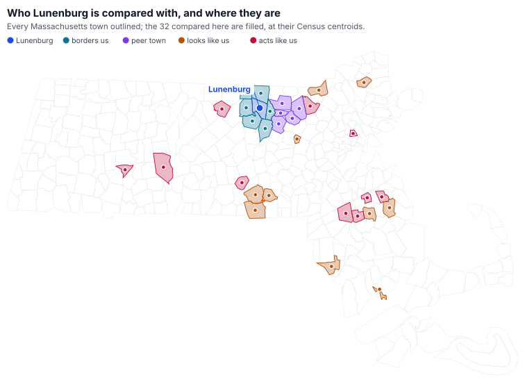
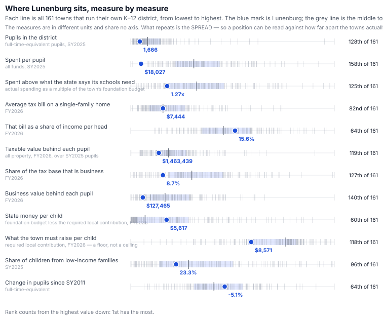
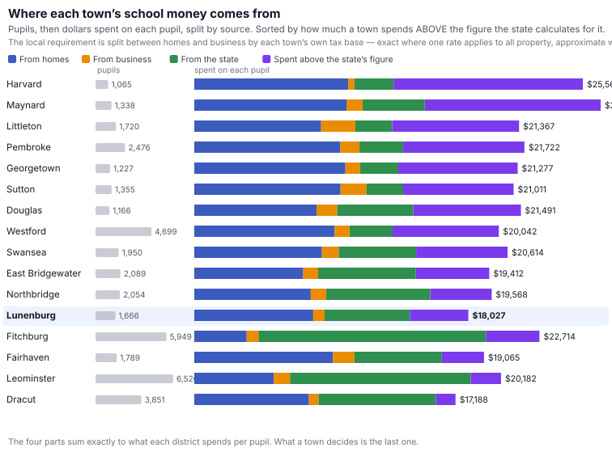
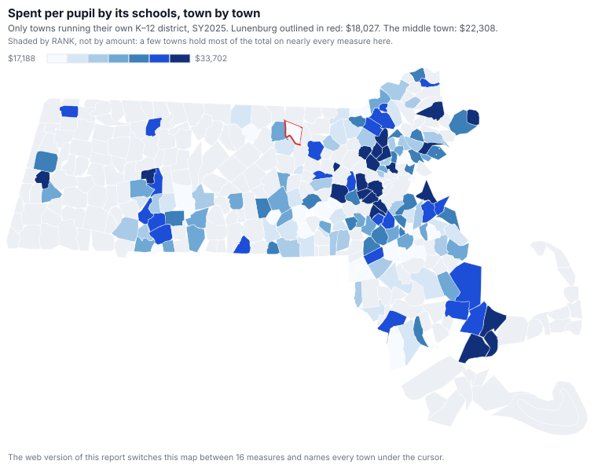

# Towns like us: what they pay, what they spend

Analysis, generated by `scripts/build_town_comparison.py`. Every figure below is computed from the documents listed at the end; nothing is typed.

> **Four comparison sets, because they answer four questions.** The six towns that share a border. The five this project uses as peers. The towns the math picks out of all 351. And the places Lunenburg children are actually schooled, which is not a peer set at all.

## What this report found

- **Wealth per child predicts school spending. State aid, size and poverty do not.** 61% of the difference is none of wealth, aid, size, poverty or tax base.
- **Regional districts do not spend less on administration: $700 a pupil against $693.** On ADMINISTRATION, no. The transport money is a separate line and a real one.
- **8 of 161 towns charge among the least and spend among the most on each pupil.** 6 have the least property value and income behind each child, so the state covers it. 2 have many houses.
- **A town’s tax bill follows house prices: about $995 more per extra $100,000 of home.** The most expensive fifth of towns average $13,795 a year. The cheapest fifth, $5,376.
- **Taxing local business at the maximum rate the law allows would save a home $224.25.** The same shift adds about $2,336.75 to a business. The town’s own assessor advised against it.
- **Lunenburg spends $4,281 less per pupil than the middle comparable district.** Not for want of state aid — it gets more than most. Its taxable value per pupil is below the middle.
- **Lunenburg spends 1.27x what the state says its schools need. The middle town spends 1.46x.** At the middle ratio Lunenburg would spend $2,646 more per pupil.
- **9 of 10 towns most like Lunenburg spend more per pupil than Lunenburg does.** 7 of those same 10 also have a smaller average tax bill than Lunenburg.
- **Lunenburg’s TOTAL school spending grew 3.2% a year — 7th fastest of these 11 towns.** It kept its pupils. The look-alikes lost up to 34.4%, which lifts per-pupil without spending more.
- **Not one of the 10 towns that most resemble Lunenburg also behaves most like it.** Who counts as “a town like ours” depends entirely on which question you ask.
- **Towns that have won 3 or more overrides average a $10,641 tax bill; towns with none, $6,809.** An override lifts the levy ceiling for good, so a vote from decades ago is still in the bill.
- **Only 32 of 177 children schooled outside Lunenburg attend a school one town funds.** 97 are at Monty Tech, which Lunenburg pays into; 38 at charter or online schools.
- **Ashby has asked its voters for an override 60 times and won 7. Lunenburg: 10 and 4.** Leominster has never asked once. Neighbours under the same costs behave completely differently.

## Can a town fund its schools well without taxing its residents? Only 8 of 161 can — and here is how

This is the question underneath every comparison anybody makes, so it goes first. Take the cheapest quarter of these 161 towns by average single-family tax bill — **$5,962 or less** — and the top quarter by spending per pupil — **$24,394 or more**. 8 towns are in both.

| Town | Average tax bill on a home | Spent per pupil | State money per child | Homes per pupil | How |
|---|---:|---:|---:|---:|---|
| Falmouth | $5,881 | $26,965 | $2,809 | 6.0 | a great many houses per child |
| Southbridge | $5,070 | $25,651 | $15,389 | 1.2 | the state pays |
| North Adams | $3,894 | $25,570 | $13,683 | 1.9 | the state pays |
| Holyoke | $5,319 | $25,371 | $18,395 | 0.9 | the state pays |
| Springfield | $4,254 | $25,349 | $19,233 | 0.9 | the state pays |
| Wareham | $4,087 | $24,538 | $6,627 | 4.1 | a great many houses per child |
| Chicopee | $4,580 | $24,501 | $13,926 | 1.5 | the state pays |
| Lawrence | $4,140 | $24,394 | $21,277 | 0.3 | the state pays |
| **Lunenburg** | **$7,444** | **$18,027** | **$5,617** | **2.2** | — |

**There are exactly two ways, and Lunenburg has neither.** 6 of the 8 are among the communities where the state’s own formula finds the least LOCAL EFFORT available — Chapter 70 measures a town by its equalized property valuation and its residents’ income, and covers what those two cannot reach: the state puts in a median of $16,892 per child across them, against $3,617 for the middle town here. The other 2 are resort and retirement towns — a great many houses, very few children — so a modest bill spread over 6.0 homes per pupil still raises a great deal for each child. None of the 8 is doing something a town could simply decide to do.

**And business base is not a third way — which is worth saying plainly, because it is the lever people reach for first.** Tested on the same rule as the other two (twice the frame’s median share of the tax base, 13.4%), **0 of the 8** qualify. Nor does it do much quietly: among the 63 towns whose average home is between $400,000 and $650,000 — the band Lunenburg’s $517,296 sits in — those with more business than the median charge $6,492 against $6,630 and spend $22,006 per pupil against $21,375. Real, and small. The town’s own assessor put the same question a different way and got $224.25 a year.

*What this does not show.* Anything about what those schools achieve — there is no outcome measure in this report. And being carried by the state is not an enviable position: it follows from having among the least property value and income behind each child in Massachusetts, with everything else that comes with that. What the table rules OUT is the hope that some town has found a third way. Within these 161, none has.

## The whole state, one measure at a time

Every Massachusetts town, shaded by whichever measure you choose — 13 of them, from what a home is taxed to what a district spends to what the state sends. Lunenburg is outlined in red. Shading is by RANK rather than by amount: on nearly every one of these a handful of towns hold most of the total, and shading the raw range would leave the other 350 an identical pale.

## What actually predicts how much a district spends on each pupil

Twelve things, each tested against spending per pupil across all 161 towns that run their own K–12 school, ranked by how much of the difference between districts each one accounts for.

| What was tested | Correlation | Accounts for |
|---|---:|---:|
| How much taxable property stands behind each pupil | +0.54 | 29% |
| What the average home is worth | +0.39 | 15% |
| Business value behind each pupil | +0.36 | 13% |
| Income per head | +0.35 | 12% |
| The average tax bill | +0.29 | 8% |
| How many overrides the town has won | +0.21 | 4% |
| What the state requires the town to raise per child | +0.19 | 4% |
| Change in pupils since SY2011 | -0.18 | 3% |
| How much the state sends per child | -0.08 | 1% |
| How much of the tax base is business | +0.03 | 0% |
| The share of children from low-income families | +0.02 | 0% |
| How many pupils the district has (log) | -0.01 | 0% |

**It is wealth per child, and it is not close.** The next three rows are the same thing measured differently — home value, business value and income are what taxable value is made of. What is NOT in it: how much the state sends (1%), how many pupils a district has (0%), the share of children from low-income families (0%), and how much of the tax base is business (0%).

**And the most important number is the one that is missing.** Put the five strongest together and they account for **39%** of the difference between districts. So **61% of what separates a district spending the most from one spending the least is none of wealth, aid, size, poverty or tax base.**

*What this does not show.* Which way any of it runs, and what that 61% IS. A town with more wealth behind each child may spend more because it can, or may have attracted that wealth by spending more; one year read across many towns cannot separate them. And the unexplained share is NOT evidence of choice — it is the absence of evidence for the four explanations people reach for. Special education caseload, debt service, contract history and regional structure are all candidates this report does not hold.

## Where the money above the state’s figure actually comes from

The chart above splits spending by the state’s formula — what a town is REQUIRED to raise and what the state adds. It cannot say where the rest comes from, and it should not be read as though it could. This can, for the districts where DESE publishes actual net school spending for FY2026.

| District | Pupils | Spent per pupil, all funds | Required of it per pupil | Appropriated ABOVE the requirement | From outside the school budget | Actual against required |
|---|---:|---:|---:|---:|---:|---:|
| Harvard | 1,065 | $25,565 | $10,795 | $6,207 | $8,562 | 1.58x |
| Groton-Dunstable *(regional)* | 2,387 | $22,664 | $14,751 | $5,338 | $2,575 | 1.36x |
| North Middlesex *(regional)* | 3,053 | $21,528 | $14,729 | $4,263 | $2,536 | 1.29x |
| Lunenburg | 1,666 | $18,027 | $13,545 | $2,714 | $1,768 | 1.20x |
| Ayer Shirley School District *(regional)* | 1,888 | $20,428 | $13,747 | $2,472 | $4,209 | 1.18x |
| Ashburnham-Westminster *(regional)* | 2,284 | $18,142 | $13,979 | $1,613 | $2,549 | 1.12x |

**Two different things, and both matter.** Harvard appropriates $6,207 a pupil above what the state requires; Lunenburg appropriates $2,714. And Harvard brings in $8,562 a pupil from outside the school appropriation entirely, against Lunenburg’s $1,768 — what THAT is gets its own section below, because an earlier draft of this sentence listed what it assumed was in it rather than what a file says.

*What this does not show.* What is inside that last column. Net school spending excludes transport, capital and most grants, so the figure is a mix and nothing here splits it. That needs DESE’s End of Year Financial Report, which separates spending by fund — already the named remedy on the money-gaps row about funding sources. And actual net school spending is published statewide only through SY2022, so this table is the districts whose current figures this archive holds.

## Does regionalising save money?

It is the answer most often offered in this town, and it is argued on shared overhead — so the measure is administration per pupil, which DESE publishes on its own.

| | Districts | Median administration per pupil | With instructional leadership | Median spent per pupil |
|---|---:|---:|---:|---:|
| Single-town districts | 161 | $693 | $2,054 | $22,308 |
| Regional districts | 49 | $700 | $2,103 | $22,749 |
| **Lunenburg** | | **$581** | **$1,690** | **$18,027** |

**On administration they are not cheaper.** What does cut overhead is SIZE rather than structure, and only somewhat: the smallest quarter of districts (median 1,242 pupils) spend $880 a pupil on administration, the largest quarter (median 6,517) spend $667. Lunenburg already spends $581 — 156th of 210, well into the lean end — so there is little administrative saving here to harvest.

### And what IS the money outside the school budget?

It is **grants and revolving funds**, and DESE publishes it. Its function-code file reports every district’s spending split two ways at once — by what it buys, and by whether the general fund or a grant or revolving account paid for it.

| District | Pupils | General fund | Grants and revolving | Per pupil | Share of its spending | Of which, teacher pay per pupil |
|---|---:|---:|---:|---:|---:|---:|
| Harvard | 1,065 | $20,688,436 | $6,547,802 | $6,146 | 24.0% | $4,964 |
| Ayer Shirley School District | 1,888 | $32,386,190 | $6,175,391 | $3,272 | 16.0% | $1,553 |
| Groton-Dunstable | 2,387 | $47,883,498 | $6,223,018 | $2,607 | 11.5% | $556 |
| North Middlesex | 3,053 | $58,828,904 | $6,899,891 | $2,260 | 10.5% | $213 |
| Ashburnham-Westminster | 2,284 | $37,110,284 | $4,322,411 | $1,893 | 10.4% | $317 |
| **Lunenburg** | 1,666 | $26,986,344 | $3,044,898 | $1,828 | 10.1% | $726 |

**It reconciles, which is why it can be trusted.** Lunenburg’s grants and revolving come to $3,044,898 here; this report derives $2,945,488 a completely different way, as all-funds spending less net school spending. Two files, two routes, the same answer.

**And one line does most of the work.** Harvard charges $4,964 a pupil of TEACHER salaries to grants and revolving accounts. Lunenburg charges $726. That single difference is most of the gap between what the two draw from outside their appropriations.

*What this does not show, and it is the question the table raises.* WHICH fund. A grant is money won from outside; a revolving fund is money the district itself takes in and may spend without an appropriation. Two kinds are evidenced directly in this archive — the athletics revolving fund, whose cashbook is held, and school choice tuition RECEIVED, which is a cherry sheet line; others such as preschool, food service and rentals are the usual sort and are named as examples, not as a claim about any district’s mix. This file does not separate them, so a district with a large school-choice intake looks identical here to one that writes successful grant applications, and those are not the same opportunity. [Registered](/what-we-cannot-answer), with DESE’s End of Year Pupil and Financial Report as the document that would settle it.

### The money a town can only get by being regional

**$88,183,608 in FY2026, to 84 regional districts, and to no single-town district at all.** Regional school transportation is reimbursed under M.G.L. c.71 s.16C. It is a CHERRY SHEET line, not Chapter 70 — which is why nothing else in this report could see it, and why an earlier version of the page concluded too much from finding no saving in administration.

| Regional district | Transportation aid, FY2026 | Pupils | Per pupil |
|---|---:|---:|---:|
| Cape Cod | $704,241 | 252 | $2,798 |
| Southern Berkshire | $1,549,462 | 745 | $2,081 |
| Minuteman | $1,133,159 | 679 | $1,668 |
| Upper Cape Cod | $1,287,134 | 912 | $1,411 |
| Blackstone Valley | $1,778,149 | 1,267 | $1,403 |
| Old Colony | $759,774 | 550 | $1,382 |
| Montachusett | $2,022,089 | 1,476 | $1,370 |
| Pioneer Valley | $509,391 | 376 | $1,355 |
| **Lunenburg** | **nothing — not eligible** | **1,666** | **—** |

**So the regionalisation argument is not empty.** What it is worth here is a question this report still cannot answer — a regional district also INCURS the transport costs it is reimbursed for, and what three towns would spend merged is not observable from what other towns spend today. But it is no longer true that nothing follows from being regional.

**And the same file answers where some of the grant and revolving money comes from.** School choice tuition RECEIVED is a cherry sheet receipt and a revolving fund at the district. Lunenburg receives $106,606 of it and pays out $460,282 in sending tuition, plus $344,897 in charter sending tuition — a net exporter of children and of money.

| Lunenburg, FY2026 | Receipts | | Assessments |
|---|---:|---|---:|
| Chapter 70 | $9,229,410 | School Ch Sending Tuition | $460,282 |
| UGGA | $1,316,438 | Chart Sch Sending Tuition | $344,897 |
| Smart Growth | $318,424 | Mosquito Control | $89,873 |
| Exemp: VBS and Elderly | $113,794 | Regional Transit | $77,917 |
| Sch Choice Rcvng Tuition | $106,606 | RMV Non Renewal | $13,920 |
| Veterans Benefits | $50,560 | MBTA | $12,394 |
| State Owned Land | $48,606 | Air Pollution | $3,968 |
| Public Libraries | $34,448 |  |  |
| Charter Tuition Reimburse | $26,136 |  |  |
| **Total Receipts** | **$11,244,422** | | |
| **Total Assessments** | **$1,003,251** | | |
| **Net Receipts** | **$10,241,171** | | |

### If three towns share one school, what does each one put in?

Chapter 70 is computed per TOWN, never per member of a district — so each town’s obligation is published separately even where the children share one school system.

| Regional district | Member town | Its children | It must raise per child | The state adds per child |
|---|---|---:|---:|---:|
| Ashburnham Westminster | Ashburnham | 1,054 | $6,506 | $7,666 |
|  | Westminster | 1,305 | $7,837 | $6,289 |
| Ayer Shirley | Ayer | 1,095 | $10,448 | $4,568 |
|  | Shirley | 769 | $9,037 | $6,059 |
| Groton Dunstable | Groton | 1,736 | $10,748 | $2,280 |
|  | Dunstable | 555 | $10,254 | $2,740 |
| North Middlesex | Ashby | 422 | $7,819 | $6,761 |
|  | Pepperell | 1,608 | $8,692 | $6,003 |
|  | Townsend | 1,258 | $7,569 | $7,088 |
| *Lunenburg, for scale* | *Lunenburg* | *1,666* | *$8,571* | *$5,617* |

**Regionalising does not change Chapter 70.** The formula is computed per MUNICIPALITY from that town’s equalized property valuation and its residents’ income, and the district’s figure is the sum of its members’. Ashby’s obligation is Ashby’s whether it belongs to a regional district or not, and joining one would not move it. Any state money that DOES follow from being regional is a different line — the transportation reimbursement under c.71 s.16C, which is a cherry sheet item and not Chapter 70. This project holds no cherry sheet data, so it cannot measure that, and it is [registered](/what-we-cannot-answer) as the gap it is rather than argued either way.

**What is NOT published is the assessment** — what each town actually votes to pay the district. That is fixed by the regional agreement and voted town meeting by town meeting, and it is the one link in the chain no statewide file carries.

**And the member towns do not add up to their district, which is the useful part.** Summing them gives 104.1% to 114.8% of the district’s own figure, because a town’s Chapter 70 covers ALL of its children — including those at a vocational school, a charter or another district by choice — while the district’s covers only the ones it teaches. The proof that this is the explanation rather than an error: within each district the required and foundation ratios are the same number to a tenth of a point, which is what happens when one factor scales both. This report refuses to build if they ever drift apart.

## How big is their business base, and what would Lunenburg need to match it?

The commercial argument is usually made in SHARES, and shares answer the wrong question. Westford is within a point of Lunenburg on share — 9.6% against 8.7% — while its business base is **$514,047,566 larger**, because Westford is a far bigger town. A school budget spends dollars, so this is in dollars, and per pupil, so a town with three times the children is not credited for three times the base.

| Town | Business, industrial and personal value | Share of its tax base | Per pupil | Levy it pays at $14.39 per $1,000 | Against Lunenburg |
|---|---:|---:|---:|---:|---:|
| Leominster | $1,182,238,628 | 17.1% | $181,317 | $17,012,414 | +$969,895,488 |
| Fitchburg | $989,017,416 | 18.4% | $166,255 | $14,231,961 | +$776,674,276 |
| Littleton | $733,312,079 | 21.2% | $426,220 | $10,552,361 | +$520,968,939 |
| Westford | $726,390,706 | 9.6% | $154,574 | $10,452,762 | +$514,047,566 |
| Pembroke | $526,264,898 | 11.6% | $212,589 | $7,572,952 | +$313,921,758 |
| Dracut | $495,439,126 | 7.8% | $128,659 | $7,129,369 | +$283,095,986 |
| Fairhaven | $469,959,729 | 13.4% | $262,753 | $6,762,721 | +$257,616,589 |
| Swansea | $434,158,379 | 11.7% | $222,600 | $6,247,539 | +$221,815,239 |
| Sutton | $400,250,502 | 15.1% | $295,475 | $5,759,605 | +$187,907,362 |
| Northbridge | $340,414,162 | 11.6% | $165,765 | $4,898,560 | +$128,071,022 |
| East Bridgewater | $338,695,440 | 12.0% | $162,102 | $4,873,827 | +$126,352,300 |
| Douglas | $292,825,662 | 14.4% | $251,223 | $4,213,761 | +$80,482,522 |
| Maynard | $239,183,026 | 9.6% | $178,788 | $3,441,844 | +$26,839,886 |
| **Lunenburg** | $212,343,140 | 8.7% | $127,465 | $3,055,618 | — |
| Georgetown | $202,926,947 | 8.8% | $165,439 | $2,920,119 | −$9,416,193 |
| Harvard | $73,471,292 | 3.9% | $68,961 | $1,057,252 | −$138,871,848 |

**What Lunenburg would need.** Its business base is $127,465 per pupil against a median of $234,713 across the 161 towns. Reaching that median means **$178,664,500 of new business value** — worth about **$2,570,982 a year** of levy at the current rate. Lunenburg’s assessors certify a median of $24,176,125 of NEW GROWTH of every kind each year, so that is roughly **7 years if every dollar of growth were commercial**, and most of it is housing. Treat the figure as a floor on the time, not an estimate of it.

**And that is the right size to judge it by.** $2,570,982 a year of extra levy capacity is roughly the size of the gaps this town argues about — so commercial growth is a credible answer to *how do we stop running deficits* and is not an answer to *how do I pay less*. The two get argued as one thing. They are not: what growth buys is room under the levy limit, and the town’s own assessor priced the other question — shifting tax onto the business already here — at $224.25 a year.

*What this does not show.* Whether that development is wanted, what it would cost in services, roads and schools of its own, or where it would go. This is arithmetic on the tax base and nothing else. `/commercial-development` translates the same quantity into buildings at the town’s own archetype values — see [what commercial growth would have to look like](/commercial-development).

## The towns most like Lunenburg, and how they differ

Picked by the math out of all 161, on eight things a town does not choose: how many children it has, how many are from low-income families, are learning English or have a disability, how many are schooled outside the district, what the average house is worth, income per head, and how much of the tax base is business. Tax bills and spending are deliberately kept OUT of the matching, so they can be compared afterwards rather than assumed.

**Swansea**

*Like Lunenburg:* low-income share 26% to Lunenburg’s 23%; average home $494,954 to Lunenburg’s $517,296; income per head $40,942 to Lunenburg’s $47,872; share with a disability 18% to Lunenburg’s 16%.

*Different:* Pays $1,821 less on the average single-family home and spends $2,587 more on each pupil.
  It has 3.2 homes for every pupil against Lunenburg’s 2.2, so more households share the cost of each child.
  It spends 1.41x what the state says its own schools need against Lunenburg’s 1.27x.

**Douglas**

*Like Lunenburg:* low-income share 24% to Lunenburg’s 23%; average home $521,818 to Lunenburg’s $517,296; income per head $46,833 to Lunenburg’s $47,872; share with a disability 18% to Lunenburg’s 16%.

*Different:* Pays $1,146 less on the average single-family home and spends $3,464 more on each pupil.
  It has 2.5 homes for every pupil against Lunenburg’s 2.2, so more households share the cost of each child.
  It raises $15,529 per pupil from single-family tax against Lunenburg’s $16,288 and gets a smaller share from the state, so the extra comes from somewhere this archive cannot see.
  It spends 1.49x what the state says its own schools need against Lunenburg’s 1.27x.

**Georgetown**

*Like Lunenburg:* children 1,197 to Lunenburg’s 1,563; share with a disability 16% to Lunenburg’s 16%.

*Different:* Pays $2,870 more on the average single-family home and spends $3,250 more on each pupil.
  The state covers only 19% of its foundation budget against 40% of Lunenburg’s — it gets LESS help, not more.
  It spends 1.59x what the state says its own schools need against Lunenburg’s 1.27x.

## What other districts do that Lunenburg does not — and how we know

Five things a comparison like this is usually used to argue for. Each one says where Lunenburg actually sits, whether it is something the town could DECIDE, and how much the data will carry. Two of the five turn out to be things Lunenburg already has.

### Spend further above what the state says your schools need

THE ONE THAT ANSWERS THE QUESTION. The state computes a foundation budget for each town from its own children and its own wealth, so comparing each town to its OWN floor is fair in a way a raw per-pupil figure is not. Lunenburg spends 1.27x its floor; the middle district here spends 1.46x. At that middle ratio Lunenburg would spend $2,646 more per pupil.

*Is it a decision?* Yes, the town could choose differently.  *How sure?* **measured** — DESE per-pupil expenditure SY2025 over the FY2026 town foundation budget per foundation pupil.

*Spending is all funds, so a town that wins more grants shows a higher ratio without its taxpayers deciding anything. And this measures distance from a formula, not whether any amount is right.*

### Be required to put in more

Lunenburg is required to raise $8,571 per child. The middle Massachusetts town is required to raise $10,714. The requirement follows a town’s property wealth and income, so it is not something anybody here votes on — but it IS a floor, not a ceiling.

*Is it a decision?* No. This is circumstance, not policy.  *How sure?* **measured** — DESE Chapter 70 municipal contribution file, FY2026: required local contribution over foundation enrolment.

*A required contribution is a statutory MINIMUM. Most towns appropriate above it, and how far above is the decision in the row above.*

### Spend more on each pupil

$18,027 per pupil, 158th of 161 comparable districts. The middle of those districts spends $22,308 — $4,281 more than Lunenburg.

*Is it a decision?* Yes, the town could choose differently.  *How sure?* **measured** — DESE per-pupil total expenditures, SY2025, all funds.

*Per-pupil spending is money in, not results out. Nothing here says whether Lunenburg is run leanly or is short of what its children need, and no figure in this report could.*

### Get more help from the state

Lunenburg already does. The state expects to cover 40% of its foundation budget, against 24% for the middle district here — 55th of 161. Low spending is NOT explained by thin state aid.

*Is it a decision?* No. This is circumstance, not policy.  *How sure?* **measured** — DESE Chapter 70 municipal contribution file, FY2026: the town foundation budget less the required local contribution.

*A foundation budget is the state’s formula for an adequate education, not what anybody spends, and a required contribution is a minimum rather than what a town raises.*

### Have more taxable value behind each child

CORRECTED, and it goes the other way. Counting HOMES, Lunenburg looks comfortable: 2.2 per pupil against 1.8 for the middle district. Counting VALUE — which is what a tax bill is actually levied on — it has $1,463,439 per pupil against a median of $1,800,204, 119th of 161. More houses per child than most towns and less money behind each child, because its houses are worth less.

*Is it a decision?* No. This is circumstance, not policy.  *How sure?* **measured** — DLS assessed value by class FY2026 over DESE full-time-equivalent pupils SY2025; parcels from the same DLS file.

*This is ALL taxable value — houses, flats, shops, plant. It is also the quantity a commercial base adds to, which is why business and housing are ONE lever here and not two: a warehouse that brings no children and a second home that brings no children do the same thing. What differs is size — business is 8.7% of Lunenburg’s base and housing is the rest.*

### Ask the voters for an override more often

Lunenburg has put 10 questions and won 4. Towns that have won 3 or more average a $10,641 tax bill; towns that have never won one average $6,809.

*Is it a decision?* Yes, the town could choose differently.  *How sure?* **not established** — DLS override and underride votes, every question since FY1990.

*WHICH CAUSES WHICH is exactly what this cannot say. A town with a higher bill may pass overrides because its residents can afford them, rather than having a higher bill because it passed them — and wealth would produce both. Asking more often is a decision; that it would raise Lunenburg’s spending is not shown here.*

### Grow the commercial base

Littleton adds 3.23% of its levy limit in new growth each year against Lunenburg’s 1.75%. But across all 161 towns, new growth and the tax bill are unrelated, and the town’s own assessor priced the largest possible shift onto business at $224.25 a year.

*Is it a decision?* Yes, the town could choose differently.  *How sure?* **measured** — DLS new growth, ten-year mean to FY2026; the correlation across the frame; Select Board minutes of 25 November 2025.

*What growth buys is levy CAPACITY — room under the limit — not a smaller bill for an existing household. Those are different things and are routinely argued as though they were one.*

## Town by town: do they pay more or less, and do they spend more or less?

Every town this report compares, sorted into four plain groups. “Pays” is the average single-family property tax bill. “Spends” is dollars per pupil from all funds. Neither is a verdict — a town that spends less may be run leanly or may be short of what its children need, and nothing here can tell those apart.

### Pays less, spends more than Lunenburg

**Fitchburg** — pays $2,255 less on the average single-family home and spends $4,687 more on each pupil.
  It has only 1.1 homes per pupil against Lunenburg’s 2.2, so fewer households share each child.
  The state covers 78% of its foundation budget against 40% of Lunenburg’s.
  It spends 1.18x what the state says its own schools need against Lunenburg’s 1.27x.

**Douglas** — pays $1,146 less on the average single-family home and spends $3,464 more on each pupil.
  It has 2.5 homes for every pupil against Lunenburg’s 2.2, so more households share the cost of each child.
  It raises $15,529 per pupil from single-family tax against Lunenburg’s $16,288 and gets a smaller share from the state, so the extra comes from somewhere this archive cannot see.
  It spends 1.49x what the state says its own schools need against Lunenburg’s 1.27x.

**Sutton** — pays about the same on the average single-family home and spends $2,984 more on each pupil.
  The state covers only 18% of its foundation budget against 40% of Lunenburg’s — it gets LESS help, not more.
  It raises $16,151 per pupil from single-family tax against Lunenburg’s $16,288 and gets a smaller share from the state, so the extra comes from somewhere this archive cannot see.
  It spends 1.53x what the state says its own schools need against Lunenburg’s 1.27x.

**Easthampton** — pays $1,882 less on the average single-family home and spends $2,958 more on each pupil.
  It has 2.5 homes for every pupil against Lunenburg’s 2.2, so more households share the cost of each child.
  The state covers only 34% of its foundation budget against 40% of Lunenburg’s — it gets LESS help, not more.
  It raises $13,762 per pupil from single-family tax against Lunenburg’s $16,288 and gets a smaller share from the state, so the extra comes from somewhere this archive cannot see.
  It spends 1.37x what the state says its own schools need against Lunenburg’s 1.27x.

**Swansea** — pays $1,821 less on the average single-family home and spends $2,587 more on each pupil.
  It has 3.2 homes for every pupil against Lunenburg’s 2.2, so more households share the cost of each child.
  It spends 1.41x what the state says its own schools need against Lunenburg’s 1.27x.

**Leominster** — pays $955 less on the average single-family home and spends $2,155 more on each pupil.
  It has only 1.3 homes per pupil against Lunenburg’s 2.2, so fewer households share each child.
  The state covers 65% of its foundation budget against 40% of Lunenburg’s.
  It spends 1.11x what the state says its own schools need against Lunenburg’s 1.27x.

**Northbridge** — pays $1,522 less on the average single-family home and spends $1,541 more on each pupil.
  It has only 1.8 homes per pupil against Lunenburg’s 2.2, so fewer households share each child.

**East Bridgewater** — pays about the same on the average single-family home and spends $1,385 more on each pupil.
  It has only 1.9 homes per pupil against Lunenburg’s 2.2, so fewer households share each child.
  It spends 1.33x what the state says its own schools need against Lunenburg’s 1.27x.

**Fairhaven** — pays $3,070 less on the average single-family home and spends $1,038 more on each pupil.
  It has 3.1 homes for every pupil against Lunenburg’s 2.2, so more households share the cost of each child.
  It raises $13,374 per pupil from single-family tax against Lunenburg’s $16,288 and gets a smaller share from the state, so the extra comes from somewhere this archive cannot see.
  It spends 1.17x what the state says its own schools need against Lunenburg’s 1.27x.

**Belchertown** — pays $822 less on the average single-family home and spends $1,008 more on each pupil.
  The state covers 46% of its foundation budget against 40% of Lunenburg’s.
  It spends 1.35x what the state says its own schools need against Lunenburg’s 1.27x.

**Gardner** — pays $2,392 less on the average single-family home and spends $912 more on each pupil.
  It has only 1.5 homes per pupil against Lunenburg’s 2.2, so fewer households share each child.
  The state covers 72% of its foundation budget against 40% of Lunenburg’s.
  It spends 1.04x what the state says its own schools need against Lunenburg’s 1.27x.

**Auburn** — pays $1,137 less on the average single-family home and spends $720 more on each pupil.
  The state covers 45% of its foundation budget against 40% of Lunenburg’s.

**West Bridgewater** — pays about the same on the average single-family home and spends $606 more on each pupil.
  It has only 1.5 homes per pupil against Lunenburg’s 2.2, so fewer households share each child.

### Pays more, spends more than Lunenburg

**Maynard** — pays $2,637 more on the average single-family home and spends $8,711 more on each pupil.
  The state covers only 27% of its foundation budget against 40% of Lunenburg’s — it gets LESS help, not more.
  It spends 1.76x what the state says its own schools need against Lunenburg’s 1.27x.

**Harvard** — pays $7,118 more on the average single-family home and spends $7,538 more on each pupil.
  It has only 1.6 homes per pupil against Lunenburg’s 2.2, so fewer households share each child.
  The state covers only 20% of its foundation budget against 40% of Lunenburg’s — it gets LESS help, not more.
  It spends 1.95x what the state says its own schools need against Lunenburg’s 1.27x.

**Pembroke** — pays about the same on the average single-family home and spends $3,695 more on each pupil.
  The state covers only 21% of its foundation budget against 40% of Lunenburg’s — it gets LESS help, not more.
  It raises $16,242 per pupil from single-family tax against Lunenburg’s $16,288 and gets a smaller share from the state, so the extra comes from somewhere this archive cannot see.
  It spends 1.58x what the state says its own schools need against Lunenburg’s 1.27x.

**Littleton** — pays $3,356 more on the average single-family home and spends $3,340 more on each pupil.
  It has only 1.8 homes per pupil against Lunenburg’s 2.2, so fewer households share each child.
  The state covers only 19% of its foundation budget against 40% of Lunenburg’s — it gets LESS help, not more.
  It spends 1.64x what the state says its own schools need against Lunenburg’s 1.27x.

**Georgetown** — pays $2,870 more on the average single-family home and spends $3,250 more on each pupil.
  The state covers only 19% of its foundation budget against 40% of Lunenburg’s — it gets LESS help, not more.
  It spends 1.59x what the state says its own schools need against Lunenburg’s 1.27x.

**Westford** — pays $3,727 more on the average single-family home and spends $2,015 more on each pupil.
  It has only 1.4 homes per pupil against Lunenburg’s 2.2, so fewer households share each child.
  The state covers only 22% of its foundation budget against 40% of Lunenburg’s — it gets LESS help, not more.
  It raises $15,520 per pupil from single-family tax against Lunenburg’s $16,288 and gets a smaller share from the state, so the extra comes from somewhere this archive cannot see.
  It spends 1.54x what the state says its own schools need against Lunenburg’s 1.27x.

**Chelmsford** — pays $1,775 more on the average single-family home and spends $1,849 more on each pupil.
  It has only 1.7 homes per pupil against Lunenburg’s 2.2, so fewer households share each child.
  The state covers only 20% of its foundation budget against 40% of Lunenburg’s — it gets LESS help, not more.
  It raises $15,833 per pupil from single-family tax against Lunenburg’s $16,288 and gets a smaller share from the state, so the extra comes from somewhere this archive cannot see.
  It spends 1.45x what the state says its own schools need against Lunenburg’s 1.27x.

**Abington** — pays about the same on the average single-family home and spends $1,597 more on each pupil.
  It has only 1.7 homes per pupil against Lunenburg’s 2.2, so fewer households share each child.

**Easton** — pays $1,997 more on the average single-family home and spends $1,163 more on each pupil.
  It has only 1.7 homes per pupil against Lunenburg’s 2.2, so fewer households share each child.
  The state covers only 20% of its foundation budget against 40% of Lunenburg’s — it gets LESS help, not more.
  It raises $15,937 per pupil from single-family tax against Lunenburg’s $16,288 and gets a smaller share from the state, so the extra comes from somewhere this archive cannot see.
  It spends 1.39x what the state says its own schools need against Lunenburg’s 1.27x.

**Hanover** — pays $2,705 more on the average single-family home and spends $829 more on each pupil.
  It has only 1.6 homes per pupil against Lunenburg’s 2.2, so fewer households share each child.
  The state covers only 21% of its foundation budget against 40% of Lunenburg’s — it gets LESS help, not more.
  It spends 1.40x what the state says its own schools need against Lunenburg’s 1.27x.

### Pays less, spends less than Lunenburg

**Dracut** — pays $1,707 less on the average single-family home and spends $839 less on each pupil.
  The state covers 49% of its foundation budget against 40% of Lunenburg’s.
  It spends 1.08x what the state says its own schools need against Lunenburg’s 1.27x.

### Pays more, spends less than Lunenburg

**Melrose** — pays $2,343 more on the average single-family home and spends $712 less on each pupil.
  It has only 1.5 homes per pupil against Lunenburg’s 2.2, so fewer households share each child.
  The state covers only 20% of its foundation budget against 40% of Lunenburg’s — it gets LESS help, not more.

### The 6 in regional districts — and how they do it

Ashby, Ayer, Groton, Lancaster, Shirley, Townsend are in REGIONAL districts, so no spending figure belongs to any one of them: the money is assessed across member towns with different tax bills and separate votes. But Chapter 70 is computed per TOWN whatever district its children attend, so what each is REQUIRED to raise per child, and what the state adds per child, are published for them exactly as for Lunenburg. Lunenburg is required to raise $8,571 per child and the state adds $5,617.

**Groton** — is required to raise $10,748 per child, $2,177 more than Lunenburg’s $8,571, and the state adds $2,280. Its children attend Groton-Dunstable, which spends $22,664 per pupil.

**Ayer** — is required to raise $10,448 per child, $1,877 more than Lunenburg’s $8,571, and the state adds $4,568. Its children attend Ayer Shirley School District, which spends $20,428 per pupil.

**Lancaster** — is required to raise $9,577 per child, $1,006 more than Lunenburg’s $8,571, and the state adds $4,282. Its children attend Nashoba, which spends $23,109 per pupil.

**Shirley** — is required to raise $9,037 per child, $465 more than Lunenburg’s $8,571, and the state adds $6,059. Its children attend Ayer Shirley School District, which spends $20,428 per pupil.

**Ashby** — is required to raise $7,819 per child, $752 less than Lunenburg’s $8,571, and the state adds $6,761. Its children attend North Middlesex, which spends $21,528 per pupil.

**Townsend** — is required to raise $7,569 per child, $1,002 less than Lunenburg’s $8,571, and the state adds $7,088. Its children attend North Middlesex, which spends $21,528 per pupil.

What stays unknowable is only the middle step: how a regional district’s assessment is apportioned between its member towns. That is a narrower gap than it looked like, and it is [registered](/what-we-cannot-answer) with the document that would close it.

## The towns Lunenburg borders, and the towns it is compared with

Six neighbours, computed from the Census boundary polygons by shared vertices rather than from memory. Five peers, which are this project’s own choice — nothing in the town’s record names a cohort.

| Town | Why it is here | School district | Average single-family tax bill, FY2026 | Where that bill ranks among the 351 Massachusetts towns (1 = highest) | That bill as a share of income per head | Spending per pupil, all funds, SY2025 | Share of the tax base that is business rather than housing | Overrides won of those put to voters |
|---|---|---|---:|---:|---:|---:|---:|---:|
| Lunenburg | Lunenburg | Lunenburg | $7,444 | 145 | 15.55% | $18,027 | 8.7% | 4 of 10 |
| Ashby | borders us | North Middlesex | $6,225 | 210 | 15.41% | $21,528 | 5.7% | 7 of 60 |
| Fitchburg | borders us | Fitchburg | $5,189 | 270 | 20.32% | $22,714 | 18.4% | 0 of 1 |
| Lancaster | borders us | Nashoba | $9,373 | 83 | 20.72% | $23,109 | 12.3% | 6 of 36 |
| Leominster | borders us | Leominster | $6,489 | 192 | 18.40% | $20,182 | 17.1% | 0 of 0 |
| Shirley | borders us | Ayer Shirley School District | $6,490 | 191 | 16.65% | $20,428 | 9.5% | 8 of 33 |
| Townsend | borders us | North Middlesex | $6,459 | 194 | 15.31% | $21,528 | 6.9% | 8 of 30 |
| Ayer | peer town | Ayer Shirley School District | $6,625 | 185 | 14.06% | $20,428 | 28.4% | 3 of 13 |
| Groton | peer town | Groton-Dunstable | $11,253 | 50 | 12.09% | $22,664 | 4.5% | 4 of 12 |
| Harvard | peer town | Harvard | $14,562 | 22 | 16.69% | $25,565 | 3.9% | 22 of 33 |
| Littleton | peer town | Littleton | $10,800 | 55 | 14.56% | $21,367 | 21.2% | 3 of 8 |
| Westford | peer town | Westford | $11,171 | 52 | 13.74% | $20,042 | 9.6% | 8 of 23 |

**Every one of the eleven spends more per pupil than Lunenburg’s $18,027.** The nearest is Westford at $20,042, $2,015 more; the highest is Harvard at $25,565. Read that beside the enrolment column further down before drawing anything from it — per-pupil spending is a ratio, and these districts have not all kept the same number of children.

**Three of the six neighbours are in a regional district, and two of those share one.** Ashby and Townsend are both North Middlesex; Lancaster is in Nashoba; Shirley is in Ayer Shirley with Ayer. So "every bordering town’s school district" is not six districts, and a per-pupil figure beside a town is sometimes a figure that town shares with others.

## The trend: what actually moves a tax bill

Correlations across the 161 Massachusetts towns that run their own K–12 district — the only shape in which town finance and school finance are the same taxpayer, which is Lunenburg’s own shape.

| Relationship | r |
|---|---:|
| average home value → tax bill | +0.91 |
| income per capita → tax bill | +0.92 |
| per-pupil spending → tax bill | +0.29 |
| overrides won → tax bill | +0.61 |
| commercial share → tax bill | -0.38 |
| commercial share → new growth | +0.41 |
| new growth → tax bill | -0.03 |
| enrolment change → per-pupil growth | -0.56 |

**The bill is the house, and the household.** Home value and income per capita track the bill almost identically and nothing here separates them — they are largely measuring the same thing. Nothing about the commercial base comes close, and certified new growth, the measure of what a town built, has no relationship to the bill at all. What a commercial base shows up as is new growth itself, which is levy CAPACITY rather than a smaller bill.

*What this does not show.* Which way any of it runs, and it cannot: this is one year read across many towns. A town with expensive houses can afford a higher bill and also chooses one. What would settle the question for Lunenburg specifically is not a comparison at all — it is the town’s own levy history against its own new growth, which is on [what growth would have to look like](/growth).

### The town has already priced this, for this town

Lunenburg levies a **single tax rate** and decides every November what share of the levy each class of property bears. At the Select Board’s tax classification hearing on 25 November 2025 the Principal Assessor priced the maximum shift onto commercial, industrial and personal property. The minute:

> “The estimated Fiscal Year 2026 single tax rate was projected at $14.39 per thousand”
>
> “At the maximum allowable CIP shift of 1.50, the residential tax rate would decrease to $13.70 per thousand while the commercial tax rate would rise to $21.58 per thousand”
>
> “a savings of only $224.25 for a $350,000 residential property”
>
> “a tax increase of approximately $2,336.75 for a comparable commercial property”
>
> — Select Board minutes, 25 November 2025 ([our copy](https://lunenburgbudgetproject.org/docs/minutes/text/select-board/2025-11-25-minutes-7534.txt), [the town’s](https://www.lunenburgma.gov/AgendaCenter/ViewFile/Minutes/_11252025-7534))

**Her arithmetic reconciles to the state’s file.** The same minute states an average single-family bill of $7,443.89 on an average value of $517,296; the Division of Local Services publishes $7,444 on $517,296 for the same year. Two independent records of the same two quantities, agreeing to the cent — which is what makes the rest of the analysis worth repeating, because the split-rate figures themselves are hers and we have not recomputed them.

She recommended against a split rate, noting that Lunenburg’s commercial share is under a tenth of the base — this report computes 8.7% for FY2026. **A shift moves the bill between classes. It does not reduce the levy**, which is set before any of this and is what the correlation above is really saying.

## “A town like ours”, one measure at a time

The two cohorts below have no town in common, which is a true finding and a useless one by itself: it says the question is ill-posed without saying what to ask instead. So here is what to ask instead — the three nearest towns on each measure SEPARATELY. Nearest is plain difference on the measure itself: no weighting, nothing to argue with. Somebody arguing about school spending should reach for a different row from somebody arguing about tax bills.

| On this measure | Lunenburg | The three nearest towns |
|---|---:|---|
| How many children it has | 1,563 | Ipswich (1,563), Bourne (1,519), Tyngsborough (1,515) |
| The share of its children from low-income families | 23% | Sandwich (23%), Tyngsborough (23%), Belchertown (23%) |
| What the average single-family home is worth | $517,296 | Attleboro ($516,733), Lowell ($514,854), Douglas ($521,818) |
| Income per head | $47,872 | Winthrop ($47,593), Plymouth ($47,294), Seekonk ($47,093) |
| How much business value stands behind each pupil | $127,465 | Dracut ($128,659), Reading ($130,973), Grafton ($121,201) |
| The average single-family tax bill | $7,444 | Carver ($7,448), West Bridgewater ($7,433), Medford ($7,427) |
| What its schools spend per pupil | $18,027 | Grafton ($17,941), North Attleborough ($18,581), West Bridgewater ($18,633) |
| How far above the state’s figure for its schools it spends | 1.27x | Peabody (1.27x), Randolph (1.27x), Abington (1.26x) |

**Almost nothing repeats down that column.** A town that matches Lunenburg on how many children it has is not the town that matches it on what those children’s schools spend, and neither is the town that matches it on the tax bill. That is the honest reason “comparable communities” has to be said with a measure attached — and the reason the town not publishing one of its own is a real gap rather than a pedantic complaint.

## The towns the math says look like Lunenburg

Two cohorts over the same 161 towns. **Structural** matches on eight things a town does not decide: how many children, how many are low income, English learners or have disabilities, how many are placed out of district, the average house, income per capita, and the commercial share of the base. **Behavioural** matches on nine things it does: the bill, the bill as a share of income, per-pupil spending, override questions put and won, and the trend in the bill, in spending and in enrolment.

Spending and bills are deliberately absent from the structural cohort. A cohort matched on per-pupil spending cannot then be asked whether Lunenburg spends like its cohort — the answer would have been assumed.

| Town | Which list | How far from Lunenburg (0 = identical) | Average single-family tax bill, FY2026 | Spending per pupil, all funds, SY2025 | Share of the tax base that is business | Overrides won of those put | Change in pupils since SY2011 |
|---|---|---:|---:|---:|---:|---:|---:|
| Lunenburg | Lunenburg | — | $7,444 | $18,027 | 8.7% | 4 of 10 | -5.1% |
| Swansea | looks like us | 0.391 | $5,623 | $20,614 | 11.7% | 0 of 1 | -5.7% |
| Douglas | looks like us | 0.450 | $6,298 | $21,491 | 14.4% | 4 of 12 | -34.4% |
| Georgetown | looks like us | 0.465 | $10,314 | $21,277 | 8.8% | 6 of 19 | -28.0% |
| Northbridge | looks like us | 0.471 | $5,922 | $19,568 | 11.6% | 2 of 4 | -23.2% |
| Fairhaven | looks like us | 0.481 | $4,374 | $19,065 | 13.4% | 0 of 3 | -13.2% |
| East Bridgewater | looks like us | 0.498 | $7,410 | $19,412 | 12.0% | 0 of 0 | -12.5% |
| Maynard | looks like us | 0.499 | $10,081 | $26,738 | 9.6% | 6 of 19 | -5.3% |
| Pembroke | looks like us | 0.503 | $7,521 | $21,722 | 11.6% | 1 of 4 | -28.5% |
| Dracut | looks like us | 0.529 | $5,737 | $17,188 | 7.8% | 0 of 13 | -7.6% |
| Sutton | looks like us | 0.541 | $7,247 | $21,011 | 15.1% | 2 of 3 | -18.2% |
| Auburn | acts like us | 0.507 | $6,307 | $18,747 | 23.7% | 2 of 6 | +4.2% |
| Hanover | acts like us | 0.577 | $10,149 | $18,856 | 15.0% | 3 of 4 | -4.9% |
| Melrose | acts like us | 0.582 | $9,787 | $17,315 | 5.0% | 3 of 11 | +3.9% |
| Easton | acts like us | 0.589 | $9,441 | $19,190 | 11.2% | 3 of 17 | -12.1% |
| Belchertown | acts like us | 0.602 | $6,622 | $19,035 | 6.3% | 4 of 14 | -18.9% |
| Chelmsford | acts like us | 0.626 | $9,219 | $19,876 | 14.7% | 2 of 8 | -6.7% |
| Easthampton | acts like us | 0.676 | $5,562 | $20,985 | 12.1% | 4 of 14 | -13.5% |
| West Bridgewater | acts like us | 0.685 | $7,433 | $18,633 | 29.3% | 1 of 5 | +6.1% |
| Abington | acts like us | 0.691 | $7,536 | $19,624 | 10.5% | 3 of 6 | +6.9% |
| Gardner | acts like us | 0.714 | $5,052 | $18,939 | 15.1% | 0 of 6 | -1.2% |

**No town appears in both closest-ten lists.** Widen each to twenty-five and 9 do: Northbridge, Dracut, Tyngsborough, Grafton, Abington, West Boylston, Easton, Ashland, Belchertown.

*What this does not show.* That either cohort is the right one. A distance is a statement about these measures given EQUAL WEIGHT and nothing more, and no weighting between dollars, percentages and counts is defensible enough to prefer. What the empty intersection does establish is that "who is like us" has no single answer.

*And the grade-span test is a published fact, not a proxy.* An earlier version of this cohort admitted any district reporting a grade-10 MCAS score, and DESE reports those by district of RESIDENCE — so an elementary district whose teenagers attend a regional high school came third on structural similarity. Membership now reads `grades_served` off DESE’s school-level file: does this district operate a school reaching grade 12.

### A per-pupil figure you may have heard, which is not this one

Monty Tech’s superintendent told the Finance Committee on 6 March 2025 that “The foundational budget per pupil spent is $20,827.” That is a different school and a different quantity: a **foundation budget** is a Chapter 70 formula output — the state’s model of what an adequate education costs — and it is thousands of dollars away from what any district actually spends. Every per-pupil figure in this report is SPENDING, all funds, reported after the year closed. ([the minute](https://lunenburgbudgetproject.org/docs/minutes/text/finance-committee/2025-03-06-minutes-7008.txt))

## Where Lunenburg children are actually schooled

Not a peer set. This is enrolment: where children who live in Lunenburg went in FY2026, and what kind of thing each place is — because a tax bill can only be set beside a district that one town’s taxpayers fund.

| Destination | Children | What funds it |
|---|---:|---|
| Lunenburg | 1,553 | Lunenburg’s own schools |
| Montachusett Regional Vocational Technical | 97 | an assessment Lunenburg itself pays, as a member town |
| Leominster | 18 | one town’s taxpayers |
| Francis W. Parker Charter Essential (District) | 15 | no single town — a charter or Commonwealth virtual school |
| Fitchburg | 8 | one town’s taxpayers |
| Greater Commonwealth Virtual District | 8 | no single town — a charter or Commonwealth virtual school |
| TEC Connections Academy Commonwealth Virtual School District | 8 | no single town — a charter or Commonwealth virtual school |
| Sizer School: A North Central Charter Essential (District) | 7 | no single town — a charter or Commonwealth virtual school |
| Nashoba | 4 | assessments on several member towns, with different bills |
| Harvard | 3 | one town’s taxpayers |
| Gardner | 2 | one town’s taxpayers |
| Ayer Shirley School District | 2 | assessments on several member towns, with different bills |
| Littleton | 1 | one town’s taxpayers |
| Berlin-Boylston | 1 | assessments on several member towns, with different bills |
| Groton-Dunstable | 1 | assessments on several member towns, with different bills |
| North Middlesex | 1 | assessments on several member towns, with different bills |
| Ralph C Mahar | 1 | assessments on several member towns, with different bills |

*What this does not show.* What any of it costs. A count of children is not a tuition, a charter assessment or a share of a regional assessment — and nothing here says which fund pays. Nor why a family chose a destination: the file records an enrolment and nothing else.

## This is a conversation the town is already having

Lunenburg’s own Budget Task Force spent part of its meeting of 19 August 2024 on exactly this comparison — per-pupil expenditure as the measure to judge the district by, set against other districts, and where Lunenburg’s teacher pay sits in that range. There are no written minutes of that passage in the archive; what exists is the recording, and it is linked here rather than quoted because the only transcript is machine captions. A caption model hears “fifteen hundred”, “$1,500” and “$50” alike, so no figure from it may be repeated as something the meeting said.

- [The Budget Task Force, 19 August 2024, at 1:26:24](https://www.youtube.com/watch?v=l_64JaMrAzA&t=5184s)

This report does not introduce the question. It gives the same question a published denominator: 161 towns that run their own K–12 district, matched to Lunenburg by the things a town does not choose, rather than a handful picked to make a point.

## The questions this report could not answer, and what would answer them

Each of these stopped a conclusion. They are registered in `sources/data/money-gaps.csv` and appear on [what we cannot answer](/what-we-cannot-answer), so the next person to hit the same wall finds them rather than describing them again in different words.

| The question | Why it stops here | The one document that would settle it |
|---|---|---|
| What does Lunenburg actually appropriate above the state’s minimum, year by year, beside the same for comparable towns? | The required local contribution is a floor and this report measures one year of the gap above it. The gap over time is the whole decision and is not assembled anywhere. | DESE’s net school spending series per district — published statewide only through SY2022, and held here for FY2026 for six local districts. |
| Which fund pays the teacher salaries a district charges to grants and revolving accounts? | Harvard charges $4,964 a pupil of teacher pay to grants and revolving where Lunenburg charges $726. Part is non-resident tuition — Harvard teaches 187 children its town is not funded for, 90 of them from Devens — but that does not account for the size of it. | DESE’s End of Year Pupil and Financial Report, which reports spending by individual fund. |
| What would regionalising be worth to Lunenburg, once the transport reimbursement is set against the transport costs it would take on? | The reimbursement side is now measured — $88,183,608 statewide, nothing to a single-town district. The cost side is not: no published figure separates a district’s busing cost from its reimbursement, and what three towns would spend merged is not what other merged towns spend today. | The regional districts’ own budgets, which state transport as a line against its reimbursement; and a regional agreement, which sets how the net is apportioned. |
| How does a regional district divide its assessment between member towns, and what does each actually appropriate? | Chapter 70 is published per town, so what each member is REQUIRED to raise is known. The assessment — what each town votes to pay the district — is the one link no statewide file carries. | Each regional district’s annual assessment schedule, voted by its member towns and filed with DESE. |
| Which towns does Lunenburg consider comparable to itself? | Nothing the town has published names a cohort. A 2023 Finance Committee minute cites “the 8 communities that were surveyed” for a salary study and never lists them. Every “compared with similar towns” claim, including this report’s, rests on a set nobody has agreed. | The eight-community list behind the 2023 salary survey, held by the Town Administrator or the bargaining unit that commissioned it. |
| What does each place a Lunenburg child is schooled outside the district actually cost the town? | DESE publishes where 177 children go and nothing about what any of them costs. A count of children is not a tuition or an assessment share. | DESE’s End of Year Financial Report, which separates tuition and assessment spending by fund and receiving district. |

**Five of the six name a document that exists and is not in this archive.** That is the useful form of a gap: a records request rather than a grievance. The sixth — what regionalising would be worth here — is the only one where no document would settle it, because the question is about a future nobody has observed.

## Who this was read for

`notes/process/PERSONAS.md` carries six readers and one test each, every concern quoted from a real public meeting. The review of this report is recorded there. Two of its findings are in the report above and would not have been: the Principal Assessor had already priced the commercial shift for this town, and the town has never published a list of comparable communities — which makes every “compared with similar towns” claim, including this one, rest on a set nobody has agreed.

## What the figures count

Two calendars, never mixed. Tax figures are FY2026, the last year the Division of Local Services has a rate for every town: an AVERAGE single-family bill on an AVERAGE single-family assessment, which is not any one house. School figures are SY2025, the last year DESE has published spending: dollars per full-time-equivalent pupil, ALL FUNDS, so state aid and grants are inside it and it is not what the town raises. An override row is a question PUT to a ballot, not a dollar levied.

*This also appears at the top of the web version of this report, because a reader who is about to quote a figure needs it before they scroll. Here it sits with the method, where somebody reading the whole document will look for it.*

## The sources

- **Massachusetts DOR, Division of Local Services** — Average single-family tax bill, value, parcels, income per capita and rank, all 351 municipalities, FY1988 onward.
  `sources/state-dls/AvgSingleFamTaxBill-2026-09-26-5d7664b92f9f.xlsx`  · sha256 `5d7664b92f9f99e2`
  Publisher’s address: https://dls-gw.dor.state.ma.us/reports/rdPage.aspx?rdReport=AverageSingleTaxBill.SingleFamTaxBill_wRange&rdReportFormat=NativeExcel&rdExportTableID=tblSinglefamtaxbill&rdExportFilename=AvgSingleFamTaxBill&rdShowGridlines=True&rdExcelOutputFormat=Excel2007
- **Massachusetts DOR, Division of Local Services** — Assessed value by class, so the commercial-industrial-personal share is the state’s certified figure rather than ours.
  `sources/state-dls/assessedvalues-2026-09-26-272171893ca3.xlsx`  · sha256 `272171893ca3b05a`
  Publisher’s address: https://dlsgateway.dor.state.ma.us/reports/rdPage.aspx?rdReport=PropertyTaxInformation.AssessedValuesbyClass.assessedvaluesbyclass&rdReportFormat=NativeExcel&rdExportTableID=tblassessedvalues&rdExportFilename=assessedvalues&rdShowGridlines=True&rdExcelOutputFormat=Excel2007
- **Massachusetts DOR, Division of Local Services** — New growth certified onto the levy limit each year, and the prior year’s limit it is measured against.
  `sources/state-dls/new_growth-2026-09-26-3b8980b0efc3.xlsx`  · sha256 `3b8980b0efc38de6`
  Publisher’s address: https://dls-gw.dor.state.ma.us/reports/rdPage.aspx?rdReport=NewGrowth.NewGrowth_dash_v2_test&rdReportFormat=NativeExcel&rdExportTableID=tblNewGrowth&rdExportFilename=new_growth&rdShowGridlines=True&rdExcelOutputFormat=Excel2007
- **Massachusetts DOR, Division of Local Services** — Every Proposition 2½ override and underride put to a town, with the date, the tallies and the result.
  `sources/state-dls/OverrideUnderrideVotes.xlsx`  · sha256 `8fa6e1fbcf9771b1`
- **Massachusetts DESE** — Per-pupil expenditure by category, enrolment in and out of district, and student demographics, for every district in the state.
  `sources/state-dese/er3w-dyti.json`  · sha256 `12a853ce1295588b`
  Publisher’s address: https://educationtocareer.data.mass.gov/resource/er3w-dyti.json
- **Massachusetts DESE** — Which grades each school actually serves — the published fact that decides whether a district runs a high school.
  `sources/state-dese/i5up-aez6-grades-served.json`  · sha256 `162fa23800a01de9`
  Publisher’s address: https://educationtocareer.data.mass.gov/resource/i5up-aez6.json
- **Town of Lunenburg, Select Board** — The Principal Assessor’s split-rate analysis: the single rate, the average bill, and what the largest shift the statute allows onto commercial property would be worth. Quoted rather than paraphrased, and re-read on every build.
  `sources/meetings/text/select-board/2025-11-25-minutes-7534.txt`  · sha256 `db42e5e9e4913d1c`
  Publisher’s address: https://www.lunenburgma.gov/AgendaCenter/ViewFile/Minutes/_11252025-7534
- **US Census Bureau, TIGERweb** — Town boundaries and centroids: which towns share a border with Lunenburg, and where each one is on the map.
  `sources/state-census/tigerweb-cousub-massachusetts.json`  · sha256 `350e59f82599e345`
  Publisher’s address: https://tigerweb.geo.census.gov/arcgis/rest/services/TIGERweb/Places_CouSub_ConCity_SubMCD/MapServer/1/query

## What this report cannot establish

- Whose comparison set is right. The six neighbours are computed from boundary polygons and are a fact; the five peers are OUR choice, and nothing in the town’s own record names a cohort of comparable communities for tax purposes. The twins are a distance in a space we chose the axes of.
- What any destination costs. A count of children enrolled somewhere is not a tuition, an assessment or a share of one, and nothing here says which fund pays for any of it.
- How a regional district divides its assessment between member towns, and what each member town actually appropriates for schools. What each is REQUIRED to raise per child IS published and is used here; what is not published is the step between that minimum and the district’s books.
- What any town actually appropriates, anywhere in this report. A required local contribution is a statutory floor and most towns go above it; how far above is the decision this comparison is really about, and it is not in these files.
- Whether a town spending more per pupil educates a child better. Per-pupil spending is an input. Nothing in this report is an outcome measure.
- Which way any correlation runs. Every figure here is a cross-section of one year across many towns, which cannot separate a town choosing a higher bill from a town able to afford one.

Three of these are registered in `sources/data/money-gaps.csv` and appear on [what we cannot answer](/what-we-cannot-answer), each with the one document that would close it: the town’s own list of comparable communities, the apportionment behind each regional district’s assessment, and what Lunenburg pays per child for each destination outside its schools.

