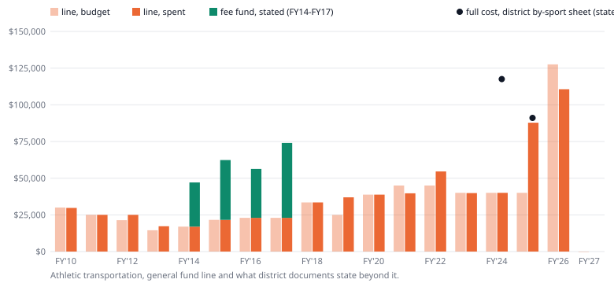
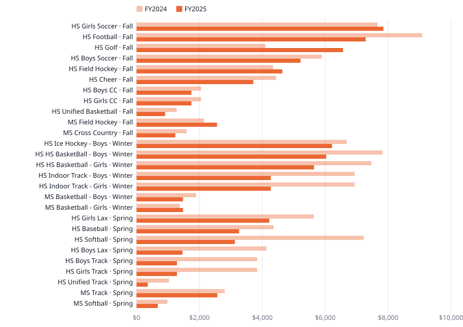
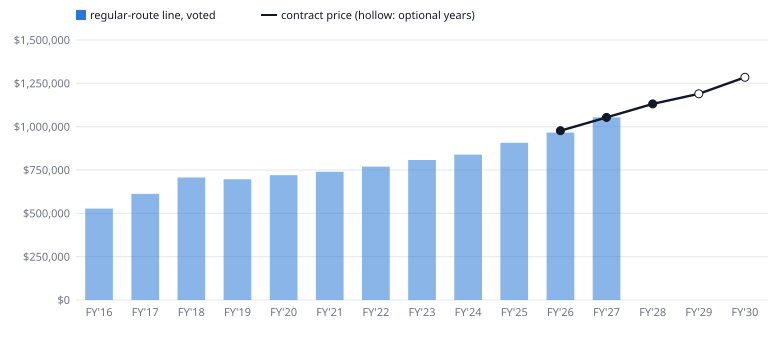
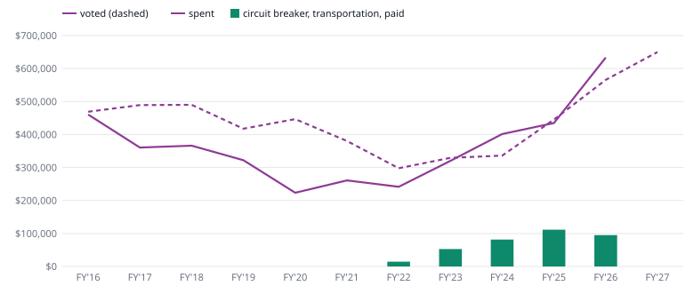

# School transportation: what the buses cost, and who pays

**What Lunenburg spends on school buses — the school day against athletics, budgeted and spent, every year since FY2010 — athletics sport by sport, and what the new Dee Bus contract fixes through FY2028.**

## The short version

**Athletic buses were 6.4% of school transportation spending in FY2026.** The school-day buses — regular routes and special education vans — were 93.4%; band trips the rest.

**The district’s own sheet put FY2024 athletic bus costs at $117,555; the voted line was $40,000.** So the line’s jump to $127,550 in FY2026 moved who pays, as the district said; the cost was already there.

**Our estimate: FY2025 athletic bus spending equals about 97 trips at the new contract’s prices.** *(our estimate — a hypothesis, not a measurement)* Girls Soccer buses cost the most, about 8 trips; football next. No sport topped $7,850.

**The bus contract already fixes FY2028’s regular-route price: $1,131,390 for 11 buses.** A known 7.4% rise. It ends June 2028; renewal, or the two priced option years, is the decision.

**FY2026’s 7.6% bus increase is the new contract’s first-year price over the old budget line.** Whether it bought a price rise or an extra bus cannot be told without the old contract.

**Special education transportation spending rose from $322,047 in FY2019 to $633,291 in FY2026.** It ran over its voted budget in FY2024 and FY2026; the district cites more vans and monitors.

**The FY2026 bus line was voted $11,000 under the contract price, then topped back up mid-year.** The Finance Committee was told the bus fee cut the line by that much; where the fees are booked is unstated.

**FY2027’s budget cut athletic buses to $0; restoring high school buses was put at $58,880.** The August plan: $10,000 from the town and $50,000 from the athletics fee fund.

Every line on this page is a general fund budget line, and a budget line is **net**: it is what the town raises after anything else that pays for the thing — bus fees, the athletic fee fund, state reimbursement — has been taken off (rule 11). None of those is netted into any figure here; each has its own column.

---

## The charts

## 1. The school day against athletics

### In plain terms

Almost all of what the schools spend on buses is the school day: the eleven Dee Bus buses on regular routes and the special education vans. Athletic buses were 6.4% of spending in FY2026 and have been between 1.8% and 6.4% every year since FY2010. That is the general fund only — athletic buses the fee fund paid for are not in it (section 2).

### The evidence

Budget is the original appropriation voted before the year. Spent is expended plus still committed at the year-end close. **The two are side by side and never combined**: the athletic share is computed once on spending and once on budget.

| FY | school day, budget | school day, spent | athletic, budget | athletic, spent | band, budget | band, spent | athletic share of spending | athletic share of budget | source |
|---|---:|---:|---:|---:|---:|---:|---:|---:|---|
| FY2010 | $793,020 | $697,310 | $30,000 | $29,744 | $5,100 | $3,350 | 4.1% | 3.6% | FinCom workbook |
| FY2011 | $724,380 | $717,259 | $25,000 | $25,000 | $5,500 | $3,545 | 3.4% | 3.3% | FinCom workbook |
| FY2012 | $673,200 | $724,216 | $21,400 | $24,992 | $4,950 | $2,214 | 3.3% | 3.1% | FinCom workbook |
| FY2013 | $824,660 | $948,263 | $14,500 | $17,276 | $5,650 | $3,498 | 1.8% | 1.7% | FinCom workbook |
| FY2014 | $872,302 | $912,386 | $17,000 | $17,000 | $5,900 | $4,417 | 1.8% | 1.9% | FinCom workbook |
| FY2015 | $923,408 | $1,008,399 | $21,600 | $21,600 | $6,900 | $2,168 | 2.1% | 2.3% | FinCom workbook |
| FY2016 | $996,626 | $988,088 | $23,000 | $23,000 | $4,100 | $2,471 | 2.3% | 2.2% | FinCom workbook |
| FY2017 | $1,101,250 | $986,037 | $23,000 | $23,000 | $4,250 | $1,927 | 2.3% | 2.0% | FinCom workbook |
| FY2018 | $1,196,500 | $1,041,184 | $33,500 | $33,500 | $4,250 | $2,740 | 3.1% | 2.7% | FinCom workbook |
| FY2019 | $1,114,185 | $1,018,647 | $24,975 | $36,974 | $4,500 | $6,075 | 3.5% | 2.2% | FinCom workbook |
| FY2020 | $1,166,658 | $732,390 | $38,801 | $38,795 | $6,900 | $2,900 | 5.0% | 3.2% | FinCom workbook |
| FY2021 | $1,120,209 | $928,696 | $45,000 | $39,703 | $4,900 | $0 | 4.1% | 3.8% | FinCom workbook |
| FY2022 | $1,067,343 | $968,815 | $45,000 | $54,567 | $5,100 | $2,620 | 5.3% | 4.0% | FinCom workbook |
| FY2023 | $1,137,335 | $1,158,144 | $40,000 | $39,880 | $6,100 | $7,565 | 3.3% | 3.4% | MUNIS |
| FY2024 | $1,174,747 | $1,318,927 | $40,000 | $40,000 | $6,700 | $4,205 | 2.9% | 3.3% | MUNIS |
| FY2025 | $1,352,528 | $1,342,122 | $40,000 | $87,822 | $8,500 | $5,205 | 6.1% | 2.9% | MUNIS |
| FY2026 | $1,531,234 | $1,609,791 | $127,550 | $110,650 | $4,000 | $3,902 | 6.4% | 7.7% | MUNIS |
| FY2027 | $1,703,313 | — | $0 | — | $0 | — | — | 0.0% | budget book, balanced |

The school day split, FY2026: regular routes voted $965,500 and spent $976,500; special education voted $565,734 and spent $633,291. Band trips were $3,902 spent against $4,000 voted.

**Band and music trips in FY2027.** The balanced budget carries $0 for both band transportation lines. The Finance Committee was told on 26 March 2026: *“The transportation for Middle-High Band would be reduced to $5,000.”* ([minutes](/docs/minutes/text/finance-committee/2026-03-26-minutes-7737.txt)). The book and the minute differ, and the record here does not say which held.

**A second route.** DESE’s End of Year Financial Report gives the same school-day spending as in-district transportation (function 3300) plus out-of-district transportation, general fund. It equals the town ledger’s regular plus special education lines to the dollar in FY2016, FY2017, FY2019, FY2022, FY2023, FY2024. Within $421 in FY2012, FY2013, FY2014, FY2015, FY2018. FY2020 and FY2021 differ by $135,112 in opposite directions, so the two years together tie; one payment booked in different years by the two would look like that (a hypothesis). FY2010, FY2011 differ by more, in both directions. In FY2025 DESE reports $1,365,412 against the ledger’s $1,342,122, $23,290 apart; nothing published here explains the difference (registered: *Why DESE’s FY2025 transportation spending for Lunenburg differs from the town ledger*). DESE splits in-district from out-of-district, which is not the town’s regular / special education split, so only the sum is compared.

### What this does not show

- **What athletic buses cost in all.** The general fund line is net of the athletic fee fund (rule 11), and the fund paid more of athletic transportation than the town did in every year a district document reports both as actual, FY2014 to FY2017 (section 2).
- **Cost per rider.** No count of riders is published (registered: *How many children ride the school buses, and how many pay the fee*). The only count in the record is 1,074 bus requests in June 2025, 494 of them unpaid at the time.
- **Monty Tech.** Students at the regional vocational school ride its buses; Lunenburg pays for them inside the Monty Tech assessment, whose transportation-and-operating part is not split. It is a town appropriation, not a school line, and is not on this page.

## 2. Athletic transportation: what it costs and who has paid

### In plain terms

The athletic bus line in the town budget used to be a fraction of what athletic buses cost; the athletic fee fund — what families pay to play — covered the rest. In FY2024 the district’s own sheet put the cost at $117,555 while the voted line was $40,000. From FY2026 the line was set to carry the full cost, and the district said so at the time. In FY2027 the balanced budget cut it to $0.

### The evidence

| FY | general fund line, budget | general fund line, spent | fee fund, stated by the district | full cost, district by-sport sheet (stated) |
|---|---:|---:|---:|---:|
| FY2014 | $17,000 | $17,000 | $30,085 | — |
| FY2015 | $21,600 | $21,600 | $40,742 | — |
| FY2016 | $23,000 | $23,000 | $33,308 | — |
| FY2017 | $23,000 | $23,000 | $50,986 | — |
| FY2018 | $33,500 | $33,500 | $27,450 (budget) | — |
| FY2019 | $24,975 | $36,974 | $40,000 (budget) | — |
| FY2020 | $38,801 | $38,795 | — | — |
| FY2021 | $45,000 | $39,703 | — | — |
| FY2022 | $45,000 | $54,567 | — | — |
| FY2023 | $40,000 | $39,880 | — | — |
| FY2024 | $40,000 | $40,000 | — | $117,555 |
| FY2025 | $40,000 | $87,822 | — | $91,066 |
| FY2026 | $127,550 | $110,650 | — | — |
| FY2027 | $0 | — | — | — |

The fee fund figures for FY2014 to FY2019 are the district’s FY19 athletics budget document (`district-budget/docs/fy19-proposed-athletics-budget.pdf`), actual to FY2017. Nothing published states the fund’s share after that; it books transportation inside one purchase-of-service account with officials, uniforms and ice time (registered: *Whether a general fund athletics line is net of the revolving fund*).

**The district’s own words.** Its FY2026 budget overview, on the athletics line: *“budgeted to cover full cost of transportation for athletics; athletic revolving can not support these increased costs”*. At the School Committee on 12 March 2025, a member: *“The cost of athletic transportation is not up 200%. The way we are accounting for athletic transportation has been corrected from past practice that was done incorrectly.”* ([minutes](/docs/minutes/text/school-committee/2025-03-12-minutes-7098.txt)).

**FY2025, the year it moved.** The line was voted at $40,000 and $47,822 was transferred in during the year, to $87,822, all of it spent. The School Committee approved the transfer on 16 April 2025: *“A fourth transfer to move funds to the athletic transportation, special detail, dues and fees and the high school after school stipends, this is the first phase move making monies available in the athletic portion of the budget. We can go back and reclassify expenses that had been charged against the revolving account.”* ([minutes](/docs/minutes/text/school-committee/2025-04-16-minutes-7171.txt)).

**FY2026, the new contract’s first athletic year**, the general fund line spent $87,126 and had $23,524 still committed at the close, $110,650 in all against $127,550 voted. At the contract’s prices the amount paid out is about 92 of the bid form’s average trips, or 117 counting what was still committed — our estimate (section 3).

### What this does not show

- **Whether teams rode more or less.** Dollars moved between two payers; no trip count is published for any year (registered: *How many athletic bus trips each sport took, and what each trip cost*).
- **That the sheet is right.** It is assembled by hand, and the district has not stood behind any per-sport figure (registered: *Which of the three published per-sport athletics cost figures is correct*).

## 3. Sport by sport, and what the dollars buy in trips

### In plain terms

In FY2025 no single sport’s buses cost more than $7,850. The five biggest together were $33,942 of the $91,066 total. Priced at the new contract’s rates, the whole FY2025 total buys about 97 trips of the kind the bid form assumes — **our estimate**, not a count.

### The evidence

From the district’s sport-by-sport workbook; the cell is the workbook’s own. **Trips are OUR ESTIMATE**: FY2025 dollars divided by $942.50, the bid form’s average trip at FY2026 prices (65 miles at $6.50 a mile plus 4 hours of waiting at $130.00 an hour). The second trip column assumes no waiting, $422.50 a trip, and is the ceiling.

| season | level | sport | FY2024 | FY2025 | trips, FY2025 — OUR ESTIMATE | trips with no waiting — OUR ESTIMATE |
|---|---|---|---:|---:|---:|---:|
| Fall | HS | Girls Soccer | $7,662.00 | $7,849.50 | 8 | 19 |
| Fall | HS | Football | $9,078.50 | $7,284.80 | 8 | 17 |
| Fall | HS | Golf | $4,100.00 | $6,565.00 | 7 | 16 |
| Fall | HS | Boys Soccer | $5,886.00 | $5,212.38 | 6 | 12 |
| Fall | HS | Field Hockey | $4,338.00 | $4,634.38 | 5 | 11 |
| Fall | HS | Cheer | $4,435.50 | $3,711.25 | 4 | 9 |
| Fall | HS | Boys CC | $2,053.75 | $1,744.38 | 2 | 4 |
| Fall | HS | Girls CC | $2,053.75 | $1,744.38 | 2 | 4 |
| Fall | HS | Unified Basketball | $1,275.00 | $907.50 | 1 | 2 |
| Fall | MS | Field Hockey | $2,150.00 | $2,559.00 | 3 | 6 |
| Fall | MS | Cross Country | $1,595.00 | $1,233.50 | 1 | 3 |
| Winter | HS | Ice Hockey - Boys | $6,681.50 | $6,215.00 | 7 | 15 |
| Winter | HS | HS BasketBall - Boys | $7,817.50 | $6,027.50 | 6 | 14 |
| Winter | HS | HS Basketball - Girls | $7,463.00 | $5,641.25 | 6 | 13 |
| Winter | HS | Indoor Track - Boys | $6,931.75 | $4,267.50 | 4 | 10 |
| Winter | HS | Indoor Track - Girls | $6,931.75 | $4,267.50 | 4 | 10 |
| Winter | HS | Ice Hockey - Girls | $0.00 | — | — | — |
| Winter | HS | Ski Team | $0.00 | — | — | — |
| Winter | MS | Basketball - Boys | $1,893.25 | $1,479.38 | 2 | 4 |
| Winter | MS | Basketball - Girls | $1,373.25 | $1,479.38 | 2 | 4 |
| Spring | HS | Girls Lax | $5,635.50 | $4,222.50 | 4 | 10 |
| Spring | HS | Baseball | $4,354.00 | $3,260.00 | 4 | 8 |
| Spring | HS | Softball | $7,222.00 | $3,125.00 | 3 | 7 |
| Spring | HS | Boys Lax | $4,130.50 | $1,462.50 | 2 | 4 |
| Spring | HS | Boys Track | $3,837.00 | $1,285.00 | 1 | 3 |
| Spring | HS | Girls Track | $3,837.00 | $1,285.00 | 1 | 3 |
| Spring | HS | Unified Track | $1,030.00 | $355.00 | 0 | 1 |
| Spring | MS | Track | $2,804.00 | $2,570.00 | 3 | 6 |
| Spring | MS | Softball | $985.50 | $677.50 | 1 | 2 |
| **all** | | | **$117,555.00** | **$91,066.06** | **97** | **216** |

**Season totals against the workbook’s own.** 5 of 6 season totals the workbook prints equal the sum of its own rows. Spring FY2025 prints $0.00 in cell AT25 while its rows sum to $18,242.50; this page uses the rows. 

**A second district sheet disagrees.** The Finance Committee’s copy of *Athletics Costs (1).xlsx* prints transportation for 40 sport-years that can be matched to the workbook; 19 agree to the cent and 21 do not. Both are hand-built; neither is a ledger (rule 13a). The ones that differ:

| FY | sport | by-sport workbook | Finance Committee copy |
|---|---|---:|---:|
| FY2024 | Baseball | $4,354.00 | $2,752.50 |
| FY2024 | Boys Ice Hockey | $6,681.50 | $4,494.50 |
| FY2024 | Boys' Basketball | $7,817.50 | $6,084.00 |
| FY2024 | Boys' Lacrosse | $4,130.50 | $1,780.50 |
| FY2024 | Boys' Soccer | $5,886.00 | $6,336.00 |
| FY2024 | Girl's Basketball | $7,463.00 | $3,929.50 |
| FY2024 | Girls' Lacrosse | $5,635.50 | $2,810.50 |
| FY2024 | Girls' Soccer | $7,662.00 | $7,212.00 |
| FY2024 | Indoor Track | $13,863.50 | $6,085.00 |
| FY2024 | MS Boys' Basketball | $1,893.25 | $2,028.25 |
| FY2024 | MS Girls' Basketball | $1,373.25 | $1,508.25 |
| FY2024 | Outdoor Track | $7,674.00 | $1,989.00 |
| FY2024 | Softball | $7,222.00 | $3,023.50 |
| FY2024 | Unified Track | $1,030.00 | $440.00 |
| FY2025 | Boys Ice Hockey | $6,215.00 | $5,605.00 |
| FY2025 | Boys' Basketball | $6,027.50 | $3,813.75 |
| FY2025 | Girl's Basketball | $5,641.25 | $4,201.25 |
| FY2025 | HS Cross Country | $3,488.75 | $3,488.76 |
| FY2025 | Indoor Track | $8,535.00 | $8,169.50 |
| FY2025 | MS Boys' Basketball | $1,479.38 | $805.63 |
| FY2025 | MS Girls' Basketball | $1,479.38 | $805.63 |

**One trip, priced.** On 4 March 2026 a teacher told the School Committee a class field trip would cost *“$731.50”*: one Dee Bus trip under the new contract, between this page’s no-waiting and four-hour prices of $422.50 and $942.50 ([minutes](/docs/minutes/text/school-committee/2026-03-04-minutes-7687.txt)).

### What this does not show

- **A count of trips.** The estimate assumes every trip is the bid form’s average: 65 miles and 4 hours of waiting. Trips differ — a golf match and a football game are not the same bus — so a sport’s estimate is a scale, not its schedule.
- **The prices actually paid in FY2025.** Those dollars were paid under the previous contract, whose rates were requested on 9 October 2026 and not delivered. If they were lower than FY2026’s, every trip estimate here is too low.
- **The bid form’s own arithmetic.** Its trip lines multiply a trip count by the rate by a mileage figure (35 × rate × 1,750 and so on); the mileage figures sum to 5,000, not the 6,500 its estimate states. The subtotal is a quantity for comparing bids, not a forecast, and this page uses only the stated average trip.

## 4. The Dee Bus contract: what is fixed, and what the 7.6% was

### In plain terms

The district signed a three-year contract with Dee Bus Service for 1 July 2025 to 30 June 2028, with two optional one-year extensions. It fixes a price **per bus per day** for every year in advance, so the regular-route cost for FY2028 is already known: $1,131,390 for eleven buses for 180 days. The district bid it under the state procurement law, to be awarded on the lowest three-year total, and the FY2027 budget carries the contract’s price to the dollar — the planning number a board can start from rather than estimate.

### The evidence

Every rate below was read off the scanned bid form and checked two ways on every build: against the scan’s text layer where it is legible, and by recomputing every subtotal and footing it to the year totals and the Grand Total the form prints, $6,086,125.00.

| year | 77-passenger, per bus per day | 83-passenger | regular routes: 8 + 3 buses × 180 days | trip rate (per mile) | waiting, per hour | year total as printed | bid form page |
|---|---:|---:|---:|---:|---:|---:|---|
| FY2026 | $485.00 | $515.00 | $976,500.00 | $6.50 | $130.00 | $1,922,250.00 | p1 (IFB p24) |
| FY2027 | $523.00 | $556.00 | $1,053,360.00 | $6.65 | $140.00 | $2,023,735.00 | p2 (IFB p25) |
| FY2028 | $565.00 | $588.50 | $1,131,390.00 | $6.90 | $150.00 | $2,140,140.00 | p3 (IFB p26) |
| FY2029 (optional) | $590.00 | $630.00 | $1,189,800.00 | $7.00 | $175.00 | $2,222,300.00 | p5 (IFB p28) |
| FY2030 (optional) | $637.20 | $680.40 | $1,284,984.00 | $7.25 | $190.00 | $2,357,859.00 | p6 (IFB p29) |

The regular-route price rises 7.9% into FY2027 and 7.4% into FY2028, then 5.2% and 8.0% in the optional years. The form allows the fleet to move by up to two buses a year at the same unit prices. The FY2027 performance bond is $2,019,685.00.

**The budget against the contract, budget to budget.** FY2025 voted $907,200 for the line. FY2026 was voted at $965,500, $11,000 below the contract price, and transfers brought it to $976,500 (section 5). An earlier FY2027 projection (`fy27-budget-projections-as-of-2-24-26-with-restorations.txt`) carried $1,110,325; the balanced budget carried $1,053,360, the contract’s second-year price exactly.

**The old contract’s last years ran over.** The regular-route line spent $837,900 in FY2023 and $917,525 in FY2024 against $807,975 and $838,800 voted. The district’s fee proposal states that *“Beginning in the 2023-2024 school-year, Lunenburg Public Schools transports all students (K-12) who reside in Lunenburg.”* — one possible reason, offered as a hypothesis; nothing here tests it. On 14 March 2024 a Finance Committee member asked for the contracts: *“Chris Menard asks for a copy of the bus contracts. The schools will be going out to bid for school buses in January.”* ([minutes](/docs/minutes/text/finance-committee/2024-03-14-minutes-6469.txt)).

**The 7.6%.** The district’s FY2026 overview prints *“Dee Bus 7.6% line increase = $69,300”*. The contract’s first-year price, $976,500, less the FY2025 budget, $907,200, is $69,300 — 7.60% of it. So the 7.6% is a **line** increase: the new contract’s price over the old budget. The old price per bus is not known, and the same $907,200 fits two fleets:

- *Hypothesis A, the same 11 buses:* FY2025 averaged $458.18 a bus a day against FY2026’s $493.18 — all of the 7.6% is price.
- *Hypothesis B, 10 buses:* FY2025 averaged $504.00 a bus a day, more than the new 77-passenger price — the rise is the eleventh bus.

The record leans to A, as a statement rather than a count: a district presentation filed under 2024-2025 says *“LPS uses 11 buses”*. What would settle it is registered: *What the Dee Bus rates and fleet were in FY2025, so the 7.6% FY2026 increase can be split into price and buses*.

### What this does not show

- **What was paid.** A contract prices a fleet; the ledger shows FY2026 spent the line’s revised budget exactly, $976,500. That is an actual and enters no calculation above.
- **Special education.** The contract covers regular routes and trip buses; the August 2026 route list *“does not include Van Pool Special Education bussing”*.
- **How many bids were received.** The rest of the Invitation for Bids was not in the delivery.

## 5. What pays for it: the fee, the fee fund, the state

### In plain terms

Four things besides the town’s budget touch school transportation, and none of them shows in a budget line. A **bus fee** started in FY2026 — $180 for one child and $270 for two or more, free or reduced for families who qualify. The **athletic fee fund** has paid part of athletic buses. The state’s **circuit breaker** pays back part of the cost of transporting children placed out of district. And Lunenburg receives **no regional transportation reimbursement**, because it is not a regional district.

### The evidence

**The fee, netted from the line.** On 20 March 2025 the Finance Committee was told: *“The implementation of transportation fee reduced the student transportation line by $11,000.”* ([minutes](/docs/minutes/text/finance-committee/2025-03-20-minutes-7010.txt)). The FY2026 regular-route line was voted at $965,500, $11,000 below the contract’s $976,500, and $11,000 was transferred in during the year. The district’s FY2027 workbook asks the same question in its comments column beside the line: *“Does this reflect a reduction of $50K to accound for the money planned to come from the busing fees?”* (row 167). The FY2027 balanced figure equals the contract price, so it is not netted.

**Where the fees went is not stated anywhere** (registered: *Where bus fee receipts are booked*). The town’s general fund revenue account `STUDENTBUS` shows $0.00 at FY2026 period 9. One account is a candidate — **a hypothesis**: in the school choice fund (1308), account 437601, `SCH. CHOICE BUS FEE`, took in:

| FY | receipts |
|---|---:|
| FY2023 | $0.00 |
| FY2024 | $0.00 |
| FY2025 | $50,628.44 |
| FY2026 | $52,717.04 |

The receipts begin in FY2025, the year the first fees fell due (by 1 June 2025, for the year starting that July). That fits the fees and does not establish them: the account is named for school choice (registered: *Whether the school choice fund’s SCH. CHOICE BUS FEE account is where the student bus fees are booked*).

**The circuit breaker’s transportation payments**, DESE’s schedule, by year paid:

| FY paid | transportation reimbursement | note |
|---|---:|---|
| FY2022 | $14,596 |  |
| FY2023 | $52,671 |  |
| FY2024 | $81,519 |  |
| FY2025 | $111,560 | Supplemental payment increased transport reimbursement to 75%. |
| FY2026 | $94,993 |  |

DESE’s file shows no transportation reimbursement before FY2022. It is money returned for out-of-district placements only, and it is a separate column everywhere on this page.

**Regional transportation.** The Cherry Sheet shows Lunenburg receiving nothing under that line in every year FY2010 to FY2027 — regional districts are reimbursed for busing and single-town districts are not.

### What this does not show

- **How much the fee raised.** Neither the number of families who paid nor the total collected is published.
- **Whether the fee covers its share.** That needs both the receipts and the riders; neither is held.

## 6. Special education transportation

### In plain terms

This is the transportation line that moves. Spending was $322,047 in FY2019, the last year before the 2020 school closures, and $633,291 in FY2026. Regular routes are priced by contract in advance; special education transportation depends on where children with a plan need to go. It came in under its voted budget every year from FY2016 to FY2023, and over it in FY2024 and FY2026.

### The evidence

| FY | voted | spent | over (+) or under | circuit breaker, transportation, paid that year |
|---|---:|---:|---:|---:|
| FY2016 | $469,046 | $460,508 | -$8,538 | — |
| FY2017 | $489,250 | $360,537 | -$128,713 | — |
| FY2018 | $490,000 | $366,184 | -$123,816 | — |
| FY2019 | $417,585 | $322,047 | -$95,538 | — |
| FY2020 | $446,658 | $223,350 | -$223,308 | — |
| FY2021 | $380,409 | $260,921 | -$119,488 | — |
| FY2022 | $297,843 | $241,390 | -$56,453 | $14,596 |
| FY2023 | $329,360 | $320,244 | -$9,116 | $52,671 |
| FY2024 | $335,947 | $401,402 | +$65,455 | $81,519 |
| FY2025 | $445,328 | $434,922 | -$10,406 | $111,560 |
| FY2026 | $565,734 | $633,291 | +$67,557 | $94,993 |
| FY2027 | $649,953 | — | — | — |

The district’s FY2026 overview gives the line’s rise as *“Rate increase 7%”* and *“Line increase 27% = $120,406 (due to increase in number of vans and monitors needed)”*. That is the district’s explanation; nothing here tests it.

### What this does not show

- **Price against volume.** The van contract is not in the archive (registered: *How many vans, monitors and routes special education transportation pays for, and at what rates*).
- **What it costs per child.** No count of children transported is published.
- **The full special education picture.** Tuition and in-district costs are on [/analysis/special-education-costs](/analysis/special-education-costs).

## What was said

From the town’s published minutes, searched with `scripts/search_minutes.py` for *Dee Bus*, *athletic transportation*, *bus fee*, *bus fees*, *late bus*, *vanpool*, *van pool*, *special education transportation*, *transportation waiver* and *passenger vans*. Every quotation is re-read from the archive on every build.

- *“it is a 3 year contract with tentative increases over the 3 years”* — School Committee, 2025-01-08 ([minutes](/docs/minutes/text/school-committee/2025-01-08-minutes-6948.txt)). The district bringing the Dee Bus bid to the Committee, before the contract was signed in May 2025.
- *“7.6% increase in Dee Bus services 7% increase in vanpool for special education transportation”* — Finance Committee, 2025-03-06 ([minutes](/docs/minutes/text/finance-committee/2025-03-06-minutes-7008.txt)). How the FY2026 increase was described to the Finance Committee: a percentage, with no fleet or rate beside it.
- *“The cost of athletic transportation is not up 200%. The way we are accounting for athletic transportation has been corrected from past practice that was done incorrectly.”* — School Committee, 2025-03-12, Mr. Beardmore ([minutes](/docs/minutes/text/school-committee/2025-03-12-minutes-7098.txt)). A School Committee member’s explanation of the FY2026 athletic line. The by-sport workbook is consistent with it: the cost was already about three times the line in FY2024.
- *“The implementation of transportation fee reduced the student transportation line by $11,000.”* — Finance Committee, 2025-03-20 ([minutes](/docs/minutes/text/finance-committee/2025-03-20-minutes-7010.txt)). The only statement in the record of how the new bus fee entered the budget. It is the same amount the FY2026 line was voted below the contract price.
- *“A fourth transfer to move funds to the athletic transportation, special detail, dues and fees and the high school after school stipends, this is the first phase move making monies available in the athletic portion of the budget. We can go back and reclassify expenses that had been charged against the revolving account.”* — School Committee, 2025-04-16 ([minutes](/docs/minutes/text/school-committee/2025-04-16-minutes-7171.txt)). The FY2025 transfer that took the athletic transportation line from its voted amount to what it spent: costs charged to the fee fund, moved onto the town line.
- *“We have received 1,074 bus requests, and have 494 unpaid at this time.”* — School Committee, 2025-06-04 ([minutes](/docs/minutes/text/school-committee/2025-06-04-minutes-7251.txt)). The only count of riders in the record, taken before the first fee year began. A request is not a rider and an unpaid request is not a refusal.
- *“Chris Menard asks for a copy of the bus contracts. The schools will be going out to bid for school buses in January.”* — Finance Committee, 2024-03-14 ([minutes](/docs/minutes/text/finance-committee/2024-03-14-minutes-6469.txt)). Said in FY2024, the year the regular-route line ran furthest over its budget, and ten months before the bid this page reads.
- *“Chris Menard suggests the schools work on the contract as it is scheduled to be renewed in 2028.”* — Finance Committee, 2026-02-26 ([minutes](/docs/minutes/text/finance-committee/2026-02-26-minutes-7673.txt)). A Finance Committee member pointing at the one transportation decision the town controls on a schedule: the contract ends on 30 June 2028.
- *“We will need to pay Dee Bus Company upfront and that cost is $731.50.”* — School Committee, 2026-03-04 ([minutes](/docs/minutes/text/school-committee/2026-03-04-minutes-7687.txt)). One trip, priced under the new contract: a class field trip. It sits inside the range this page’s per-trip estimate uses.
- *“All athletic transportation would be cut saving: $127,550.”* — Finance Committee, 2026-03-26 ([minutes](/docs/minutes/text/finance-committee/2026-03-26-minutes-7737.txt)). The FY2027 balanced budget, as presented to the Finance Committee.
- *“The transportation for Middle-High Band would be reduced to $5,000.”* — Finance Committee, 2026-03-26 ([minutes](/docs/minutes/text/finance-committee/2026-03-26-minutes-7737.txt)). The same presentation. The FY2027 balanced budget in the district’s book carries nothing for either band transportation line; the minute and the book differ, and the record here does not say which held.
- *“a more creative avenue for further conversation needs to be had about the athletic transportation”* — School Committee, 2026-03-23 ([minutes](/docs/minutes/text/school-committee/2026-03-23-minutes-7732.txt)). A parent at public comment, on the cut. The same meeting heard a student ask why teachers were being cut while athletic transportation was not yet.
- *“two buses will be necessary for transportation to away games”* — School Committee, 2026-07-29 ([minutes](/docs/minutes/text/school-committee/2026-07-29-minutes-7930.txt)). The football boosters, offering to pay for buses after the FY2027 cut.
- *“the private transportation waiver currently included in FinalForms, which allowed student-athletes to be transported privately while district transportation was unavailable”* — School Committee, 2026-08-26 ([minutes](/docs/minutes/text/school-committee/2026-08-26-minutes-7980.txt)). A parent’s question: with district buses cut, athletes were being driven privately under a signed waiver. The FY2026 athletic line had come in under its revised budget.
- *“the verified transportation cost was approximately $58,880, which she rounded to $60,000. Of that amount, $10,000 would come from the additional appropriation and $50,000 from the athletic revolving account.”* — School Committee, 2026-08-26 ([minutes](/docs/minutes/text/school-committee/2026-08-26-minutes-7980.txt)). The Superintendent’s plan to restore high school athletic buses for FY2027. She attributed the lower figure to scheduling competitions closer to Lunenburg, more home competitions, and estimating from actual schedules.
- *“75% reimbursement for FY25 out of district special education transportation costs through the circuit breaker program increased from 44%”* — School Committee, 2025-05-07 ([minutes](/docs/minutes/text/school-committee/2025-05-07-minutes-7207.txt)). The district’s account of the state’s change to the transportation half of the circuit breaker. The state’s own schedule shows the payment rising the same year.

*Late bus* found nothing in the town’s minutes. That is a statement about the documents searched, not about the meetings.

## Read as each reader

`notes/process/PERSONAS.md`, run before publishing.

- **Already sure the schools are not straight with them.** The worst-looking facts are on the first screen at full size: the athletic line was about a third of what athletic buses cost in FY2024, with families’ fees covering the rest, and nobody has said where the new bus fees are booked. The first draft kept the second of those in an expansion; it is now the supporting line of its card.
- **Hears it second-hand.** The sentence they will repeat is the first card: athletic buses were 6.4% of school transportation spending in FY2026. True as worded, on the general fund it names, and the card says the rest was the school day.
- **Close to the boards.** No finding names a person. Two people are quoted, each for something said on the record: a School Committee member’s explanation of the athletic line, and a Finance Committee member’s request for the contracts.
- **Finance Committee.** One thing to do: the contract ends 30 June 2028 and its option years are already priced, so the renewal — and the old contract the 7.6% question needs — can be asked for before the FY2029 budget rather than during it.
- **School Committee.** *Did the bus fee lower the bill?* is answered in section 5: it lowered the voted line by $11,000 and the line was topped back up.
- **Select Board.** Nothing here compares the town side with the school side; the Monty Tech buses, a town appropriation, are named and left out.
- **The parent whose programme is on the list.** Every sport is findable by name in section 3. Band was not, in the first draft: the FY2027 balanced budget carries nothing for band trips while the Finance Committee was told they would be reduced, and both are now in section 1.
- **Somebody with one concrete thing (the meeting search).** Three lines here ran over or under budget, and each was searched. Athletic transportation came in under its revised budget in FY2026, the year before it was cut, while athletes were then being driven privately under a signed waiver — quoted. The regular-route line ran over in FY2023 and FY2024; a Finance Committee member asked for the bus contracts that spring — quoted. Special education transportation ran over in FY2024 and FY2026; the search found only the district’s account of the state’s reimbursement, and no resident speaking to it.
- **Grilled.** The first draft measured the special education rise from FY2020, its lowest year — a year of school closures. It now starts from FY2019 and says why.

## Method and classification

Analysis, October 2026. Every figure is computed by `scripts/build_transportation.py` and recomputed by a different route by `scripts/verify_transportation.py`.

- **Which accounts.** General fund school accounts, by function and object code: regular routes 3300/535025, special education 3300/535026, athletics 3510/535016, band and music 2440/535016. Every general fund school account whose description names transportation must be one of these, or the build stops. The grouping is ours.
- **Two ledgers, tied.** FY2023 to FY2026 are the MUNIS year-end reports. Earlier years are the Finance Committee’s ledger history, used because its transportation rows equal the MUNIS reports to the dollar in FY2023 and FY2024; the build refuses if they stop.
- **Budget** is the original appropriation; **spent** is expended plus still committed at the close. They are never added, and no rate here runs from one to the other.
- **Trips** are OUR ESTIMATE wherever they appear.

## Sources

- **Lunenburg Public Schools / Dee Bus Service, Inc.** — Exhibit E: Bid Proposal, pages 24-29 of the Invitation for Bids, filled in and signed 12-27-24; delivered as “Daily Transportation Rates 25-28.pdf”. Records request of 9 October 2026 (sources/contracts/PROVENANCE-records-request-2026-10-09.md). `sources/contracts/pdf/dee-bus-bid-proposal-rates-fy26-fy30.pdf` sha256 `2a05b91924d7`
- **Lunenburg Public Schools / Dee Bus Service, Inc.** — the executed agreement: term 1 July 2025 to 30 June 2028, two optional one-year extensions, subject to appropriation. `sources/contracts/pdf/dee-bus-transportation-agreement-fy26-fy28.pdf` sha256 `67e4279cb402`
- **Lunenburg Public Schools / Dee Bus Service, Inc.** — the First Amendment, which changes only the bonds. `sources/contracts/pdf/dee-bus-first-amendment-2025.pdf` sha256 `d4b6bf07e55b`
- **United Casualty and Surety Insurance Company** — the FY2027 performance and payment bonds. `sources/contracts/pdf/dee-bus-performance-and-payment-bond-fy27.pdf` sha256 `f5c1d9517e1d`
- **Town of Lunenburg — Town Accountant (MUNIS)** — the school general fund year-end budget report, FY2026 period 13; FY2023 to FY2025 beside it under the same name. Records request (sources/town-ledgers/expenses/PROVENANCE-fy2023-fy2026-p13-school.md). `sources/town-ledgers/expenses/glytdbud-expense-fy2026-p13-gf-school.xlsx` sha256 `ec2f620cb36d`
- **Town of Lunenburg — Town Accountant (MUNIS)** — the school special funds year-end report, FY2026 period 13: fund 1308 (school choice) and fund 1301 (athletics); FY2023 to FY2025 beside it. `sources/town-ledgers/expenses/glytdbud-expense-fy2026-p13-special-school.xlsx` sha256 `8c572c5f42ef`
- **Lunenburg Finance Committee** — the general fund original budget, revised budget and actual, every account, FY2010-FY2025, assembled from MUNIS exports; used for FY2010-FY2022 because its transportation rows tie to the MUNIS reports. `sources/budget-workbooks/finance-committee/fy26-budget/general-fund-budget-vs-actuals-history.xlsx` sha256 `92968c581fa2`
- **Lunenburg Public Schools** — the district’s FY2027 budget workbook: every scenario, with the comments column. `sources/budget-workbooks/fy27-proposals.xlsx` sha256 `94184d3b167a`
- **Lunenburg Public Schools** — the FY2026 budget overview: the 7.6%, the vans, the athletics line. `sources/district-budget/docs/school-department-fy26-budget-overview.pdf` sha256 `803eeaa19367`
- **Lunenburg Public Schools** — Transportation: Bus Fee Proposal, presented to the School Committee in 2024-2025. `sources/district-budget/docs/sc-meetings/2024-2025-transportation-fee-proposal.pdf` sha256 `034a6ddd92ef`
- **Lunenburg Public Schools** — the district’s sport-by-sport athletics workbook (publisher’s name “Copy of Athletics 24.25 (1).xlsx”), received by records request 17 June 2026. Hand-assembled. `sources/town-ledgers/account-details/athletics-by-sport-fy2024-fy2026.xlsx` sha256 `9c669e9f34a4`
- **Lunenburg Public Schools** — Athletics Costs (1).xlsx, a second per-sport sheet, from the Finance Committee’s FY2026 budget files. Hand-assembled. `sources/budget-workbooks/finance-committee/fy26-budget/department-presentations/lunenburg-public-schools/athletics-costs-1.xlsx` sha256 `7389fab2e70f`
- **Massachusetts Department of Elementary and Secondary Education** — End of Year Financial Report, function 3300 and out-of-district transportation, general fund. `sources/state-dese/district-expenditures-by-function.xlsx` sha256 `9e43789807b1`
- **Massachusetts Department of Elementary and Secondary Education** — the circuit breaker reimbursement schedule, transportation column, by year of payment. `sources/state-dese/dese-circuit-breaker.xlsx` sha256 `b710ba4f88fb`
- **Lunenburg Public Schools** — the Superintendent’s May 2025 bus fee email: the FY2026 fee schedule. `sources/correspondence/2025-05-bus-fees-superintendent.txt` sha256 `25a3dece3399`
- **Lunenburg Public Schools** — the Superintendent’s August 2026 email: the FY2027 routes and fees; the route list excludes special education vans. `sources/correspondence/2026-08-17-bus-routes-and-fees-superintendent.txt` sha256 `b08af7ae3500`

Generated by `scripts/build_transportation.py`; every figure in the summary is recomputed by `scripts/verify_transportation.py` by a different route.
